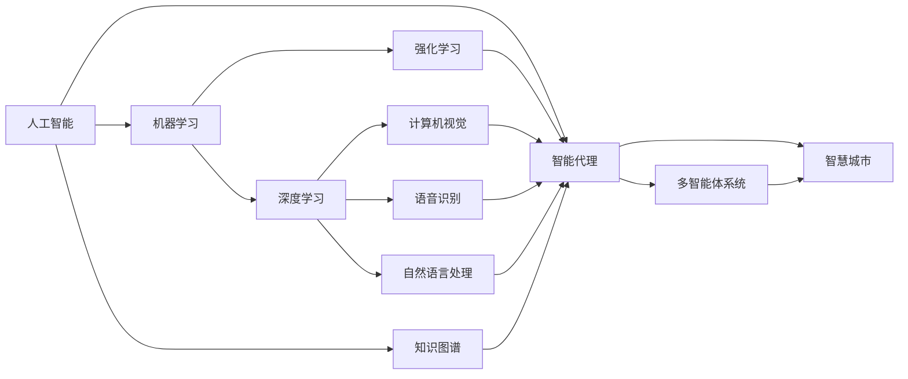

# AI人工智能深度学习算法：智能代理在智慧城市中的实践

关键词：人工智能、深度学习、智能代理、智慧城市、强化学习、多智能体系统、知识图谱、计算机视觉

## 1. 背景介绍
### 1.1 问题的由来
随着城市化进程的不断加快,城市面临的交通拥堵、环境污染、能源短缺等问题日益突出。传统的城市管理模式已经无法满足现代化城市的发展需求。如何利用先进的信息技术手段,实现城市的智能化管理和可持续发展,已经成为全球关注的热点问题。人工智能技术的快速发展为解决这一问题提供了新的思路和方法。

### 1.2 研究现状 
近年来,国内外学者围绕智慧城市中的人工智能应用开展了大量研究。一方面,研究者们利用深度学习等AI技术构建智能交通、智慧能源、智慧环保等智慧城市子系统,取得了显著成效。另一方面,学者们尝试将多智能体系统、强化学习等前沿AI理论应用于智慧城市的宏观决策和协同优化,初步实现了城市系统的自主学习和动态适应。

### 1.3 研究意义
探索人工智能在智慧城市中的应用,对于提升城市管理和服务水平、推动城市可持续发展具有重要意义。一方面,人工智能可以增强城市感知和认知能力,为城市管理者提供全面、准确的数据支持和科学决策依据。另一方面,人工智能可以优化城市资源配置,提高城市运行效率,减少资源浪费和环境污染。此外,人工智能还可以促进政府、企业、公众等多元主体的协同创新,激发城市发展新动能。

### 1.4 本文结构
本文将重点探讨人工智能深度学习算法在智慧城市中的应用,特别是智能代理技术的实践。第2部分介绍相关核心概念;第3部分阐述智能代理的核心算法原理和操作步骤;第4部分建立智能代理的数学模型并给出公式推导;第5部分展示智能代理的代码实现;第6部分分析智能代理在智慧城市各领域的应用场景;第7部分推荐相关工具和学习资源;第8部分总结全文并展望未来;第9部分列出常见问题解答。

## 2. 核心概念与联系

- 人工智能(Artificial Intelligence):让机器具备感知、学习、推理、决策等智能行为的技术,旨在模拟、延伸和扩展人类智能。

- 机器学习(Machine Learning):人工智能的核心,使计算机系统能够从数据中自主学习,改进性能,无需明确编程。常见的机器学习范式包括监督学习、无监督学习、半监督学习、强化学习等。

- 深度学习(Deep Learning):机器学习的一个分支,基于深度神经网络,模拟人脑结构和机理,能够从海量数据中自动提取多层次特征,建立复杂映射关系。深度学习在计算机视觉、语音识别、自然语言处理等领域取得突破性进展。

- 智能代理(Intelligent Agent):能够感知环境,根据环境做出自主决策,并通过执行动作对环境产生影响的计算实体。智能代理通常由感知、决策、执行等模块组成,可以应用深度学习等AI技术赋予智能。

- 多智能体系统(Multi-Agent System):由多个智能代理通过交互构成的松耦合网络系统。每个智能体根据局部信息做出决策,通过协作、竞争等方式实现整体目标。多智能体系统能够解决集中式系统难以处理的复杂问题。

- 强化学习(Reinforcement Learning):智能代理通过与环境的交互来学习最优决策的机器学习范式。智能体根据环境反馈的奖励或惩罚信号,不断调整策略,最大化累积奖励。强化学习在博弈、控制、机器人等领域有广泛应用。

- 知识图谱(Knowledge Graph):用图结构表示实体及其关系的语义网络,包含大规模实体、关系和属性三元组。知识图谱可以支持智能代理进行知识表示、推理和决策,增强其认知和学习能力。

- 智慧城市(Smart City):充分利用物联网、云计算、大数据、人工智能等新一代信息技术,实现城市智能感知、分析、决策和执行,提升城市管理和服务水平,改善人居环境,推动城市可持续发展的新型城市形态。

下图展示了这些核心概念之间的关系:

智能代理作为人工智能的一个重要应用,综合利用了深度学习、强化学习、知识图谱等多种AI技术,通过多智能体协同,可以在智慧城市的各个领域发挥重要作用,推动城市的智能化转型和可持续发展。

## 3. 核心算法原理 & 具体操作步骤
### 3.1 算法原理概述
智能代理的核心是深度强化学习算法。传统的强化学习如Q学习使用表格存储状态-动作值函数,难以处理高维状态空间。深度强化学习将深度神经网络引入强化学习,用于逼近值函数、策略函数或环境模型,大大提升了强化学习处理复杂问题的能力。

深度强化学习的主要算法包括DQN、DDPG、A3C、PPO等。其中,DQN(Deep Q Network)结合深度学习和Q学习,使用深度神经网络逼近Q函数,能够直接从高维输入学习最优策略。DDPG(Deep Deterministic Policy Gradient)基于行动者-评论家框架,适用于连续动作空间。A3C(Asynchronous Advantage Actor-Critic)和PPO(Proximal Policy Optimization)通过并行训练多个智能体,提高了训练效率和稳定性。

### 3.2 算法步骤详解
以DQN算法为例,其主要步骤如下:

1. 初始化经验回放缓存D,用于存储智能体与环境交互的转移样本(st,at,rt,st+1)。

2. 随机初始化行动值函数Q的参数θ。

3. 对每个episode循环:
   1) 初始化环境状态s1。
   2) 对每个step循环:
      a. 根据ϵ-greedy策略选择动作at=argmaxaQ(st,a;θ)或随机动作。
      b. 执行动作at,观察奖励rt和下一状态st+1。 
      c. 将转移样本(st,at,rt,st+1)存储到D中。
      d. 从D中随机采样小批量转移样本(sj,aj,rj,sj+1)。
      e. 计算目标值yj=rj+γmaxa′Q(sj+1,a′;θ−),其中θ−是目标网络的参数。
      f. 最小化损失L(θ)=E[(yj−Q(sj,aj;θ))^2],更新Q网络的参数θ。
      g. 每隔C步将Q网络的参数θ复制给目标网络的参数θ−。
      h. st←st+1。
   3) 直到st为终止状态。

4. 直到收敛或达到最大episode数。

其中,目标网络和经验回放是DQN的两大关键技术。目标网络使用延迟更新的参数,提高了训练稳定性。经验回放将转移样本缓存下来,打破了数据的相关性,提高了样本利用效率。

### 3.3 算法优缺点
深度强化学习算法的优点包括:
- 端到端学习:无需人工设计特征,直接从原始高维输入学习策略。
- 非线性逼近:深度神经网络能够逼近任意非线性函数,具有强大的表达能力。
- 自适应:能够根据环境反馈自主学习和调整策略,适应动态环境。

其缺点包括:
- 样本效率低:需要大量的环境交互样本,训练成本高。
- 不稳定:对超参数、奖励函数敏感,容易发散。
- 可解释性差:神经网络是一个"黑盒",学习到的策略难以解释。

### 3.4 算法应用领域
深度强化学习在智慧城市的多个领域有广泛应用,如智能交通、智慧能源、智慧环保等。一些典型应用包括:

- 智能交通信号控制:将交通信号灯视为智能体,状态为车流量,动作为信号配时,奖励为通行效率,通过深度强化学习优化信号灯策略,减少延误。

- 智能电网调度:将电网调度视为智能体,状态为发电、负荷情况,动作为发电计划,奖励为供需平衡程度,通过深度强化学习优化电网调度,提高能源利用效率。

- 智能垃圾分类:将垃圾分类机器人视为智能体,状态为垃圾图像,动作为分类决策,奖励为分类准确性,通过深度强化学习提高垃圾分类的智能化水平。

- 智能路径规划:将无人车视为智能体,状态为车辆位置、速度等,动作为油门、刹车等,奖励为行驶距离、安全性等,通过深度强化学习实现无人车的智能决策和导航。

下一部分将重点介绍智能代理的数学建模和公式推导。

## 4. 数学模型和公式 & 详细讲解 & 举例说明
### 4.1 数学模型构建
智能代理可以用马尔可夫决策过程(Markov Decision Process, MDP)建模。MDP由一个六元组$\langle \mathcal{S}, \mathcal{A}, \mathcal{P}, \mathcal{R}, \rho_0, \gamma \rangle$定义,其中:

- $\mathcal{S}$是有限状态集。
- $\mathcal{A}$是有限动作集。 
- $\mathcal{P}:\mathcal{S} \times \mathcal{A} \times \mathcal{S} \rightarrow [0,1]$是转移概率函数,表示在状态s下执行动作a后转移到状态s'的概率。
- $\mathcal{R}:\mathcal{S} \times \mathcal{A} \rightarrow \mathbb{R}$是奖励函数,表示在状态s下执行动作a后获得的即时奖励。
- $\rho_0:\mathcal{S} \rightarrow [0,1]$是初始状态分布。
- $\gamma \in [0,1]$是折扣因子,表示未来奖励的重要程度。

MDP的目标是寻找一个最优策略$\pi^*:\mathcal{S} \rightarrow \mathcal{A}$,使得智能体在该策略下的期望累积奖励最大化:

$$\pi^* = \arg\max_{\pi} \mathbb{E}_{\tau \sim \pi}[\sum_{t=0}^{\infty} \gamma^t r_t]$$

其中,$\tau$表示一条轨迹$(s_0,a_0,r_0,s_1,a_1,r_1,...)$,$\tau \sim \pi$表示根据策略$\pi$生成轨迹。

为了求解最优策略,需要引入价值函数的概念。状态价值函数$V^{\pi}(s)$表示从状态s开始,执行策略$\pi$能获得的期望累积奖励:

$$V^{\pi}(s) = \mathbb{E}_{\tau \sim \pi}[\sum_{t=0}^{\infty} \gamma^t r_t | s_0=s]$$

状态-动作价值函数$Q^{\pi}(s,a)$表示从状态s开始,先执行动作a,再执行策略$\pi$能获得的期望累积奖励:

$$Q^{\pi}(s,a) = \mathbb{E}_{\tau \sim \pi}[\sum_{t=0}^{\infty} \gamma^t r_t | s_0=s, a_0=a]$$

最优价值函数$V^*(s)$和$Q^*(s,a)$分别表示在最优策略下的状态价值和状态-动作价值:

$$V^