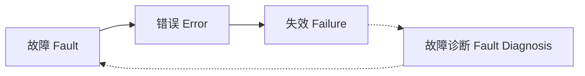

# AI系统故障诊断原理与代码实战案例讲解

作者：禅与计算机程序设计艺术 / Zen and the Art of Computer Programming 

关键词：AI系统、故障诊断、算法原理、数学模型、代码实战

## 1. 背景介绍
### 1.1  问题的由来
随着人工智能技术的飞速发展,AI系统已经广泛应用于各个领域。但是,随之而来的一个重要问题就是AI系统的故障诊断。AI系统由于其复杂性和不确定性,一旦发生故障,往往很难定位和解决问题。这就需要我们对AI系统故障诊断有深入的研究。
### 1.2  研究现状
目前,针对AI系统故障诊断已经有了一些研究成果。比如基于知识图谱的故障诊断方法、基于深度学习的异常检测方法等。但是这些方法还存在一些局限性,如泛化能力不强、诊断精度不高等。因此,如何提高AI系统故障诊断的有效性和准确性,仍然是一个亟待解决的问题。
### 1.3  研究意义 
AI系统故障诊断的研究对于保障AI系统的稳定运行、提高AI应用的可靠性具有重要意义。通过对AI系统故障诊断原理的探索和算法的优化,可以及时发现AI系统运行过程中出现的异常,快速定位故障原因,从而最大限度地减少故障带来的损失。同时,故障诊断技术的提升也有助于完善AI系统的设计,提高其鲁棒性。
### 1.4  本文结构
本文将从以下几个方面对AI系统故障诊断进行探讨：

1. 介绍AI系统故障诊断的核心概念与内在联系
2. 阐述AI系统故障诊断的核心算法原理及具体操作步骤
3. 建立AI系统故障诊断的数学模型,并结合案例进行详细讲解
4. 给出基于Python的AI系统故障诊断代码实例,并进行解释说明
5. 分析AI系统故障诊断技术的实际应用场景
6. 推荐AI系统故障诊断领域常用的工具和学习资源
7. 总结全文,展望AI系统故障诊断技术的未来发展趋势和挑战
8. 归纳AI系统故障诊断的常见问题,并给出解答

## 2. 核心概念与联系

在探讨AI系统故障诊断原理之前,我们需要先明确几个核心概念：

- **故障(Fault)**：是指系统中存在的异常状态或缺陷,会导致系统行为偏离预期。在AI系统中,故障可能由算法缺陷、数据质量问题、硬件故障等因素引起。
- **错误(Error)**：是故障在系统中的具体表现,通常表现为输出结果的偏差或系统性能的下降。
- **失效(Failure)**：是指由于错误的累积,导致系统无法正常工作,不能完成预定功能。
- **故障诊断(Fault Diagnosis)**：是在系统发生故障时,判断故障是由哪些原因引起的,并确定这些原因对系统的影响。诊断的目的是找出故障的根源,为故障恢复提供依据。

这几个概念之间的关系如下图所示：

可以看出,故障是引起错误和失效的根本原因,错误是故障的具体表现,失效则是错误累积到一定程度的结果。而故障诊断则是在系统失效后,反向追溯故障的过程。诊断的结果可以帮助我们改进系统,避免同类故障再次发生。

在AI系统中,由于系统的复杂性,故障的表现形式多种多样,给诊断带来了很大挑战。比如,一个图像识别系统,其故障可能表现为识别精度下降、识别速度变慢、无法识别特定类别的图像等。究竟是算法问题、训练数据问题还是部署环境问题导致的,需要进行细致的诊断分析。

## 3. 核心算法原理 & 具体操作步骤

### 3.1 算法原理概述

AI系统故障诊断的核心是建立系统状态与故障原因之间的映射关系。通常采用的方法有:

1. 基于规则的诊断:将专家的诊断经验总结为IF-THEN形式的规则,根据系统状态进行匹配,得出故障原因。
2. 基于模型的诊断:建立系统的数学模型,通过参数估计、状态观测等手段,判断系统是否发生故障。
3. 基于数据驱动的诊断:通过对历史运行数据进行挖掘分析,总结系统状态与故障之间的关联规律,用于指导诊断。
4. 基于知识图谱的诊断:将系统架构、性能指标、故障案例等信息整合为知识图谱,利用图谱推理故障传播路径与原因。

### 3.2 算法步骤详解

下面以基于数据驱动的故障诊断为例,详细讲解其算法步骤。

输入:系统历史运行数据 $D=\{(x_1,y_1),\cdots,(x_n,y_n)\}$,其中$x_i$表示系统状态特征,$y_i$表示对应的故障类别标签。

输出:故障诊断模型 $f:X\rightarrow Y$,其中$X$为系统状态特征空间,$Y$为故障类别标签空间。

Step 1: 数据预处理
- 对原始数据进行清洗,剔除噪声数据与异常值
- 对数据进行特征工程,提取反映系统状态的关键特征
- 对数据进行标准化处理,消除量纲影响

Step 2: 特征选择
- 通过特征重要性评估、特征相关性分析等方法,选择最具诊断价值的特征子集$X'$

Step 3: 模型训练
- 选择适当的机器学习模型,如决策树、SVM、神经网络等
- 利用训练数据集$D$训练模型参数,得到故障诊断模型$f$
$$\min\limits_{f\in F} \frac{1}{n}\sum\limits_{i=1}^nL(f(x_i),y_i) + \Omega(f)$$
其中$F$为模型函数空间,$L$为损失函数,$\Omega$为正则化项

Step 4: 模型评估
- 利用测试数据集评估模型的诊断性能,如精确率、召回率、F1值等
- 进行交叉验证,评估模型的泛化能力

Step 5: 模型应用
- 将训练好的诊断模型部署到实际的AI系统中
- 当系统出现异常时,提取系统状态特征输入模型,得到故障原因诊断结果

### 3.3 算法优缺点

基于数据驱动的故障诊断算法的优点包括:
- 可以从数据中自动学习故障特征,不需要人工总结规则
- 诊断模型可以不断从新数据中学习,自动优化和提升
- 相比基于规则和模型的方法,对领域知识的依赖较少

同时,该算法也存在一些局限:
- 诊断的精度很大程度上依赖于训练数据的质量
- 对于训练数据中未覆盖的故障类型,诊断能力有限
- 模型的泛化能力有待进一步验证和提高

### 3.4 算法应用领域

基于数据驱动的故障诊断算法可以应用于多个领域的AI系统,如:
- 工业生产中的设备故障诊断
- 智能电网中的电力设备故障诊断
- 自动驾驶汽车的故障诊断
- 医疗影像诊断系统的故障诊断

通过从系统运行数据中学习故障模式,可以实现故障的早期预警和快速定位,保障系统安全高效运行。

## 4. 数学模型和公式 & 详细讲解 & 举例说明

### 4.1 数学模型构建

为了形式化地描述AI系统故障诊断问题,我们可以建立如下数学模型:

令状态空间$X=\{x_1,\cdots,x_n\}$表示AI系统所有可能的状态,其中$x_i$为d维状态特征向量。令故障空间$\Phi=\{\phi_1,\cdots,\phi_k\}$表示系统可能发生的k种故障类型。

定义系统状态到故障类型的映射:
$$\delta:X\rightarrow \Phi$$

即函数$\delta$将系统状态映射到对应的故障类型。

故障诊断过程就是根据观测到的系统状态$x$,估计故障类型$\hat{\phi}$:
$$\hat{\phi}=\delta(x)=\arg\max\limits_{\phi_j\in\Phi}P(\phi_j|x)$$

其中$P(\phi_j|x)$表示在状态$x$下,系统发生故障$\phi_j$的条件概率。

根据贝叶斯公式,可以将其转化为:
$$P(\phi_j|x)=\frac{P(x|\phi_j)P(\phi_j)}{P(x)}$$

其中$P(x|\phi_j)$为故障$\phi_j$下状态$x$出现的概率,$P(\phi_j)$为故障$\phi_j$的先验概率,$P(x)$为状态$x$出现的概率。

### 4.2 公式推导过程

对于给定的训练数据集$D=\{(x_1,\phi_1),\cdots,(x_n,\phi_n)\}$,我们可以通过极大似然估计来求解故障诊断模型的参数。

假设模型参数为$\theta$,似然函数为:
$$L(\theta)=\prod_{i=1}^nP(\phi_i|x_i;\theta)$$

取对数得到对数似然函数:
$$\log L(\theta)=\sum_{i=1}^n\log P(\phi_i|x_i;\theta)$$

目标是求解参数$\theta^*$使得$\log L(\theta)$最大化:
$$\theta^*=\arg\max\limits_{\theta}\log L(\theta)$$

假设$P(\phi_j|x;\theta)$服从参数为$\theta_j$的指数族分布:
$$P(\phi_j|x;\theta_j)=h(x)g(\theta_j)\exp\{\theta_j^T\tau(x)\}$$

其中$h,g,\tau$为确定的函数。

代入对数似然函数,并考虑正则化项,得到最终的优化目标:
$$\min\limits_{\theta}-\sum_{i=1}^n\log P(\phi_i|x_i;\theta)+\lambda\|\theta\|^2$$

其中$\lambda$为正则化系数。可以通过梯度下降法求解该优化问题,得到最优参数$\theta^*$。

### 4.3 案例分析与讲解

下面以一个简单的例子来说明故障诊断模型的建立与求解过程。

假设一个AI图像识别系统有3种可能的运行状态:

$x_1$:识别准确率高,速度快
$x_2$:识别准确率高,速度慢
$x_3$:识别准确率低

可能发生的故障类型有2种:

$\phi_1$:算法Bug
$\phi_2$:硬件故障

假设训练数据集如下:

| 系统状态 | 故障类型 |
|:-------:|:-------:|
| $x_1$ | $\phi_1$ |
| $x_1$ | $\phi_1$ |
| $x_2$ | $\phi_1$ |
| $x_2$ | $\phi_2$ |
| $x_3$ | $\phi_2$ |

取模型参数$\theta=(\theta_1,\theta_2)$,其中$\theta_j=(\theta_{j0},\theta_{j1},\theta_{j2},\theta_{j3})^T$。

假设$P(\phi_j|x;\theta_j)$服从softmax分布:
$$P(\phi_j|x_i;\theta_j)=\frac{\exp(\theta_{j0}+\theta_{j1}x_{i1}+\theta_{j2}x_{i2}+\theta_{j3}x_{i3})}{\sum_{l=1}^2\exp(\theta_{l0}+\theta_{l1}x_{i1}+\theta_{l2}x_{i2}+\theta_{l3}x_{i3})}$$

其中$x_{i1},x_{i2},x_{i3}$为状态$x_i$的3个特征值。

代入对数似然函数,并加入L2正则化项,得到优化目标:

$$\min\limits_{\theta}-\sum_{i=1}^5\sum_{j