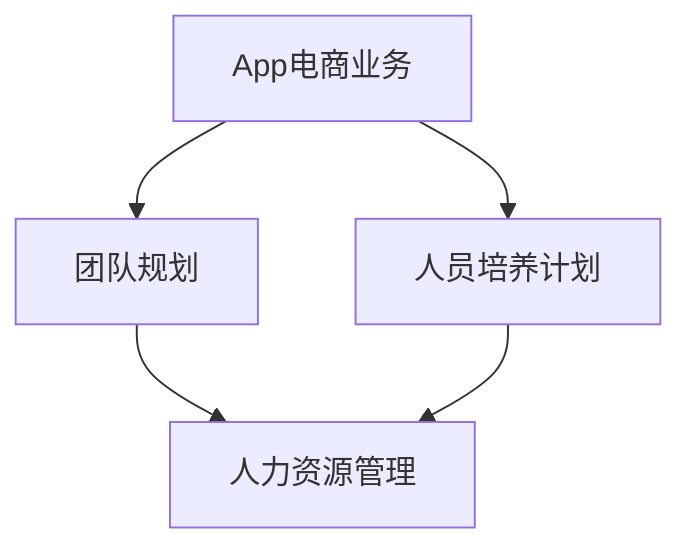

# App电商业务团队规划和人员规划与人员培养计划

## 1. 背景介绍

### 1.1 问题的由来

在当今快节奏的数字时代，移动应用程序(App)已经成为企业与客户之间沟通和交互的关键渠道。随着电子商务的蓬勃发展,App电商业务已经成为许多公司的核心业务之一。然而,构建和维护一个高效、可扩展的App电商系统需要一支经验丰富、技能全面的团队。缺乏合理的人员规划和培养计划,将会严重影响App电商业务的发展。

### 1.2 研究现状

目前,许多企业在App电商团队的建设上还存在一些问题和挑战:

1. **人员结构不合理**:团队成员的技能分布不均衡,缺乏全栈开发人员和高级架构师。
2. **人员流失严重**:由于缺乏有效的激励机制和职业发展规划,优秀人才容易流失。
3. **培训计划滞后**:培训计划无法跟上技术发展的步伐,导致团队技能老化。
4. **缺乏长远规划**:企业缺乏对App电商业务发展的前瞻性规划,无法及时补充所需人力资源。

### 1.3 研究意义

合理的App电商业务团队规划和人员培养计划对于企业的长期发展至关重要。它可以:

1. **优化人员结构**:根据业务需求,配备合理的人员结构,提高团队的整体实力。
2. **降低人员流失**:通过有效的激励机制和职业发展规划,留住核心人才。
3. **促进技能提升**:持续的培训计划有助于团队技能与时俱进,保持竞争力。
4. **支持业务发展**:前瞻性的人员规划可以为App电商业务的持续发展提供人力资源保障。

### 1.4 本文结构

本文将详细探讨App电商业务团队的规划和人员培养计划,内容包括:

1. 核心概念与联系
2. 团队规划的核心原理和步骤
3. 人员培养计划的数学模型和公式
4. 实际项目案例分析和代码实现
5. 应用场景和未来发展趋势
6. 工具和资源推荐
7. 总结和常见问题解答

## 2. 核心概念与联系

在探讨App电商业务团队规划和人员培养计划之前,我们需要了解以下几个核心概念及其相互关系:

1. **App电商业务**:指利用移动应用程序(App)进行电子商务活动,包括产品展示、在线购物、支付结算等。
2. **团队规划**:根据业务需求,合理配置团队人员结构、技能分布和职责分工。
3. **人员培养计划**:通过系统的培训和发展机会,提升团队成员的技能和能力。
4. **人力资源管理**:管理和优化企业的人力资源,包括招聘、培训、绩效考核等。

这些概念密切相关,需要协同发展。合理的团队规划为人员培养计划提供方向,而人员培养计划则为团队规划提供持续的人力资源支持。同时,人力资源管理为整个过程提供系统性的支撑。

## 3. 核心算法原理 & 具体操作步骤

### 3.1 算法原理概述

App电商业务团队规划和人员培养计划的核心算法原理基于以下几个关键点:

1. **业务需求分析**:全面分析App电商业务的现状和未来发展需求,确定所需的人员结构和技能要求。
2. **人员评估**:对现有团队成员进行全面评估,了解其技能水平、潜力和发展需求。
3. **差距分析**:比对业务需求和现有人员状况,识别人员结构和技能上的差距。
4. **人员规划**:根据差距分析结果,制定人员补充、调整和培训计划。
5. **持续优化**:持续监控团队状况和业务需求变化,并及时调整人员规划和培养计划。

### 3.2 算法步骤详解

1. **业务需求分析**
   - 收集App电商业务的各项指标,如用户规模、交易量、收入等
   - 分析业务的未来发展规划和战略目标
   - 确定所需的技术栈和架构
   - 列出所需的岗位和技能要求

2. **人员评估**
   - 收集现有团队成员的个人信息、技能、经验等数据
   - 设计评估标准和量化指标
   - 进行技能测试和绩效考核
   - 分析每位成员的优势、潜力和发展需求

3. **差距分析**
   - 比对业务需求和现有人员状况
   - 识别人员结构上的差距,如缺失的岗位、人员过剩或不足等
   - 识别技能差距,如缺乏的技能、需要提升的技能等

4. **人员规划**
   - 根据差距分析结果,制定人员补充计划(招聘、外包等)
   - 制定人员调整计划(内部调动、晋升等)
   - 制定人员培训计划(内部培训、外部培训等)
   - 设计激励机制和职业发展规划,留住核心人才

5. **持续优化**
   - 建立定期评估机制,持续监控团队状况和业务需求变化
   - 根据评估结果,及时调整人员规划和培养计划
   - 建立反馈机制,收集团队成员的意见和建议

### 3.3 算法优缺点

**优点**:

1. **系统性**:该算法从业务需求出发,全面考虑了人员结构、技能和发展需求,具有系统性。
2. **动态性**:通过持续优化环节,算法能够及时应对业务需求和团队状况的变化。
3. **可量化**:引入评估标准和量化指标,使得算法更加客观和可衡量。

**缺点**:

1. **复杂性**:算法涉及多个环节,需要大量的数据收集和分析工作,实施过程较为复杂。
2. **主观性**:部分环节(如评估标准设计)存在一定主观性,可能影响结果的准确性。
3. **成本高**:实施该算法需要投入大量的人力和资源,对于中小型企业来说,成本可能较高。

### 3.4 算法应用领域

该算法不仅适用于App电商业务团队的规划和人员培养,也可应用于其他领域的团队建设和人力资源管理,如:

- 软件开发团队
- IT运维团队
- 数据分析团队
- 产品设计团队
- 市场营销团队

只要对算法中的业务需求分析和人员评估标准进行相应调整,该算法就可以广泛应用于各种团队的建设和优化。

## 4. 数学模型和公式 & 详细讲解 & 举例说明

在进行App电商业务团队规划和人员培养计划时,我们可以借助数学模型和公式来量化和优化决策过程。

### 4.1 数学模型构建

我们将团队规划和人员培养计划视为一个优化问题,目标是最小化团队建设成本,同时满足业务需求和人员发展需求。我们可以构建以下数学模型:

$$\min \sum_{i=1}^{n} c_i x_i + \sum_{j=1}^{m} d_j y_j$$

其中:
- $n$是现有团队成员的数量
- $m$是需要补充的新员工数量
- $c_i$是保留现有员工$i$的成本(包括薪资、培训等)
- $x_i$是一个二元变量,表示是否保留现有员工$i$ (1表示保留,0表示裁员)
- $d_j$是招聘新员工$j$的成本(包括招聘、培训等)
- $y_j$是一个二元变量,表示是否招聘新员工$j$ (1表示招聘,0表示不招聘)

该模型的目标是最小化团队建设成本,包括保留现有员工和招聘新员工的成本。

同时,我们需要引入一些约束条件,以确保满足业务需求和人员发展需求:

$$\sum_{i=1}^{n} a_{ik} x_i + \sum_{j=1}^{m} b_{jk} y_j \geq r_k, \quad k=1,2,\ldots,p$$

其中:
- $p$是技能种类的数量
- $a_{ik}$是现有员工$i$在技能$k$上的水平评分
- $b_{jk}$是新员工$j$在技能$k$上的预期水平评分
- $r_k$是业务对技能$k$的最低需求水平

该约束条件确保团队在每种技能上的总水平都能满足业务需求。

$$\sum_{i=1}^{n} x_i + \sum_{j=1}^{m} y_j \geq T$$

其中$T$是团队所需的最小人数,该约束条件确保团队的总人数满足需求。

通过求解这个优化问题,我们可以得到最优的人员配置方案,包括保留哪些现有员工、招聘哪些新员工,以及相应的培训计划。

### 4.2 公式推导过程

在上述数学模型中,我们引入了一些变量和参数,下面将详细解释它们的含义和计算方法。

1. **现有员工保留成本 $c_i$**

$$c_i = s_i + e_i + t_i$$

其中:
- $s_i$是现有员工$i$的年薪
- $e_i$是现有员工$i$的预期薪酬增长
- $t_i$是现有员工$i$的预期培训成本

我们可以根据员工的历史薪酬、绩效评估和发展潜力来估计$e_i$和$t_i$的值。

2. **新员工招聘成本 $d_j$**

$$d_j = h_j + o_j + t_j$$

其中:
- $h_j$是新员工$j$的预期年薪
- $o_j$是招聘新员工$j$的一次性成本(如招聘费用、签约奖金等)
- $t_j$是新员工$j$的预期培训成本

我们可以根据市场薪酬水平、招聘渠道和新员工的技能背景来估计$h_j$、$o_j$和$t_j$的值。

3. **现有员工技能水平评分 $a_{ik}$**

$$a_{ik} = \alpha_i \beta_{ik} \gamma_{ik}$$

其中:
- $\alpha_i$是员工$i$的整体能力评分
- $\beta_{ik}$是员工$i$在技能$k$上的专业程度评分
- $\gamma_{ik}$是员工$i$在技能$k$上的经验评分

我们可以通过综合考虑员工的教育背景、工作经历、技能测试结果等因素来确定$\alpha_i$、$\beta_{ik}$和$\gamma_{ik}$的值。

4. **新员工技能水平预期评分 $b_{jk}$**

$$b_{jk} = \delta_j \eta_{jk}$$

其中:
- $\delta_j$是新员工$j$的整体能力预期评分
- $\eta_{jk}$是新员工$j$在技能$k$上的预期水平评分

我们可以根据新员工的教育背景、工作经历和技能自我评估来估计$\delta_j$和$\eta_{jk}$的值。

通过上述公式,我们可以量化团队规划和人员培养计划中的各个因素,为优化决策提供数据支持。

### 4.3 案例分析与讲解

为了更好地理解上述数学模型和公式的应用,我们将通过一个实际案例进行分析和讲解。

**案例背景**:某电商公司准备推出一款新的App,需要组建一个App电商业务团队。该团队需要具备以下几种关键技能:

- 移动应用开发(Android和iOS)
- 后端开发(Java、Python等)
- 数据库设计与优化
- UI/UX设计
- 项目管理

公司现有的IT团队中有10名员工,他们的技能水平和预期成本如下表所示:

| 员工编号 | 移动开发 | 后端开发 | 数据库 | UI/UX设计 | 项目