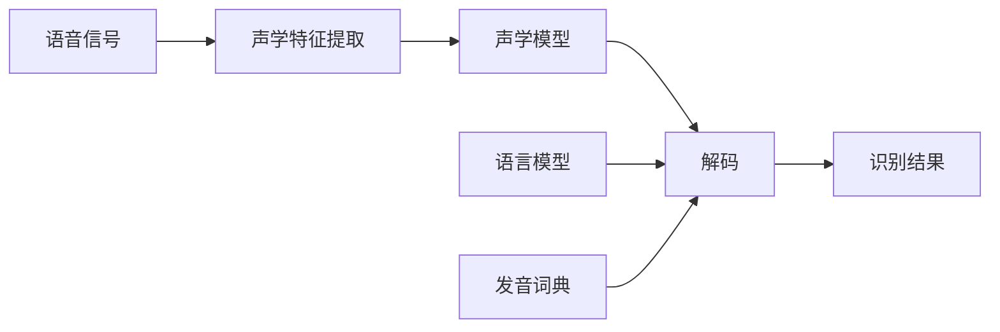

# Automatic Speech Recognition (ASR)原理与代码实例讲解

作者：禅与计算机程序设计艺术 / Zen and the Art of Computer Programming 

关键词：语音识别、声学模型、语言模型、隐马尔可夫模型、深度学习、端到端ASR

## 1. 背景介绍

### 1.1 问题的由来

语音是人类最自然、最便捷的交互方式之一。让计算机能够像人一样"听懂"语音,并据此完成相应任务,一直是人工智能领域的重要目标。自动语音识别(Automatic Speech Recognition, ASR)技术就是为实现这一目标而生的。

### 1.2 研究现状

经过几十年的发展,ASR技术取得了长足进步。传统的ASR系统通常由声学模型、发音词典和语言模型三部分组成,其中声学模型大多基于隐马尔可夫模型(HMM)。近年来,随着深度学习的兴起,一些端到端(End-to-End)的ASR方法如CTC、RNN Transducer、Attention等被提出,无需发音词典,直接将语音信号转录为文本,大大简化了系统构建流程。目前工业界主流的ASR系统多采用深度学习方法。

### 1.3 研究意义

ASR是实现人机语音交互的关键技术,在智能助理、车载交互、医疗记录、会议记录等诸多领域有广泛应用。研究ASR技术不仅有助于提升人机交互体验,促进人工智能在更多场景的落地,也可为相关学科如语音合成、说话人识别等提供借鉴。此外,ASR中的一些思想方法如序列建模也可用于其他领域。

### 1.4 本文结构

本文将首先介绍ASR中的一些核心概念,然后重点讲解传统HMM-based ASR和当前主流的End-to-End ASR的基本原理和实现步骤。之后通过数学模型和代码实例进一步阐释这些方法。最后总结ASR的发展趋势和面临的挑战,并给出学习资源推荐。

## 2. 核心概念与联系

- 语音信号:携带语言信息的声波,通常由发音器官产生。ASR的输入。
- 声学特征:从语音信号中提取的一些物理量如MFCC、Fbank等,刻画语音的声学属性。 
- 声学模型:描述语音信号与发音单元(如音素)之间对应关系的统计模型。
- 语言模型:刻画语言中词序列的概率分布,反映词的先验组合规律。
- 发音词典:定义每个词的发音方式,连接声学模型和语言模型。
- 解码:利用声学模型和语言模型对声学特征序列进行搜索,找出概率最大的词序列作为识别结果的过程。

它们的关系可以用下图表示:

## 3. 核心算法原理 & 具体操作步骤

### 3.1 算法原理概述

#### HMM-based ASR

传统的HMM-based ASR的基本思想是,将语音信号建模为隐马尔可夫模型。每个HMM状态代表一个发音单元(如音素),状态之间的转移对应发音的时序变化,状态的观测概率描述了该发音单元下产生不同声学特征矢量的概率。识别时,利用Viterbi算法对HMM进行解码,找到产生观测特征序列概率最大的状态序列,再根据状态到音素、音素到词的映射关系得到最终的识别结果。

#### End-to-End ASR

不同于HMM-based ASR中声学模型、发音词典和语言模型的分离构建,End-to-End ASR希望构建一个统一的模型,直接将声学特征序列映射到词序列。主要方法包括:

- CTC:引入一个特殊的blank标签,代表发射空白帧。每个时刻网络输出音素的后验概率,通过特定的映射规则将输出序列整合为最终的词序列。
- RNN Transducer:网络包含声学编码器(Encoder)和预测网络(Prediction Network),解码时两者输出结合产生发射概率,用前缀束搜索算法寻找最优词序列。
- Attention:Encoder-Decoder框架,Encoder将语音序列编码为高维特征,Attention机制在Decoder的每一步聚焦于Encoder输出的不同部分,生成相应的词。

### 3.2 算法步骤详解

以下以HMM-based ASR和基于Attention的End-to-End ASR为例详细说明实现步骤。

#### HMM-based ASR

1. 特征提取:将语音信号分帧,每帧提取声学特征如MFCC、Fbank等,得到特征序列。
2. 声学模型训练:将特征序列切分成音素段,对每个音素训练一个HMM。通常使用Baum-Welch算法进行参数估计。 
3. 语言模型训练:在大规模文本语料上训练N-gram语言模型,刻画词序列的概率。
4. 解码:对于待识别的语音,提取声学特征后,利用声学模型计算每个HMM状态的发射概率,语言模型提供状态转移概率。使用Viterbi算法找到概率最大的状态序列,再根据发音词典将状态序列映射为词序列。

#### 基于Attention的End-to-End ASR

1. 特征提取:同HMM-based ASR。
2. 编码:使用RNN或CNN将特征序列编码为高维特征表示。
3. 解码:Attention Decoder在每个时步根据Encoder输出和已生成的词计算Attention权重,获得Encoder特征的加权和,再通过softmax输出词的概率分布,选择概率最大的词作为当前时步的输出。
4. 训练:Encoder-Decoder作为整体进行端到端训练,最小化预测词序列的交叉熵损失函数。
5. 解码:对待识别语音,提取特征后输入训练好的模型,每个时步选择概率最大的词,直到遇到句尾标记为止。

### 3.3 算法优缺点

#### HMM-based ASR
- 优点:
    - 模型简单,训练和解码有效;
    - 模块化设计,各部分可独立优化;
    - 可解释性强,便于分析和改进。
- 缺点:  
    - 假设各部分相互独立,忽略了它们之间的关联;
    - 难以刻画长距离的依赖;
    - 需要大量标注数据,对非标准、自由说话等场景适应性差。

#### End-to-End ASR
- 优点:
    - 端到端建模,避免了模块间误差传播;
    - 可建模任意长度的上下文信息;
    - 所需标注数据少,可从数据中自动学习映射关系。
- 缺点:
    - 模型复杂,训练耗时;
    - 解码速度慢,难以应用于实时场景;
    - 可解释性差,难以分析和调试。

### 3.4 算法应用领域

ASR技术在智能助理、车载交互、医疗记录、会议记录、语音输入、语音搜索、语音内容分析等领域有广泛应用。目前工业界的主流ASR系统多基于深度学习的End-to-End方法,在标准数据集上的识别错误率可低至5%以下。一些具体应用案例如:

- 苹果Siri:基于深度学习的语音识别,支持多种语言,可执行打电话、设置提醒等任务。
- 谷歌语音搜索:将语音输入转为文本,用于网页搜索。
- 讯飞听见:提供语音转写、实时字幕、会议记录等企业级语音服务。
- 亚马逊Alexa:智能音箱,可通过语音控制智能家居、播放音乐等。

## 4. 数学模型和公式 & 详细讲解 & 举例说明

### 4.1 数学模型构建

#### HMM-based ASR

HMM-based ASR的数学模型可表示为:

$$\hat{W} = \arg\max_{W} P(O|W)P(W)$$

其中$\hat{W}$为识别结果,$O$为观测的声学特征序列,$P(O|W)$为声学模型,$P(W)$为语言模型。

声学模型用隐马尔可夫模型刻画:

$$P(O|W) = \sum_{S} \prod_{t=1}^T a_{s_t s_{t+1}} b_{s_t}(o_t)$$

其中$S$为所有可能的HMM状态序列,$a_{ij}$为状态$i$转移到状态$j$的概率,$b_j(o_t)$为状态$j$产生观测$o_t$的概率。

语言模型通常用N-gram模型:

$$P(W) = \prod_{i=1}^N P(w_i|w_{i-1}, ..., w_{i-n+1})$$

其中$w_i$为第$i$个词,$N$为词的总数。

#### 基于Attention的End-to-End ASR

Attention-based ASR直接建模条件概率:

$$P(W|O) = \prod_{i=1}^N P(w_i|w_{1:i-1}, O)$$

其中Encoder将$O$编码为高维特征序列$H$,Decoder根据$H$和已生成的词$w_{1:i-1}$计算Attention权重:

$$e_{ij} = f(s_{i-1}, h_j)$$
$$\alpha_{ij} = \frac{\exp(e_{ij})}{\sum_{k=1}^T \exp(e_{ik})}$$

$f$为Attention函数,$s_{i-1}$为Decoder在$i-1$时步的隐藏状态。

Decoder的输入为Attention权重对$H$的加权和:

$$c_i = \sum_{j=1}^T \alpha_{ij} h_j$$

再通过softmax输出词的概率分布:

$$P(w_i|w_{1:i-1}, O) = \text{softmax}(g(s_i, c_i))$$

$g$为前馈神经网络。

### 4.2 公式推导过程

#### HMM-based ASR

1. 根据贝叶斯公式,将目标$\hat{W}$表示为最大化$P(O|W)P(W)$。
2. 对于$P(O|W)$,将每个词的HMM连接起来,可得到整句话的HMM。求和运算考虑了所有可能的状态序列。
3. 对于$P(W)$,假设当前词只与前$n-1$个词相关,由条件概率连乘得到。

#### 基于Attention的End-to-End ASR

1. 将目标$P(W|O)$写为词序列生成概率的连乘形式。
2. 在Decoder的每个时步,通过Attention机制计算Encoder输出的加权和,作为该时步的输入。
3. Attention权重通过对Encoder输出和Decoder上一时步隐藏状态计算Attention函数,再归一化得到。
4. Decoder的输出通过softmax归一化,得到词的后验概率分布。

### 4.3 案例分析与讲解

以一个简单的语音识别任务为例,输入为"今天天气怎么样",说明HMM-based ASR的工作流程:

1. 将语音信号分帧,提取MFCC特征,得到特征序列$O$。
2. 根据发音词典,将句子划分为音素序列,如"j in t ian t ian q i z en m e y ang"。每个音素用一个HMM建模。
3. 语言模型提供不同词序列的先验概率,如$P($"今天 天气 怎么样"$) > P($"今天 天气 怎么 样"$)$。
4. 解码时,对于每个时刻的观测$o_t$,计算其在每个HMM状态下的发射概率$b_j(o_t)$。
5. 利用Viterbi算法,结合发射概率、状态转移概率和语言模型概率,搜索产生$O$概率最大的状态序列。
6. 根据状态到音素、音素到词的映射,得到最终的识别结果"今天天气怎么样"。

对于Attention-based ASR:

1. 同样提取声学特征$O$,输入Encoder得到高维特征序列$H$。
2. Decoder在第一个时步,Attention权重随机初始化,输出<sos>标记。
3. 之后每个时步,Decoder根据前一时步的输出和Attention权重计算当前的隐藏状态。
4. 通过