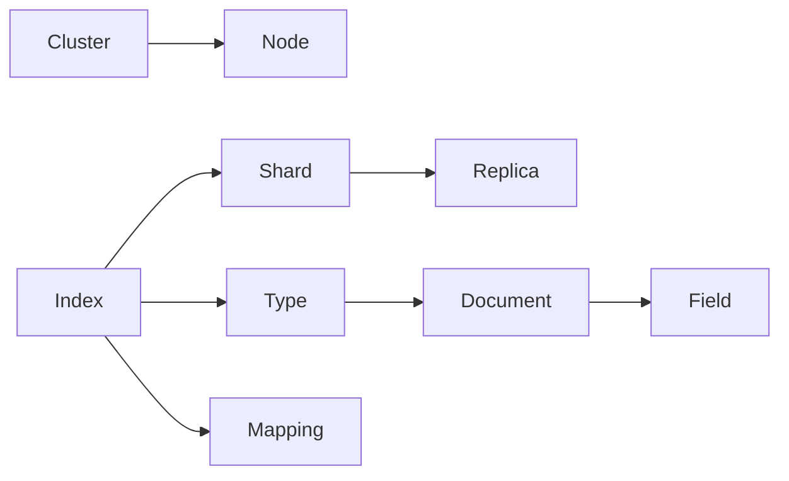

# ElasticSearch原理与代码实例讲解

作者：禅与计算机程序设计艺术 / Zen and the Art of Computer Programming 

## 1. 背景介绍
### 1.1 问题的由来
随着互联网时代的快速发展,海量数据的存储和检索成为了一个巨大的挑战。传统的关系型数据库在面对海量数据时,无论是在存储还是检索方面都显得力不从心。为了解决这一问题,各种NoSQL数据库应运而生,ElasticSearch就是其中的佼佼者。

### 1.2 研究现状
目前,ElasticSearch已经成为全文搜索引擎领域的领头羊。越来越多的公司开始使用ElasticSearch来存储和检索海量数据,如维基百科、GitHub、Stack Overflow等。同时,学术界对ElasticSearch的研究也越来越深入,涌现出许多优秀的论文和研究成果。

### 1.3 研究意义
深入研究ElasticSearch的原理和应用,对于我们理解和掌握大数据处理技术具有重要意义。通过学习ElasticSearch,我们可以了解倒排索引、分布式搜索等核心技术,提升自己的技术视野和大数据处理能力。同时,ElasticSearch在实际的项目中也有广泛的应用,学习ElasticSearch可以让我们在实际工作中游刃有余。

### 1.4 本文结构
本文将从以下几个方面对ElasticSearch进行深入探讨：

- 首先介绍ElasticSearch的核心概念与技术原理
- 然后重点讲解ElasticSearch的核心算法和数学模型
- 接着通过代码实例和应用场景展示ElasticSearch的实际应用
- 最后总结ElasticSearch的特点、应用前景以及未来的挑战

通过本文的学习,相信读者能够对ElasticSearch有一个全面深入的认识,并能在实际项目中灵活运用。

## 2. 核心概念与联系

要想深入理解ElasticSearch的原理,首先需要了解其核心概念：

- 索引(Index):含有相同属性的文档集合
- 类型(Type):索引可以定义一个或多个类型,文档必须属于一个类型
- 文档(Document):可以被索引的基本数据单位
- 映射(Mapping):定义文档的字段名和类型
- 节点(Node):ElasticSearch集群中的一个服务器
- 集群(Cluster):一个或多个节点构成,对外提供索引和搜索功能
- 分片(Shard):索引的一部分,可分布到集群的不同节点上
- 副本(Replica):分片的一份或多份副本

这些概念环环相扣,共同构成了ElasticSearch的技术体系：



从图中可以看出,集群由多个节点组成,每个节点存储索引的一个或多个分片。索引下可以有多个类型,每个类型包含多个文档。文档由多个字段构成,字段的名称和类型由Mapping定义。

这种分布式的架构设计赋予了ElasticSearch高可用、可扩展、近实时搜索的特性。正是由于ElasticSearch对CAP理论的巧妙平衡,才使得其在海量数据存储和检索领域独占鳌头。

## 3. 核心算法原理 & 具体操作步骤
### 3.1 算法原理概述
ElasticSearch的核心是倒排索引(Inverted Index)。倒排索引源于实际应用中需要根据属性的值来查找记录的需求。

与传统的正向索引相反,倒排索引会为每个属性值维护一个包含它的文档列表。比如,下面是一个倒排索引的例子:

```
单词ID    文档ID列表
1        1,2,3
2        1,3
3        1,2
4        2,3
```

可以看到,对于每个单词,都有一个包含它的文档ID列表。这种索引结构的核心思想就是空间换时间,通过额外的存储空间来换取查询时间。

### 3.2 算法步骤详解
ElasticSearch在构建倒排索引时,大致可以分为以下几个步骤:

1. 将文档传给分词组件(Tokenizer),分词组件会将文档分成一个个词(Term)。
2. 将每个词传给语汇单元过滤器(Token Filter),它可以修改词(如转小写、删除停用词、添加同义词等)。
3. 处理后的词传给语汇单元流(Token Stream),语汇单元流由一组词(Term)组成。 
4. 将每个词(Term)传给索引器(Indexer),索引器将词(Term)写入倒排索引。

在搜索时,ElasticSearch会执行以下步骤:

1. 对用户输入的查询语句进行分词和过滤,得到语汇单元流(Token Stream)。
2. 在倒排索引中查找每个词(Term),得到包含该词的文档ID列表。 
3. 根据文档ID列表和查询语句计算文档的相关度分数(Score)。
4. 根据相关度分数对结果进行排序,返回给用户。

### 3.3 算法优缺点
倒排索引的优点是检索效率高,缺点是索引文件较大,占用较多的存储空间。此外,倒排索引只能用于某些特定的查询,对于其他查询需要使用其他索引结构。

### 3.4 算法应用领域
倒排索引广泛应用于全文搜索引擎领域,除ElasticSearch外,像Lucene、Solr等都是基于倒排索引的搜索引擎库。

## 4. 数学模型和公式 & 详细讲解 & 举例说明
### 4.1 数学模型构建
ElasticSearch在计算文档的相关度分数时,主要依赖两个经典的信息检索模型:

- TF-IDF模型
- BM25模型

TF-IDF(Term Frequency-Inverse Document Frequency)由两部分组成:

- TF(Term Frequency):词频,表示词条在文档d中出现的频率。
- IDF(Inverse Document Frequency):逆文档频率,表示词条t在整个文档集合中的区分度。

它们的计算公式如下:

$$
TF(t,d) = \frac{f_{t,d}}{\sum_{t'\in d} f_{t',d}}
$$

其中,$f_{t,d}$表示词条t在文档d中出现的次数。分母则表示文档d中所有词条的出现次数之和。

$$
IDF(t) = log\frac{N}{n_t}
$$

其中,N表示文档集合的总数,$n_t$表示包含词条t的文档数。

TF-IDF的分数就是TF和IDF的乘积:

$$
TF\text{-}IDF(t,d) = TF(t,d) \times IDF(t)
$$

BM25(Best Match 25)模型是对TF-IDF的进一步改进,它的计算公式如下:

$$
score(q,d) = \sum_{t \in q} IDF(t) \cdot \frac{f(t,d) \cdot (k_1+1)}{f(t,d)+k_1 \cdot (1-b+b \cdot \frac{|d|}{avgdl})}
$$

其中:

- $f(t,d)$表示词条t在文档d中的出现频率。
- $|d|$表示文档d的长度。
- $avgdl$表示文档集合的平均长度。
- $k_1$和$b$是自由参数,通常$k_1$取1.2~2.0,$b$取0.75。

可以看到,BM25在TF-IDF的基础上,引入了文档长度因子,对过长或过短的文档进行了惩罚。同时,自由参数$k_1$和$b$的引入也使得模型更加灵活。

### 4.2 公式推导过程
TF-IDF中的TF和IDF都有直观的解释:

- TF反映了词条在文档中的重要程度。词频越高,说明词条对文档越重要。
- IDF反映了词条在文档集合中的区分度。包含词条的文档越少,说明词条的区分度越高。

将TF和IDF相乘,就得到了词条对文档的重要程度。

BM25公式看似复杂,实际上是在TF-IDF的基础上引入了文档长度因子:

$$
\frac{f(t,d) \cdot (k_1+1)}{f(t,d)+k_1 \cdot (1-b+b \cdot \frac{|d|}{avgdl})}
$$

其中,$\frac{|d|}{avgdl}$表示文档长度与平均长度的比值。$b$参数控制了文档长度因子的影响程度:

- 当$b$趋近于0时,文档长度因子的影响变小,此时BM25退化为标准的TF-IDF。
- 当$b$趋近于1时,文档长度因子的影响变大,会更多地惩罚过长或过短的文档。

$k_1$参数则控制了词频的饱和度。$k_1$越大,词频的作用越明显;$k_1$越小,词频的作用越弱。

### 4.3 案例分析与讲解
下面我们以一个简单的例子来说明TF-IDF和BM25的计算过程。

假设我们有以下三个文档:

```
d1: This is a book
d2: This is a pen
d3: This is an apple
```

我们要计算查询"book"对每个文档的相关度分数。

首先,我们计算每个词的IDF值:

```
book: log(3/1) = 0.477 
is: log(3/3) = 0
a: log(3/2) = 0.176
this: log(3/3) = 0
pen: log(3/1) = 0.477
an: log(3/1) = 0.477
apple: log(3/1) = 0.477
```

然后,我们计算查询词"book"在每个文档中的TF值:

```
d1: 1/4 = 0.25
d2: 0/4 = 0 
d3: 0/4 = 0
```

将TF和IDF相乘,得到TF-IDF分数:

```
d1: 0.25 * 0.477 = 0.119
d2: 0 * 0.477 = 0
d3: 0 * 0.477 = 0
```

可以看到,只有文档d1与查询相关。

接下来,我们用BM25计算相关度分数。假设$k_1=1.5, b=0.75$,平均文档长度为4。

对于文档d1:

$$
score(book, d1) = 0.477 \cdot \frac{1 \cdot (1.5+1)}{1+1.5 \cdot (1-0.75+0.75 \cdot \frac{4}{4})} = 0.318
$$

对于文档d2和d3,由于查询词频率为0,分数也为0。

可以看到,在这个例子中,BM25与TF-IDF给出的排序结果是一致的。但在更复杂的场景中,BM25通常能给出更好的结果。

### 4.4 常见问题解答
1. 为什么要使用TF-IDF而不是原始的词频?

使用TF-IDF而不是词频的原因主要有两个:

- 词频只考虑了词条在文档中的重要程度,而忽略了词条在整个文档集合中的区分度。IDF项的引入弥补了这一缺陷。
- 对于不同长度的文档,词频无法直接比较。除以文档长度进行归一化后,才能得到合理的比较结果。

2. BM25相比TF-IDF有哪些优势?

- BM25引入了文档长度因子,对过长或过短的文档进行了惩罚,使得排序结果更加合理。
- BM25引入了$k_1$和$b$两个自由参数,使得模型更加灵活,可以根据需求进行调整。
- 实践表明,BM25在大多数场景下的表现优于TF-IDF。

3. ElasticSearch中还有哪些相关度计算模型?

除了TF-IDF和BM25,ElasticSearch还支持以下相关度计算模型:

- DFR(Divergence From Randomness)模型
- DFI(Divergence From Independence)模型
- IB(Information Based)模型
- LMDirichlet(Bayesian smoothing using Dirichlet priors)模型

不同的模型在不同的场景下会有不同的表现,用户可以根据需求选择合适的模型。

## 5. 项目实践：代码实例和详细解释说明
### 5.1 开发环境搭建
要运行ElasticSearch,需要先安装Java运行环境。可以在官网下载最新的Java SE并按照提示进行安装。

接下来,从Elastic