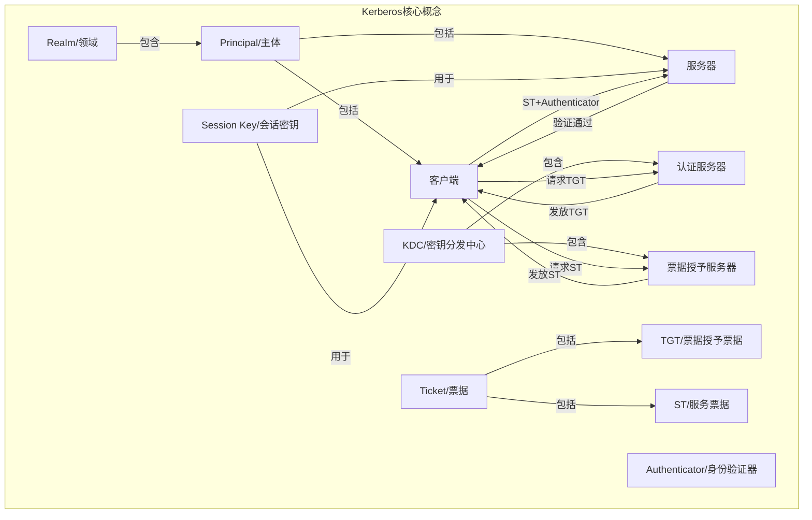

# Kerberos原理与代码实例讲解

## 1. 背景介绍

### 1.1 问题的由来

在分布式系统和网络环境中,安全性一直是一个重要的关注点。随着系统复杂性的增加和网络规模的扩大,确保通信的机密性、完整性和身份验证变得越来越具有挑战性。传统的安全机制,如基于密码的身份验证,存在着诸多缺陷,例如密码可能被窃取或暴力破解、无法防止重放攻击等。因此,需要一种更加安全、可靠的身份验证和授权机制来保护分布式系统中的通信。

### 1.2 研究现状

为解决上述问题,Kerberos协议应运而生。Kerberos是一种网络认证协议,旨在通过使用强密钥密码系统为客户机/服务器应用程序提供相互身份验证。它最初由麻省理工学院(MIT)在20世纪80年代开发,后来成为Internet工程任务组(IETF)的一个标准。Kerberos协议广泛应用于Microsoft Windows、Unix/Linux等操作系统,以及许多企业级应用程序中。

### 1.3 研究意义

Kerberos协议的设计目标是提供强大的身份验证服务,同时避免在网络上传输明文密码或可重用的密钥。它采用了一种基于票据的身份验证机制,利用对称密钥加密技术和可信第三方认证中心(Key Distribution Center,KDC)来实现安全的身份验证和密钥分发。通过Kerberos,客户端和服务器可以相互验证身份,并建立安全的会话密钥,从而确保后续通信的机密性和完整性。

Kerberos协议具有以下主要优势:

- 防止明文密码在网络上传输,增强了安全性
- 支持单点登录(Single Sign-On,SSO),提高了用户体验
- 支持跨域和互操作性,适用于异构环境
- 具有可扩展性和良好的性能

因此,深入理解Kerberos协议的原理和实现对于构建安全的分布式系统至关重要。

### 1.4 本文结构

本文将全面介绍Kerberos协议的核心概念、算法原理、数学模型、实现细节和实际应用场景。首先,我们将探讨Kerberos协议的核心概念和组件,以及它们之间的关系。接下来,将详细阐述Kerberos协议的核心算法原理和具体操作步骤。然后,我们将介绍Kerberos协议中使用的数学模型和公式,并通过案例分析进行详细说明。此外,本文还将提供Kerberos协议的代码实现示例,并对关键代码进行解读和分析。最后,我们将讨论Kerberos协议在实际应用场景中的应用,以及未来的发展趋势和面临的挑战。

## 2. 核心概念与联系

Kerberos协议涉及了多个核心概念和组件,它们相互协作以实现安全的身份验证和授权。下面我们将介绍这些核心概念及它们之间的关系。

1. **Principal/主体**: 指与Kerberos协议交互的实体,包括客户端(Client)和服务器(Server)。每个主体都有一个唯一的标识符,用于在Kerberos领域内进行身份验证。

2. **Realm/领域**: 是一个逻辑上的安全边界,用于定义一组相互信任的主体和服务。每个Realm都由一个KDC管理。

3. **KDC/密钥分发中心**: 是Kerberos协议的核心组件,负责进行身份验证和发放票据。KDC包括两个子组件:认证服务器(AS)和票据授予服务器(TGS)。

4. **Ticket/票据**: 是Kerberos协议中用于身份验证和授权的关键数据结构。它包含了主体的身份信息、会话密钥等加密数据。有两种主要类型的票据:TGT(票据授予票据)和ST(服务票据)。

5. **TGT/票据授予票据**: 是客户端首次向KDC的AS请求并获得的票据,用于后续向TGS请求ST。

6. **ST/服务票据**: 是客户端向TGS请求并获得的票据,用于向特定服务器进行身份验证和建立安全会话。

7. **Session Key/会话密钥**: 是客户端和服务器之间用于加密通信的对称密钥,由KDC生成并分发给双方。

8. **Authenticator/身份验证器**: 是客户端向服务器发送的一个记录,用于证明客户端确实拥有会话密钥,从而验证其身份。

上述核心概念相互关联,共同构成了Kerberos协议的完整流程。客户端首先向AS请求TGT,然后使用TGT向TGS请求ST,最后使用ST和Authenticator向服务器进行身份验证,并建立安全会话。整个过程中,KDC作为可信第三方,负责生成和分发票据和会话密钥,确保通信的安全性。

## 3. 核心算法原理与具体操作步骤

### 3.1 算法原理概述

Kerberos协议的核心算法原理基于对称密钥加密技术和可信第三方认证中心(KDC)。它采用了一种基于票据的身份验证机制,通过交换加密的票据和身份验证器来实现客户端和服务器之间的相互身份验证和建立安全会话。

算法的基本流程如下:

1. 客户端向KDC的认证服务器(AS)请求一个票据授予票据(TGT)。
2. AS验证客户端的身份,并发放一个加密的TGT和会话密钥。
3. 客户端使用TGT向KDC的票据授予服务器(TGS)请求一个服务票据(ST)。
4. TGS验证TGT的有效性,并发放一个加密的ST和新的会话密钥。
5. 客户端使用ST和身份验证器向服务器进行身份验证。
6. 服务器验证ST和身份验证器的有效性,确认客户端的身份。
7. 客户端和服务器使用会话密钥进行后续的安全通信。

在整个过程中,密钥和票据都是加密的,从而避免了在网络上传输明文密码或可重用的密钥。同时,KDC作为可信第三方,负责生成和分发票据和会话密钥,确保了通信的安全性和可靠性。

### 3.2 算法步骤详解

下面我们将详细解释Kerberos协议的具体操作步骤:

1. **客户端向AS请求TGT**

   客户端向KDC的认证服务器(AS)发送一个身份验证请求,请求一个票据授予票据(TGT)。该请求包含客户端的主体名称和Realm信息。

2. **AS验证客户端身份并发放TGT**

   AS使用客户端的密码对请求进行身份验证。如果验证通过,AS将生成以下数据:

   - 一个TGT,包含客户端的主体名称、Realm信息、TGT的有效期等。
   - 一个会话密钥(Session Key),用于客户端和TGS之间的后续通信。

   AS将TGT和会话密钥分别使用客户端的密码和TGS的密钥进行加密,然后发送给客户端。

3. **客户端向TGS请求ST**

   客户端使用从AS获得的TGT和会话密钥向KDC的票据授予服务器(TGS)发送请求,请求一个服务票据(ST)。该请求包含客户端希望访问的服务器的主体名称和Realm信息。

4. **TGS验证TGT并发放ST**

   TGS使用自己的密钥解密TGT,验证TGT的有效性和客户端的身份。如果验证通过,TGS将生成以下数据:

   - 一个ST,包含客户端的主体名称、服务器的主体名称、ST的有效期等。
   - 一个新的会话密钥(Session Key),用于客户端和服务器之间的后续通信。

   TGS将ST使用服务器的密钥进行加密,并将加密后的ST和新的会话密钥使用TGT中的会话密钥进行加密,然后发送给客户端。

5. **客户端向服务器进行身份验证**

   客户端使用从TGS获得的ST和会话密钥向服务器发送身份验证请求。该请求包含以下数据:

   - 加密后的ST
   - 一个身份验证器(Authenticator),包含客户端的主体名称、时间戳等信息,使用会话密钥进行加密。

6. **服务器验证ST和Authenticator**

   服务器使用自己的密钥解密ST,获取客户端的主体名称、会话密钥等信息。然后,服务器使用从ST中获取的会话密钥解密Authenticator,验证其中的时间戳和客户端主体名称是否有效。

   如果验证通过,服务器就可以确认客户端的身份,并使用相同的会话密钥与客户端进行后续的安全通信。

通过上述步骤,Kerberos协议实现了客户端和服务器之间的相互身份验证,并建立了一个安全的会话密钥,用于后续的加密通信。整个过程中,密钥和票据都是加密的,从而避免了在网络上传输明文密码或可重用的密钥,提高了系统的安全性。

### 3.3 算法优缺点

**优点:**

1. **防止明文密码传输**: Kerberos协议避免了在网络上传输明文密码,提高了安全性。

2. **支持单点登录(SSO)**: 用户只需在初始登录时提供一次凭证,就可以访问多个服务,提高了用户体验。

3. **支持跨域和互操作性**: Kerberos协议支持多个领域(Realm),并且可以在异构环境中实现互操作性。

4. **可扩展性和性能**: Kerberos协议具有良好的可扩展性和性能,可以支持大规模的分布式系统。

5. **基于票据的身份验证**: 使用票据进行身份验证,避免了密钥的重复使用,提高了安全性。

**缺点:**

1. **依赖可信第三方(KDC)**: Kerberos协议依赖于一个可信的中央认证服务器(KDC),如果KDC被攻破或出现故障,整个系统的安全性将受到威胁。

2. **时钟同步要求**: 客户端和服务器之间需要进行时钟同步,以防止重放攻击。时钟同步的误差会影响系统的安全性。

3. **密钥管理复杂性**: Kerberos协议需要管理大量的密钥,包括主体密钥、服务器密钥和会话密钥,密钥管理的复杂性较高。

4. **单点故障风险**: 由于KDC是单点组件,一旦发生故障,整个系统将无法正常工作,因此需要采取高可用性措施。

5. **不支持非互联网协议**: Kerberos协议主要设计用于TCP/IP网络,对于非互联网协议(如AppleTalk)的支持较差。

总的来说,Kerberos协议提供了一种安全、可靠的身份验证和授权机制,但也存在一些固有的限制和挑战。在实际应用中,需要根据具体场景权衡其优缺点,并采取适当的措施来降低风险和提高安全性。

### 3.4 算法应用领域

Kerberos协议广泛应用于各种分布式系统和网络环境中,以提供安全的身份验证和授权服务。以下是一些典型的应用场景:

1. **企业网络和内部网**: