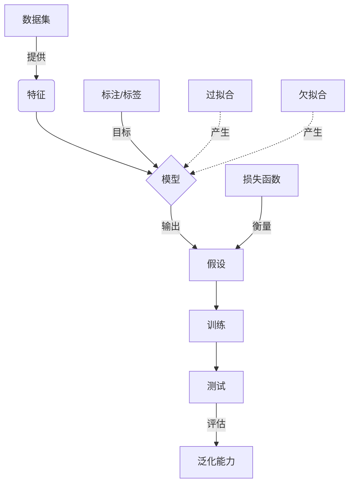

好的,我会严格遵循约束条件,尽最大努力为您撰写一篇高质量的技术博客文章。以下是正文部分:

# Machine Learning原理与代码实例讲解

## 1. 背景介绍

### 1.1 问题的由来

在当今数据时代,海量的数据被收集和存储。然而,如何从这些原始数据中提取有价值的信息和知识,并将其应用于实际问题的解决,成为了一个巨大的挑战。机器学习(Machine Learning)作为一门多领域交叉的学科,正是为了解决这一问题而产生和发展。

机器学习的核心思想是:利用算法从数据中"学习",获取程序在编写时没有直接指定的知识,并将其应用于解决实际问题。这种以数据为基础,通过算法自动获取知识的方式,突破了传统编程范式的局限,为人工智能系统的发展开辟了新的道路。

### 1.2 研究现状  

机器学习理论和应用研究已经取得了长足的进展。在理论层面,统计学习理论、计算学习理论等为机器学习奠定了坚实的数学基础。在算法层面,诸如支持向量机、决策树、贝叶斯方法、神经网络等多种有效的机器学习算法不断涌现。在应用层面,机器学习技术已广泛应用于计算机视觉、自然语言处理、推荐系统、金融分析等诸多领域,取得了卓越的成就。

与此同时,机器学习也面临着一些新的挑战。大数据时代的到来,使得机器学习需要处理更大规模、更复杂的数据。另一方面,人工智能系统对机器学习的性能和可解释性提出了更高的要求。如何设计高效、健壮、可解释的机器学习算法,是当前研究的重点课题。

### 1.3 研究意义

机器学习是人工智能的核心,是实现智能系统的关键技术之一。深入研究机器学习的原理和方法,不仅可以推动人工智能技术的发展,还将为解决现实世界中的诸多挑战性问题提供有力的技术支持,对经济、社会的发展将产生深远的影响。

从理论层面看,机器学习融合了计算机科学、数学、统计学、信息论等多个学科的理论和方法,是一门典型的交叉学科。对机器学习理论和方法的研究,将进一步深化这些学科的内涵,促进学科交叉融合,推动相关领域的创新发展。

从应用层面看,机器学习技术可以广泛应用于计算机视觉、自然语言处理、决策支持、模式识别、数据挖掘等诸多领域,为智能系统的构建提供强有力的技术支撑。随着人工智能技术在各行各业的不断渗透,机器学习在工业、农业、医疗、金融等领域的应用前景十分广阔。

### 1.4 本文结构

本文将系统介绍机器学习的核心概念、关键算法原理、数学模型,并结合实例对算法实现进行详细解析。全文共分为8个章节:

第1章对机器学习的背景、现状和意义进行了阐述。第2章介绍机器学习的核心概念及其内在联系。第3章重点讲解经典机器学习算法的原理和具体实现步骤。第4章构建机器学习的数学模型,并对模型中的公式进行推导和案例分析。第5章通过代码实例,对算法的实现进行详尽的讲解和分析。第6章探讨机器学习在实际应用中的场景。第7章推荐相关的学习资源、开发工具和论文。最后第8章对全文内容进行总结,并对机器学习的发展趋势和面临的挑战进行展望。

## 2. 核心概念与联系

机器学习是一门研究如何构建能够自动学习的算法和系统的科学。它包含以下几个核心概念:

1. **数据集(Dataset)**: 机器学习算法从数据集中学习知识,数据集的质量对算法性能有重要影响。常见的数据集包括监督学习数据集(带标签)和非监督学习数据集(无标签)。

2. **特征(Feature)**: 特征是对样本数据的数值化描述,是机器学习算法的输入。合理选择特征对算法性能至关重要。

3. **模型(Model)**: 机器学习算法基于数据构建模型,模型对应数据到结果的映射关系。模型可分为生成模型和判别模型两类。

4. **标注/标签(Label)**: 标注是对样本数据的类别标记,在监督学习中作为模型的输出目标。

5. **假设(Hypothesis)**: 假设对应模型对未知数据的判定或预测,是模型对问题的解决方案。

6. **损失函数(Loss Function)**: 损失函数衡量模型假设与真实标注之间的差异程度,是模型优化的目标函数。

7. **训练(Training)**: 训练是机器学习模型从数据集中学习知识的过程,通过优化算法调整模型参数,使损失函数最小化。

8. **测试(Testing)**: 在独立的测试数据集上评估模型性能,检验模型的泛化能力。

9. **泛化(Generalization)**: 泛化是模型对未知数据的适应能力,是机器学习追求的核心目标。

10. **过拟合(Overfitting)和欠拟合(Underfitting)**: 过度拟合训练数据而无法泛化的现象称为过拟合,欠拟合则是模型无法很好地拟合训练数据。

这些核心概念相互关联、环环相扣,共同构成了机器学习的理论框架和技术体系。掌握这些概念是深入学习和应用机器学习算法的基础和前提。

## 3. 核心算法原理及具体操作步骤  

机器学习涵盖了多种不同的算法,这些算法可以根据学习任务的不同分为监督学习、非监督学习和强化学习等类别。本节将重点介绍几种经典的监督学习算法的原理及实现步骤。

### 3.1 算法原理概述

#### 3.1.1 线性回归

线性回归是最简单、最基础的监督学习算法之一。其目标是学习出一个线性函数,使其能够最小化训练数据集中的均方误差。线性回归既可用于回归任务(连续值预测),也可用于分类任务(二分类)。

#### 3.1.2 逻辑回归

逻辑回归是一种广义线性模型,主要用于分类任务。它通过对线性函数引入Sigmoid函数作为激活函数,将输出值映射到(0,1)区间内,从而可以解释为概率输出。逻辑回归的损失函数通常采用交叉熵损失。

#### 3.1.3 决策树

决策树是一种基于树形结构的监督学习算法。它通过不断地对特征进行条件判断,将数据划分为更小的子集,最终达到预测目的。决策树模型具有可解释性强、无需特征缩放等优点,但也容易过拟合。

#### 3.1.4 支持向量机(SVM)

支持向量机是一种基于核函数的监督学习算法,主要用于分类任务。SVM的基本思想是在高维空间中寻找一个超平面,使得不同类别的数据能够被该超平面完全分开,且分类间隔最大化。SVM具有泛化能力强、避免维数灾难等优点。

#### 3.1.5 朴素贝叶斯

朴素贝叶斯是一种基于贝叶斯定理与特征独立性假设的分类算法。它计算每个特征对类别的贡献,并选择具有最大后验概率的类别作为预测输出。朴素贝叶斯简单高效,对缺失数据也具有鲁棒性。

#### 3.1.6 K-近邻算法(KNN)

K-近邻算法是一种基于实例的监督学习算法。对于待预测的新实例,KNN算法根据其与训练集中各实例的距离,选取距离最近的K个实例,并基于它们的多数类别进行预测。KNN算法直观简单,无需训练过程,但对大规模数据的性能欠佳。

#### 3.1.7 人工神经网络

人工神经网络是一种模拟生物神经网络的机器学习模型。它由多个神经元层构成,每层之间通过加权连接进行信息传递。通过反向传播算法对网络进行训练,神经网络可以学习出复杂的非线性映射关系。近年来,深度神经网络在计算机视觉、自然语言处理等领域取得了突破性进展。

### 3.2 算法步骤详解

以线性回归为例,具体实现步骤如下:

输入:训练数据集 $D=\{(x_1,y_1),(x_2,y_2),...,(x_m,y_m)\}$,其中 $x_i$ 为特征向量, $y_i$ 为标量响应值。
输出:线性回归模型 $f(x)=wx+b$,使得 $\sum_{i=1}^{m}(f(x_i)-y_i)^2$ 最小。

1) 定义损失函数(Loss Function):

$$J(w,b)=\frac{1}{2m}\sum_{i=1}^{m}(f(x_i)-y_i)^2$$

其中 $w$ 为权重向量, $b$ 为偏置。目标是求解能够最小化损失函数的 $w,b$。

2) 梯度下降法(Gradient Descent):

$$\begin{align*}
w &= w - \alpha\frac{\partial J(w,b)}{\partial w}\\
b &= b - \alpha\frac{\partial J(w,b)}{\partial b}
\end{align*}$$

其中 $\alpha$ 为学习率,决定了梯度下降的步长。具体求导过程如下:

$$\begin{align*}
\frac{\partial J(w,b)}{\partial w} &= \frac{1}{m}\sum_{i=1}^{m}(f(x_i)-y_i)x_i\\
\frac{\partial J(w,b)}{\partial b} &= \frac{1}{m}\sum_{i=1}^{m}(f(x_i)-y_i)
\end{align*}$$

3) 迭代更新 $w,b$,直到收敛或满足停止条件。

### 3.3 算法优缺点

线性回归算法的优点:

- 原理简单,易于理解和实现
- 无需特征缩放,对异常值也有较强鲁棒性
- 可以给出有意义的解释,如权重向量反映了各特征的重要性
- 训练速度快,可以高效处理大规模数据

缺点:

- 对非线性问题的拟合能力较差
- 对异常值的鲁棒性虽强于神经网络,但仍可能受到异常值的影响
- 存在欠拟合和过拟合问题,需要合理选择模型复杂度
- 只能用于数值型数据,对于类别型数据需要进行特征工程编码

### 3.4 算法应用领域

线性回归算法广泛应用于以下领域:

- 金融分析:利用线性回归预测股票、汇率等金融数据
- 运营分析:通过线性回归模型预测销售额、用户增长等指标
- 计量经济学:构建宏观经济计量模型,分析影响因素
- 自然科学:建立物理、化学等领域的线性模型
- 工程领域:如电路设计、材料分析等

此外,线性回归也常被用作更复杂机器学习模型的基线模型,用于比较不同算法的性能表现。

## 4. 数学模型和公式及详细讲解与举例说明

机器学习算法大多建立在坚实的数学理论基础之上。本节将围绕线性回归和逻辑回归这两种经典算法,构建其数学模型,并对模型中的公式进行推导和案例分析。

### 4.1 数学模型构建  

#### 4.1.1 线性回归模