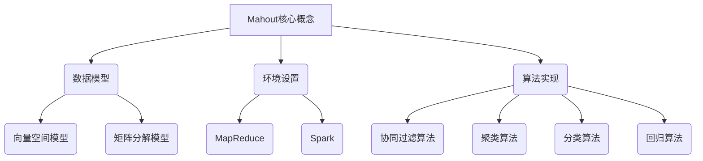
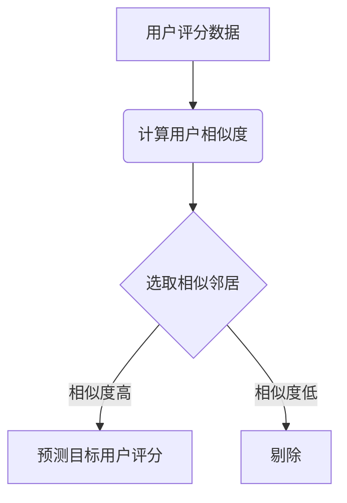

# Mahout原理与代码实例讲解

## 1. 背景介绍

### 1.1 问题的由来

在当今大数据时代，海量的数据被不断产生和积累。如何从这些庞大的数据中发现有价值的信息和知识模式,成为了一个亟待解决的问题。传统的数据处理方法已经无法满足大数据场景下的需求,因此迫切需要一种新的数据处理范式。

Apache Mahout 就是为解决这一问题而诞生的开源机器学习库。它旨在帮助开发人员更容易地创建可扩展的机器学习应用程序,能够高效地处理大规模数据集。

### 1.2 研究现状  

目前,Mahout 已经成为 Apache 软件基金会顶级项目之一,拥有活跃的开发者社区和大量的用户。它支持多种常见的机器学习算法,包括协同过滤、聚类、分类、回归等,可以广泛应用于推荐系统、广告定向、欺诈检测等领域。

与此同时,随着大数据技术的不断发展,Mahout 也在持续更新和完善。最新版本已经与 Apache Spark 深度集成,能够充分利用 Spark 的内存计算优势,显著提高了算法的执行效率。

### 1.3 研究意义

深入理解 Mahout 的原理和实现细节,对于从事大数据和机器学习相关工作的开发者来说意义重大。一方面,它可以帮助开发者更好地利用 Mahout 解决实际问题;另一方面,研究 Mahout 的设计思路和代码实现,也有助于提高开发者的机器学习算法设计和系统构建能力。

### 1.4 本文结构  

本文将全面介绍 Mahout 的核心概念、算法原理、数学模型、代码实现和实际应用场景。具体来说,第 2 节将阐述 Mahout 的核心概念及其内在联系;第 3 节将深入探讨 Mahout 中几种核心算法的原理和具体操作步骤;第 4 节将详细讲解这些算法背后的数学模型和公式推导过程;第 5 节将提供 Mahout 代码实例及其详细解释;第 6 节将介绍 Mahout 在实际应用中的场景;第 7 节将推荐一些有用的学习资源和开发工具;最后第 8 节将总结 Mahout 的发展趋势和面临的挑战。

## 2. 核心概念与联系

在探讨 Mahout 的具体算法之前,我们有必要先了解一些核心概念,这些概念贯穿于 Mahout 的整个设计和实现过程中。

### 2.1 数据模型

Mahout 中有两种主要的数据模型:向量空间模型和矩阵分解模型。

**向量空间模型**通常用于表示文本文档,其中每个文档被表示为一个向量,每个维度对应一个特征(如单词)的权重。这种模型常用于文本挖掘任务,如文本聚类、分类等。

**矩阵分解模型**则更适用于推荐系统等场景。在这种模型中,用户对项目的喜好被表示为一个大的评分矩阵,通过矩阵分解技术可以发现用户和项目的潜在特征,从而预测缺失的评分并产生个性化推荐。

### 2.2 环境设置

Mahout 最初是基于 MapReduce 构建的,用于在大型集群上并行执行机器学习算法。后来,Mahout 也支持了 Apache Spark 作为底层计算引擎,以充分利用 Spark 的内存计算优势。

用户可以根据具体需求选择 MapReduce 或 Spark 作为 Mahout 的运行环境。通常情况下,对于迭代式算法,如协同过滤、聚类等,使用 Spark 可以获得更好的性能;而对于非迭代式算法,如朴素贝叶斯分类等,MapReduce 也是一个不错的选择。

### 2.3 算法实现

Mahout 实现了多种常见的机器学习算法,包括:

- **协同过滤算法**:用于构建推荐系统,包括基于用户的协同过滤和基于项目的协同过滤。
- **聚类算法**:用于发现数据内在的组织结构,包括 K-means、模糊 K-means、Canopy 聚类等。  
- **分类算法**:用于将数据划分为不同的类别,包括朴素贝叶斯、逻辑回归、随机森林等。
- **回归算法**:用于预测连续值输出,包括线性回归、逻辑回归等。

这些算法都以可扩展的方式实现,能够高效地处理大规模数据集。

## 3. 核心算法原理 & 具体操作步骤  

在本节中,我们将重点介绍 Mahout 中几种核心算法的原理和具体操作步骤,包括协同过滤算法、K-means 聚类算法和朴素贝叶斯分类算法。

### 3.1 协同过滤算法原理概述

协同过滤(Collaborative Filtering)是构建推荐系统的一种常用技术。其核心思想是利用过去用户对项目的评分数据,发现用户之间或项目之间的相似性,从而预测用户对新项目的可能评分,并基于此生成个性化推荐。

Mahout 中实现了两种主要的协同过滤算法:基于用户的协同过滤和基于项目的协同过滤。

**基于用户的协同过滤**的基本步骤是:

1. 计算用户之间的相似度,通常基于用户对相同项目的评分。
2. 选取与目标用户相似度较高的一组邻居用户。
3. 根据邻居用户对某项目的评分,预测目标用户对该项目的可能评分。

**基于项目的协同过滤**的基本步骤是:

1. 计算项目之间的相似度,通常基于对同一用户的评分。  
2. 选取与目标项目相似度较高的一组邻居项目。
3. 根据目标用户对邻居项目的评分,预测其对目标项目的可能评分。

两种算法各有优缺点,需要根据具体场景进行选择。一般来说,基于项目的算法更适合项目数量较少、用户数量较多的情况,反之则更适合使用基于用户的算法。

### 3.2 算法步骤详解

以基于用户的协同过滤算法为例,具体步骤如下:

1. **计算用户相似度**

   常用的相似度计算方法有欧几里得距离、皮尔逊相关系数和余弦相似度等。Mahout 默认采用的是余弦相似度,计算公式如下:

   $$\text{sim}(u, v) = \frac{\sum\limits_{i \in I_{uv}}r_{ui}r_{vi}}{\sqrt{\sum\limits_{i \in I_u}r_{ui}^2}\sqrt{\sum\limits_{i \in I_v}r_{vi}^2}}$$

   其中 $u$、$v$ 表示两个用户, $I_{uv}$ 表示两个用户都对其评分的项目集合, $r_{ui}$ 表示用户 $u$ 对项目 $i$ 的评分。

2. **选取相似邻居**

   对于目标用户 $u$,选取与其相似度较高的 $k$ 个用户作为邻居,其中 $k$ 是一个可调参数,通常取值在 10~100 之间。

3. **预测目标用户评分**

   对于目标用户 $u$ 未评分的项目 $i$,其预测评分可以通过加权平均邻居用户的评分计算得到:

   $$\hat{r}_{ui} = \overline{r}_u + \frac{\sum\limits_{v \in N(u, k)}(\text{sim}(u, v)(r_{vi} - \overline{r}_v))}{\sum\limits_{v \in N(u, k)}\lvert\text{sim}(u, v)\rvert}$$

   其中 $N(u, k)$ 表示与用户 $u$ 最相似的 $k$ 个邻居用户集合, $\overline{r}_u$ 和 $\overline{r}_v$ 分别表示用户 $u$ 和 $v$ 的平均评分。

通过上述步骤,我们可以为目标用户预测其未评分项目的评分,从而为其生成个性化推荐列表。

### 3.3 算法优缺点

协同过滤算法的主要优点是:

- 无需了解项目的内容信息,只依赖于用户的历史评分数据。
- 能够自动发现用户和项目的隐式特征,提供个性化推荐。
- 可以通过调节相似度计算方法和邻居数量等参数,优化算法性能。

但它也存在一些缺点:

- 对于新用户或新项目,由于缺乏足够的评分数据,无法进行准确预测,这就是所谓的"冷启动"问题。
- 算法的计算复杂度较高,需要计算所有用户对或项目对之间的相似度。
- 存在数据稀疏性问题,即大多数用户只评分了少量项目,导致难以发现相似用户或项目。

### 3.4 算法应用领域

协同过滤算法广泛应用于推荐系统领域,如电子商务网站的商品推荐、视频网站的影视推荐、音乐网站的歌曲推荐等。除此之外,它还可以应用于其他一些场景,如社交网络中的好友推荐、新闻个性化推荐等。

## 4. 数学模型和公式 & 详细讲解 & 举例说明

在上一节中,我们介绍了协同过滤算法的基本原理和步骤。现在,我们将深入探讨该算法背后的数学模型和公式推导过程,并通过实例进行详细说明。

### 4.1 数学模型构建

我们将用户对项目的评分数据表示为一个评分矩阵 $R$,其中 $R_{ij}$ 表示用户 $i$ 对项目 $j$ 的评分。如果用户 $i$ 没有对项目 $j$ 进行评分,则 $R_{ij}$ 为缺失值。

基于用户的协同过滤算法的目标是估计这些缺失值,即预测用户对未评分项目的可能评分。为此,我们需要构建一个函数 $f$,使得:

$$\hat{R}_{ij} = f(R, i, j)$$

其中 $\hat{R}_{ij}$ 表示对用户 $i$ 对项目 $j$ 的预测评分。

### 4.2 公式推导过程

在 3.2 节中,我们给出了预测评分的具体公式:

$$\hat{r}_{ui} = \overline{r}_u + \frac{\sum\limits_{v \in N(u, k)}(\text{sim}(u, v)(r_{vi} - \overline{r}_v))}{\sum\limits_{v \in N(u, k)}\lvert\text{sim}(u, v)\rvert}$$

这个公式是如何推导出来的呢?我们来一步步分析。

首先,我们假设用户 $u$ 对项目 $i$ 的预测评分 $\hat{r}_{ui}$ 可以表示为:

$$\hat{r}_{ui} = \overline{r}_u + \sum\limits_{v \in N(u, k)}w_{uv}(r_{vi} - \overline{r}_v)$$

其中 $\overline{r}_u$ 和 $\overline{r}_v$ 分别表示用户 $u$ 和 $v$ 的平均评分, $w_{uv}$ 是一个权重系数,用于衡量用户 $v$ 对预测 $\hat{r}_{ui}$ 的贡献程度。

为了使预测评分 $\hat{r}_{ui}$ 尽可能接近真实评分 $r_{ui}$,我们需要最小化以下均方误差:

$$\min \