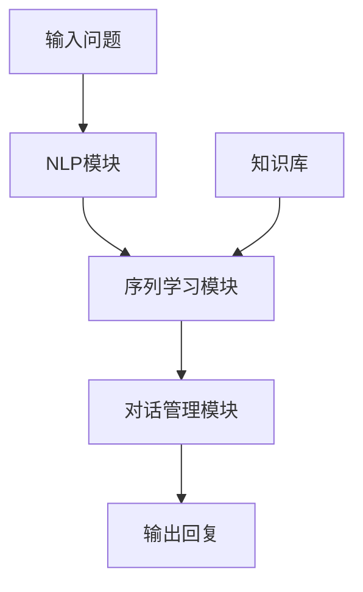

# Python机器学习实战：智能聊天机器人的构建与优化

## 1. 背景介绍

### 1.1 问题的由来

随着人工智能技术的不断发展,智能聊天机器人已经逐渐走进我们的生活。从最初简单的基于规则的问答系统,到后来的基于检索的聊天机器人,再到现在的基于深度学习的智能对话系统,聊天机器人的能力不断提高。然而,当前的智能聊天机器人仍然存在一些问题和挑战,比如上下文理解能力不足、知识库覆盖面有限、回复生成质量参差不齐等。

### 1.2 研究现状

近年来,研究人员致力于提高聊天机器人的自然语言理解、知识表示、对话管理和响应生成等各个环节的能力。其中,基于深度学习的序列到序列(Seq2Seq)模型、记忆增强网络、知识库引入等技术为构建高质量的智能聊天机器人提供了有力支撑。同时,开源对话数据集(如Cornell Movie Dialogs等)和自然语言处理工具库(如NLTK、SpaCy等)的出现,也为聊天机器人的研发提供了重要资源。

### 1.3 研究意义

构建高质量的智能聊天机器人不仅可以提升人机交互体验,还可以在客户服务、教育辅助、心理健康等多个领域发挥重要作用。本文将介绍如何利用Python及相关机器学习库,从零开始构建一个智能聊天机器人系统,并对其进行性能优化,以期为读者提供实践指导。

### 1.4 本文结构

本文首先介绍智能聊天机器人的核心概念和技术,包括自然语言处理、序列学习模型等;然后详细阐述聊天机器人的核心算法原理和数学模型;接着通过一个实际项目案例,讲解如何使用Python代码实现聊天机器人系统;最后探讨聊天机器人的应用场景、未来发展趋势和面临的挑战。

## 2. 核心概念与联系

构建智能聊天机器人需要多个技术模块的紧密配合,包括自然语言处理(NLP)、序列学习模型、知识库等。下面我们逐一介绍这些核心概念。

### 2.1 自然语言处理(NLP)

自然语言处理是使计算机能够理解和生成人类语言的技术,是聊天机器人系统的基础。NLP技术包括以下几个主要步骤:

1. **分词(Tokenization)**: 将文本按照一定规则分割成单词序列。
2. **词性标注(POS Tagging)**: 为每个单词赋予相应的词性标签(如名词、动词等)。
3. **命名实体识别(NER)**: 识别出文本中的人名、地名、组织机构名等命名实体。
4. **依存解析(Dependency Parsing)**: 分析句子中词与词之间的依存关系。
5. **词向量(Word Embedding)**: 将单词表示为稠密的向量形式,用于后续的机器学习模型输入。

Python中有多个优秀的NLP库可以使用,如NLTK、SpaCy等。这些库可以高效完成上述NLP任务。

### 2.2 序列学习模型

聊天机器人的核心是根据输入的问题生成合理的回复,这属于一个序列到序列(Seq2Seq)的学习问题。常用的Seq2Seq模型包括:

1. **循环神经网络(RNN)**: 可以处理序列数据,但存在梯度消失/爆炸问题。
2. **长短期记忆网络(LSTM)**: 改进的RNN,通过门控机制解决了梯度问题。
3. **门控循环单元(GRU)**: 与LSTM类似,但更简单高效。
4. **Transformer**: 基于注意力机制的新型Seq2Seq模型,在多个NLP任务中表现优异。
5. **BERT**: 预训练的Transformer模型,可以显著提高下游NLP任务的性能。

这些序列学习模型需要结合NLP技术对输入问题进行预处理,并在训练阶段学习问答对之间的映射关系,最终生成自然的回复。Python中有PyTorch、TensorFlow等深度学习框架可以高效实现这些模型。

### 2.3 知识库

为了提高聊天机器人的知识覆盖面,我们需要构建知识库。知识库可以是基于规则的问答库、基于检索的语料库,或者是结构化的知识图谱等。聊天机器人可以基于知识库快速查找相关信息,并将其融入到生成的回复中。

构建高质量知识库是一项艰巨的工程,需要大量的人工标注和清理工作。或者,我们也可以利用开源的知识库资源,如Wikipedia、ConceptNet等。

### 2.4 对话管理

对话管理模块负责控制整个对话流程,包括上下文跟踪、多轮交互、话题切换等。常用的对话管理策略有:

1. **基于规则**: 预定义对话流程,根据规则进行状态转移。
2. **基于机器学习**: 将对话过程建模为马尔可夫决策过程,通过强化学习优化策略。
3. **混合策略**: 结合规则和机器学习的优势。

对话管理模块需要与NLP模块、序列学习模块、知识库模块紧密协作,以实现自然流畅的多轮对话交互。

### 2.5 模块关系

上述各个模块在智能聊天机器人系统中的关系如下图所示:

其中,NLP模块对输入问题进行预处理;序列学习模块根据问题生成初步回复;知识库为回复提供补充信息;对话管理模块控制整个对话流程,综合各模块的输出生成最终回复。

## 3. 核心算法原理与具体操作步骤

### 3.1 算法原理概述

智能聊天机器人的核心算法是基于序列到序列(Seq2Seq)的生成模型,主要分为以下几个步骤:

1. **输入表示**: 将输入问题表示为词向量序列。
2. **编码器(Encoder)**: 一个RNN(如LSTM)对输入序列进行编码,得到上下文向量。
3. **解码器(Decoder)**: 另一个RNN根据上下文向量生成输出回复序列。
4. **注意力机制(Attention)**: 在解码时,对输入序列中的不同位置赋予不同的注意力权重。
5. **梯度更新**: 通过最小化问答对之间的损失函数,对模型参数进行梯度更新。

此外,我们还可以引入外部知识库、对话管理模块等,以提高聊天机器人的性能和交互质量。

### 3.2 算法步骤详解

我们以一个基于LSTM的Seq2Seq模型为例,详细介绍算法的具体步骤。假设输入问题为 $X = (x_1, x_2, ..., x_T)$,期望输出回复为 $Y = (y_1, y_2, ..., y_{T'})$。

#### 3.2.1 输入表示

首先,我们将输入问题 $X$ 映射为词向量序列 $\boldsymbol{x} = (\boldsymbol{x}_1, \boldsymbol{x}_2, ..., \boldsymbol{x}_T)$,其中 $\boldsymbol{x}_t \in \mathbb{R}^{d_x}$ 是第 $t$ 个词的 $d_x$ 维词向量。

#### 3.2.2 编码器

编码器是一个LSTM网络,它读入词向量序列 $\boldsymbol{x}$,计算出每个时间步的隐藏状态 $\boldsymbol{h}_t$:

$$\begin{aligned}
\boldsymbol{h}_t &= \text{LSTM}(\boldsymbol{x}_t, \boldsymbol{h}_{t-1}) \\
              &= \begin{bmatrix}
                    \boldsymbol{f}_t \\
                    \boldsymbol{i}_t \\
                    \boldsymbol{o}_t \\
                    \boldsymbol{c}_t
                  \end{bmatrix}
                  = \begin{bmatrix}
                    \sigma(\boldsymbol{W}_f \boldsymbol{x}_t + \boldsymbol{U}_f \boldsymbol{h}_{t-1} + \boldsymbol{b}_f) \\
                    \sigma(\boldsymbol{W}_i \boldsymbol{x}_t + \boldsymbol{U}_i \boldsymbol{h}_{t-1} + \boldsymbol{b}_i) \\
                    \sigma(\boldsymbol{W}_o \boldsymbol{x}_t + \boldsymbol{U}_o \boldsymbol{h}_{t-1} + \boldsymbol{b}_o) \\
                    \boldsymbol{f}_t \odot \boldsymbol{c}_{t-1} + \boldsymbol{i}_t \odot \tanh(\boldsymbol{W}_c \boldsymbol{x}_t + \boldsymbol{U}_c \boldsymbol{h}_{t-1} + \boldsymbol{b}_c)
                  \end{bmatrix}
\end{aligned}$$

其中, $\boldsymbol{f}_t$、$\boldsymbol{i}_t$、$\boldsymbol{o}_t$ 分别是遗忘门、输入门、输出门,控制着单元状态 $\boldsymbol{c}_t$ 的更新;$\sigma$ 是sigmoid激活函数;$\odot$ 是元素级乘积;$\boldsymbol{W}$、$\boldsymbol{U}$、$\boldsymbol{b}$ 是LSTM的可训练参数。

最后,我们取最后一个隐藏状态 $\boldsymbol{h}_T$ 作为编码器的输出,即输入问题的语义表示 $\boldsymbol{c} = \boldsymbol{h}_T$。

#### 3.2.3 解码器

解码器也是一个LSTM网络,它根据语义表示 $\boldsymbol{c}$ 生成输出回复序列 $\boldsymbol{y} = (\boldsymbol{y}_1, \boldsymbol{y}_2, ..., \boldsymbol{y}_{T'})$。具体地,在每个时间步 $t$,解码器计算:

$$\begin{aligned}
\boldsymbol{s}_t &= \text{LSTM}(\boldsymbol{y}_{t-1}, \boldsymbol{s}_{t-1}, \boldsymbol{c}) \\
\boldsymbol{o}_t &= \boldsymbol{V} \boldsymbol{s}_t + \boldsymbol{b} \\
\boldsymbol{y}_t &\sim \text{Softmax}(\boldsymbol{o}_t)
\end{aligned}$$

其中, $\boldsymbol{s}_t$ 是解码器的隐藏状态,除了依赖于前一状态 $\boldsymbol{s}_{t-1}$ 和当前输入 $\boldsymbol{y}_{t-1}$ 外,还与编码器的语义表示 $\boldsymbol{c}$ 相关;$\boldsymbol{V}$ 和 $\boldsymbol{b}$ 是可训练参数;$\boldsymbol{o}_t$ 是logits向量,通过softmax函数得到每个词的生成概率 $\boldsymbol{y}_t$。

在训练阶段,我们最大化真实回复序列的生成概率(或最小化交叉熵损失);在测试阶段,我们根据 $\boldsymbol{y}_t$ 贪婪地采样出下一个词,直到生成终止符号。

#### 3.2.4 注意力机制

为了提高模型性能,我们可以引入注意力机制。具体地,在解码器的每个时间步,我们计算输入序列 $\boldsymbol{x}$ 中每个位置对当前输出的注意力权重 $\boldsymbol{\alpha}_t$:

$$\begin{aligned}
\boldsymbol{e}_t &= \boldsymbol{v}^\top \tanh(\boldsymbol{W}_h \boldsymbol{h}_t + \boldsymbol{W}_s \boldsymbol{s}_t) \\
\boldsymbol{\alpha}_t &= \text{Softmax}(\boldsymbol{e}_t)
\end{aligned}$$

其中, $\boldsymbol{v}$、$\boldsymbol{W}_h$、$\boldsymbol{W}_s$ 是可训练参数;$\boldsymbol{h}_t$ 是编码器在时间步 $t$ 的隐藏状态。

然后,我们根据注意力权重 $\boldsymbol{\alpha}_t$ 对编码器隐藏状态 $\bolds