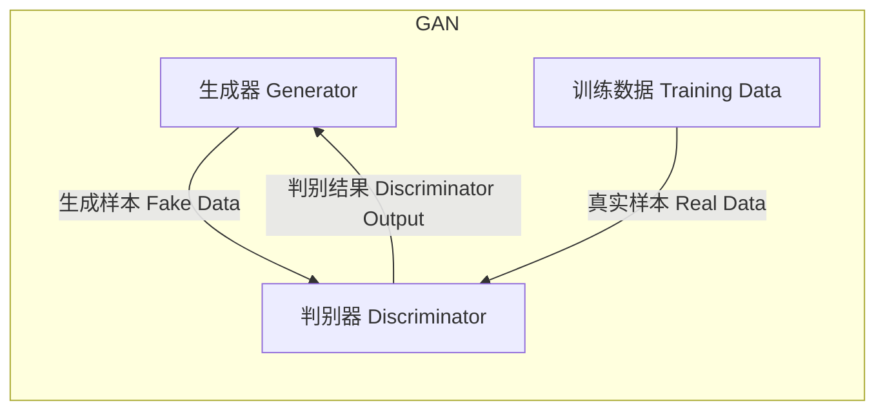

# Python机器学习实战：生成对抗网络(GAN)的原理与应用

## 1. 背景介绍

### 1.1 问题的由来

在传统的机器学习领域中，大多数算法都是基于监督学习的范式。这种方法需要大量的标注数据作为训练集输入，然而获取高质量的标注数据通常是一个耗时且昂贵的过程。为了解决这个问题,Ian Goodfellow等人在2014年提出了生成对抗网络(Generative Adversarial Networks, GAN)的概念,开辟了无监督生成式模型的新领域。

### 1.2 研究现状

自从GAN被提出以来,它在计算机视觉、自然语言处理、音频合成等多个领域展现出了巨大的潜力。GAN可以从噪声分布中学习数据的真实分布,并生成逼真的图像、文本和音频等数据。目前,GAN已经被广泛应用于图像生成、图像翻译、数据增强、超分辨率重建等多个领域。

### 1.3 研究意义

GAN的出现为机器学习领域带来了全新的思路和方法。它可以从少量或无标注数据中学习数据分布,从而生成新的逼真数据,为数据增强、数据私有化等提供了新的解决方案。此外,GAN在图像、视频、音频等多媒体领域的应用也为人工智能的发展注入了新的活力。

### 1.4 本文结构

本文将全面介绍GAN的基本原理、核心算法、数学模型以及在Python中的实现细节。文章首先阐述GAN的核心思想和基本概念,然后深入探讨GAN的数学模型和训练过程,接着介绍如何使用Python和相关框架(如PyTorch和TensorFlow)实现GAN模型。最后,本文将分享GAN在实际应用中的案例,并对其未来发展趋势和挑战进行展望。

## 2. 核心概念与联系

生成对抗网络(GAN)是一种全新的生成式模型,它由两个神经网络模型组成:生成器(Generator)和判别器(Discriminator)。这两个模型相互对抗,最终达到一种动态平衡。

**生成器(Generator)**的目标是从一个潜在的随机噪声分布中生成逼真的数据样本,以欺骗判别器。生成器可以被视为一个"艺术家",它试图创作出逼真的作品。

**判别器(Discriminator)**的目标是区分生成器生成的数据样本和真实的训练数据。判别器扮演着"艺术鉴赏家"的角色,它需要判断一件作品是真品还是赝品。

生成器和判别器之间存在一个对抗的博弈过程。生成器努力生成更加逼真的数据样本来欺骗判别器,而判别器则努力提高自身的判别能力来识别生成的数据样本。通过这种对抗训练,生成器和判别器相互促进,最终达到一种动态平衡,使生成器能够生成与真实数据无法区分的样本。

上图展示了GAN的基本工作原理。生成器从随机噪声中生成假样本,判别器接收假样本和真实样本,并输出判别结果。生成器根据判别器的反馈不断优化自身,以生成更逼真的样本。

GAN的核心思想是通过对抗训练的方式,使生成器学习真实数据的分布,从而生成新的逼真数据样本。这种全新的无监督学习范式为机器学习领域带来了革命性的变化,开辟了诸多应用场景。

## 3. 核心算法原理 & 具体操作步骤

### 3.1 算法原理概述

GAN的训练过程可以看作是一个minimax博弈问题,生成器G和判别器D相互对抗,最终达到一种纳什均衡。具体来说,生成器G的目标是最小化判别器D判别为真实数据的概率,而判别器D的目标是最大化正确判别真实数据和生成数据的概率。这可以用以下公式表示:

$$\min_G \max_D V(D,G) = \mathbb{E}_{x\sim p_{data}(x)}[\log D(x)] + \mathbb{E}_{z\sim p_z(z)}[\log(1-D(G(z)))]$$

其中:
- $p_{data}(x)$表示真实数据分布
- $p_z(z)$表示生成器输入的噪声分布,通常为高斯分布或均匀分布
- $G(z)$表示生成器从噪声$z$生成的样本
- $D(x)$表示判别器对样本$x$判别为真实数据的概率

在理想情况下,生成器G将学习到真实数据分布$p_{data}(x)$,从而生成的样本$G(z)$与真实数据$x$无法区分。此时,判别器D将无法有效地区分真实数据和生成数据,对所有输入输出0.5的概率。

### 3.2 算法步骤详解

GAN的训练过程包括以下几个主要步骤:

1. **初始化生成器G和判别器D**
   - 生成器G通常采用上采样卷积网络(如转置卷积)结构
   - 判别器D通常采用下采样卷积网络结构

2. **生成器G生成假样本**
   - 从噪声先验分布$p_z(z)$中采样一个随机噪声向量$z$
   - 将噪声$z$输入生成器G,生成假样本$G(z)$

3. **判别器D对真实样本和假样本进行判别**
   - 从真实数据分布$p_{data}(x)$中采样一批真实样本$x$
   - 将真实样本$x$和生成样本$G(z)$输入判别器D
   - 计算判别器D对真实样本的判别结果$D(x)$
   - 计算判别器D对生成样本的判别结果$D(G(z))$

4. **计算生成器G和判别器D的损失函数**
   - 生成器G的损失函数:$\mathcal{L}_G = -\mathbb{E}_{z\sim p_z(z)}[\log(D(G(z)))]$
     - 生成器G的目标是最小化这个损失函数,使判别器D尽可能将生成样本$G(z)$判别为真实样本

   - 判别器D的损失函数:$\mathcal{L}_D = -\mathbb{E}_{x\sim p_{data}(x)}[\log D(x)] - \mathbb{E}_{z\sim p_z(z)}[\log(1-D(G(z)))]$
     - 判别器D的目标是最大化这个损失函数,正确区分真实样本$x$和生成样本$G(z)$

5. **更新生成器G和判别器D的参数**
   - 使用优化算法(如Adam)计算生成器G和判别器D的梯度
   - 更新生成器G和判别器D的参数,使它们朝着各自的目标优化

6. **重复步骤2-5,直到模型收敛**
   - 在每个训练epoch中,重复执行上述步骤
   - 监控生成器G和判别器D的损失函数,直到它们达到动态平衡

通过上述步骤的反复迭代,生成器G将不断提高生成样本的质量,而判别器D也将不断提高判别能力。最终,生成器G将学习到真实数据分布,生成的样本将无法被判别器D区分。

### 3.3 算法优缺点

**优点:**

1. **无需大量标注数据**:GAN是一种无监督学习算法,不需要大量的标注数据,只需要未标注的原始数据。

2. **生成新数据**:GAN可以从噪声分布中生成新的逼真数据样本,为数据增强、数据私有化等提供了新的解决方案。

3. **多样化输出**:由于GAN的生成过程具有随机性,它可以生成多样化的输出,而不是简单地复制训练数据。

4. **端到端训练**:GAN的生成器和判别器可以通过端到端的方式进行联合训练,无需人工设计特征提取器。

**缺点:**

1. **训练不稳定**:GAN的训练过程容易出现模式崩溃(mode collapse)、梯度消失/爆炸等问题,导致训练不稳定。

2. **评估困难**:由于GAN生成的是无监督数据,很难定义一个客观的评估指标来衡量生成结果的质量。

3. **计算资源需求高**:训练GAN模型通常需要大量的计算资源,尤其是在处理高分辨率图像或视频数据时。

4. **缺乏解释性**:GAN生成的数据缺乏可解释性,难以理解模型内部的工作机制。

### 3.4 算法应用领域

GAN因其独特的生成式建模能力,在多个领域展现出了广阔的应用前景:

1. **图像生成**:GAN可以生成逼真的图像数据,应用于图像增强、图像编辑、图像复原等场景。

2. **图像翻译**:通过条件GAN(Conditional GAN),可以实现图像到图像的翻译,如将素描图像翻译为真实照片。

3. **语音合成**:GAN可以生成逼真的语音数据,用于语音合成、语音增强等应用。

4. **文本生成**:结合序列模型,GAN可以生成逼真的文本数据,应用于文本摘要、机器创作等领域。

5. **数据增强**:GAN生成的数据可用于扩充训练集,提高机器学习模型的泛化能力。

6. **数据私有化**:GAN可以生成具有相似统计特性但不包含个人信息的数据,用于数据私有化和保护隐私。

7. **半监督学习**:GAN可以利用少量标注数据和大量未标注数据进行半监督学习,提高模型性能。

8. **异常检测**:通过训练GAN生成正常数据,可以检测出偏离正常模式的异常数据。

总的来说,GAN为机器学习领域带来了全新的无监督生成式建模范式,在多个领域展现出了广阔的应用前景。

## 4. 数学模型和公式 & 详细讲解 & 举例说明

### 4.1 数学模型构建

生成对抗网络(GAN)的数学模型可以形式化为一个minimax博弈问题,其目标函数如下:

$$\min_G \max_D V(D,G) = \mathbb{E}_{x\sim p_{data}(x)}[\log D(x)] + \mathbb{E}_{z\sim p_z(z)}[\log(1-D(G(z)))]$$

其中:

- $G$是生成器(Generator)模型,它将一个随机噪声$z$映射为一个样本$G(z)$,试图欺骗判别器$D$。
- $D$是判别器(Discriminator)模型,它接收一个样本$x$,输出一个标量$D(x)$,表示$x$来自真实数据分布$p_{data}(x)$的概率。
- $p_{data}(x)$是真实数据的分布。
- $p_z(z)$是生成器输入的噪声分布,通常为高斯分布或均匀分布。

判别器$D$的目标是最大化上述目标函数,正确区分真实样本$x$和生成样本$G(z)$。而生成器$G$的目标是最小化这个目标函数,使判别器$D$尽可能将生成样本$G(z)$判别为真实样本。

在理想情况下,生成器$G$将学习到真实数据分布$p_{data}(x)$,从而生成的样本$G(z)$与真实数据$x$无法区分。此时,判别器$D$将无法有效地区分真实数据和生成数据,对所有输入输出0.5的概率。

### 4.2 公式推导过程

为了更好地理解GAN的数学模型,我们可以从最小化KL散度(Kullback-Leibler Divergence)的角度来推导目标函数。

KL散度是衡量两个概率分布之间差异的一种常用方法,定义如下:

$$D_{KL}(p_{data}||p_g) = \mathbb{E}_{x\sim p_{data}(x)}\left[\log\frac{p_{data}(x)}{p_g(x)}\right]$$

其中,$ p_{data}(x)$