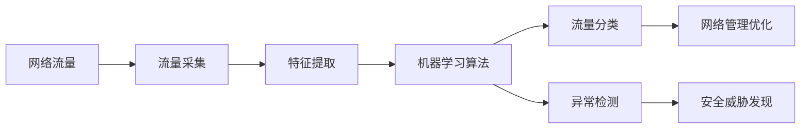

# Python机器学习实战：采用机器学习技术对网络流量进行分析

关键词：Python、机器学习、网络流量分析、异常检测、流量分类

## 1. 背景介绍

### 1.1 问题的由来

随着互联网的快速发展，网络流量呈现爆炸式增长。海量的网络流量数据给网络管理和安全带来了巨大挑战。传统的网络流量分析方法已经难以应对复杂多变的网络环境。如何从海量网络流量数据中挖掘有价值的信息，实现智能化的网络管理和安全防护，成为亟待解决的问题。

### 1.2 研究现状

近年来，机器学习技术在网络流量分析领域得到了广泛应用。国内外学者提出了多种基于机器学习的网络流量分析方法，如基于支持向量机（SVM）、决策树、随机森林等算法的流量分类方法，基于聚类、异常检测等算法的网络异常检测方法。这些方法在一定程度上提高了网络流量分析的智能化水平，但仍存在精度不高、实时性不足等问题。

### 1.3 研究意义

本文旨在探索采用机器学习技术对网络流量进行智能分析的方法。通过Python实现常见的机器学习算法，并应用于真实的网络流量数据，实现网络流量的分类和异常检测。这不仅可以提高网络管理的效率，实现网络流量的可视化和智能调度，还可以及时发现网络中的安全威胁，保障网络系统的安全稳定运行。

### 1.4 本文结构

本文共分为九个部分：第一部分介绍研究背景和意义；第二部分介绍机器学习在网络流量分析中的核心概念；第三部分详细阐述常见的机器学习算法原理和步骤；第四部分建立网络流量分析的数学模型，并给出详细的公式推导过程；第五部分通过Python代码实例，演示机器学习算法在网络流量分析中的具体应用；第六部分分析机器学习技术在实际网络环境中的应用场景；第七部分推荐网络流量分析的相关工具和学习资源；第八部分总结全文，并展望机器学习技术在网络流量分析中的发展趋势和面临的挑战；第九部分为附录，解答一些常见问题。

## 2. 核心概念与联系

在将机器学习应用于网络流量分析之前，我们需要了解一些核心概念：

- **网络流量**：网络中传输的数据流，包括数据包的各种属性，如源IP、目的IP、协议类型、包长度等。
- **流量分类**：根据网络流量的特征，将其划分到预定义的类别中，如P2P、HTTP、FTP等。
- **异常检测**：通过分析网络流量的模式，发现异常行为和潜在的安全威胁，如DDoS攻击、端口扫描等。
- **机器学习**：一种人工智能技术，通过数据驱动的方式，让计算机系统从数据中自动学习和改进，无需显式编程。
- **有监督学习**：一种常见的机器学习范式，使用带标签的训练数据训练模型，再用模型对新数据进行预测。适用于流量分类等场景。
- **无监督学习**：另一种机器学习范式，使用无标签的数据，通过数据之间的相似性进行学习。适用于异常检测等场景。

网络流量分析与机器学习技术的关系如下图所示：



从图中可以看出，机器学习是网络流量分析的核心，通过对采集到的流量数据进行特征提取，再使用机器学习算法进行建模和预测，最终实现流量分类和异常检测，为网络管理和安全防护提供支撑。

## 3. 核心算法原理 & 具体操作步骤

### 3.1 算法原理概述

网络流量分析常用的机器学习算法可分为有监督学习和无监督学习两大类。有监督学习算法包括：

- **k近邻（k-NN）**：根据数据点的k个最近邻居的类别来决定该点的类别。
- **决策树（Decision Tree）**：通过树形结构，根据特征的取值进行分类决策。
- **朴素贝叶斯（Naive Bayes）**：基于贝叶斯定理和特征独立性假设，计算后验概率进行分类。
- **支持向量机（SVM）**：寻找最优的分类超平面，对非线性可分数据进行核函数变换。

无监督学习算法包括：

- **k均值聚类（k-means）**：将数据划分为k个簇，每个簇有一个中心点，迭代优化簇内距离平方和。
- **DBSCAN**：基于密度的聚类算法，可以发现任意形状的簇，并识别噪声点。
- **异常检测（Anomaly Detection）**：通过建模正常数据的分布，识别偏离正常模式的异常点。

### 3.2 算法步骤详解

以k近邻算法为例，其主要步骤如下：

1. 数据预处理：对网络流量数据进行清洗、特征提取等预处理操作。
2. 相似度计算：计算测试样本与训练集中每个样本的距离（如欧氏距离）。
3. 选取k个近邻：选取与测试样本距离最近的k个训练样本。
4. 类别决策：根据k个近邻的类别，通过少数服从多数的投票方式决定测试样本的类别。

Python代码实现如下：

```python
from sklearn.neighbors import KNeighborsClassifier

# 训练k近邻分类器
knn = KNeighborsClassifier(n_neighbors=k)  
knn.fit(X_train, y_train)

# 预测测试样本的类别
y_pred = knn.predict(X_test)
```

### 3.3 算法优缺点

k近邻算法的优点包括：

- 原理简单，易于实现。
- 适用于多分类问题。
- 对异常值不敏感。

缺点包括：

- 计算量大，分类速度慢。
- k值的选择需要经验。
- 不适合高维数据。

### 3.4 算法应用领域

k近邻算法可用于网络流量的分类和异常检测。例如，通过提取流量数据的各种统计特征，如包大小、持续时间等，利用k近邻算法可以实现P2P、HTTP等应用层协议的分类。此外，还可以通过建模正常流量模式，利用k近邻检测异常流量。

除了k近邻算法，决策树、SVM等算法也被广泛应用于网络流量分析领域。决策树算法可解释性强，SVM算法分类性能优异。实际应用中需要根据具体问题选择合适的算法。

## 4. 数学模型和公式 & 详细讲解 & 举例说明

### 4.1 数学模型构建

为了利用机器学习算法进行网络流量分析，需要将网络流量数据转化为结构化的数学表示。设网络流量数据集 $D=\{(\mathbf{x}_1,y_1),(\mathbf{x}_2,y_2),\dots,(\mathbf{x}_m,y_m)\}$，其中 $\mathbf{x}_i$ 表示第 $i$ 个流的特征向量，$y_i$ 表示流的类别标签。

以二分类问题为例，类别标签 $y_i \in \{-1, +1\}$。我们希望学习一个分类函数 $f(\mathbf{x})$，对于新的流量数据 $\mathbf{x}$，可以预测其类别标签 $y$。

### 4.2 公式推导过程

以支持向量机（SVM）为例，其目标是找到一个最优的超平面 $\mathbf{w}^T\mathbf{x}+b=0$，使得不同类别的数据点能够被超平面正确分开，且离超平面最近的数据点（支持向量）到超平面的距离最大。

SVM的数学模型可表示为以下优化问题：

$$
\begin{aligned}
\min_{\mathbf{w},b} & \frac{1}{2}\|\mathbf{w}\|^2 \\
s.t. & y_i(\mathbf{w}^T\mathbf{x}_i+b) \geq 1, i=1,2,\dots,m
\end{aligned}
$$

其中，$\|\mathbf{w}\|^2$ 表示超平面的范数，最小化它可以使得间隔最大。约束条件表示所有数据点都必须被超平面正确分类。

通过拉格朗日乘子法，可以将上述优化问题转化为对偶问题：

$$
\begin{aligned}
\max_{\mathbf{\alpha}} & \sum_{i=1}^m \alpha_i - \frac{1}{2}\sum_{i=1}^m\sum_{j=1}^m \alpha_i \alpha_j y_i y_j \mathbf{x}_i^T \mathbf{x}_j \\
s.t. & \sum_{i=1}^m \alpha_i y_i = 0 \\
& \alpha_i \geq 0, i=1,2,\dots,m
\end{aligned}
$$

其中，$\alpha_i$ 为拉格朗日乘子。求解出最优的 $\mathbf{\alpha}$ 后，可得到分类决策函数：

$$
f(\mathbf{x}) = \text{sign}(\sum_{i=1}^m \alpha_i y_i \mathbf{x}_i^T \mathbf{x} + b)
$$

对于非线性可分的情况，可以通过核函数 $K(\mathbf{x}_i,\mathbf{x}_j)$ 将数据映射到高维空间，再进行分类。

### 4.3 案例分析与讲解

下面以一个简单的网络流量分类案例，说明SVM的应用。假设我们通过提取流量的两个特征：包大小和持续时间，得到如下数据集：

| 序号 | 包大小（字节） | 持续时间（秒） | 类别 |
|------|--------------|--------------|------|
| 1    | 1000         | 10           | HTTP |
| 2    | 500          | 5            | HTTP |  
| 3    | 1500         | 20           | P2P  |
| 4    | 800          | 8            | HTTP |
| 5    | 2000         | 25           | P2P  |

将HTTP流量标记为+1类，P2P流量标记为-1类，可得到训练集 $D=\{(\mathbf{x}_1,+1),(\mathbf{x}_2,+1),(\mathbf{x}_3,-1),(\mathbf{x}_4,+1),(\mathbf{x}_5,-1)\}$，其中 $\mathbf{x}_i=(x_{i1},x_{i2})$ 表示第 $i$ 个流的特征向量。

利用SVM训练出最优分类超平面，再用它对新的网络流量进行分类。例如，对于一个新的流量 $\mathbf{x}=(1200,12)$，代入决策函数，若 $f(\mathbf{x})>0$，则预测为HTTP流量，否则为P2P流量。

### 4.4 常见问题解答

**问题1**：SVM的核函数如何选择？

常用的核函数包括：线性核、多项式核、高斯核（RBF）等。一般根据经验先选择高斯核，再调节其参数。若效果不好，可以尝试其他核函数。

**问题2**：SVM对数据规模和维度有什么要求？

SVM适用于小样本、高维数据。当数据规模较大时，训练时间会较长。此时可以考虑采用分布式训练或者数据采样的方法。

**问题3**：SVM的优缺点是什么？

SVM的优点是分类性能好，可以处理非线性问题，适合高维数据。缺点是训练时间长，模型可解释性差，参数调节较困难。

## 5. 项目实践：代码实例和详细解释说明

### 5.1 开发环境搭建

本项目使用Python 3.x作为开发语言，需要安装以下库：

- NumPy：数值计算库
- Pandas：数据分析处理库
- Scikit-learn：机器学习算法库
- Matplotlib：数据可视化库

可以使用pip安装上述库：

```bash
pip install numpy pandas scikit-learn matplotlib
```

### 5.2 源代码详细实现

下面给出利用SVM对