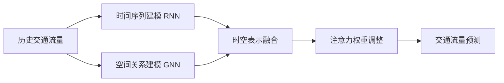

# Python深度学习实践：时空网络在交通预测中的应用

关键词：深度学习, 时空网络, 交通预测, Python, LSTM, GRU, 图神经网络 

## 1. 背景介绍

### 1.1 问题的由来

随着城市化进程的加快和机动车保有量的快速增长,城市交通拥堵问题日益突出。准确预测未来一段时间内的交通流量,对于缓解交通拥堵、优化交通管理具有重要意义。传统的交通预测方法主要基于统计学和运筹学模型,难以有效挖掘交通数据中蕴含的时空关联性,预测精度有限。近年来,深度学习技术的兴起为交通预测问题提供了新的解决思路。

### 1.2 研究现状

目前,利用深度学习进行交通预测的研究主要集中在以下几个方面:

(1) 基于循环神经网络(如LSTM、GRU等)对交通流量进行时间序列预测。这类方法能够建模时间维度上的长期依赖关系,但忽略了空间维度的相关性。

(2) 基于卷积神经网络对交通流量时空数据进行建模和预测。CNN 能够同时提取时间和空间维度的局部特征,但是在捕捉长程依赖关系方面能力有限。

(3) 将 RNN 和 CNN 结合,设计时空混合网络结构用于交通预测。这类方法在一定程度上弥补了单一网络的不足,但对路网结构的拓扑关系建模不足。

(4) 引入图神经网络(GNN)处理路网结构数据,同时与RNN等方法结合,形成时空图网络模型。GNN 能够直接在路网拓扑图上进行信息传播,更好地挖掘路段间的空间关联性。

### 1.3 研究意义

发展基于深度学习的时空网络交通预测方法,融合路网拓扑结构信息、时空关联特征进行端到端学习,有望进一步提升预测精度,为智能交通系统提供更加精准的数据支撑。同时,相关技术也可推广应用到其他时空预测问题中,具有广阔的应用前景。

### 1.4 本文结构

本文将重点介绍时空网络在交通预测中的应用实践。第2部分介绍相关的核心概念;第3部分阐述时空网络交通预测的核心算法原理;第4部分建立数学模型并给出公式推导;第5部分基于Python实现算法代码;第6部分讨论实际应用场景;第7部分推荐相关工具和资源;第8部分总结全文并展望未来;第9部分列出常见问题解答。

## 2. 核心概念与联系

- 交通流量预测:根据历史交通流量数据,预测未来一段时间内道路网络上各路段的车流量。这是智能交通系统(ITS)的核心任务之一。

- 时空数据:交通流量数据具有明显的时间和空间属性。时间维度体现为车流量随时间动态变化;空间维度体现为不同路段间存在拓扑关联。

- 时空网络:一种能够同时建模时间序列特征和空间网络结构的深度学习模型。主要包括时间序列建模(如RNN)和空间关系建模(如GNN)两个部分。

- 图神经网络:直接在图结构数据上进行深度学习的神经网络模型。通过定义节点的聚合更新函数,实现网络中节点表示的学习。

- 注意力机制:一种聚焦于关键信息的机制。在时空网络中引入注意力机制,可以自适应地关注对预测更重要的时空区域。

时空网络结合RNN建模时序特征和GNN建模空间依赖,再辅以注意力机制动态调整时空权重,从而构建端到端的交通流量预测模型。下图展示了时空网络的基本架构:

## 3. 核心算法原理 & 具体操作步骤

### 3.1 算法原理概述

时空网络交通预测算法的核心是同时对时间维度和空间维度进行建模学习。具体来说:

- 时间维度建模:使用RNN及其变体(如LSTM、GRU)处理时间序列数据,学习交通流量的时序变化规律。

- 空间维度建模:使用GNN处理路网拓扑结构数据,学习不同路段之间的空间关联特征。

- 时空表示融合:将RNN学到的时间特征和GNN学到的空间特征进行融合,形成统一的时空表示。

- 注意力机制:引入注意力层,根据当前预测任务自适应调整不同时空区域的重要程度。

通过端到端训练,使模型能够自动学习时空特征并权衡不同区域的影响,最终输出未来时间步的流量预测值。

### 3.2 算法步骤详解

输入:历史T个时间步的路网交通流量数据。
输出:未来T'个时间步的各路段流量预测值。

(1) 时序建模:使用LSTM或GRU对每个路段的流量时间序列进行建模:
$$h_i^t = LSTM(x_i^t, h_i^{t-1})$$
其中$x_i^t$为路段$i$在$t$时刻的流量值,$h_i^t$为对应的隐状态。

(2) 空间建模:使用图卷积网络(GCN)对路网结构进行建模:
$$g_i^t = ReLU(\sum_{j\in N(i)}\frac{1}{c_{ij}}g_j^{t-1}W^t)$$
其中$g_i^t$为路段$i$在$t$时刻的GCN表示,$N(i)$为其邻居路段集合,$c_{ij}$为归一化常数,$W^t$为变换矩阵。

(3) 时空融合:将LSTM的隐状态和GCN的路段表示拼接并变换:
$$r_i^t = ReLU(W_r[h_i^t \parallel g_i^t] + b_r)$$
其中$r_i^t$为路段$i$在$t$时刻的时空融合表示。

(4) 注意力汇聚:使用注意力机制对不同路段的时空表示进行自适应加权求和:
$$\alpha_{ij}^t = \frac{exp(e_{ij}^t)}{\sum_{k\in N(i)}exp(e_{ik}^t)}$$
$$e_{ij}^t = LeakyReLU(W_a[r_i^t \parallel r_j^t])$$
$$\hat{r}_i^t = \sum_{j\in N(i)}\alpha_{ij}^t r_j^t$$

(5) 输出层:将注意力汇聚后的时空表示通过全连接层映射到输出维度,得到未来T'个时间步的流量预测值:
$$\hat{X}_i^{t+1:t+T'} = W_o \hat{r}_i^t + b_o$$

(6) 模型训练:使用均方误差(MSE)作为损失函数,利用反向传播算法优化模型参数:
$$L = \frac{1}{n}\sum_{i=1}^n \sum_{t=1}^{T'}(\hat{X}_i^t - X_i^t)^2$$

### 3.3 算法优缺点

优点:
- 同时建模时间和空间维度,能够充分挖掘交通流量数据的时空关联性。
- 引入注意力机制,可以自适应地关注不同区域,提高预测精度。
- 端到端学习,无需人工设计复杂特征,降低了特征工程成本。

缺点:
- 模型复杂度较高,训练和推理的计算开销大。
- 需要大量高质量的历史数据进行训练,对数据的依赖性强。
- 解释性不强,模型学到的特征不够直观,存在一定的"黑盒"特性。

### 3.4 算法应用领域

- 智能交通系统:交通流量预测、拥堵预警、信号灯时间优化等
- 轨道交通调度:客流量预测、列车运行计划调整等
- 位置服务:未来人流量预测、区域人气指数评估等
- 其他时空预测问题:如天气预报、空气质量预测、销量预测等

## 4. 数学模型和公式 & 详细讲解 & 举例说明

### 4.1 数学模型构建

考虑一个有$n$个路段的道路网络,将每个路段视为图中的一个节点,路段之间的连接关系视为图中的边。定义图 $G=(V,E,A)$:

- $V$:图的节点集,每个节点代表一个路段,$|V|=n$。
- $E$:图的边集,每条边代表两个路段之间的连接关系。
- $A$:图的邻接矩阵,$A_{ij}=1$表示路段$i$和$j$之间有连接,$A_{ij}=0$表示没有连接。

对于路段$i$,用$x_i^t$表示其在$t$时刻的交通流量值。定义时间步长为$\Delta t$,历史时间窗口长度为$T$,预测时间窗口长度为$T'$。

时空网络模型的目标是学习一个映射函数$f$:
$$[\hat{X}_i^{t+1}, \hat{X}_i^{t+2}, ..., \hat{X}_i^{t+T'}] = f(X_i^{t-T+1}, X_i^{t-T+2}, ..., X_i^t, G)$$

其中$X_i^t = [x_1^t, x_2^t, ..., x_n^t]^\top$为$t$时刻所有路段的流量向量,$\hat{X}_i^t$为对应的预测值。$f$同时依赖于过去$T$个时间步的流量数据和路网结构$G$。

### 4.2 公式推导过程

时空网络交通预测模型主要包括四个部分:时序建模、空间建模、时空融合和注意力汇聚。下面依次推导各部分的数学公式。

(1) 时序建模

使用LSTM网络对每个路段的流量时间序列进行建模。LSTM的前向传播公式为:
$$f_i^t = \sigma(W_f\cdot[h_i^{t-1},x_i^t] + b_f)$$
$$i_i^t = \sigma(W_i\cdot[h_i^{t-1},x_i^t] + b_i)$$
$$o_i^t = \sigma(W_o\cdot[h_i^{t-1},x_i^t] + b_o)$$
$$\tilde{C}_i^t = tanh(W_c\cdot[h_i^{t-1},x_i^t] + b_c)$$
$$C_i^t = f_i^t \odot C_i^{t-1} + i_i^t \odot \tilde{C}_i^t$$
$$h_i^t = o_i^t \odot tanh(C_i^t)$$

其中$f_i^t,i_i^t,o_i^t$分别为遗忘门、输入门和输出门,$C_i^t$为记忆单元状态,$\odot$为按元素乘法。LSTM通过门控机制和记忆单元来捕捉时间序列的长期依赖关系。

(2) 空间建模

使用图卷积网络(GCN)在路网结构上传播信息。单层GCN的前向传播公式为:
$$G^{(l+1)} = ReLU(\hat{D}^{-\frac{1}{2}}\hat{A}\hat{D}^{-\frac{1}{2}}G^{(l)}W^{(l)})$$

其中$\hat{A}=A+I$为加入自环的邻接矩阵,$\hat{D}_{ii}=\sum_j\hat{A}_{ij}$为对应的度矩阵,$G^{(l)}$为第$l$层的节点表示矩阵,$W^{(l)}$为可学习的权重矩阵。通过多层GCN可以有效捕捉路网中节点的高阶空间关联性。

(3) 时空融合

将LSTM的隐状态和GCN的节点表示拼接并通过全连接层进行变换,得到路段的时空融合表示:
$$r_i^t = ReLU(W_r[h_i^t \parallel g_i^t] + b_r)$$

其中$h_i^t$为LSTM在$t$时刻的隐状态输出,$g_i^t$为GCN在$t$时刻的节点表示输出。