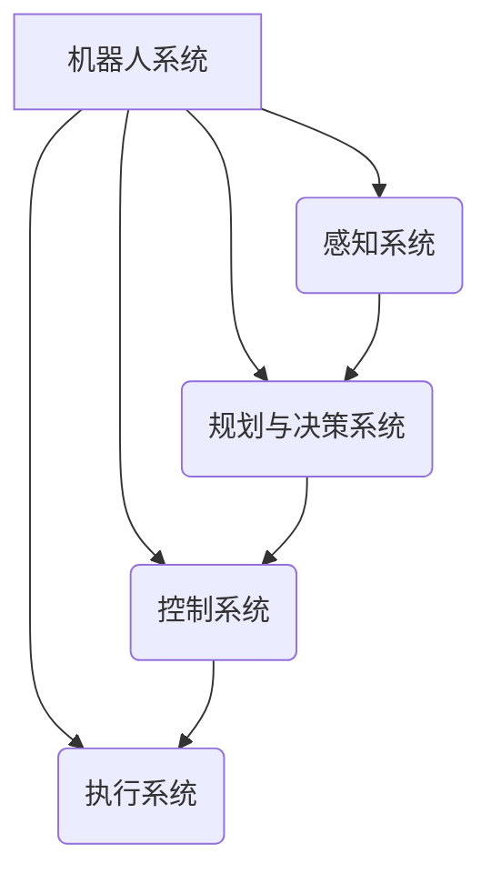

# Robotics 原理与代码实战案例讲解

## 1. 背景介绍

### 1.1 问题的由来

机器人技术是当代科技发展的前沿领域,它将人工智能、计算机视觉、控制理论、传感器技术等多学科知识融合应用,在工业生产、航空航天、国防军事、医疗康复、家庭服务等诸多领域发挥着不可替代的重要作用。随着科技的不断进步,机器人系统的复杂性和智能化程度也在不断提高,对机器人控制算法和软硬件系统的要求也越来越高。

机器人技术的发展面临诸多挑战:如何实现机器人的自主决策和智能控制?如何提高机器人的灵活性和适应性?如何降低机器人系统的复杂度并提高可靠性?如何设计高效的机器人运动规划和控制算法?如何实现人机协作和安全?这些问题都需要机器人领域的研究人员通过理论创新和技术突破来解决。

### 1.2 研究现状  

近年来,机器人技术取得了长足的进步,尤其是在人工智能、计算机视觉、传感器等相关技术的推动下,机器人系统的智能化水平不断提高。同时,机器人控制理论和算法也在不断完善,例如基于优化理论的运动规划算法、基于学习的控制算法、基于视觉的导航算法等,极大地提高了机器人的自主能力和应用范围。

在工业领域,机器人已经广泛应用于自动化生产线、物料搬运等场景,大幅提高了生产效率和产品质量。在服务领域,家用机器人、医疗手术机器人等也逐渐走进人们的生活。在探索领域,机器人还被用于深海勘探、火星探测等极端环境作业。

### 1.3 研究意义

机器人技术是一个交叉学科,涉及机械、电子、计算机、控制、人工智能等多个领域。研究机器人原理和实践案例,有助于我们全面深入地理解这一领域的理论基础和技术实现,把握机器人发展的前沿动态。

通过学习机器人控制算法、规划方法、感知系统、决策框架等核心技术,我们可以掌握机器人智能化的本质,为设计开发下一代智能机器人系统奠定基础。同时,研究不同领域的机器人应用案例,有助于我们了解实际需求,拓展思路,开发出更加实用、高效、安全的机器人解决方案。

此外,机器人技术在很多领域都有广阔的应用前景,对促进社会生产力发展、推动科技创新具有重要意义。因此,深入研究机器人原理与实践是非常有价值和意义的。

### 1.4 本文结构

本文将全面介绍机器人技术的理论基础和实践案例。主要内容包括:

1. 机器人核心概念及其内在联系
2. 机器人控制算法原理及操作步骤 
3. 机器人运动规划数学模型及公式推导
4. 基于ROS的机器人系统开发实践
5. 机器人在工业、服务等领域的应用现状及趋势
6. 常用机器人开发工具和学习资源推荐
7. 机器人技术发展趋势分析及面临的挑战
8. 常见问题解答

接下来,我们将逐一深入探讨上述内容。

## 2. 核心概念与联系

在探讨机器人技术的细节之前,我们先来了解几个核心概念及其内在联系:

1. **感知系统**:包括各种传感器(视觉、激光、惯性等),用于获取机器人及环境的信息,是机器人感知外界的"眼睛"和"耳朵"。

2. **规划与决策系统**:基于感知信息,根据给定的任务目标,通过算法计算出机器人的运动轨迹、动作序列等,作出行为决策,是机器人的"大脑"。

3. **控制系统**:将规划出的期望运动轨迹或动作序列,通过控制算法转化为对执行系统的控制指令,是连接"大脑"与"肢体"的"神经"。

4. **执行系统**:包括各种执行机构(机械手臂、车辆底盘等)和驱动器,按照控制指令运行,完成实际的运动和作业,是机器人的"身体"。

这四个系统有机地结合在一起,相互协调配合,共同实现机器人的感知、思考和行动功能。其中,感知系统负责获取信息,规划与决策系统负责"思考",控制系统负责"下命令",执行系统负责"行动"。

理解这些概念及其内在联系,对于掌握机器人技术的本质至关重要。接下来,我们将进一步剖析其中的核心算法原理。

## 3. 核心算法原理与具体操作步骤

机器人的"大脑"——规划与决策系统,是整个机器人系统的核心。它包含了多种复杂的算法,用于感知信息处理、运动规划、行为决策等环节。这些算法的性能直接决定了机器人的智能水平和自主能力。我们重点介绍两种核心算法。

### 3.1 算法原理概述

#### 3.1.1 概率机器人状态估计算法

在机器人感知环境的过程中,由于传感器测量误差、数据噪声等因素,获取的环境信息往往是不完全和不精确的。因此,我们需要一种算法来估计机器人在环境中的精确状态(位置、姿态等)。

**概率机器人状态估计算法**基于概率论和贝叶斯推理,通过融合来自多种传感器的信息,计算出机器人在环境中状态的概率分布,从而获得最可能的状态估计值。这种算法可以有效处理传感器数据的不确定性,提高状态估计的准确性和鲁棒性。

常用的概率状态估计算法有:卡尔曼滤波(Kalman Filter)、粒子滤波(Particle Filter)、图优化(Graph Optimization)等。

#### 3.1.2 采样优化运动规划算法  

机器人在执行任务时,需要根据环境约束和任务目标,计算出无碰撞的理想运动轨迹。这是一个高维空间的路径规划问题,并且需要考虑机器人和障碍物的几何约束,是一个计算量很大的NP难问题。

**采样优化运动规划算法**通过有策略地对高维空间进行采样,快速探索可行解空间,并利用优化技术对候选解进行改进,最终得到满足约束的最优或次优解。这种算法具有全局性和任意维数可解的优点。

常见的采样优化算法有:RRT(Rapidly-exploring Random Tree)、RRT*、PRM(Probabilistic Road Map)、CHOMP(Covariant Hamiltonian Optimization for Motion Planning)等。

上述两类算法分别解决了机器人感知和运动规划的核心问题,是机器人智能的关键所在。接下来,我们将详细介绍它们的具体操作步骤。

### 3.2 算法步骤详解

#### 3.2.1 概率机器人状态估计算法

以经典的卡尔曼滤波算法为例,其步骤如下:

1. **状态表示**: 将机器人的状态(如位置、速度等)用状态变量 $x$ 表示,初始状态为 $x_0$。

2. **状态转移模型**: 根据控制量 $u$ 和运动模型,确定状态转移概率 $p(x_t|x_{t-1}, u_t)$。

3. **观测模型**: 根据传感器测量值 $z$ 和观测模型,确定观测概率 $p(z_t|x_t)$。

4. **预测**:已知上一时刻状态 $x_{t-1}$,计算当前时刻状态的预测值:
$$\hat{x}_t^- = f(x_{t-1}, u_t)$$

5. **更新**:根据当前时刻的观测值 $z_t$,计算卡尔曼增益 $K_t$,对状态预测值进行更新:
$$\hat{x}_t = \hat{x}_t^- + K_t(z_t - h(\hat{x}_t^-))$$

6. **迭代**:重复上述过程,不断融合控制和观测信息,估计出最新的状态值。

其中,卡尔曼增益 $K_t$ 的计算需要根据协方差矩阵进行,这里我们省略具体推导过程。

通过上述迭代过程,卡尔曼滤波可以有效融合控制和观测信息,获得状态的最优估计值,并能自动消除噪声和误差的影响。当然,实际应用中还需要考虑非线性、非高斯等情况,使用扩展卡尔曼滤波、无迹卡尔曼滤波等变种算法。

#### 3.2.2 RRT* 采样优化运动规划算法

RRT* 算法是 RRT 算法的一个改进变种,能够得到无碰撞的最优或次优解,其步骤如下:

1. **初始化**:在配置空间中随机采样初始点 $x_{init}$ 和目标点 $x_{goal}$,构建起点节点 $n_{init}$。

2. **生成新节点**:在配置空间中随机采样一个新点 $x_{rand}$。

3. **寻找最近节点**:在当前树中寻找离 $x_{rand}$ 最近的节点 $n_{nearest}$。

4. **扩展新节点**:从 $n_{nearest}$ 出发,沿最短路径方向扩展一小步得到新节点 $n_{new}$。如果 $n_{new}$ 与障碍物有碰撞或超出边界,则拒绝并返回步骤2。

5. **选择父节点**:在当前树中寻找一个节点 $n_{parent}$,使得路径 $n_{parent} \rightarrow n_{new}$ 的代价最小。

6. **插入并重连**:将 $n_{new}$ 插入树中,并检查是否可以通过重连使得某些节点到根节点的路径代价降低。

7. **终止检查**:如果 $n_{new}$ 到达目标点附近或者达到迭代次数上限,则终止并返回最优路径;否则返回步骤2继续。

在第5步选择父节点时,RRT* 算法采用了一种复杂的"rewiring"技术,以保证渐进地收敛到最优解。相比于 RRT 算法,RRT* 在无碰撞情况下能够得到更优的路径,但计算代价也更高。

通过上述步骤,RRT* 算法可以快速探索高维空间,并利用优化技术不断改进路径,最终得到满足约束的最优或次优解。当然,在实际应用中,我们还需要针对具体问题对算法进行改进和优化。

### 3.3 算法优缺点

#### 3.3.1 概率机器人状态估计算法

**优点**:
- 能够有效融合多源异构传感器信息
- 具有较强的鲁棒性,可以抗干扰、消除噪声影响
- 算法原理清晰,易于理解和实现

**缺点**:  
- 需要建立精确的系统模型和噪声模型
- 计算量较大,对实时性要求较高
- 在非线性、非高斯情况下,估计精度会受到影响

#### 3.3.2 采样优化运动规划算法

**优点**:
- 无需事先构建空间模型,可应用于任意维数
- 算法思路简单,易于实现和并行化
- 能够快速探索可行解空间,并有效优化路径

**缺点**:
- 无法保证一定能找到最优解,只能获得次优解
- 收敛速度较慢,需要大量采样,计算代价高  
- 对障碍物的几何形状有一定要求

总的来说,这两类算法都具有重要的理论意义和应用价值,但也存在一些不足之处。在实际应用中,我们需要根据具体问题和应用场景,选择合适的算法并进行针对性优化。

### 3.4 算法应用领域

上述两类算法在机器人领域有着广泛的应用:

-