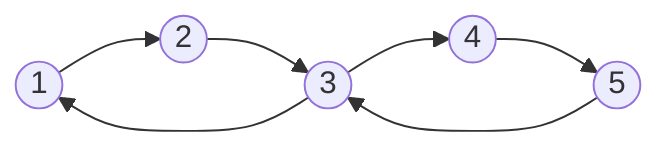

# Strongly Connected Components强连通分量算法原理与代码实例讲解

作者：禅与计算机程序设计艺术

关键词：强连通分量、Tarjan算法、Kosaraju算法、有向图、DFS

## 1. 背景介绍
### 1.1 问题的由来
在图论和计算机科学中，强连通分量(Strongly Connected Components, SCCs)是一个重要的概念。它在许多实际应用中扮演着关键角色，如社交网络分析、网页排名、科学计算等领域。因此，研究高效的强连通分量算法对于解决实际问题具有重要意义。

### 1.2 研究现状
目前已经有多种求解强连通分量的算法被提出，其中最著名的是Tarjan算法和Kosaraju算法。这两种算法都基于深度优先搜索(DFS)思想，通过巧妙的设计实现了线性时间复杂度。近年来，一些改进和优化的算法也被陆续提出，进一步提升了算法效率。

### 1.3 研究意义
深入研究强连通分量算法，对于理解有向图的内在结构和特性具有重要意义。通过掌握高效的算法，我们可以更好地解决实际问题，如社交网络的社区发现、网页重要性排序、程序优化等。同时，强连通分量算法也为其他高级算法奠定了基础。

### 1.4 本文结构
本文将全面介绍强连通分量的概念和两种经典算法：Tarjan算法和Kosaraju算法。我们将从算法原理出发，结合具体的操作步骤，并给出详细的代码实例。同时，本文还将讨论算法的数学模型、实际应用场景以及未来的发展趋势与挑战。

## 2. 核心概念与联系
在介绍算法之前，我们首先要明确几个核心概念：

- 有向图：边有方向的图，表示为G=(V, E)，其中V为顶点集，E为有向边集。
- 连通图：对于无向图，如果从任意一个顶点出发，都能到达其他所有顶点，则称该图是连通图。
- 强连通图：对于有向图，如果对于每一对顶点v和u，既存在从v到u的有向路径，也存在从u到v的有向路径，则称该图是强连通图。
- 强连通分量：有向图G的一个极大强连通子图称为G的强连通分量。

强连通分量之间的关系可以形成一个缩点图(Condensation Graph)，将每个强连通分量缩成一个点，并保留原图中跨越不同分量的边。缩点图必然是一个有向无环图(DAG)。

## 3. 核心算法原理 & 具体操作步骤
### 3.1 算法原理概述
求解强连通分量的两大经典算法是Tarjan算法和Kosaraju算法。它们的基本思路如下：

- Tarjan算法：在DFS过程中，用栈记录已访问的顶点。每个顶点v维护两个时间戳dfn[v]和low[v]，分别表示v的发现时间和v所能追溯到的最早的栈中顶点的时间戳。当出现dfn[v]=low[v]时，以v为根的搜索子树上所有顶点构成一个强连通分量。
- Kosaraju算法：分两趟DFS。第一趟在原图上进行DFS，并在回溯时记录顶点的完成时间戳f[v]。第二趟在原图的转置图(所有边反向)上进行DFS，以f[v]降序的顺序访问未访问过的顶点。每一次DFS树对应一个强连通分量。

### 3.2 算法步骤详解

#### Tarjan算法步骤：
1. 初始化dfn和low数组，用栈stk记录顶点，时间戳timestamp从0开始。
2. 对每个未访问的顶点v，调用Tarjan(v)。
3. Tarjan(v)：
   - 将v入栈stk，设置dfn[v]=low[v]=++timestamp。
   - 遍历v的所有出边(v,u)：
     - 若u未访问，递归调用Tarjan(u)，并用low[u]更新low[v]。
     - 若u已访问且在栈中，用dfn[u]更新low[v]。
   - 若dfn[v]=low[v]，说明v是某个强连通分量的根，不断出栈直到v，得到一个强连通分量。

#### Kosaraju算法步骤：
1. 对原图G进行DFS，并在回溯时记录每个顶点v的完成时间戳f[v]。
2. 构造G的转置图G^T。
3. 按照f[v]降序的顺序，对G^T中的每个未访问顶点v进行DFS。
4. 每一次DFS得到的树形结构即为一个强连通分量。

### 3.3 算法优缺点
- Tarjan算法：
  - 优点：一次DFS即可求出所有强连通分量，时间复杂度为O(V+E)。
  - 缺点：实现相对复杂，需要维护dfn和low数组，以及栈。
- Kosaraju算法：
  - 优点：实现简单，两次DFS即可求出所有强连通分量。
  - 缺点：需要两次遍历图，时间复杂度也是O(V+E)，但常数较大。

### 3.4 算法应用领域
强连通分量算法在许多领域有着广泛应用，如：

- 社交网络分析：发现社区结构，找出紧密联系的用户群体。
- 网页排名：如Google的PageRank算法，利用网页之间的链接关系计算重要性。
- 程序优化：在程序流图中寻找强连通分量，进行死代码消除等优化。
- 电路设计：找出电路中的环，进行正确性验证。
- 科学计算：求解非线性方程组，发现变量之间的依赖关系。

## 4. 数学模型和公式 & 详细讲解 & 举例说明
### 4.1 数学模型构建
我们可以用邻接矩阵和邻接表两种方式来表示有向图G=(V,E)。设|V|=n，|E|=m。

邻接矩阵A是一个n*n的方阵，其中：
$A[i][j]=\begin{cases}1, & (v_i,v_j)\in E \\ 0, & otherwise\end{cases}$

邻接表则用一个长度为n的数组Adj[]，其中Adj[i]存储了所有从顶点i出发的边$(v_i,v_j)$。

### 4.2 公式推导过程
在Tarjan算法中，关键是理解dfn和low值的定义和更新规则。

- dfn[u]：顶点u的发现时间戳，即u第一次被访问到的时间戳。
- low[u]：顶点u或u的子树能够追溯到的最早的栈中顶点的时间戳。

当我们访问顶点u时，初始令low[u]=dfn[u]。在回溯过程中，对于每一条边(u,v)：
- 若v未被访问，说明v是u的子树中的顶点，在递归访问v后，令low[u]=min(low[u], low[v])。
- 若v已被访问且在栈中，说明v是u的祖先，此时令low[u]=min(low[u], dfn[v])。

通过DFS，dfn值单调递增。而low值在回溯过程中会不断更新，直到找到一个强连通分量的根r，此时有dfn[r]=low[r]。

### 4.3 案例分析与讲解
我们以下图为例，演示Tarjan算法的执行过程：



1. 初始化dfn和low数组为0，stk为空，timestamp=0。
2. 从顶点1开始DFS，令dfn[1]=low[1]=++timestamp=1，将1入栈stk。
3. 访问1的邻居2，令dfn[2]=low[2]=++timestamp=2，将2入栈stk。
4. 访问2的邻居3，令dfn[3]=low[3]=++timestamp=3，将3入栈stk。
5. 访问3的邻居1，发现1已访问且在栈中，更新low[3]=min(low[3], dfn[1])=1。
6. 访问3的邻居4，令dfn[4]=low[4]=++timestamp=4，将4入栈stk。
7. 访问4的邻居5，令dfn[5]=low[5]=++timestamp=5，将5入栈stk。
8. 访问5的邻居3，发现3已访问且在栈中，更新low[5]=min(low[5], dfn[3])=3。
9. 回溯到4，更新low[4]=min(low[4], low[5])=3。
10. 回溯到3，此时dfn[3]=low[3]=3，找到一个强连通分量{3,4,5}，出栈直到3。
11. 继续回溯到2，更新low[2]=min(low[2], low[3])=1。
12. 回溯到1，此时dfn[1]=low[1]=1，找到另一个强连通分量{1,2}，出栈直到1。

最终得到两个强连通分量{1,2}和{3,4,5}。

### 4.4 常见问题解答
Q: 强连通分量可以相交吗？
A: 不可以。强连通分量是极大强连通子图，任意两个强连通分量没有交集，且它们之间至多只能有单向边。

Q: 有向无环图的强连通分量有什么特点？ 
A: 在DAG中，每个顶点自身都是一个强连通分量。因为DAG中不存在环，所以两个顶点之间不可能互相可达。

Q: Tarjan算法中为什么要用栈？
A: 栈用于存储已访问的顶点，通过比较dfn和low的值，可以及时找出已形成的强连通分量。同时，栈中的顶点顺序也反映了它们在DFS树中的祖先-后代关系。

## 5. 项目实践：代码实例和详细解释说明
### 5.1 开发环境搭建
本文使用C++语言实现Tarjan算法和Kosaraju算法。读者需要准备以下开发环境：

- 操作系统：Windows/Linux/MacOS
- 编译器：支持C++11标准的编译器，如g++、clang++
- 编辑器：任意文本编辑器或IDE，如VSCode、Dev-C++等

### 5.2 源代码详细实现

#### Tarjan算法

```cpp
const int MAXN = 1e5+5;
vector<int> G[MAXN]; // 邻接表存储图
int dfn[MAXN], low[MAXN], timestamp;
stack<int> stk;

void tarjan(int u) {
    dfn[u] = low[u] = ++timestamp;
    stk.push(u);
    for (int v : G[u]) {
        if (!dfn[v]) {
            tarjan(v);
            low[u] = min(low[u], low[v]);
        } else if (dfn[v] < dfn[u]) {
            low[u] = min(low[u], dfn[v]);
        }
    }
    if (dfn[u] == low[u]) {
        cout << "SCC: ";
        while (stk.top() != u) {
            cout << stk.top() << " ";
            stk.pop();
        }
        cout << stk.top() << endl;
        stk.pop();
    }
}

void findSCC(int n) {
    timestamp = 0;
    memset(dfn, 0, sizeof(dfn));
    for (int i = 1; i <= n; i++) {
        if (!dfn[i]) {
            tarjan(i);
        }
    }
}
```

#### Kosaraju算法

```cpp
const int MAXN = 1e5+5;
vector<int> G[MAXN], GT[MAXN]; // 原图和转置图
bool vis[MAXN];
stack<int> stk;

void dfs1(int u) {
    vis[u] = true;
    for (int v : G[u]) {
        if (!vis[v]) {
            dfs1(v);
        }
    }
    stk.push(u);
}

void dfs2(int u) {
    vis[u] = true;
    cout << u << " ";
    for (int v : GT[u]) {
        if (!vis[v]) {
            dfs2(v);
        }
    }
}

void kosaraju(int n) {
    memset(vis, false, sizeof(vis));
    for (int i = 1; i <= n; i++) {
        if (!vis[i]) {
            dfs1(i);
        }
    }
    memset(vis, false, sizeof(vis));
    while (!stk.empty()) {
        int u = stk.top();
        stk.pop();
        if (!vis[u]) {
            cout << "SCC: ";
            dfs2(u);
            cout << endl;
        }
    }
}
```

### 5.3 代码解读