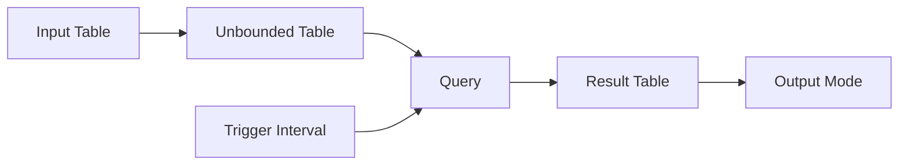
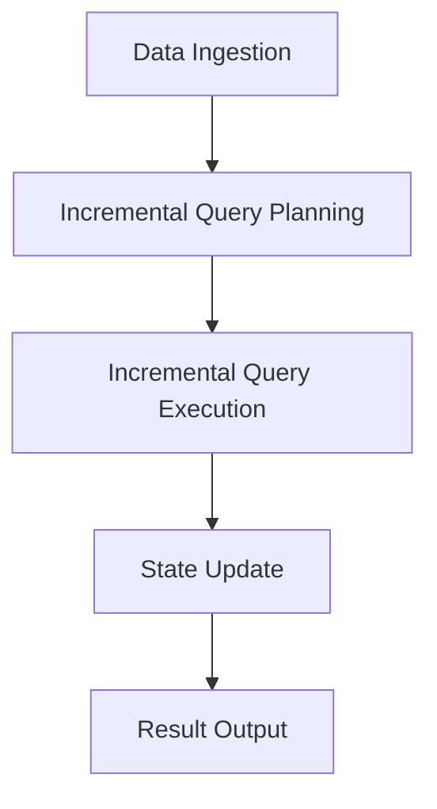

# Structured Streaming原理与代码实例讲解

作者：禅与计算机程序设计艺术 / Zen and the Art of Computer Programming

## 1. 背景介绍

### 1.1 问题的由来
在大数据时代，流式数据处理已成为一个热门话题。随着物联网、移动设备和社交媒体的普及，海量的实时数据不断产生。如何高效、实时地处理这些数据，并从中提取有价值的信息，是摆在我们面前的一大挑战。传统的批处理模型已经无法满足实时性要求，因此流式计算应运而生。

### 1.2 研究现状
目前，主流的流式计算框架有Apache Storm、Flink、Spark Streaming等。其中，Spark Streaming基于微批次(micro-batch)的处理模型，将流式数据拆分成一个个小批次进行处理，实现了准实时计算。但是，这种方式仍存在一些局限性，如累积延迟、复杂的状态管理等。为了克服这些问题，Databricks在Spark 2.0中引入了Structured Streaming，它是一种基于Spark SQL引擎的端到端、容错的流式处理系统。

### 1.3 研究意义
Structured Streaming的出现，为流式大数据处理带来了新的思路。它建立在Spark SQL之上，继承了其强大的表达能力和优化机制。通过将流式数据抽象为无界表(unbounded table)，Structured Streaming允许用户使用与批处理相同的SQL语法来操作流式数据。这大大降低了流式应用开发的复杂度。同时，Structured Streaming提供了端到端且一次且仅一次(exactly-once)的数据一致性保证，使得流式应用更加可靠。深入研究Structured Streaming的原理和应用，对于构建高性能、高可靠的实时大数据系统具有重要意义。

### 1.4 本文结构
本文将围绕Structured Streaming展开深入探讨。首先，我们将介绍Structured Streaming的核心概念和工作原理。然后，重点讲解其内部的增量执行模型和状态管理机制。接着，通过数学建模和公式推导，揭示Structured Streaming的理论基础。在实践部分，我们将给出详细的代码实例，演示如何使用Structured Streaming进行流式数据处理。同时，总结Structured Streaming在实际场景中的应用案例。最后，展望Structured Streaming的未来发展方向和面临的挑战。

## 2. 核心概念与联系

在介绍Structured Streaming的核心概念之前，我们先回顾一下Spark SQL的基本原理。Spark SQL是Spark生态系统中用于结构化数据处理的组件。它提供了一个名为DataFrame的编程抽象，可以将数据组织成类似关系型数据库中表的形式。通过DataFrame API，用户可以方便地对结构化数据进行查询、过滤、聚合等操作。

Structured Streaming建立在Spark SQL之上，将流式数据处理与批处理统一起来。它引入了几个重要的概念：

1. 无界表(Unbounded Table)：将输入的数据流看作一张不断增长的表，没有固定的结束边界。每个时间点到达的新数据被视为表中新增的行。

2. 输入表(Input Table)：代表输入的数据源，如Kafka、文件系统等。Structured Streaming定期从输入表中读取新到达的数据。

3. 结果表(Result Table)：代表计算的输出结果。它是根据输入表和查询定义动态更新的。

4. 输出模式(Output Mode)：指定了结果表的更新方式，有Append、Update、Complete三种模式。Append模式只会追加新的结果行，Update模式可以更新已有的结果行，Complete模式则将整个结果表重新计算并输出。

5. 触发间隔(Trigger Interval)：定义了Structured Streaming的执行频率，即每隔多久触发一次增量查询。

下图展示了Structured Streaming的核心概念之间的关系：

从图中可以看出，输入表作为数据源不断将新数据追加到无界表中。Structured Streaming根据查询定义对无界表进行增量计算，生成结果表。结果表的更新方式由输出模式决定。触发间隔控制了查询的执行频率。

理解了这些核心概念后，我们就可以更好地掌握Structured Streaming的工作原理。在后续章节中，我们将详细阐述Structured Streaming的内部实现机制。

## 3. 核心算法原理 & 具体操作步骤

### 3.1 算法原理概述
Structured Streaming的核心算法是基于增量执行模型(Incremental Execution Model)的。与传统的批处理不同，增量执行模型在每个触发间隔只处理新到达的数据，并将增量结果与之前的结果进行合并，得到最新的计算结果。这种方式避免了重复计算，提高了执行效率。

### 3.2 算法步骤详解
Structured Streaming的增量执行过程可以分为以下几个步骤：

1. 数据摄取(Data Ingestion)：从输入源读取新到达的数据，并将其追加到输入表中。

2. 增量查询计划生成(Incremental Query Planning)：根据查询定义和输入表的变化，生成增量查询计划。增量查询计划只处理新增的数据，并重用之前的中间结果。

3. 增量查询执行(Incremental Query Execution)：执行增量查询计划，计算出本次触发间隔内的增量结果。

4. 状态更新(State Update)：将增量结果与之前的状态进行合并，得到最新的计算结果。状态的管理和更新是Structured Streaming的重要特性，它保证了计算的连续性和一致性。

5. 结果输出(Result Output)：根据输出模式，将最新的计算结果写入外部存储系统，如文件系统、数据库等。

下图展示了Structured Streaming的增量执行过程：

### 3.3 算法优缺点
Structured Streaming的增量执行模型有以下优点：

1. 低延迟：通过增量处理，Structured Streaming能够快速响应新到达的数据，实现毫秒级别的端到端延迟。

2. 高吞吐：增量执行避免了不必要的重复计算，提高了系统的吞吐量。

3. 容错性：Structured Streaming提供了端到端的容错机制，能够从故障中自动恢复，保证数据的一致性。

4. 易用性：用户可以使用与批处理相同的SQL语法来操作流式数据，降低了开发复杂度。

当然，Structured Streaming也存在一些局限性：

1. 状态管理开销：对于某些需要维护大量状态的应用场景，如大窗口聚合，状态管理的开销可能会比较大。

2. 延迟与吞吐的权衡：为了实现低延迟，Structured Streaming采用了微批次的处理方式，这在一定程度上限制了吞吐量的提升。

### 3.4 算法应用领域
Structured Streaming适用于各种实时数据处理场景，如：

1. 日志分析：对网站或应用的访问日志进行实时分析，提取用户行为模式，进行异常检测等。

2. 监控告警：对系统指标、传感器数据等进行实时监控，当出现异常情况时及时告警。

3. 实时推荐：根据用户的实时行为数据，动态更新推荐结果，提供个性化的推荐服务。

4. 欺诈检测：对交易数据进行实时分析，识别可疑的欺诈行为，防范金融风险。

5. 物联网数据处理：对来自各种物联网设备的实时数据进行清洗、转换和聚合，实现设备的监控和控制。

## 4. 数学模型和公式 & 详细讲解 & 举例说明

### 4.1 数学模型构建
为了深入理解Structured Streaming的工作原理，我们需要建立相应的数学模型。首先，我们定义以下符号：

- $T$：表示时间轴，是一个连续的实数集合。
- $D$：表示数据域，即所有可能的数据记录的集合。
- $S$：表示状态域，即所有可能的状态值的集合。
- $Q$：表示查询函数，将输入数据映射到对应的状态更新和输出结果。

基于以上符号，我们可以将Structured Streaming的增量执行过程抽象为以下数学模型：

给定一个查询函数$Q$，对于每个时间点$t \in T$，定义输入数据流$I_t \subseteq D$，状态$S_t \in S$，输出结果$O_t \subseteq D$，满足以下条件：

$$
S_t = Q(S_{t-\Delta t}, I_t) \\
O_t = Q(S_t, \emptyset)
$$

其中，$\Delta t$表示触发间隔，$S_{t-\Delta t}$表示上一次触发时的状态，$I_t$表示当前触发间隔内新到达的数据，$\emptyset$表示空集。

这个数学模型描述了Structured Streaming的增量执行过程：在每个触发时间点$t$，查询函数$Q$将上一次的状态$S_{t-\Delta t}$和新到达的数据$I_t$作为输入，计算出新的状态$S_t$。然后，再以$S_t$作为输入，计算出当前的输出结果$O_t$。

### 4.2 公式推导过程
接下来，我们对上述数学模型进行进一步的推导和分析。

假设初始状态为$S_0$，对于任意时间点$t_n$，我们可以通过递归的方式计算出对应的状态$S_{t_n}$和输出$O_{t_n}$：

$$
S_{t_n} = Q(S_{t_{n-1}}, I_{t_n}) \\
O_{t_n} = Q(S_{t_n}, \emptyset)
$$

展开递归式，可以得到：

$$
S_{t_n} = Q(...Q(Q(S_0, I_{t_1}), I_{t_2})..., I_{t_n}) \\
O_{t_n} = Q(S_{t_n}, \emptyset)
$$

这个公式表明，任意时间点的状态和输出都可以通过初始状态和历史数据递推计算出来。这就是Structured Streaming增量执行的本质：通过不断更新状态，在每个触发间隔只处理新增的数据，避免了重复计算。

### 4.3 案例分析与讲解
为了更直观地理解上述数学模型和公式，我们来看一个具体的案例。假设我们要对一个实时的用户点击日志流进行统计，计算每个用户的总点击次数。

我们可以定义状态$S$为一个键值对(Key-Value)形式的映射，其中键为用户ID，值为该用户的总点击次数。初始状态$S_0$为空映射{}。

查询函数$Q$的定义如下：对于新到达的点击日志$I_t$，提取出每个日志的用户ID和点击次数，然后与当前状态$S_{t-\Delta t}$进行合并，得到新的状态$S_t$。具体而言，对于每个用户ID，将其在$I_t$中的点击次数加到$S_{t-\Delta t}$中对应的总点击次数上，得到$S_t$中该用户ID的最新总点击次数。输出结果$O_t$就是$S_t$本身，即所有用户的最新总点击次数。

举个例子，假设初始状态$S_0 = \{\}$，在第一个触发间隔内收到以下点击日志：

$I_{t_1} = \{(u_1, 2), (u_2, 1), (u_1, 1)\}$

那么，根据查询函数$Q$，新的状态$S_{t_1}$和输出$O_{t_1}$为：

$S_{t_1} = O_{t_1} = Q(S_0, I_{t_1}) = \{(u_1, 3), (u_2, 1)\}$

在第二个触发间隔内，又收到以下点击日志：

$I_{t_2} = \{(u_2, 2), (u_3, 1)\}$

那么，新的状态$S_{t_2}$和输出$O_{t_2}$为：

$S_{t_2} = O_{t_2} = Q(S_{t_1}, I_{t_2}) = \{(u_1, 3), (u_2, 3), (u_3, 1)\}$