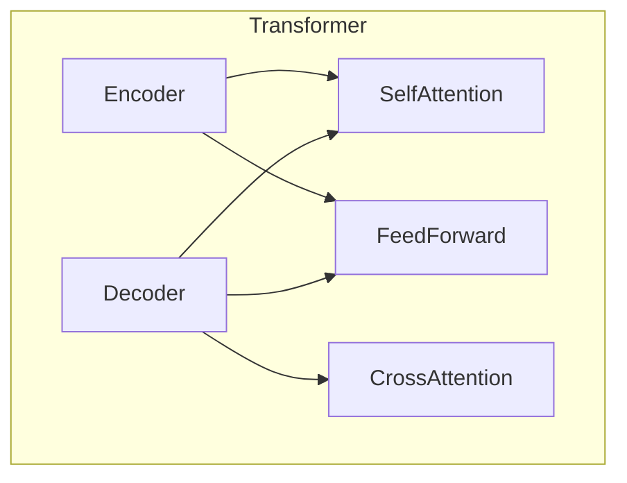
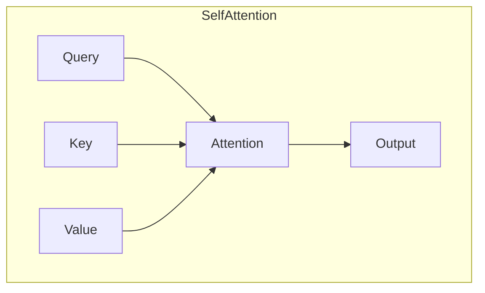
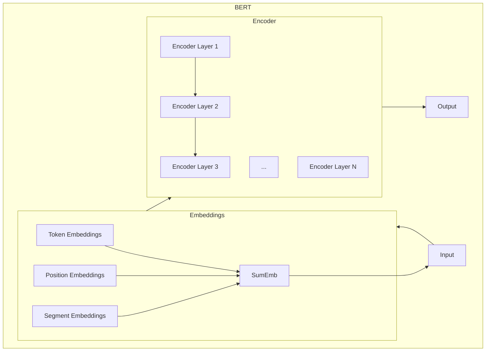

# Transformer大模型实战 从预训练的BERT模型中提取嵌入

## 1. 背景介绍

### 1.1 问题的由来

在自然语言处理(NLP)领域中,将文本表示为数值向量是一个关键挑战。传统的单词表示方法,如one-hot编码和词袋(Bag of Words)模型,存在一些固有的缺陷,例如高维稀疏、无法捕捉语义关系等。为了解决这些问题,出现了基于神经网络的词嵌入(Word Embedding)技术,其中最著名的是Word2Vec和GloVe。

然而,这些静态词嵌入方法仍然存在局限性,因为它们无法捕捉单词在不同上下文中的多义性。为了解决这一问题,出现了基于Transformer的预训练语言模型(Pre-trained Language Model, PLM),如BERT、GPT等。这些模型通过在大规模语料库上进行预训练,学习到了丰富的语义和上下文信息,从而能够生成上下文相关的动态词嵌入向量。

### 1.2 研究现状

BERT(Bidirectional Encoder Representations from Transformers)是一种基于Transformer的预训练语言模型,由Google AI团队在2018年提出。它通过掩码语言模型(Masked Language Model, MLM)和下一句预测(Next Sentence Prediction, NSP)两个预训练任务,在大规模语料库上进行无监督预训练,学习到了丰富的语义和上下文信息。

预训练完成后,BERT模型可以被微调(Fine-tune)到各种下游NLP任务上,如文本分类、命名实体识别、问答系统等,并取得了令人瞩目的成绩。BERT的出现极大地推动了NLP领域的发展,成为了当前最流行和最成功的预训练语言模型之一。

### 1.3 研究意义

虽然BERT模型已经取得了巨大的成功,但如何有效地利用和应用BERT模型仍然是一个值得探索的课题。其中,从预训练的BERT模型中提取词嵌入向量,是一个非常重要的基础步骤。通过获取BERT词嵌入,我们可以进一步进行下游NLP任务的开发和模型微调,也可以用于语义相似度计算、词向量可视化等多种应用场景。

因此,全面理解BERT模型的内部结构和原理,掌握从中提取词嵌入向量的方法,对于NLP从业者和研究人员来说是非常宝贵和必要的。本文将深入探讨这一主题,为读者提供理论知识和实践指导。

### 1.4 本文结构  

本文将从以下几个方面全面介绍如何从预训练的BERT模型中提取词嵌入向量:

1. 背景介绍: 阐述问题由来、研究现状和意义
2. 核心概念与联系: 介绍BERT模型的核心概念,如Transformer、自注意力机制等
3. 核心算法原理与步骤: 详细解释BERT模型的预训练过程和微调过程
4. 数学模型和公式: derived推导BERT模型中的数学公式,如自注意力计算公式
5. 项目实践: 使用Python代码示例,展示如何加载BERT模型和提取词嵌入向量
6. 实际应用场景: 介绍BERT词嵌入在文本分类、相似度计算等任务中的应用
7. 工具和学习资源: 推荐BERT相关的开发工具、学习资料和论文
8. 总结和展望: 总结BERT模型的发展现状,并展望其未来的发展方向和挑战

接下来,我们将逐一深入探讨上述各个方面的内容。

## 2. 核心概念与联系

在深入了解BERT模型之前,我们需要先理解它所基于的一些核心概念,如Transformer模型、自注意力机制等。

### 2.1 Transformer模型

Transformer是一种全新的基于注意力机制的序列到序列(Seq2Seq)模型,由Google的Vaswani等人在2017年提出。它完全摒弃了传统序列模型中的循环神经网络(RNN)和卷积神经网络(CNN)结构,纯粹基于注意力机制来计算输入和输出之间的映射关系。

Transformer模型的核心组件包括编码器(Encoder)和解码器(Decoder)两个部分。编码器的作用是映射一个序列到一个连续的向量表示,而解码器则将这个向量表示映射回另一个序列。编码器和解码器都是基于多头自注意力(Multi-Head Attention)和前馈神经网络(Feed-Forward Neural Network)构建而成。

Transformer模型具有并行计算能力强、长距离依赖建模能力好等优点,因此在机器翻译、语音识别等领域取得了卓越的表现。BERT正是基于Transformer编码器的结构发展而来的。

### 2.2 自注意力机制

自注意力机制(Self-Attention)是Transformer模型的核心部件之一。与RNN和CNN中的注意力机制不同,自注意力机制不需要外部的记忆单元或卷积核,而是通过计算输入序列中不同位置元素之间的相关性,捕捉它们之间的长程依赖关系。

在自注意力计算过程中,每个序列元素都会与其他元素进行注意力加权,得到一个注意力表示。这种方式允许模型直接关注序列中最相关的部分,从而更好地建模长期依赖关系。

自注意力机制可以通过以下公式计算:

$$\text{Attention}(Q, K, V) = \text{softmax}\left(\frac{QK^T}{\sqrt{d_k}}\right)V$$

其中 $Q$ 表示查询(Query)向量, $K$ 表示键(Key)向量, $V$ 表示值(Value)向量。通过将查询向量与所有键向量进行点积运算,然后除以一个缩放因子 $\sqrt{d_k}$ 进行缩放,最后通过 softmax 函数得到注意力分数,并与值向量相乘,即可得到注意力表示。

自注意力机制赋予了Transformer强大的长程依赖建模能力,是BERT等预训练语言模型取得巨大成功的重要原因之一。

### 2.3 BERT模型架构

BERT(Bidirectional Encoder Representations from Transformers)是一种基于Transformer编码器的预训练语言模型。它的核心思想是通过在大规模语料库上进行无监督预训练,学习到通用的语义和上下文表示,然后将这些表示迁移到下游NLP任务中进行微调和应用。

BERT模型由多层Transformer编码器堆叠而成,每一层包含多头自注意力和前馈神经网络两个子层。BERT的输入由词元(Token)序列构成,包括词元嵌入(Token Embeddings)、位置嵌入(Position Embeddings)和句子嵌入(Segment Embeddings)三个部分。

在预训练阶段,BERT使用了两个无监督任务:掩码语言模型(MLM)和下一句预测(NSP)。MLM任务通过随机掩码输入序列中的一些词元,并让模型基于上下文预测被掩码的词元;NSP任务则是判断两个句子是否相邻。通过这两个任务,BERT可以有效地学习到双向的上下文表示。

预训练完成后,BERT可以被微调到各种下游NLP任务上,如文本分类、命名实体识别、问答系统等,并取得了卓越的表现。

## 3. 核心算法原理与具体操作步骤

### 3.1 算法原理概述

BERT的核心算法原理可以分为两个阶段:预训练(Pre-training)和微调(Fine-tuning)。

**预训练阶段**

在预训练阶段,BERT通过在大规模语料库上进行无监督学习,获得通用的语义和上下文表示。具体来说,BERT使用了两个预训练任务:

1. **掩码语言模型(MLM)**: 该任务通过随机掩码输入序列中的一些词元,并让模型基于上下文预测被掩码的词元。这有助于BERT学习到双向的上下文表示。

2. **下一句预测(NSP)**: 该任务是判断两个句子是否相邻,有助于BERT学习到句子级别的关系表示。

通过在大规模语料库上执行这两个预训练任务,BERT可以有效地学习到通用的语义和上下文表示,这些表示可以作为下游NLP任务的初始化参数。

**微调阶段**

在微调阶段,我们将预训练好的BERT模型应用到特定的下游NLP任务上,如文本分类、命名实体识别等。微调的过程是:

1. 将预训练好的BERT模型作为初始化参数
2. 在特定任务的标注数据集上继续训练BERT模型
3. 通过反向传播算法,根据任务目标函数微调BERT模型的参数

经过微调后,BERT模型就可以很好地适应特定的下游任务,并取得优异的表现。

### 3.2 算法步骤详解

**预训练阶段**

1. **准备语料库**: 首先需要准备一个大规模的语料库作为预训练数据集,通常使用Wikipedia、书籍等语料。

2. **构建输入**: 将语料库中的文本按照一定规则构建成BERT的输入格式,包括词元序列、位置嵌入和句子嵌入等。

3. **掩码语言模型(MLM)**: 随机选择输入序列中的15%的词元进行掩码,其中80%直接用[MASK]标记替换,10%用随机词元替换,剩余10%保持不变。模型的目标是基于上下文预测被掩码的词元。

4. **下一句预测(NSP)**: 对于相邻的两个句子,50%的概率保持原样,50%的概率交换两个句子的顺序。模型需要预测这两个句子是否相邻。

5. **模型训练**: 使用上述两个预训练任务的目标函数,通过梯度下降算法在大规模语料库上训练BERT模型的参数。

6. **模型保存**: 将训练好的BERT模型参数保存下来,以备后续的微调和应用。

**微调阶段**

1. **准备任务数据集**: 针对特定的下游NLP任务,准备相应的标注数据集,如文本分类的数据集。

2. **构建输入**: 将任务数据集中的文本按照BERT的输入格式进行预处理和构建。

3. **加载预训练模型**: 加载之前保存的BERT预训练模型参数作为初始化参数。

4. **微调训练**: 在任务数据集上继续训练BERT模型,通过反向传播算法根据任务目标函数微调模型参数。

5. **模型评估**: 在任务的验证集或测试集上评估微调后的BERT模型的性能表现。

6. **模型部署**: 如果模型性能满足要求,就可以将其部署到实际的应用系统中使用。

通过上述步骤,我们可以充分利用BERT预训练模型中学习到的通用语义和上下文表示,并将其迁移到特定的下游NLP任务中,从而获得优异的性能表现。

### 3.3 算法优缺点

**优点**:

1. **通用性强**: BERT通过在大规模语料库上进行无监督预训练,学习到了通用的语义和上下文表示,可以有效地迁移到各种下游NLP任务中。

2. **双向建模**: 与传统的单向语言模型不同,BERT采用了双向的Transformer编码器结构,能够同时捕捉到单词的左右上下文信息。

3. **长程依赖建模能