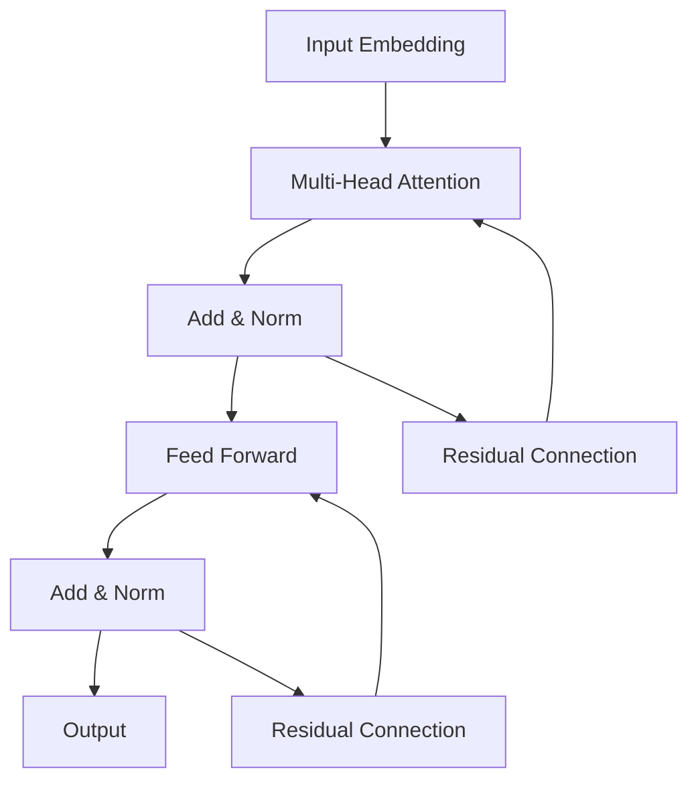

# Transformer大模型实战 叠加和归一组件

作者：禅与计算机程序设计艺术 / Zen and the Art of Computer Programming

关键词：Transformer、大模型、叠加组件、归一组件、自注意力机制、前馈神经网络、残差连接、层归一化

## 1. 背景介绍
### 1.1 问题的由来
近年来，随着深度学习技术的飞速发展，自然语言处理(NLP)领域取得了巨大的突破。Transformer作为一种革命性的神经网络架构，在机器翻译、文本生成、语义理解等任务中展现出了非凡的性能。然而，对于如何构建高效且可扩展的Transformer模型，特别是其中的叠加和归一组件，仍然存在诸多挑战。

### 1.2 研究现状 
目前，业界已经提出了多种Transformer的变体和优化方法，如BERT、GPT、XLNet等。这些模型在不同的NLP任务上取得了state-of-the-art的结果。但是，随着模型规模的不断增大，训练和推理的计算开销也在急剧增加。如何在保证模型性能的同时，提高训练效率和推理速度，成为了亟待解决的问题。

### 1.3 研究意义
深入研究Transformer的叠加和归一组件，对于优化模型结构、提升训练效率具有重要意义。通过探索新颖的网络架构和归一化方法，有望进一步提高Transformer模型的性能，推动NLP技术的发展。同时，高效的Transformer模型也将在更多实际应用场景中得到广泛应用，如智能客服、知识图谱、语义搜索等。

### 1.4 本文结构
本文将围绕Transformer的叠加和归一组件展开深入探讨。第2节介绍Transformer的核心概念和内部各组件之间的联系。第3节重点阐述叠加组件的算法原理和具体实现步骤。第4节从数学角度对Transformer的关键公式进行推导和举例说明。第5节给出了一个完整的代码实例，并对其进行详细解读。第6节讨论了Transformer在实际应用中的典型场景。第7节推荐了一些有助于读者进一步学习和研究的资源。第8节总结全文，并对Transformer的未来发展趋势和面临的挑战进行展望。

## 2. 核心概念与联系
Transformer是一种基于自注意力机制(Self-Attention)的神经网络架构，主要由编码器(Encoder)和解码器(Decoder)两部分组成。其中，编码器用于将输入序列映射为隐藏状态表示，解码器根据隐藏状态和之前的输出序列生成下一个输出。

在编码器和解码器内部，最关键的组件包括：

1. 多头自注意力层(Multi-Head Attention)：通过计算序列中不同位置之间的相关性，捕捉输入的长距离依赖关系。
2. 前馈神经网络层(Feed Forward Network)：对自注意力层的输出进行非线性变换，增强模型的表达能力。
3. 残差连接(Residual Connection)和层归一化(Layer Normalization)：有助于缓解梯度消失问题，加速模型收敛。

下图展示了Transformer编码器的内部结构和各组件之间的联系：

可以看出，输入首先经过多头自注意力层，捕捉序列内部的依赖关系。然后通过残差连接和层归一化，将自注意力层的输出与原始输入相加并归一化。接着，经过前馈神经网络层进行非线性变换。最后，再次使用残差连接和层归一化，得到最终的编码器输出。

Transformer的解码器与编码器结构类似，但在自注意力层之前多了一个Masked Multi-Head Attention，用于避免在生成序列时看到未来的信息。此外，解码器还会引入编码器的隐藏状态，作为Encoder-Decoder Attention的键值对。

## 3. 核心算法原理 & 具体操作步骤
### 3.1 算法原理概述
Transformer的核心是自注意力机制，通过计算序列中不同位置之间的相关性，捕捉输入的长距离依赖关系。具体来说，自注意力层将输入序列 $X \in \mathbb{R}^{n \times d}$ 映射为三个矩阵：查询矩阵(Query) $Q$、键矩阵(Key) $K$ 和值矩阵(Value) $V$。然后，通过计算 $Q$ 和 $K$ 的点积并归一化，得到注意力权重矩阵 $A$。最后，将 $A$ 与 $V$ 相乘，得到自注意力层的输出 $Z$。

$$
\begin{aligned}
Q &= XW_Q \\
K &= XW_K \\
V &= XW_V \\
A &= \text{softmax}(\frac{QK^T}{\sqrt{d_k}}) \\
Z &= AV
\end{aligned}
$$

其中，$W_Q, W_K, W_V \in \mathbb{R}^{d \times d_k}$ 是可学习的权重矩阵，$d_k$ 是查询/键/值向量的维度。除以 $\sqrt{d_k}$ 是为了缓解点积结果过大的问题。

多头自注意力机制将上述过程独立重复 $h$ 次，然后将各头的输出拼接起来并经过线性变换，得到最终的多头自注意力输出。

$$
\begin{aligned}
Z_i &= \text{Attention}(XW_Q^i, XW_K^i, XW_V^i) \\
\text{MultiHead}(X) &= \text{Concat}(Z_1, \dots, Z_h)W_O
\end{aligned}
$$

其中，$W_Q^i, W_K^i, W_V^i \in \mathbb{R}^{d \times d_k}, W_O \in \mathbb{R}^{hd_k \times d}$ 都是可学习的权重矩阵。

### 3.2 算法步骤详解
基于上述原理，Transformer中自注意力层的具体实现步骤如下：

1. 将输入序列 $X$ 通过三个线性变换，分别得到查询矩阵 $Q$、键矩阵 $K$ 和值矩阵 $V$。
2. 计算 $Q$ 和 $K$ 的点积，并除以 $\sqrt{d_k}$ 进行缩放。
3. 对缩放后的点积结果应用 softmax 函数，得到注意力权重矩阵 $A$。
4. 将 $A$ 与 $V$ 相乘，得到自注意力层的输出 $Z$。
5. 对步骤1-4独立重复 $h$ 次，得到 $h$ 个自注意力头的输出 $Z_1, \dots, Z_h$。
6. 将 $Z_1, \dots, Z_h$ 拼接起来，并经过线性变换得到多头自注意力层的最终输出。

前馈神经网络层的实现相对简单，就是两个线性变换中间夹一个非线性激活函数(通常为ReLU)：

$$
\text{FFN}(X) = \text{ReLU}(XW_1 + b_1)W_2 + b_2
$$

其中，$W_1 \in \mathbb{R}^{d \times d_{ff}}, b_1 \in \mathbb{R}^{d_{ff}}, W_2 \in \mathbb{R}^{d_{ff} \times d}, b_2 \in \mathbb{R}^d$ 都是可学习的参数，$d_{ff}$ 是前馈层的隐藏状态维度。

残差连接和层归一化的作用是将上一层的输出与原始输入相加，并对结果进行归一化：

$$
\begin{aligned}
X' &= \text{LayerNorm}(X + \text{Sublayer}(X)) \\
\text{LayerNorm}(X) &= \frac{X - \text{E}[X]}{\sqrt{\text{Var}[X] + \epsilon}} * \gamma + \beta
\end{aligned}
$$

其中，$\text{Sublayer}$ 可以是自注意力层或前馈神经网络层，$\gamma, \beta$ 是可学习的缩放和偏移参数，$\epsilon$ 是一个小常数，用于数值稳定性。

### 3.3 算法优缺点
Transformer的优点主要有：

1. 通过自注意力机制，可以有效捕捉输入序列中的长距离依赖关系，对于理解语言中的语义信息非常有帮助。
2. 多头自注意力允许模型在不同的子空间里学习到不同的表示，增强了模型的表达能力。
3. 残差连接和层归一化有助于缓解梯度消失问题，加速模型收敛。
4. 与循环神经网络相比，Transformer可以更好地并行化，加速训练和推理过程。

但Transformer也存在一些局限性：

1. 自注意力机制的计算复杂度为 $O(n^2)$，其中 $n$ 是序列长度，这导致Transformer在处理较长序列时计算开销很大。
2. Transformer对位置信息的建模能力较弱，需要引入额外的位置编码。
3. Transformer是一个纯粹的序列模型，无法很好地处理图结构数据。

### 3.4 算法应用领域
Transformer已经在多个NLP任务中取得了state-of-the-art的性能，主要应用领域包括：

1. 机器翻译：Transformer是当前主流的神经机器翻译模型，如Google的BERT。
2. 文本生成：如GPT系列模型，可以生成连贯、流畅的文本。
3. 命名实体识别和关系抽取：Transformer可以有效地对实体和关系进行编码。
4. 文本分类和情感分析：Transformer可以学习到句子和文档级别的语义表示。
5. 问答系统：Transformer可以用于构建端到端的问答模型，如BERT for QA。

此外，Transformer的思想也被广泛应用于其他领域，如计算机视觉、语音识别、推荐系统等。

## 4. 数学模型和公式 & 详细讲解 & 举例说明
### 4.1 数学模型构建
为了更好地理解Transformer的内部原理，我们需要对其中的关键公式进行推导和分析。首先，让我们回顾一下Transformer中的几个核心概念：

1. 自注意力机制：将输入序列 $X$ 映射为 $Q$、$K$、$V$ 三个矩阵，然后通过计算 $Q$ 和 $K$ 的相似度得到注意力权重，最后将权重应用于 $V$ 得到输出。
2. 多头自注意力：将自注意力过程独立重复多次，然后将结果拼接起来。
3. 残差连接和层归一化：将上一层的输出与原始输入相加，并对结果进行归一化。

下面，我们将对这些概念涉及的数学公式进行详细推导。

### 4.2 公式推导过程
#### 4.2.1 自注意力机制
给定输入序列 $X \in \mathbb{R}^{n \times d}$，自注意力机制首先通过三个线性变换得到 $Q$、$K$、$V$ 矩阵：

$$
\begin{aligned}
Q &= XW_Q \\
K &= XW_K \\
V &= XW_V
\end{aligned}
$$

其中，$W_Q, W_K, W_V \in \mathbb{R}^{d \times d_k}$ 是可学习的权重矩阵。

然后，计算 $Q$ 和 $K$ 的点积并除以 $\sqrt{d_k}$ 进行缩放：

$$
\text{scores} = \frac{QK^T}{\sqrt{d_k}}
$$

接着，对 $\text{scores}$ 应用 softmax 函数，得到注意力权重矩阵 $A$：

$$
A = \text{softmax}(\text{scores})
$$

其中，softmax 函数定义为：

$$
\text{softmax}(x_i) = \frac{\exp(x_i)}{\sum_j \exp(x_j)}
$$

最后，将 $A$ 与 $V$ 相乘，得到自注意力层的输出 $Z$：

$$
Z = AV
$$

#### 4.2.2 多头自注意力
多头自注意力将上述过程独立重复 $h$ 次，然后将各头的输出拼接起来：

$$
\begin{aligned}
Z_i &= \text{Attention}(XW_Q