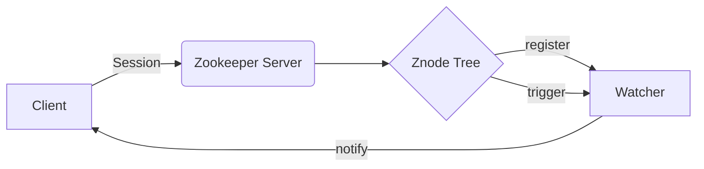
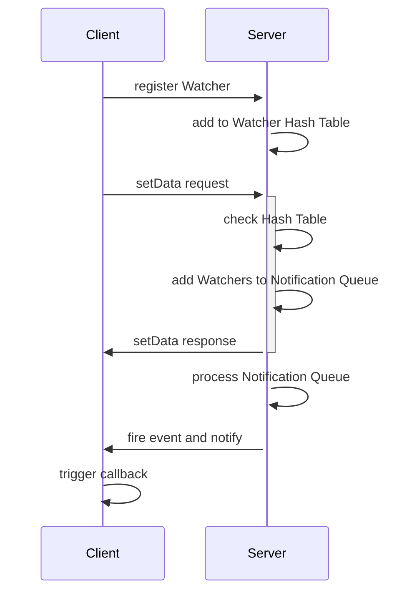

# Zookeeper Watcher机制原理与代码实例讲解

关键词：Zookeeper、Watcher机制、事件通知、分布式协调

## 1. 背景介绍
### 1.1  问题的由来
在分布式系统中，各个节点之间需要进行协调和同步，以保证系统的一致性和可靠性。Zookeeper作为一个分布式协调服务，提供了一种简单而强大的机制来实现分布式锁、配置管理、命名服务等功能。而Watcher机制是Zookeeper的一个重要特性，它允许客户端在数据发生变化时获得通知，从而实现事件驱动的分布式应用。

### 1.2  研究现状
目前，Zookeeper已经被广泛应用于各种分布式系统中，如Hadoop、Kafka、Dubbo等。对于Zookeeper的研究也比较深入，包括其架构设计、一致性算法、性能优化等方面。然而，对于Watcher机制的原理和实现细节的介绍还比较少，很多开发者对其内部工作原理了解不够深入。

### 1.3  研究意义
深入理解Zookeeper的Watcher机制，对于开发高效、可靠的分布式应用具有重要意义。通过掌握Watcher的原理和使用方法，可以设计出更加灵活、实时的分布式协调方案。同时，对Watcher的性能和可扩展性进行优化，也是提高分布式系统效率的关键。

### 1.4  本文结构
本文将从以下几个方面对Zookeeper的Watcher机制进行深入探讨：

1. Watcher机制的核心概念和工作原理
2. Watcher的注册和触发流程详解
3. Watcher的几种典型使用场景
4. 基于Watcher实现分布式锁和配置更新的代码实例
5. Watcher机制的优缺点分析
6. 现有工具和资源推荐
7. Watcher机制的未来发展趋势和挑战

## 2. 核心概念与联系
在介绍Watcher机制之前，我们先来了解几个核心概念：

- Znode：Zookeeper的数据节点，分为持久节点和临时节点两种。每个Znode可以存储少量数据，并且有一个版本号。
- Watcher：事件监听器，用于监听某个Znode上的事件，包括数据变更、子节点变更等。
- 会话(Session)：客户端与服务端之间的一个TCP长连接，客户端可以通过会话来发送请求和接收响应。

下图展示了Znode、Watcher和会话之间的关系：



可以看出，客户端通过会话连接到Zookeeper服务端，并在某些Znode上注册Watcher。当这些Znode发生变化时，会触发相应的Watcher，服务端就会通过会话将事件通知给客户端。

## 3. 核心算法原理 & 具体操作步骤
### 3.1  算法原理概述
Watcher机制的核心是事件驱动模型，即客户端注册Watcher来监听感兴趣的事件，当事件发生时，服务端会异步通知客户端。整个过程可以分为三个阶段：

1. 客户端注册Watcher
2. 服务端处理Watcher
3. 触发Watcher并通知客户端

### 3.2  算法步骤详解
1. 客户端注册Watcher
   - 客户端调用`getData`、`exists`、`getChildren`等读取数据的API，并传入Watcher对象
   - 服务端将Watcher对象和被监听的Znode路径关联起来，存储在内存的哈希表中
   
2. 服务端处理Watcher  
   - 对于每一个写操作(如`setData`、`create`、`delete`)，服务端都会检查哈希表，找出该Znode对应的所有Watcher
   - 将这些Watcher加入到待通知队列中，并标记事件类型(如节点数据变更、节点创建、节点删除等)
   
3. 触发Watcher并通知客户端
   - 服务端在处理完写操作后，会依次处理待通知队列中的每一个Watcher
   - 服务端通过会话将事件类型和Znode路径发送给客户端
   - 客户端根据事件类型和Znode路径，触发相应的回调函数来处理事件

下图展示了整个Watcher通知流程：



### 3.3  算法优缺点
Watcher机制的优点包括：

- 可以实现事件驱动的分布式应用，提高系统的实时性和灵活性
- 减少了客户端的轮询开销，提高了系统的性能
- 可以方便地实现分布式锁、配置管理等功能

缺点包括：

- Watcher是一次性的，触发后需要重新注册，增加了编程复杂度
- 如果客户端处理事件的回调函数执行时间过长，可能会阻塞服务端的通知线程
- 对于频繁更新的Znode，可能会产生大量的事件通知，增加系统开销

### 3.4  算法应用领域
Watcher机制在分布式系统中有广泛的应用，典型的场景包括：

- 分布式锁：通过Znode的创建和删除事件来实现锁的获取和释放
- 配置管理：通过监听配置Znode的变更事件，实现配置的实时更新
- 负载均衡：通过监听服务节点的增减事件，实现服务的动态上下线
- 集群管理：通过监听集群节点的状态变化，实现故障检测和自动恢复

## 4. 数学模型和公式 & 详细讲解 & 举例说明
### 4.1  数学模型构建
对于Watcher机制，我们可以使用集合论来建立数学模型。假设有一组Znode集合$Z=\{z_1,z_2,...,z_n\}$，以及一组Watcher集合$W=\{w_1,w_2,...,w_m\}$。我们用二元组$(z_i,w_j)$来表示Watcher $w_j$监听了Znode $z_i$。

### 4.2  公式推导过程
对于任意一个Znode $z_i$，我们可以定义一个函数$f(z_i)$来表示监听它的所有Watcher集合：

$$
f(z_i) = \{w_j | (z_i,w_j) \in Z \times W\}
$$

当$z_i$发生变化时，Zookeeper需要通知所有的$w_j \in f(z_i)$。

同理，对于任意一个Watcher $w_j$，我们可以定义一个函数$g(w_j)$来表示它监听的所有Znode集合：

$$
g(w_j) = \{z_i | (z_i,w_j) \in Z \times W\}
$$

当$w_j$被触发时，说明$g(w_j)$中至少有一个Znode发生了变化。

### 4.3  案例分析与讲解
举一个具体的例子，假设有以下Znode：

- /config
- /config/db
- /config/cache

以及以下Watcher：

- $w_1$监听/config的数据变更事件
- $w_2$监听/config/db的创建和删除事件
- $w_3$监听/config的子节点变更事件

则我们有：

$$
\begin{aligned}
f(/config) &= \{w_1,w_3\} \\
f(/config/db) &= \{w_2\} \\
f(/config/cache) &= \emptyset \\
g(w_1) &= \{/config\} \\
g(w_2) &= \{/config/db\} \\
g(w_3) &= \{/config\}
\end{aligned}
$$

现在，如果/config/db被删除了，则Zookeeper需要通知$f(/config/db)=\{w_2\}$以及$f(/config)=\{w_1,w_3\}$，即$w_2$和$w_3$都会被触发。

### 4.4  常见问题解答
- 问：Watcher可以监听多个Znode吗？
  答：可以，一个Watcher可以通过多次注册来监听多个Znode，即$|g(w_j)| \geq 1$。

- 问：一个Znode可以被多个Watcher监听吗？  
  答：可以，一个Znode可以被多个Watcher监听，即$|f(z_i)| \geq 0$。
  
- 问：Watcher可以监听子节点的事件吗？
  答：可以，Watcher可以监听子节点的创建、删除等事件，但不能监听子节点数据的变更事件。如果要监听子节点数据变更，需要对每个子节点分别注册Watcher。

## 5. 项目实践：代码实例和详细解释说明
下面我们通过两个具体的代码实例来演示Watcher机制的使用。

### 5.1  开发环境搭建
- JDK 1.8+
- Zookeeper 3.4+
- Curator框架(可选)

### 5.2  源代码详细实现
#### 5.2.1 使用原生Zookeeper API实现分布式锁

```java
public class ZkLock implements Watcher {
    private ZooKeeper zk;
    private String lockPath;
    private String currentPath;
    private String waitPath;
    private CountDownLatch latch = new CountDownLatch(1);

    public ZkLock(String lockPath) throws IOException, InterruptedException {
        this.lockPath = lockPath;
        zk = new ZooKeeper("localhost:2181", 10000, this);
        zk.create(lockPath, new byte[0], ZooDefs.Ids.OPEN_ACL_UNSAFE, CreateMode.PERSISTENT);
    }

    public void lock() throws InterruptedException, KeeperException {
        currentPath = zk.create(lockPath + "/lock_", new byte[0], ZooDefs.Ids.OPEN_ACL_UNSAFE, CreateMode.EPHEMERAL_SEQUENTIAL);
        List<String> children = zk.getChildren(lockPath, false);
        Collections.sort(children);
        if (currentPath.equals(lockPath + "/" + children.get(0))) {
            return;
        } else {
            int index = children.indexOf(currentPath.substring(lockPath.length() + 1));
            waitPath = lockPath + "/" + children.get(index - 1);
            zk.exists(waitPath, true);
            latch.await();
        }
    }

    public void unlock() throws InterruptedException, KeeperException {
        zk.delete(currentPath, -1);
    }

    @Override
    public void process(WatchedEvent event) {
        if (event.getType() == Event.EventType.NodeDeleted && event.getPath().equals(waitPath)) {
            latch.countDown();
        }
    }
}
```

这个分布式锁的实现思路如下：

1. 在Zookeeper上创建一个持久节点作为锁的根节点
2. 每个客户端尝试在根节点下创建一个临时顺序节点，创建成功则获得锁
3. 如果创建失败，则获取根节点下所有子节点，并排序
4. 如果自己创建的节点是第一个子节点，则获得锁；否则，监听前一个子节点的删除事件
5. 当前一个子节点被删除时，则当前客户端获得锁
6. 执行完业务逻辑后，删除自己创建的临时顺序节点，释放锁

可以看到，这里主要使用了Watcher来监听前一个子节点的删除事件，从而实现了锁的等待和通知机制。

#### 5.2.2 使用Curator实现配置更新

```java
public class ConfigUpdater implements CuratorWatcher {
    private CuratorFramework client;
    private String configPath;

    public ConfigUpdater(String configPath) {
        this.configPath = configPath;
        client = CuratorFrameworkFactory.newClient("localhost:2181", new ExponentialBackoffRetry(1000, 3));
        client.start();
    }

    public void start() throws Exception {
        client.watchers().add().usingWatcher(this).forPath(configPath);
        loadConfig();
    }

    private void loadConfig() throws Exception {
        byte[] data = client.getData().forPath(configPath);
        String config = new String(data);
        System.out.println("Loaded config: " + config);
        // TODO: 应用配置
    }

    @Override
    public void process(WatchedEvent event) throws Exception {
        if (event.getType() == Watcher.Event.EventType.NodeDataChanged) {
            loadConfig();
        }
    }
}
```

这个配置更新的实现思路如下：

1. 使用Curator框架