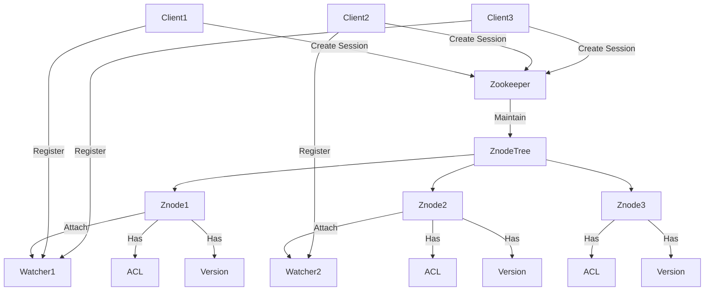

# Zookeeper原理与代码实例讲解

作者：禅与计算机程序设计艺术 / Zen and the Art of Computer Programming 

## 1. 背景介绍

### 1.1 问题的由来
随着大数据和分布式系统的快速发展,如何有效地协调和管理分布式集群中的各个节点,实现高可用、高性能、高可扩展性成为一个重要的技术挑战。传统的集中式架构难以满足海量数据和高并发访问的需求,而分布式架构虽然能够解决扩展性问题,但如何保证数据一致性、如何协调不同节点之间的状态同步等,都需要一个高效可靠的分布式协调服务。

### 1.2 研究现状
目前业界主流的分布式协调服务包括Google的Chubby、Apache的Zookeeper等。其中,Zookeeper作为Apache顶级开源项目,凭借其简单易用的API接口、可靠的性能表现,在分布式领域得到了广泛应用。很多知名开源项目如Hadoop、Kafka、Hbase等都依赖Zookeeper来实现分布式协调。同时各大互联网公司也纷纷基于Zookeeper开发了自己的分布式服务,可见其受欢迎程度。

### 1.3 研究意义
深入研究Zookeeper的内部原理和工作机制,对于理解现代分布式系统架构设计、算法思想具有重要意义。通过剖析Zookeeper是如何实现分布式锁、Leader选举、配置管理等功能,可以学习到很多分布式协议设计的精髓。此外,Zookeeper本身也是一个优秀的Java项目,其代码风格简洁、逻辑清晰,对于Java程序员具有很好的学习价值。

### 1.4 本文结构 
本文将围绕Zookeeper的原理和代码实例展开详细讲解。首先介绍Zookeeper的核心概念和基本架构,然后重点分析其几个关键算法的原理,并结合数学模型和公式加以阐述。接着通过实际的代码案例演示Zookeeper的使用方法。最后总结Zookeeper的特点、应用场景以及未来的发展趋势,并提供一些学习资源供进一步研究参考。

## 2. 核心概念与联系

Zookeeper的核心概念主要包括:

- Znode:Zookeeper树形结构中的数据节点,分为持久节点和临时节点。
- Session:客户端与服务端之间的会话。
- Watcher:事件监听器,可监听节点的变化。
- ACL:节点的访问控制权限。
- 版本:节点数据的版本号,实现乐观锁。

这些概念之间的关系可以用下图表示:



可以看出:
1. 多个客户端可以连接到Zookeeper,并创建会话。
2. Zookeeper内部维护一个Znode树,每个Znode代表一个数据节点。
3. 客户端可以在Znode上注册Watcher监听数据变更。
4. 每个Znode都有权限控制和版本概念。

## 3. 核心算法原理 & 具体操作步骤

### 3.1 算法原理概述
Zookeeper采用ZAB(Zookeeper Atomic Broadcast)协议来保证分布式数据一致性。ZAB协议是一种特殊的原子广播协议,基于Paxos算法,能够很好地支持崩溃恢复。

### 3.2 算法步骤详解
Leader选举是ZAB协议的核心,假设有5台机器组成的Zookeeper集群,它的步骤如下:

1. 初始化阶段:每个Server发出一个投票。由于是初始情况,Server1和Server2都会将自己作为Leader服务器来进行投票,每次投票都会包含所推举的服务器的myid和ZXID,使用(myid, ZXID)来表示,此时Server1的投票为(1, 0),Server2的投票为(2, 0),然后各自将这个投票发给集群中的其它机器。

2. 接收来自各个服务器的投票。集群中的每个服务器收到投票后,首先判断该投票的有效性,如检查是否是本轮投票(epoch)、是否来自LOOKING状态的服务器。

3. 处理投票。针对每一个投票,服务器都需要将别人的投票和自己的投票进行PK,PK规则如下:
   - 优先比较ZXID,ZXID比较大的服务器优先作为Leader。
   - 如果ZXID相同,那么就比较myid,myid较大的服务器作为Leader服务器。
   
   对于Server1而言,它的投票是(1, 0),接收Server2的投票为(2, 0),首先会比较两者的ZXID,均为0,再比较myid,此时Server2的myid最大,于是更新自己的投票为(2, 0),然后重新投票,对于Server2而言,它不需要更新自己的投票,只是再次向集群中所有机器发出上一次投票信息即可。

4. 统计投票。每次投票后,服务器都会统计投票信息,判断是否已经有过半机器接受到相同的投票信息,对于Server1、Server2而言,都统计出集群中已经有3台机器接受了(2, 0)的投票信息,此时便认为已经选出了Leader。

5. 改变服务器状态。一旦确定了Leader,每个服务器就会更新自己的状态,如果是Follower,那么就变更为FOLLOWING,如果是Leader,就变更为LEADING。

### 3.3 算法优缺点
ZAB协议的优点是可以很好地支持崩溃恢复,能够保证数据一致性。缺点是在Leader选举过程中,集群处于不可用状态,对性能有一定影响。

### 3.4 算法应用领域
ZAB协议主要应用于Zookeeper中实现分布式数据一致性。此外很多其他系统也借鉴了ZAB的思想,如Kafka、Etcd等。

## 4. 数学模型和公式 & 详细讲解 & 举例说明

### 4.1 数学模型构建
我们可以用一个二维数组来表示Zookeeper集群,每个元素代表一台机器:

$$
\begin{bmatrix}
S_{1} & S_{2} & \cdots  & S_{n}\\ 
Z_{1} & Z_{2} & \cdots  & Z_{n}
\end{bmatrix}
$$

其中$S_i$代表第i台机器的myid,$Z_i$代表第i台机器的ZXID。

投票可以用一个三元组$(i,j,k)$表示,其中i为投票轮次epoch,j为被推举Leader的myid,k为被推举Leader的ZXID。

### 4.2 公式推导过程
假设在第n轮投票中,收到的投票分布为:

$$
\begin{aligned}
V_n &= \{(n,j_1,k_1),(n,j_2,k_2),\cdots,(n,j_n,k_n)\} \\
&= \{v_1,v_2,\cdots,v_n\}
\end{aligned}
$$

我们定义一个评分函数score:

$score(v_i) = \begin{cases}
1, & Z_{v_i} > Z_{max} 或 (Z_{v_i} = Z_{max} 且 S_{v_i} > S_{max})\\
0, & 其他情况
\end{cases}$

其中$Z_{max}$和$S_{max}$分别是当前收到的所有投票中ZXID和myid的最大值。

如果有一个投票$v_i$满足:

$$\sum_{j=1}^{n}score(v_j) > \frac{n}{2}$$

那么就可以确定Leader为$S_{v_i}$。

### 4.3 案例分析与讲解
还是以上面5台机器的例子,假设它们的myid和ZXID如下:

$$
\begin{bmatrix}
1 & 2 & 3 & 4 & 5\\ 
9 & 8 & 7 & 6 & 5
\end{bmatrix}
$$

在第1轮投票中,每台机器都投自己,于是:

$V_1 = \{(1,1,9),(1,2,8),(1,3,7),(1,4,6),(1,5,5)\}$

根据评分函数,只有(1,1,9)满足条件,于是:

$score(1,1,9) = 1$
$\sum_{j=1}^{5}score(v_j) = 1 < \frac{5}{2}$

没有过半,进入第2轮投票。

此时每台机器检查上一轮投票,发现(1,1,9)得分最高,于是都更新为(1,1,9),再次进行投票:

$V_2 = \{(1,1,9),(1,1,9),(1,1,9),(1,1,9),(1,1,9)\}$

这一轮,有:

$\sum_{j=1}^{5}score(v_j) = 5 > \frac{5}{2}$

满足Leader选举条件,于是确定myid=1的机器为Leader。

### 4.4 常见问题解答
Q:Zookeeper是如何检测Leader宕机并重新选举的?
A:Zookeeper依靠心跳机制检测机器存活状态。一旦发现Leader挂了,其他Follower就会进入新一轮投票,重新选举Leader。

Q:Zookeeper能容忍多少台机器宕机?
A:Zookeeper采用过半机制,只要集群中超过半数的机器存活,就能保证服务可用。所以2N+1台机器能容忍N台机器宕机。

## 5. 项目实践：代码实例和详细解释说明

### 5.1 开发环境搭建
要使用Zookeeper,首先需要搭建开发环境。具体步骤如下:

1. 安装JDK,要求版本1.8以上。
2. 下载Zookeeper安装包,解压到本地目录。
3. 配置环境变量ZOOKEEPER_HOME,值为Zookeeper根目录。
4. 修改conf/zoo.cfg文件,指定数据存储目录和日志目录。
5. 启动Zookeeper服务:bin/zkServer.sh start

### 5.2 源代码详细实现
下面是一个使用Zookeeper实现分布式锁的Java代码示例:

```java
public class ZooKeeperLock implements Lock {
    private ZooKeeper zk;
    private String lockName;
    private String lockPath;
    private String waitNode;

    public ZooKeeperLock(String lockName) {
        this.lockName = lockName;
        try {
            zk = new ZooKeeper("localhost:2181", 5000, null);
            Stat stat = zk.exists("/" + lockName, false);
            if (stat == null) {
                zk.create("/" + lockName, new byte[0], ZooDefs.Ids.OPEN_ACL_UNSAFE, CreateMode.PERSISTENT);
            }
        } catch (IOException | KeeperException | InterruptedException e) {
            e.printStackTrace();
        }
    }

    public void lock() {
        try {
            waitNode = zk.create("/" + lockName + "/lock_", null, ZooDefs.Ids.OPEN_ACL_UNSAFE, CreateMode.EPHEMERAL_SEQUENTIAL);
            lockPath = waitNode.substring(0, waitNode.lastIndexOf("_"));
            List<String> childrenNodes = zk.getChildren("/" + lockName, false);
            Collections.sort(childrenNodes);
            String minNode = childrenNodes.get(0);
            if (waitNode.equals("/" + lockName + "/" + minNode)) {
                return;
            }
            String prevNode = "/" + lockName + "/" + childrenNodes.get(childrenNodes.indexOf(waitNode.substring(waitNode.lastIndexOf("/") + 1)) - 1);
            Stat stat = zk.exists(prevNode, new Watcher() {
                public void process(WatchedEvent event) {
                    if (event.getType() == Watcher.Event.EventType.NodeDeleted) {
                        synchronized (this) {
                            notifyAll();
                        }
                    }
                }
            });
            if (stat != null) {
                synchronized (this) {
                    wait();
                }
            }
        } catch (KeeperException | InterruptedException e) {
            e.printStackTrace();
        }
    }

    public void unlock() {
        try {
            zk.delete(waitNode, -1);
        } catch (InterruptedException | KeeperException e) {
            e.printStackTrace();