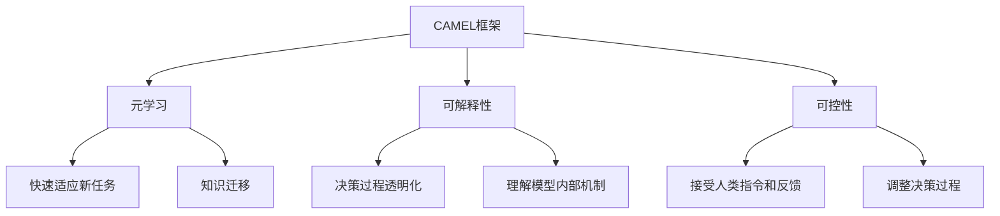
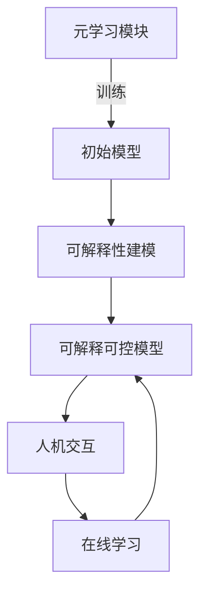

# 【大模型应用开发 动手做AI Agent】CAMEL简介

## 1. 背景介绍

### 1.1 问题的由来

在人工智能领域，大型语言模型已经取得了令人瞩目的成就。然而,这些模型通常被视为"黑箱",缺乏可解释性和可控性,这限制了它们在关键任务中的应用。为了解决这一问题,研究人员提出了CAMEL(Controllable and Auditable Metalearning)框架,旨在开发可控和可审计的人工智能代理。

### 1.2 研究现状

目前,大多数人工智能系统都是基于单一任务的专用模型,它们在特定领域表现出色,但缺乏通用性和灵活性。与此同时,大型语言模型虽然具有广泛的知识覆盖面,但它们缺乏可解释性和可控性,这使得它们难以应用于需要高度可靠性和安全性的关键任务。

### 1.3 研究意义

CAMEL框架旨在开发具有可解释性、可控性和通用性的人工智能代理。这种代理不仅能够完成各种任务,而且能够解释其决策过程,并接受人类的指令和反馈。这对于提高人工智能系统的可靠性和安全性至关重要,有助于建立人类对人工智能的信任。

### 1.4 本文结构

本文将首先介绍CAMEL框架的核心概念和原理,包括元学习、可解释性和可控性。然后,我们将详细讨论CAMEL框架的核心算法,包括算法原理、具体步骤、优缺点和应用领域。接下来,我们将探讨CAMEL框架的数学模型和公式,并通过案例分析进行详细说明。此外,我们还将提供一个实际项目的代码实现和运行结果展示。最后,我们将讨论CAMEL框架的实际应用场景、未来发展趋势和面临的挑战。

## 2. 核心概念与联系

CAMEL框架的核心概念包括元学习(Meta-Learning)、可解释性(Interpretability)和可控性(Controllability)。

### 2.1 元学习(Meta-Learning)

元学习是机器学习中的一种范式,旨在开发能够快速适应新任务并有效利用先验知识的模型。在CAMEL框架中,元学习被用于开发通用的人工智能代理,这些代理可以快速学习新任务,并将先前学习到的知识迁移到新任务中。

### 2.2 可解释性(Interpretability)

可解释性是指人工智能系统能够解释其决策过程和内部机制的能力。在CAMEL框架中,可解释性是实现可审计和可信任人工智能的关键。通过提供透明的决策过程,人类可以更好地理解模型的行为,从而提高对人工智能系统的信任。

### 2.3 可控性(Controllability)

可控性是指人工智能系统能够接受人类的指令和反馈,并相应调整其决策过程的能力。在CAMEL框架中,可控性使人类能够主动参与人工智能系统的决策过程,从而确保系统的行为符合人类的意图和价值观。

## 3. 核心算法原理 & 具体操作步骤

### 3.1 算法原理概述

CAMEL框架的核心算法基于元学习和可解释性建模,旨在开发可控和可审计的人工智能代理。该算法包括以下几个主要步骤:

1. **元学习模块**: 通过元学习,训练一个通用的初始模型,该模型能够快速适应新任务并有效利用先验知识。
2. **可解释性建模**: 在初始模型的基础上,引入可解释性机制,使模型能够解释其决策过程和内部机制。
3. **人机交互**: 通过人机交互界面,人类可以向模型发出指令和反馈,模型则相应调整其决策过程。
4. **在线学习**: 在任务执行过程中,模型持续学习并更新自身,以适应新的情况和反馈。

### 3.2 算法步骤详解

1. **元学习模块**
   - 采用基于梯度的元学习算法,如MAML(Model-Agnostic Meta-Learning)或Reptile算法
   - 在多个不同的任务上训练初始模型,使其能够快速适应新任务
   - 利用元学习,初始模型可以有效地利用先验知识,加速新任务的学习过程

2. **可解释性建模**
   - 在初始模型的基础上,引入可解释性机制,如注意力机制或概念激活向量(CAV)
   - 通过可视化注意力分布或CAV,模型可以解释其内部决策过程
   - 采用可解释性正则化技术,鼓励模型学习可解释的表示

3. **人机交互**
   - 设计人机交互界面,允许人类向模型发出指令和反馈
   - 模型根据人类的指令和反馈,调整其决策过程和行为
   - 人类可以通过交互界面查看模型的决策解释,并提供反馈

4. **在线学习**
   - 在任务执行过程中,模型持续学习并更新自身
   - 利用人类的反馈和新的数据,模型可以不断改进其决策过程
   - 采用在线学习算法,如在线元学习或在线知识蒸馏

### 3.3 算法优缺点

**优点**:

- 通过元学习,模型可以快速适应新任务,提高泛化能力
- 可解释性机制使模型的决策过程透明化,提高可信度
- 可控性允许人类主动参与决策过程,确保模型行为符合人类意图
- 在线学习使模型能够持续改进,适应新的情况和反馈

**缺点**:

- 算法复杂度较高,需要大量计算资源和训练数据
- 可解释性和可控性机制可能会影响模型的性能
- 人机交互界面的设计和反馈机制需要进一步优化
- 在线学习可能会引入新的偏差和不确定性

### 3.4 算法应用领域

CAMEL框架及其核心算法可以应用于各种需要可解释性、可控性和通用性的人工智能任务,包括但不限于:

- 自动决策系统(如医疗诊断、金融风险评估等)
- 人机协作系统(如智能助手、机器人控制等)
- 安全关键系统(如自动驾驶、网络安全等)
- 科学发现和创新(如药物设计、材料发现等)

## 4. 数学模型和公式 & 详细讲解 & 举例说明

### 4.1 数学模型构建

CAMEL框架中的核心数学模型是基于元学习和可解释性建模的。我们首先定义一个元学习任务分布 $p(\mathcal{T})$,其中每个任务 $\mathcal{T}_i$ 由一个支持集 $\mathcal{D}_i^{tr}$ 和一个查询集 $\mathcal{D}_i^{val}$ 组成。元学习的目标是学习一个初始模型 $f_{\theta}$,使其能够在少量支持数据 $\mathcal{D}_i^{tr}$ 上快速适应,并在相应的查询集 $\mathcal{D}_i^{val}$ 上表现良好。

我们定义元学习的目标函数如下:

$$J(\theta) = \mathbb{E}_{\mathcal{T}_i \sim p(\mathcal{T})}[\mathcal{L}(f_{\theta'}, \mathcal{D}_i^{val})]$$

其中 $\theta'$ 是通过在支持集 $\mathcal{D}_i^{tr}$ 上优化初始模型 $f_{\theta}$ 得到的适应后的模型参数。$\mathcal{L}$ 是任务相关的损失函数,如交叉熵损失或均方误差。

为了实现可解释性,我们引入了一个可解释性正则项 $\Omega(f_{\theta})$,鼓励模型学习可解释的表示。可解释性正则项可以基于注意力机制或概念激活向量(CAV)等技术来定义。

因此,我们的最终优化目标函数为:

$$J'(\theta) = J(\theta) + \lambda \Omega(f_{\theta})$$

其中 $\lambda$ 是一个超参数,用于平衡任务损失和可解释性正则项的权重。

### 4.2 公式推导过程

我们采用基于梯度的元学习算法,如MAML或Reptile,来优化上述目标函数。以MAML为例,其优化过程如下:

1. 对于每个任务 $\mathcal{T}_i$,在支持集 $\mathcal{D}_i^{tr}$ 上优化初始模型 $f_{\theta}$,得到适应后的模型参数 $\theta'_i$:

$$\theta'_i = \theta - \alpha \nabla_{\theta} \mathcal{L}(f_{\theta}, \mathcal{D}_i^{tr})$$

其中 $\alpha$ 是内循环学习率。

2. 计算适应后模型在查询集 $\mathcal{D}_i^{val}$ 上的损失,并考虑可解释性正则项:

$$\mathcal{L}_i = \mathcal{L}(f_{\theta'_i}, \mathcal{D}_i^{val}) + \lambda \Omega(f_{\theta'_i})$$

3. 通过对多个任务的损失求平均,计算元梯度:

$$\nabla J'(\theta) = \frac{1}{N}\sum_{i=1}^{N}\nabla_{\theta}\mathcal{L}_i$$

4. 使用元梯度更新初始模型参数:

$$\theta \leftarrow \theta - \beta \nabla J'(\theta)$$

其中 $\beta$ 是外循环学习率。

通过上述迭代过程,我们可以得到一个初始模型 $f_{\theta}$,该模型不仅能够快速适应新任务,而且具有良好的可解释性。

### 4.3 案例分析与讲解

为了更好地理解CAMEL框架的数学模型和公式,我们以一个文本分类任务为例进行案例分析。

假设我们有一个情感分析任务,需要判断给定文本的情感极性(正面、负面或中性)。我们的目标是开发一个可解释且可控的情感分析模型,该模型能够解释其决策过程,并接受人类的反馈进行调整。

我们采用CAMEL框架,首先在多个不同领域的情感分析数据集上进行元学习,得到一个初始模型 $f_{\theta}$。然后,我们引入注意力机制作为可解释性建模,使模型能够解释关键词对情感判断的影响。我们定义可解释性正则项 $\Omega(f_{\theta})$ 为注意力分布的熵,鼓励模型学习更加集中的注意力分布,从而提高可解释性。

在人机交互过程中,人类可以查看模型对于每个输入文本的注意力分布,了解模型的决策依据。如果人类发现模型关注了一些不恰当的词语,就可以提供反馈,引导模型调整注意力分布。同时,人类也可以直接向模型发出指令,要求它关注特定的词语或语义信息。

通过持续的人机交互和在线学习,模型可以不断改进其决策过程,提高情感分析的准确性和可解释性。最终,我们得到一个可靠且可信任的情感分析模型,该模型不仅表现出色,而且能够解释其决策过程,并根据人类的反馈进行调整。

### 4.4 常见问题解答

1. **为什么需要可解释性和可控性?**

可解释性和可控性是确保人工智能系统可靠性和安全性的关键因素。可解释性使人类能够理解模型的决策过程,从而建立对人工智能的信任。可控性则允许人类主动参与决策过程,确保模型的行为符合人类的意图和价值观。

2