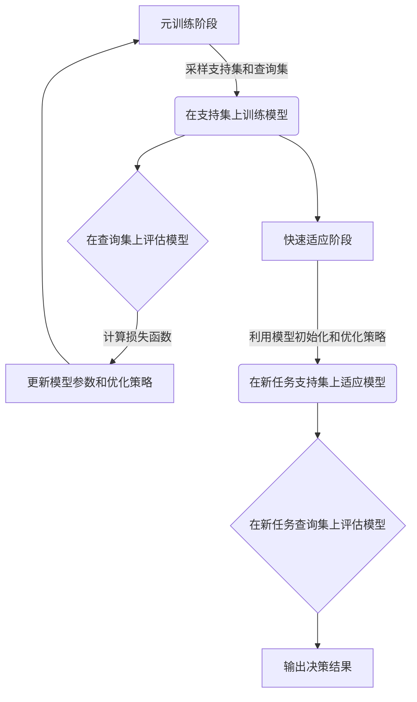

# 一切皆是映射：掌握元学习用于实时战术决策分析

## 1. 背景介绍

### 1.1 问题的由来

在当今快节奏的战争环境中，实时战术决策分析变得前所未有的重要。传统的决策系统往往基于预定义的规则和模型,难以适应战场环境的高度动态性和不确定性。因此,需要一种新的方法来提高决策的灵活性和适应性,以应对复杂的战术场景。

### 1.2 研究现状  

近年来,元学习(Meta-Learning)作为一种新兴的机器学习范式,受到了广泛关注。它旨在通过从先前任务中学习元知识,来加速新任务的学习过程。元学习在计算机视觉、自然语言处理等领域取得了显著成果,但在实时战术决策分析领域的应用还鲜有报道。

### 1.3 研究意义

将元学习应用于实时战术决策分析,可以显著提高决策系统的灵活性和适应性。通过从历史战役中学习元知识,决策系统能够快速适应新的战术场景,做出准确的实时决策。这对于提高战斗力、保护人员安全、节省资源等方面具有重大意义。

### 1.4 本文结构

本文首先介绍元学习的核心概念,并阐述其与实时战术决策分析的联系。接下来详细解释元学习在该领域的核心算法原理和数学模型。然后通过代码实例展示如何将元学习应用于实际项目。最后讨论元学习在该领域的应用场景、发展趋势和面临的挑战。

## 2. 核心概念与联系

元学习(Meta-Learning)是一种机器学习范式,旨在通过学习任务之间的共性,来加速新任务的学习过程。它由两个关键概念组成:

1. **元知识(Meta-Knowledge)**: 指从先前任务中学习到的可迁移的知识,如数据表示、模型初始化、优化策略等。

2. **快速适应(Fast Adaptation)**: 指利用元知识快速适应新任务,使模型在少量新数据上快速收敛。

将元学习应用于实时战术决策分析,可以将历史战役视为先前任务,从中学习元知识。当面临新的战术场景时,决策系统可以基于元知识快速适应,做出准确的实时决策。

元学习的优势在于:

- 提高决策灵活性,快速适应新环境
- 减少对大量标注数据的依赖
- 利用历史经验,避免从零开始学习

因此,元学习为实现高效、鲁棒的实时战术决策分析提供了有力工具。

## 3. 核心算法原理 & 具体操作步骤  

### 3.1 算法原理概述

元学习算法通常分为两个阶段:元训练(Meta-Training)和快速适应(Fast Adaptation)。

**元训练阶段**:

1. 从大量任务分布中采样一批支持集(Support Set)和查询集(Query Set)。
2. 在支持集上训练模型,获得模型初始化参数和优化策略。
3. 在查询集上评估模型,计算损失函数。
4. 通过优化损失函数,更新模型参数和优化策略。

**快速适应阶段**:

1. 在新任务的支持集上,利用元训练获得的模型初始化和优化策略,快速适应模型。
2. 在新任务的查询集上,评估适应后的模型性能。

该过程迭代进行,持续提高模型的泛化能力。

### 3.2 算法步骤详解

1. **任务分布采样**

   从大量历史战役数据中构建任务分布$p(\mathcal{T})$,每个任务$\mathcal{T}_i$包含支持集$\mathcal{D}_i^{tr}$和查询集$\mathcal{D}_i^{ts}$。支持集用于快速适应,查询集用于评估模型性能。

2. **模型训练**

   在支持集$\mathcal{D}_i^{tr}$上训练模型$f_{\phi}$,其中$\phi$为模型参数。常用的模型有基于梯度的模型(如MAML)和基于度量的模型(如匹配网络)。

3. **损失函数计算**

   在查询集$\mathcal{D}_i^{ts}$上评估模型性能,计算损失函数:

   $$\mathcal{L}(\phi) = \sum_{(x,y) \in \mathcal{D}_i^{ts}} l(f_{\phi}(x), y)$$

   其中$l$为损失函数,如交叉熵损失。

4. **模型参数更新**

   通过优化损失函数,更新模型参数$\phi$和优化策略$\lambda$:

   $$\phi' = \phi - \alpha \nabla_{\phi} \mathcal{L}(\phi; \lambda)$$

   其中$\alpha$为学习率,$\lambda$可能包括学习率调度、正则化等优化策略。

5. **快速适应**

   在新任务$\mathcal{T}_{new}$的支持集$\mathcal{D}_{new}^{tr}$上,利用元训练获得的模型初始化$\phi'$和优化策略$\lambda$,快速适应模型:

   $$\phi_{new} = \phi' - \beta \nabla_{\phi'} \mathcal{L}(\phi'; \mathcal{D}_{new}^{tr}, \lambda)$$

   其中$\beta$为新任务的学习率。

6. **决策输出**

   在新任务的查询集$\mathcal{D}_{new}^{ts}$上评估适应后的模型$f_{\phi_{new}}$,输出决策结果。

该算法通过在大量任务上训练,学习通用的模型初始化和优化策略,从而实现快速适应新任务的目标。

### 3.3 算法优缺点

**优点**:

- 提高决策灵活性,快速适应新环境
- 减少对大量标注数据的依赖
- 利用历史经验,避免从零开始学习
- 可解释性好,决策过程可追踪

**缺点**:

- 需要大量历史数据构建任务分布
- 支持集和查询集的选择会影响性能
- 元训练过程计算开销大
- 泛化能力依赖于任务分布的覆盖范围

### 3.4 算法应用领域

元学习在实时战术决策分析领域具有广阔的应用前景:

- 目标检测与跟踪
- 路径规划与航迹优化  
- 威胁评估与态势预判
- 电子对抗与频谱管理
- 自动目标识别与目标优先级确定
- ...

除军事领域外,元学习也可应用于其他决策分析场景,如智能交通决策、智能制造决策等。

## 4. 数学模型和公式 & 详细讲解 & 举例说明

### 4.1 数学模型构建

我们将实时战术决策问题建模为一个元学习问题。假设有一个任务分布$p(\mathcal{T})$,每个任务$\mathcal{T}_i$包含支持集$\mathcal{D}_i^{tr}$和查询集$\mathcal{D}_i^{ts}$,支持集用于快速适应,查询集用于评估模型性能。

对于每个任务$\mathcal{T}_i$,我们的目标是学习一个条件概率模型$p(y|x, \mathcal{D}_i^{tr})$,其中$x$为输入,如雷达图像、目标特征等;$y$为输出,如目标类别、威胁级别等。

在元训练阶段,我们优化以下目标函数:

$$\min_{\phi, \lambda} \sum_{\mathcal{T}_i \sim p(\mathcal{T})} \mathcal{L}(\phi, \lambda; \mathcal{T}_i)$$

其中$\phi$为模型参数,$\lambda$为优化策略参数,如学习率调度、正则化等。$\mathcal{L}$为损失函数,可以是支持集损失和查询集损失的组合:

$$\mathcal{L}(\phi, \lambda; \mathcal{T}_i) = \mathcal{L}_{\mathcal{D}_i^{tr}}(\phi, \lambda) + \mathcal{L}_{\mathcal{D}_i^{ts}}(\phi, \lambda)$$

在快速适应阶段,对于新任务$\mathcal{T}_{new}$,我们利用元训练获得的模型初始化$\phi^*$和优化策略$\lambda^*$,快速适应模型:

$$\phi_{new}^* = \arg\min_{\phi} \mathcal{L}_{\mathcal{D}_{new}^{tr}}(\phi, \lambda^*)$$

然后在查询集$\mathcal{D}_{new}^{ts}$上评估适应后的模型$p(y|x, \phi_{new}^*)$,输出决策结果。

### 4.2 公式推导过程

我们以基于梯度的模型MAML(Model-Agnostic Meta-Learning)为例,推导其目标函数和更新公式。

MAML的目标是在元训练阶段,学习一个好的模型初始化$\phi$,使得在新任务的支持集上经过几步梯度更新后,模型在查询集上的性能最优。

形式化地,MAML的目标函数为:

$$\min_{\phi} \sum_{\mathcal{T}_i \sim p(\mathcal{T})} \mathcal{L}_{\mathcal{D}_i^{ts}}(U_i(\phi))$$

其中$U_i(\phi)$表示在任务$\mathcal{T}_i$的支持集$\mathcal{D}_i^{tr}$上,对初始化参数$\phi$进行$k$步梯度更新:

$$\phi_i^{(k)} = U_i(\phi) = \phi - \alpha \sum_{j=1}^{k} \nabla_{\phi} \mathcal{L}_{\mathcal{D}_i^{tr}}(\phi_i^{(j-1)})$$

将$U_i(\phi)$代入目标函数,我们得到:

$$\min_{\phi} \sum_{\mathcal{T}_i \sim p(\mathcal{T})} \mathcal{L}_{\mathcal{D}_i^{ts}}(\phi - \alpha \sum_{j=1}^{k} \nabla_{\phi} \mathcal{L}_{\mathcal{D}_i^{tr}}(\phi_i^{(j-1)}))$$

对$\phi$求导并使用链式法则,我们得到MAML的更新公式:

$$\phi \leftarrow \phi - \beta \nabla_{\phi} \sum_{\mathcal{T}_i \sim p(\mathcal{T})} \mathcal{L}_{\mathcal{D}_i^{ts}}(U_i(\phi))$$
$$= \phi - \beta \sum_{\mathcal{T}_i \sim p(\mathcal{T})} \nabla_{\phi} \mathcal{L}_{\mathcal{D}_i^{ts}}(U_i(\phi)) \left( \sum_{j=1}^{k} \nabla_{\phi_i^{(j-1)}}^2 \mathcal{L}_{\mathcal{D}_i^{tr}}(\phi_i^{(j-1)}) \right)$$

其中$\beta$为元学习率。这个更新公式体现了MAML的核心思想:在元训练阶段,通过最小化查询集损失,来学习一个好的模型初始化,使得在新任务的支持集上经过少量更新后,模型在查询集上的性能最优。

### 4.3 案例分析与讲解

假设我们需要构建一个实时目标检测与跟踪系统,用于战场环境下的无人机侦察任务。我们将这个问题建模为一个元学习问题。

**任务构建**:

我们从历史战役数据中采样一系列目标检测与跟踪任务$\{\mathcal{T}_i\}$,每个任务$\mathcal{T}_i$包含:

- 支持集$\mathcal{D}_i^{tr}$: 一组已标注的红外图像,包含目标位置和类别信息。
- 查询集$\mathcal{D}_i^{ts}$: 一组未标注的红外图像,需要检测和跟踪目标。

**模型结构**:

我们采用一个基于卷积神经网络(CNN)的目标检测模型,如Faster R-CNN。模型输入为红外图像$x$,输出为目标边界框和类别