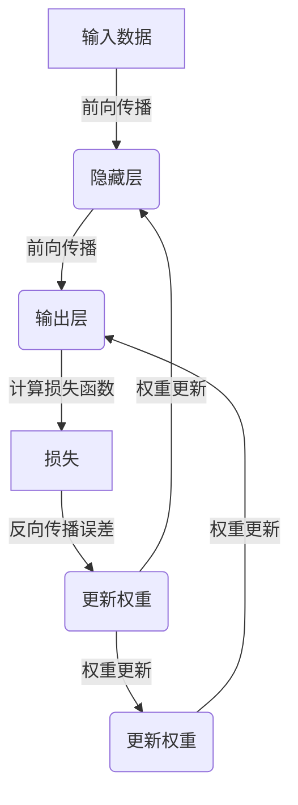

# 一切皆是映射：探索神经网络的基本概念

## 1. 背景介绍

### 1.1 问题的由来

在人工智能领域中,神经网络已成为解决各种复杂问题的强大工具。从图像识别到自然语言处理,再到游戏AI,神经网络无所不能。然而,对于许多开发人员和初学者来说,神经网络的内部工作原理仍然是一个黑箱。我们知道它们能够学习和推理,但究竟是如何做到的?本文旨在揭开神经网络的神秘面纱,探索其背后的基本概念和原理。

### 1.2 研究现状  

神经网络的研究可以追溯到20世纪40年代,当时它们被提出作为模拟生物神经系统的数学模型。多年来,研究人员不断改进和发展神经网络,使其能够处理越来越复杂的任务。随着计算能力的提高和大数据时代的到来,深度学习革命掀起了新的浪潮,推动神经网络在各个领域获得了前所未有的成功。

### 1.3 研究意义

理解神经网络的基本概念对于有效利用这一强大工具至关重要。通过揭示神经网络的本质,我们可以更好地设计、训练和优化网络,从而提高其性能和可解释性。此外,深入探讨神经网络的原理也有助于我们发现其局限性,并寻求创新的解决方案。

### 1.4 本文结构

本文将从神经网络的基本构建模块开始,逐步探索其核心概念和工作原理。我们将介绍神经元、激活函数、损失函数等基础知识,并解释它们是如何协同工作的。接下来,我们将深入探讨反向传播算法、优化技术和正则化方法等核心算法。此外,我们还将讨论神经网络的数学模型和公式推导过程。最后,我们将通过实际案例和代码示例,帮助读者更好地理解和应用神经网络。

## 2. 核心概念与联系

神经网络的核心概念可以概括为以下几个方面:

1. **神经元(Neuron)**: 神经网络的基本构建块,模拟生物神经元的工作原理。每个神经元接收来自其他神经元或输入数据的加权输入,并通过激活函数产生输出。

2. **激活函数(Activation Function)**: 决定神经元的输出方式,引入非线性,使网络能够学习复杂的映射关系。常见的激活函数包括Sigmoid、ReLU、Tanh等。

3. **网络结构(Network Architecture)**: 神经元按照特定的拓扑结构组织成层,形成输入层、隐藏层和输出层。不同的网络结构适用于不同的任务,如前馈神经网络、卷积神经网络和递归神经网络。

4. **权重和偏置(Weights and Biases)**: 每个神经元连接都有一个相关的权重,表示该连接的重要性。偏置则控制神经元的激活阈值。通过调整这些参数,网络可以学习到最优的映射关系。

5. **损失函数(Loss Function)**: 衡量网络预测与真实值之间的差异,用于指导网络参数的优化过程。常见的损失函数包括均方误差、交叉熵等。

6. **优化算法(Optimization Algorithm)**: 通过最小化损失函数,找到最优的网络参数。常用的优化算法有梯度下降、动量优化、Adam等。

7. **正则化(Regularization)**: 一系列技术,旨在降低过拟合风险,提高网络的泛化能力。常见的正则化方法包括L1/L2正则化、dropout、批量归一化等。

这些核心概念相互关联、相互作用,共同构建了神经网络的基础框架。理解它们及其联系,是掌握神经网络原理的关键所在。

## 3. 核心算法原理与具体操作步骤

### 3.1 算法原理概述

神经网络的核心算法是**反向传播(Backpropagation)算法**,它是一种有监督的学习算法,用于训练多层神经网络。反向传播算法的主要思想是:

1. 在前向传播过程中,输入数据经过网络层层传递,产生输出预测值。
2. 计算输出预测值与真实值之间的损失函数。
3. 通过反向传播,将损失函数的梯度自后向前逐层传递,更新每个神经元连接的权重和偏置。
4. 重复上述过程,直到网络收敛或达到停止条件。

通过不断调整网络参数以最小化损失函数,反向传播算法使神经网络能够逐步学习到最优的映射关系。

### 3.2 算法步骤详解

反向传播算法可以分为以下几个主要步骤:

1. **前向传播(Forward Propagation)**

   - 输入数据通过网络层层传递
   - 每个神经元根据加权输入和激活函数计算输出
   - 最终得到网络的输出预测值

2. **计算损失函数(Loss Computation)**

   - 使用预定义的损失函数(如均方误差或交叉熵)
   - 计算输出预测值与真实值之间的损失

3. **反向传播(Backpropagation)**

   - 从输出层开始,计算每个神经元的误差项(损失函数关于该神经元输出的偏导数)
   - 利用链式法则,将误差项逐层传递回前一层
   - 计算每个连接权重的梯度(误差项乘以前一层神经元的输出)

4. **权重更新(Weight Update)**

   - 使用优化算法(如梯度下降)根据权重梯度更新权重
   - 更新偏置项(视为来自常数输入1的权重)

5. **重复迭代(Iteration)**

   - 对训练数据集中的所有样本重复上述过程
   - 直到网络收敛或达到停止条件(如最大迭代次数或损失函数阈值)

通过不断迭代,神经网络可以逐步调整参数,从而学习到最优的映射关系,实现对输入数据的精确预测或分类。

### 3.3 算法优缺点

**优点**:

- 能够学习复杂的非线性映射关系
- 具有很强的泛化能力
- 可以处理高维数据
- 易于并行计算,利用GPU加速训练

**缺点**:

- 需要大量的训练数据
- 存在过拟合风险
- 训练过程计算量大,收敛慢
- 缺乏可解释性,难以理解内部决策过程
- 对异常数据敏感,鲁棒性较差

### 3.4 算法应用领域

反向传播算法及其变体已广泛应用于各个领域,包括但不限于:

- **计算机视觉**: 图像分类、目标检测、语义分割等
- **自然语言处理**: 机器翻译、文本生成、情感分析等
- **语音识别**: 自动语音识别、语音合成等
- **推荐系统**: 个性化推荐、内容过滤等
- **金融**: 金融风险管理、欺诈检测等
- **医疗健康**: 医学图像分析、疾病诊断等
- **游戏AI**: 下棋AI、对抗性AI等

随着算法的不断改进和计算能力的提高,神经网络的应用领域正在不断扩大。

## 4. 数学模型和公式详细讲解与举例说明

### 4.1 数学模型构建

为了更好地理解神经网络的工作原理,我们需要建立其数学模型。考虑一个单层神经网络,包含$m$个输入神经元和$n$个输出神经元。

对于第$j$个输出神经元,其输出$y_j$可以表示为:

$$y_j = \phi\left(\sum_{i=1}^{m}w_{ji}x_i + b_j\right)$$

其中:
- $x_i$是第$i$个输入神经元的值
- $w_{ji}$是从第$i$个输入神经元到第$j$个输出神经元的连接权重
- $b_j$是第$j$个输出神经元的偏置项
- $\phi$是激活函数,引入非线性

对于整个网络,我们可以用矩阵形式表示:

$$\mathbf{y} = \phi(\mathbf{W}^T\mathbf{x} + \mathbf{b})$$

其中$\mathbf{W}$是权重矩阵,$\mathbf{x}$是输入向量,$\mathbf{b}$是偏置向量,$\mathbf{y}$是输出向量。

### 4.2 公式推导过程

现在,我们来推导反向传播算法中权重更新的公式。假设使用均方误差作为损失函数:

$$E = \frac{1}{2}\sum_{j=1}^{n}(t_j - y_j)^2$$

其中$t_j$是第$j$个输出神经元的目标值。我们需要计算损失函数关于权重$w_{ji}$的偏导数:

$$\frac{\partial E}{\partial w_{ji}} = \frac{\partial E}{\partial y_j}\frac{\partial y_j}{\partial w_{ji}}$$

利用链式法则,我们可以得到:

$$\frac{\partial E}{\partial y_j} = y_j - t_j$$
$$\frac{\partial y_j}{\partial w_{ji}} = \phi'(\cdot)x_i$$

将它们代入原式,得到:

$$\frac{\partial E}{\partial w_{ji}} = (y_j - t_j)\phi'(\cdot)x_i$$

这就是权重$w_{ji}$的梯度。通过梯度下降法,我们可以更新权重:

$$w_{ji}^{(新)} = w_{ji}^{(旧)} - \eta\frac{\partial E}{\partial w_{ji}}$$

其中$\eta$是学习率,控制更新的步长。

通过类似的推导过程,我们可以得到偏置项$b_j$的更新公式:

$$b_j^{(新)} = b_j^{(旧)} - \eta\frac{\partial E}{\partial b_j}$$

这就是反向传播算法中权重和偏置更新的数学基础。

### 4.3 案例分析与讲解

为了更好地理解上述公式,让我们来看一个简单的二元线性回归问题。我们将使用一个单层神经网络,其中包含2个输入神经元(对应自变量$x_1$和$x_2$)和1个输出神经元(对应因变量$y$)。

假设我们有以下训练数据:

$$
\begin{array}{c|c}
x_1 & x_2 & y \\
\hline
0.1 & 0.2 & 0.3 \\
0.4 & 0.5 & 0.9 \\
0.6 & 0.7 & 1.3
\end{array}
$$

我们的目标是找到最佳的权重$w_1$、$w_2$和偏置$b$,使得输出$\hat{y}$尽可能接近真实值$y$。

1) 初始化权重和偏置,例如$w_1 = 0.1$、$w_2 = 0.2$、$b = 0.3$。
2) 对于第一个训练样本$(0.1, 0.2)$,前向传播计算输出:

   $$\hat{y} = w_1x_1 + w_2x_2 + b = 0.1 \times 0.1 + 0.2 \times 0.2 + 0.3 = 0.34$$

3) 计算均方误差损失函数:

   $$E = \frac{1}{2}(0.3 - 0.34)^2 = 0.0016$$

4) 反向传播计算权重和偏置的梯度:

   $$\frac{\partial E}{\partial w_1} = (0.34 - 0.3) \times 0.1 = 0.004$$
   $$\frac{\partial E}{\partial w_2} = (0.34 - 0.3) \times 0.2 = 0.008$$
   $$\frac{\partial E}{\partial b} = 0.34 - 0.3 = 0.04$$

5) 使用梯度下降法更新权重和偏置(假设学习率$\eta = 0.01$):

   $$w_1^{(新)} = 0.1 - 0.01 \times 0.004 = 0.0