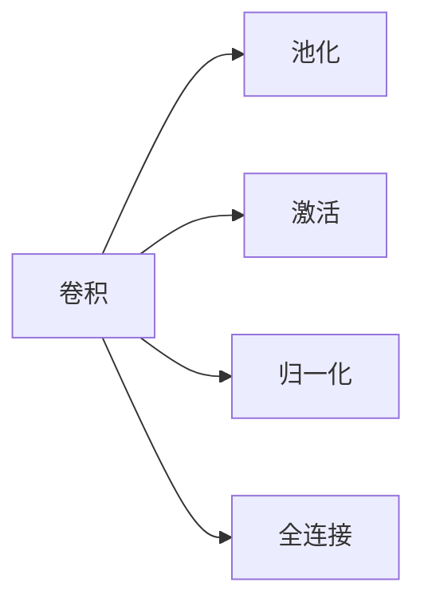

# 从零开始大模型开发与微调：PyTorch中的卷积函数实现详解

关键词：大模型、卷积神经网络、PyTorch、卷积函数、深度学习

## 1. 背景介绍

### 1.1 问题的由来

近年来，随着深度学习技术的飞速发展，大规模预训练语言模型（Pretrained Language Models, PLMs）在各种自然语言处理任务中取得了显著的性能提升。这些大模型通过在海量无标注语料上进行预训练，可以学习到丰富的语言知识和通用语义表示，再通过微调（Fine-tuning）的方式应用到下游任务，极大地提高了模型的泛化能力和性能表现。

然而，训练和部署大模型面临着诸多挑战，包括计算资源的限制、模型的可解释性不足、推理效率较低等问题。如何从零开始构建大模型并进行高效微调，成为了当前学术界和工业界的研究热点。

### 1.2 研究现状

目前，业界主流的大模型训练框架包括Google的TensorFlow、Facebook的PyTorch、微软的ONNX Runtime等。其中，PyTorch凭借其简洁灵活的接口设计、动态计算图机制以及强大的社区生态，受到了广大研究者和开发者的青睐。

在PyTorch生态中，卷积神经网络（Convolutional Neural Networks, CNNs）是图像识别、语音识别、自然语言处理等领域的核心模型架构。CNN通过卷积操作可以自动提取输入数据的局部特征，并通过池化操作实现特征降维和平移不变性。PyTorch内置了多种常用的卷积函数，如nn.Conv1d、nn.Conv2d、nn.Conv3d等，可以方便地构建各种CNN模型。

### 1.3 研究意义

深入理解PyTorch卷积函数的内部实现原理，对于从零开始构建大模型并进行微调具有重要意义：

1. 掌握卷积函数的数学原理和代码实现细节，有助于更好地理解CNN的工作机制，为设计创新的网络架构提供理论基础。

2. 了解卷积函数的性能瓶颈和优化技巧，可以针对性地改进模型训练和推理效率，降低计算资源消耗。

3. 熟悉PyTorch底层API的使用方法，可以更灵活地自定义各种卷积层，满足大模型开发中的特定需求。

4. 总结卷积函数在不同应用场景下的最佳实践，为大模型的微调和部署提供有益参考。

### 1.4 本文结构

本文将围绕PyTorch卷积函数的实现展开详细讨论，内容组织如下：

第2节介绍卷积操作的核心概念及其与其他操作的联系；第3节重点阐述卷积的数学原理和具体计算步骤；第4节给出卷积的数学模型并推导相关公式，辅以案例讲解说明；第5节通过PyTorch代码实例，演示如何从零开始实现各种卷积层；第6节总结卷积函数在计算机视觉、语音识别等领域的实际应用；第7节推荐卷积操作的学习资源、开发工具和相关文献；第8节对全文进行总结，并展望卷积技术的未来发展趋势和面临的挑战；第9节列举常见问题解答，为读者答疑解惑。

## 2. 核心概念与联系

卷积操作是CNN的核心组件，其本质是一种特殊的线性变换，通过滑动窗口对输入信号进行加权求和，得到输出特征图。卷积具有局部连接、权重共享、平移等变性等优良特性，使得CNN能够高效地提取数据的空间结构信息。

在数学上，离散卷积可以表示为：

$$ y[i] = \sum_{k=0}^{K-1} x[i-k] \cdot w[k] $$

其中，$x$为输入序列，$w$为卷积核，$y$为输出序列，$K$为卷积核大小。

除了标准卷积，CNN中还广泛采用了各种变体，如转置卷积（Transposed Convolution）、空洞卷积（Dilated Convolution）、可分离卷积（Separable Convolution）等，它们在网络设计中扮演着不同的角色：

- 转置卷积：也称反卷积（Deconvolution），常用于图像分割、生成对抗网络等任务中，用于恢复特征图尺寸。
- 空洞卷积：通过在卷积核中引入空洞（扩张率），可以在不增加参数量和计算量的情况下，扩大感受野，捕获更大范围的上下文信息。
- 可分离卷积：将标准卷积拆分为深度卷积和逐点卷积，可以大幅降低参数量和计算量，提高模型效率。

卷积与其他常见操作的联系如下图所示：

- 池化：对卷积得到的特征图进行下采样，减小数据维度，提高平移不变性。
- 激活：在卷积之后引入非线性变换，增强网络的表达能力。
- 归一化：对卷积的输入或输出进行归一化处理，加速收敛，提高泛化性能。
- 全连接：将卷积提取到的特征展平，送入全连接层进行分类、回归等任务。

## 3. 核心算法原理 & 具体操作步骤

### 3.1 算法原理概述

卷积的核心思想是：用一个卷积核（滤波器）在输入信号上滑动，通过加权求和的方式，提取局部特征。卷积核中的权重参数可以通过反向传播算法自动学习优化。

以二维卷积为例，假设输入特征图的尺寸为 $H \times W$，卷积核尺寸为 $K_h \times K_w$，卷积步长为 $S$，填充大小为 $P$，则卷积后得到的输出特征图尺寸为：

$$H_{out} = \lfloor \frac{H + 2P - K_h}{S} \rfloor + 1$$

$$W_{out} = \lfloor \frac{W + 2P - K_w}{S} \rfloor + 1$$

其中，$\lfloor \cdot \rfloor$ 表示向下取整。

### 3.2 算法步骤详解

以PyTorch的nn.Conv2d为例，其前向传播过程可分为以下步骤：

1. 根据卷积核尺寸、步长、填充等参数，确定输出特征图的形状。
2. 在输入特征图上，以卷积核大小为窗口，以指定步长滑动，提取局部区域。
3. 将卷积核与当前局部区域进行逐元素相乘，然后求和，得到输出特征图上的一个像素值。
4. 重复步骤2-3，直到遍历完整个输入特征图，得到完整的输出特征图。
5. 对输出特征图应用偏置项（如果有），并返回结果。

反向传播过程与前向类似，主要是根据链式法则，计算损失函数对卷积核权重和偏置项的梯度，并用优化算法（如SGD、Adam）更新参数。

### 3.3 算法优缺点

卷积算法的优点包括：
- 通过局部连接和权重共享，大大减少了网络参数数量，降低了过拟合风险。
- 通过卷积核的滑动，可以提取输入数据的平移不变特征。
- 多层卷积的堆叠，使网络能够逐层提取从低级到高级的特征层次。

卷积算法的缺点包括：  
- 卷积操作计算量大，对硬件性能要求较高。
- 卷积核大小、步长等超参数需要精心设计和调优。
- 标准卷积无法很好地处理不规则的数据结构，如图、树等。

### 3.4 算法应用领域

卷积广泛应用于以下领域：

- 计算机视觉：图像分类、目标检测、语义分割、行为识别等。
- 语音识别：声学模型、语言模型、说话人识别等。  
- 自然语言处理：文本分类、情感分析、机器翻译、命名实体识别等。
- 生物信息学：蛋白质结构预测、药物发现等。

## 4. 数学模型和公式 & 详细讲解 & 举例说明

### 4.1 数学模型构建

考虑一个二维卷积的数学模型，输入特征图 $X$ 的尺寸为 $H \times W \times C_{in}$，卷积核 $W$ 的尺寸为 $K_h \times K_w \times C_{in} \times C_{out}$，其中 $C_{in}$ 和 $C_{out}$ 分别为输入和输出的通道数。

令卷积的步长为 $(S_h, S_w)$，填充大小为 $(P_h, P_w)$，则输出特征图 $Y$ 的尺寸为 $H_{out} \times W_{out} \times C_{out}$，其中：

$$H_{out} = \lfloor \frac{H + 2P_h - K_h}{S_h} \rfloor + 1$$

$$W_{out} = \lfloor \frac{W + 2P_w - K_w}{S_w} \rfloor + 1$$

输出特征图中每个像素值 $Y[i,j,k]$ 的计算公式为：

$$Y[i,j,k] = \sum_{c=0}^{C_{in}-1} \sum_{u=0}^{K_h-1} \sum_{v=0}^{K_w-1} X[i \cdot S_h + u, j \cdot S_w + v, c] \cdot W[u,v,c,k] + b[k]$$

其中，$b \in \mathbb{R}^{C_{out}}$ 为偏置项。

### 4.2 公式推导过程

对于卷积核的每个元素 $W[u,v,c,k]$，我们可以将其展开为：

$$\begin{aligned}
\frac{\partial L}{\partial W[u,v,c,k]} &= \sum_{i=0}^{H_{out}-1} \sum_{j=0}^{W_{out}-1} \frac{\partial L}{\partial Y[i,j,k]} \cdot \frac{\partial Y[i,j,k]}{\partial W[u,v,c,k]} \\
&= \sum_{i=0}^{H_{out}-1} \sum_{j=0}^{W_{out}-1} \frac{\partial L}{\partial Y[i,j,k]} \cdot X[i \cdot S_h + u, j \cdot S_w + v, c]
\end{aligned}$$

其中，$L$ 为损失函数。可见，卷积核梯度的计算可以转化为输出梯度与输入特征图的卷积操作。

类似地，偏置项的梯度为：

$$\frac{\partial L}{\partial b[k]} = \sum_{i=0}^{H_{out}-1} \sum_{j=0}^{W_{out}-1} \frac{\partial L}{\partial Y[i,j,k]}$$

即输出梯度在空间维度上求和。

### 4.3 案例分析与讲解

考虑一个简单的例子，输入特征图 $X$ 的尺寸为 $4 \times 4 \times 1$，卷积核 $W$ 的尺寸为 $3 \times 3 \times 1 \times 2$，步长为1，不使用填充。

则输出特征图 $Y$ 的尺寸为：

$$H_{out} = \lfloor \frac{4 + 2 \times 0 - 3}{1} \rfloor + 1 = 2$$

$$W_{out} = \lfloor \frac{4 + 2 \times 0 - 3}{1} \rfloor + 1 = 2$$

输出通道数为2，因此 $Y$ 的形状为 $2 \times 2 \times 2$。

假设输入特征图和卷积核分别为：

$$X = \begin{bmatrix}
1 & 2 & 3 & 4 \\
5 & 6 & 7 & 8 \\
9 & 10 & 11 & 12 \\
13 & 14 & 15 & 16
\end{bmatrix}$$

$$W[:,:,0,0] = \begin{bmatrix}
1 & 2 & 3 \\
4 & 5 & 6 \\
7 & 8 & 9
\end{bmatrix}, \quad W[:,:,0,1] = \begin{bmatrix}
9 & 8 & 7 \\
6 & 5 & 4 \\
3 & 2 & 1
\end{bmatrix}$$

偏置项为