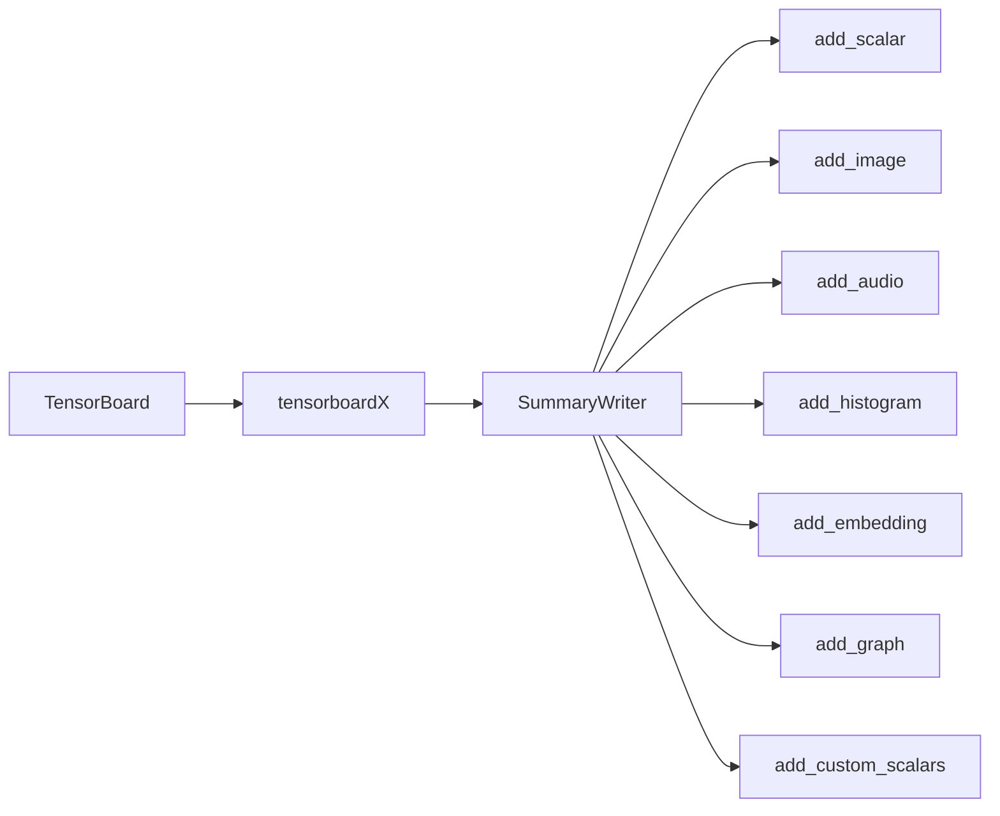

# 从零开始大模型开发与微调：可视化组件tensorboardX的简介与安装

关键词：大模型、微调、可视化、tensorboardX、Pytorch、深度学习

## 1. 背景介绍

### 1.1 问题的由来

随着深度学习的快速发展，越来越多的研究者和工程师开始尝试开发和微调大规模的预训练语言模型。然而，在训练和优化这些大模型的过程中，我们经常需要实时监控各种指标，以便及时发现问题并进行调整。传统的命令行输出方式已经无法满足这种可视化的需求。因此，一个高效、直观的可视化工具变得尤为重要。

### 1.2 研究现状

目前，在深度学习领域，TensorFlow自带的TensorBoard已经成为了可视化的标准工具。它提供了丰富的功能，如标量、图像、音频、直方图、嵌入向量可视化等。然而，对于使用PyTorch框架的研究者来说，TensorBoard并不是一个理想的选择，因为它需要将PyTorch的数据转换成TensorFlow的格式，这增加了额外的开销和复杂性。

为了解决这个问题，Facebook的研究者开发了tensorboardX，它是TensorBoard的一个Python库，可以直接在PyTorch中使用，无需任何转换。tensorboardX提供了与TensorBoard类似的功能，同时还支持一些TensorBoard不支持的特性，如动态图和自定义插件。

### 1.3 研究意义

掌握tensorboardX的使用，对于从事大模型开发与微调的研究者和工程师来说至关重要。它可以帮助我们：

1. 实时监控训练过程中的各种指标，如损失函数、准确率、学习率等，以便及时发现问题并进行调整。
2. 可视化模型的结构和参数，以便更好地理解模型的工作原理。
3. 比较不同超参数设置下的模型性能，以便选择最优的模型。
4. 展示训练过程中的样本数据，以便直观地评估模型的效果。

因此，tensorboardX已经成为大模型开发与微调过程中不可或缺的工具。

### 1.4 本文结构

本文将从以下几个方面介绍tensorboardX的使用：

1. tensorboardX的核心概念与组件
2. tensorboardX的安装与配置
3. tensorboardX的基本用法，包括标量、图像、音频、直方图、嵌入向量可视化等
4. tensorboardX的高级用法，包括动态图、自定义插件等
5. 一个完整的案例，演示如何在PyTorch中使用tensorboardX进行大模型微调
6. tensorboardX的常见问题与解答

## 2. 核心概念与联系

在深入介绍tensorboardX之前，我们需要先了解几个核心概念：

- **TensorBoard**：TensorFlow自带的可视化工具，提供了丰富的功能，如标量、图像、音频、直方图、嵌入向量可视化等。
- **SummaryWriter**：tensorboardX的核心类，用于创建日志文件并写入各种数据。
- **add_scalar**：添加标量数据，如损失函数、准确率、学习率等。
- **add_image**：添加图像数据，如输入样本、特征图、生成图像等。
- **add_audio**：添加音频数据，如语音、音乐等。
- **add_histogram**：添加直方图数据，如权重、梯度等。
- **add_embedding**：添加嵌入向量数据，如词向量、图像特征等。
- **add_graph**：添加计算图，即模型的结构。
- **add_custom_scalars**：添加自定义标量数据。

这些概念之间的联系如下图所示：



## 3. 核心算法原理 & 具体操作步骤

### 3.1 算法原理概述

tensorboardX的核心算法是将各种数据（如标量、图像、音频等）写入日志文件，然后通过TensorBoard进行可视化。具体来说，它使用了Protocol Buffers格式来序列化数据，并使用事件文件（event file）来存储这些数据。每个事件文件包含了一系列的事件（event），每个事件又包含了一个或多个摘要（summary）。摘要是一个键值对，其中键是一个字符串，表示数据的名称，值是一个序列化的Protocol Buffers消息，表示实际的数据。

### 3.2 算法步骤详解

使用tensorboardX的一般步骤如下：

1. 创建一个SummaryWriter对象，指定日志文件的保存路径。
2. 在训练循环中，使用SummaryWriter的各种方法（如add_scalar、add_image等）记录数据。
3. 在训练完成后，关闭SummaryWriter对象。
4. 在命令行中启动TensorBoard，指定日志文件的路径，然后在浏览器中查看可视化结果。

下面是一个简单的例子，演示了如何使用tensorboardX记录标量数据：

```python
from tensorboardX import SummaryWriter

# 创建SummaryWriter对象
writer = SummaryWriter('runs/exp1')

# 模拟训练过程
for i in range(100):
    loss = 1.0 / (i + 1)
    accuracy = i / 100.0
    
    # 记录标量数据
    writer.add_scalar('Loss', loss, i)
    writer.add_scalar('Accuracy', accuracy, i)

# 关闭SummaryWriter对象    
writer.close()
```

在上面的例子中，我们首先创建了一个SummaryWriter对象，指定日志文件的保存路径为'runs/exp1'。然后，在模拟的训练过程中，我们使用add_scalar方法记录了损失函数和准确率这两个标量数据。最后，我们关闭了SummaryWriter对象。

### 3.3 算法优缺点

tensorboardX的主要优点包括：

1. 与PyTorch无缝集成，无需将数据转换成TensorFlow格式。
2. 支持动态图和自定义插件，功能更加灵活。
3. 提供了与TensorBoard类似的丰富功能，可以满足大多数可视化需求。

tensorboardX的主要缺点包括：

1. 与TensorBoard相比，社区支持度较低，文档和示例相对较少。
2. 某些高级功能（如图像分割可视化）尚不支持。

### 3.4 算法应用领域

tensorboardX主要应用于深度学习领域，特别是使用PyTorch进行研究和开发的场景。它可以用于：

1. 监控训练过程中的各种指标，如损失函数、准确率、学习率等。
2. 可视化模型的结构和参数，以便更好地理解模型的工作原理。
3. 比较不同超参数设置下的模型性能，以便选择最优的模型。
4. 展示训练过程中的样本数据，以便直观地评估模型的效果。

## 4. 数学模型和公式 & 详细讲解 & 举例说明

### 4.1 数学模型构建

tensorboardX本身并不涉及复杂的数学模型，它主要是一个可视化工具。但是，在使用tensorboardX进行深度学习模型的可视化时，我们经常需要用到一些基本的数学概念，如标量、向量、矩阵、张量等。

- 标量（scalar）：一个单独的数，如损失函数的值。
- 向量（vector）：一组有序的数，如图像的特征向量。
- 矩阵（matrix）：一个二维的数组，如全连接层的权重矩阵。
- 张量（tensor）：一个多维的数组，如卷积层的输入和输出。

### 4.2 公式推导过程

在深度学习中，我们经常使用一些基本的数学公式，如线性变换、激活函数、损失函数等。下面是一些常见的公式：

- 线性变换：$y = Wx + b$，其中$W$是权重矩阵，$x$是输入向量，$b$是偏置向量。
- Sigmoid激活函数：$\sigma(x) = \frac{1}{1 + e^{-x}}$。
- ReLU激活函数：$f(x) = \max(0, x)$。
- 交叉熵损失函数：$L = -\sum_{i=1}^{n} y_i \log(\hat{y}_i)$，其中$y_i$是真实标签，$\hat{y}_i$是预测标签。

### 4.3 案例分析与讲解

下面是一个使用tensorboardX可视化神经网络的案例：

```python
import torch
import torch.nn as nn
import torch.nn.functional as F
from tensorboardX import SummaryWriter

# 定义一个简单的神经网络
class Net(nn.Module):
    def __init__(self):
        super(Net, self).__init__()
        self.conv1 = nn.Conv2d(1, 6, 5)
        self.conv2 = nn.Conv2d(6, 16, 5)
        self.fc1 = nn.Linear(16 * 5 * 5, 120)
        self.fc2 = nn.Linear(120, 84)
        self.fc3 = nn.Linear(84, 10)

    def forward(self, x):
        x = F.max_pool2d(F.relu(self.conv1(x)), (2, 2))
        x = F.max_pool2d(F.relu(self.conv2(x)), 2)
        x = x.view(-1, self.num_flat_features(x))
        x = F.relu(self.fc1(x))
        x = F.relu(self.fc2(x))
        x = self.fc3(x)
        return x

    def num_flat_features(self, x):
        size = x.size()[1:]
        num_features = 1
        for s in size:
            num_features *= s
        return num_features

# 创建SummaryWriter对象
writer = SummaryWriter('runs/mnist_cnn')

# 创建一个神经网络实例
net = Net()

# 将模型写入日志文件
writer.add_graph(net, torch.randn(1, 1, 32, 32))

writer.close()
```

在上面的例子中，我们首先定义了一个简单的卷积神经网络Net。然后，我们创建了一个SummaryWriter对象，指定日志文件的保存路径为'runs/mnist_cnn'。接着，我们使用add_graph方法将模型的结构写入日志文件。最后，我们关闭了SummaryWriter对象。

在TensorBoard中，我们可以看到这个神经网络的结构如下图所示：


### 4.4 常见问题解答

**问题1：如何在PyTorch中使用tensorboardX？**

答：使用tensorboardX非常简单，只需要以下几个步骤：

1. 安装tensorboardX：`pip install tensorboardX`。
2. 在代码中导入SummaryWriter：`from tensorboardX import SummaryWriter`。
3. 创建一个SummaryWriter对象，指定日志文件的保存路径：`writer = SummaryWriter('runs/exp1')`。
4. 在训练循环中，使用SummaryWriter的各种方法（如add_scalar、add_image等）记录数据。
5. 在训练完成后，关闭SummaryWriter对象：`writer.close()`。
6. 在命令行中启动TensorBoard，指定日志文件的路径：`tensorboard --logdir=runs`，然后在浏览器中访问`http://localhost:6006`查看可视化结果。

**问题2：tensorboardX支持哪些类型的数据可视化？**

答：tensorboardX支持以下几种类型的数据可视化：

- 标量（scalar）：使用`add_scalar`方法记录单个数值，如损失函数、准确率等。
- 图像（image）：使用`add_image`方法记录图像数据，如输入样本、特征图等。
- 音频（audio）：使用`add_audio`方法记录音频数据，如语音、音乐等。
- 直方图（histogram）：使用`add_histogram`方法记录数值分布，如权重、梯度等。
- 嵌入向量（embedding）：使用`add_embedding`方法记录高维向量，如词向量、图像特征等。
- 计算图（graph）：使用`add_graph`方法记录模型的结构。
- 自定义标量（custom scalars）：使用`add_custom_scalars`方法记录自定义的标量数据。

**问题3：tensorboardX和TensorBoard有什么区别？**

答：tensorboardX是TensorBoard的一个Python库，它们的主要区别包括：

1. tensorboardX是专门为PyTorch设计的，而TensorBoard是TensorFlow自带的可视化工具。
2. tensorboardX支持动态图