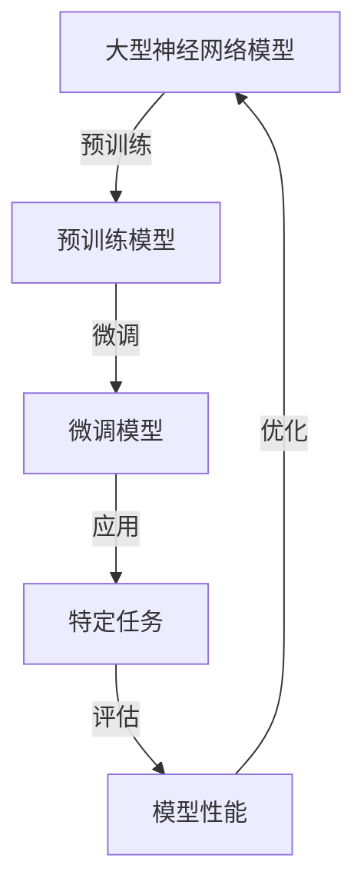

# 从零开始大模型开发与微调：实战MNIST手写体识别

## 1. 背景介绍

### 1.1 问题的由来

随着人工智能和深度学习技术的飞速发展，大型神经网络模型在各个领域展现出了强大的能力。然而，训练这些大型模型需要耗费大量的计算资源和时间。为了解决这一问题，研究人员提出了模型微调(Model Fine-tuning)的方法。

模型微调是指在一个已经在大型数据集上预训练的模型基础上,利用特定任务的数据进行进一步训练,从而使模型在该任务上表现出色。这种方法可以大大减少训练时间和计算资源的需求,同时保持模型在通用任务上的强大性能。

### 1.2 研究现状

目前,模型微调已经在自然语言处理、计算机视觉等多个领域取得了巨大成功。例如,在自然语言处理领域,基于大型语言模型(如BERT、GPT等)进行微调,可以显著提高模型在下游任务(如文本分类、机器阅读理解等)上的性能。在计算机视觉领域,基于大型视觉模型(如ResNet、VGG等)进行微调,也可以获得出色的结果。

然而,对于一些特定的任务,如手写体识别,现有的模型微调方法可能还不够完美。手写体识别任务具有一些独特的挑战,如字符形状的多样性、噪声和扭曲等。因此,需要探索更加有效的模型微调策略,以提高模型在这类任务上的性能。

### 1.3 研究意义

本文将探讨如何从零开始开发一个大型神经网络模型,并针对MNIST手写体识别任务进行微调。通过这个案例研究,我们可以深入理解模型微调的原理和实践,为将来在其他领域应用模型微调奠定基础。

具体来说,本文将涵盖以下几个方面:

1. 大型神经网络模型的开发和训练
2. 模型微调的理论基础和方法
3. 针对MNIST手写体识别任务的模型微调实践
4. 模型性能评估和优化策略
5. 模型微调在其他领域的应用前景

通过本文的研究,我们希望能够为读者提供一个完整的模型开发和微调流程,并分享相关的经验和教训。同时,我们也希望能够激发读者对这一领域的进一步探索和创新。

### 1.4 本文结构

本文的结构安排如下:

1. 背景介绍
2. 核心概念与联系
3. 核心算法原理与具体操作步骤
4. 数学模型和公式详细讲解与举例说明
5. 项目实践:代码实例和详细解释说明
6. 实际应用场景
7. 工具和资源推荐
8. 总结:未来发展趋势与挑战
9. 附录:常见问题与解答

## 2. 核心概念与联系

在深入探讨模型开发和微调之前,我们需要先了解一些核心概念及它们之间的联系。

1. **深度神经网络(Deep Neural Network, DNN)**:深度神经网络是一种由多层人工神经元组成的机器学习模型,能够从原始输入数据中自动学习特征表示。常见的DNN架构包括卷积神经网络(CNN)、循环神经网络(RNN)和Transformer等。

2. **模型预训练(Model Pre-training)**:模型预训练是指在大型通用数据集上训练一个DNN模型,使其学习到一般性的特征表示。预训练模型可以作为下游任务的初始化模型,从而加速训练过程并提高性能。

3. **模型微调(Model Fine-tuning)**:模型微调是指在一个已经预训练的模型基础上,利用特定任务的数据进行进一步训练,使模型适应该任务的特征分布。微调过程通常只需要更新模型的部分层参数,从而节省计算资源。

4. **迁移学习(Transfer Learning)**:迁移学习是一种机器学习范式,旨在利用在一个领域或任务中学习到的知识,来帮助解决另一个相关但不同的领域或任务。模型微调可以被视为迁移学习的一种具体形式。

5. **MNIST数据集**:MNIST是一个广为人知的手写数字图像数据集,常被用于评估机器学习模型在图像分类任务上的性能。它包含60,000个训练样本和10,000个测试样本,每个样本是一个28x28像素的手写数字图像,标记为0到9之间的数字。

这些核心概念相互关联,构成了本文研究的理论基础。下一节,我们将详细介绍模型开发和微调的核心算法原理。

## 3. 核心算法原理与具体操作步骤

### 3.1 算法原理概述

模型微调的核心思想是利用迁移学习的方法,将一个在大型通用数据集上预训练的模型,应用到一个特定的下游任务中。具体来说,包括以下几个关键步骤:

1. **预训练阶段**:在大型通用数据集(如ImageNet、Wikipedia等)上训练一个深度神经网络模型,使其学习到通用的特征表示。这一阶段通常需要耗费大量的计算资源和时间。

2. **模型初始化**:将预训练模型的参数作为特定任务模型的初始参数。

3. **数据准备**:收集并准备好特定任务的训练数据和测试数据。

4. **微调训练**:在特定任务的训练数据上,对预训练模型进行进一步的训练,更新部分层的参数,使模型适应该任务的特征分布。在这一阶段,通常会冻结预训练模型的部分层参数,只更新后面几层的参数。

5. **模型评估**:在特定任务的测试数据上,评估微调后模型的性能表现。

6. **模型优化**:根据评估结果,调整微调策略和超参数,进一步优化模型性能。

通过这种方式,模型微调可以充分利用预训练模型在大型数据集上学习到的通用特征表示,从而加速特定任务的训练过程,并提高模型的泛化能力。

### 3.2 算法步骤详解

接下来,我们将详细介绍模型微调算法的具体操作步骤。

#### 步骤1:预训练模型

首先,我们需要获得一个在大型通用数据集上预训练的深度神经网络模型。这一步骤通常需要耗费大量的计算资源和时间。幸运的是,目前已经有许多优秀的预训练模型可供使用,如计算机视觉领域的ResNet、VGG等,自然语言处理领域的BERT、GPT等。

在本文的案例中,我们将使用一个在ImageNet数据集上预训练的ResNet-50模型。ImageNet是一个大型的图像分类数据集,包含超过100万张图像,分为1000个类别。ResNet-50是一种残差神经网络架构,具有50层深度,在ImageNet数据集上表现出色。

#### 步骤2:模型初始化

接下来,我们需要将预训练模型的参数作为特定任务模型的初始参数。在本文的案例中,我们将创建一个新的神经网络模型,其前几层参数初始化为ResNet-50预训练模型的参数,后几层参数则随机初始化。

这一步骤的目的是利用预训练模型在ImageNet数据集上学习到的通用特征表示,作为特定任务模型的起点。通过这种方式,我们可以加速训练过程,并提高模型的泛化能力。

#### 步骤3:数据准备

在进行模型微调之前,我们需要准备好特定任务的训练数据和测试数据。在本文的案例中,我们将使用MNIST手写数字识别数据集。

MNIST数据集包含60,000个训练样本和10,000个测试样本,每个样本是一个28x28像素的手写数字图像,标记为0到9之间的数字。我们需要对这些图像数据进行适当的预处理,如归一化、数据增强等,以提高模型的性能。

#### 步骤4:微调训练

在数据准备就绪后,我们可以开始对模型进行微调训练。具体来说,我们将冻结预训练模型的前几层参数,只更新后面几层的参数。

这一步骤的目的是保留预训练模型在ImageNet数据集上学习到的通用特征表示,同时使模型适应MNIST手写数字识别任务的特征分布。通过这种方式,我们可以充分利用预训练模型的优势,同时减少需要更新的参数数量,从而加速训练过程。

在训练过程中,我们需要设置合适的超参数,如学习率、批大小、正则化强度等,以获得最佳的模型性能。此外,我们还可以尝试不同的微调策略,如逐层微调、discriminative fine-tuning等,以进一步提高模型性能。

#### 步骤5:模型评估

微调训练完成后,我们需要在MNIST测试数据集上评估模型的性能表现。常用的评估指标包括准确率(Accuracy)、精确率(Precision)、召回率(Recall)、F1分数等。

通过评估结果,我们可以判断模型是否达到了预期的性能水平,并与其他模型进行比较。如果结果不理想,我们可以调整微调策略和超参数,重复步骤4和步骤5,直到获得满意的结果。

#### 步骤6:模型优化

根据模型评估的结果,我们可以采取一些优化策略,以进一步提高模型的性能。常见的优化策略包括:

1. **超参数调整**:调整学习率、批大小、正则化强度等超参数,以获得更好的收敛性和泛化能力。

2. **数据增强**:通过一些数据增强技术,如旋转、平移、缩放等,生成更多的训练数据,提高模型的鲁棒性。

3. **模型结构调整**:根据任务的特点,调整模型的结构和层数,以获得更好的特征表示能力。

4. **损失函数优化**:探索不同的损失函数,如交叉熵损失、焦点损失等,以更好地拟合任务的目标。

5. **模型集成**:通过集成多个模型的预测结果,提高模型的泛化能力和鲁棒性。

通过不断地优化和迭代,我们可以最终获得一个在MNIST手写数字识别任务上表现出色的模型。

### 3.3 算法优缺点

模型微调算法具有以下优点:

1. **计算资源节省**:相比从头开始训练一个大型模型,微调只需要更新部分层的参数,从而大大节省了计算资源和时间。

2. **泛化能力增强**:通过利用预训练模型在大型数据集上学习到的通用特征表示,微调后的模型往往具有更好的泛化能力。

3. **快速部署**:由于只需要更新部分层的参数,微调后的模型可以快速部署到实际应用中。

4. **任务迁移**:微调算法可以方便地应用于不同的下游任务,实现知识迁移和模型复用。

同时,模型微调算法也存在一些缺点和限制:

1. **依赖预训练模型**:微调算法的性能在很大程度上依赖于预训练模型的质量。如果预训练模型不够优秀,微调后的模型性能也可能受到限制。

2. **任务差异影响**:如果下游任务与预训练任务存在较大差异,预训练模型的特征表示可能不太适用,从而影响微调效果。

3. **数据需求**:虽然相比从头训练节省了计算资源,但微调仍然需要一定数量的高质量的下游任务数据。

4. **超参数调整**:微调过程中需要调整多个超参数,如学习率、正则化强度等,这增加了模型优化的复杂性。

5. **局部最优陷阱**:由于微调是在预训练模型的基础上进行的,因此可能会陷入局部最优解,无法达到全局最优性能。

总的来说,模型微调算法是一种高效的