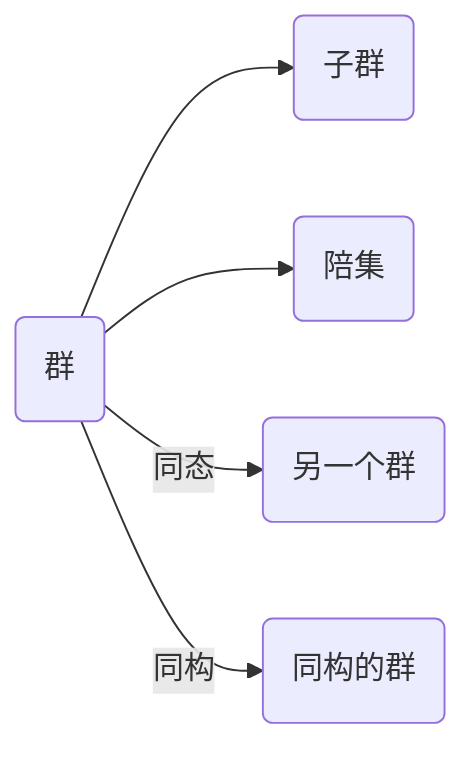

# 代数群引论：第一章 群概形的初等性质

关键词：群、群概形、同态、同构、陪集、Lagrange定理

## 1. 背景介绍 
### 1.1 问题的由来
群论作为现代数学的重要分支,在数学的许多领域都有广泛应用。它研究对象的对称性和不变性质,是一个高度抽象的理论。群论的起源可以追溯到18世纪末,欧拉、拉格朗日等数学家在研究多项式方程求解问题时,开始关注根式的置换变换性质。19世纪,伽罗瓦、柯西、阿贝尔等人进一步发展了置换群理论。随后,李群、矩阵群等各种具体的群相继出现。直到19世纪末,德国数学家韦伯斯特拉斯提出抽象群的概念,标志着抽象群论的形成。

### 1.2 研究现状
经过一个多世纪的发展,群论已经成为一个内容丰富、结构精深的数学分支。它不仅在数学内部得到广泛应用,而且在物理学、化学、生物学、计算机科学等领域也有重要应用。目前,群论研究主要集中在有限群、李群、表示论等方面。一些前沿课题如散在单群分类、亏格线性群、量子群等,仍是国际数学界关注的热点。

### 1.3 研究意义 
群论思想对现代数学产生了深远影响。群、环、域、模等代数系统都吸收了群论的思想。同时,群论为数学其他分支提供了重要工具。例如,黎曼几何中的对称空间可用李群刻画,量子力学中的对称性可用表示群描述。此外,群论在密码学、编码理论、组合设计等计算机科学领域也有重要应用。因此,深入研究群论具有重要的理论意义和实践价值。

### 1.4 本文结构
本文是群论入门教程系列的第一篇,主要介绍群、子群、陪集、同态、同构等基本概念和初等性质。全文分为9个章节：第1节介绍研究背景,第2节给出群的定义和例子,第3节讨论群同态和同构,第4节引入陪集和Lagrange定理,第5节给出相关概念的代码实现,第6节列举群论的几个经典应用,第7节推荐学习资源,第8节总结全文,第9节列出常见问题解答。

## 2. 核心概念与联系
群是一种具有二元运算的代数结构,它由一个非空集合G和一个二元运算 · 组成,满足以下性质:
1) 封闭性:对任意a,b∈G,有a·b∈G
2) 结合律:对任意a,b,c∈G,有(a·b)·c=a·(b·c)  
3) 单位元:存在e∈G,对任意a∈G,有e·a=a·e=a
4) 逆元:对任意a∈G,存在b∈G使得a·b=b·a=e

如果(G,·)还满足交换律,即对任意a,b∈G有a·b=b·a,则称(G,·)为交换群或阿贝尔群。

设(G,·)为一个群,G的一个非空子集H称为G的子群,如果:
1) 对任意a,b∈H,有a·b∈H
2) 对任意a∈H,a在G中的逆元a^(-1)也属于H

设G为一个群,a∈G,定义a的陪集为aH={ah:h∈H}。可以证明H为G的子群当且仅当对任意a∈G有aH=Ha。这时G可以被其子群H的所有陪集划分为若干个等价类,每个陪集都有|H|个元素。因此得到Lagrange定理:有限群的子群的阶必整除群的阶。

设(G,·),(G',*)为两个群,映射f:G→G'称为群同态,如果对任意a,b∈G,有f(a·b)=f(a)*f(b)。如果f还是双射,则称f为G到G'的同构,记为G≌G'。群的同构是一种等价关系。

群、子群、陪集、同态、同构之间的关系如下图所示:



## 3. 核心算法原理 & 具体操作步骤
### 3.1 算法原理概述
群论中的许多问题可以通过构造合适的群同态简化求解。例如求一个群的子群,可以先找一个已知结构的群,再构造到它的满同态,原象就是要求的子群。求群的阶、元素阶、中心等,也可以通过同态映射到某个熟知的群上进行。同构测试是判断两个群是否本质相同的重要算法,目前最快的同构测试算法是Babai和Luks在1983年提出的,复杂度为 $exp(O(√(nlogn)))$。

### 3.2 算法步骤详解
下面以求群的中心为例,展示利用同态的一般步骤:
输入:群 $(G,·)$
输出:$Z(G)={a∈G:∀g∈G,ag=ga}$
步骤:
1) 令 $G'=G/Z(G)$,定义映射 $f:G→G'$,其中 $f(a)=aZ(G)$
2) 证明 $f$ 是满同态
3) 因为 $Z(G')={1}$,所以 $Z(G)=kerf={a∈G:f(a)=1}$
4) 枚举 $G$ 的元素 $a$,判断 $f(a)$ 是否等于1,等于1的元素就属于 $Z(G)$

### 3.3 算法优缺点
利用同态求解群论问题的优点是:
1) 把原问题转化为熟知群上的问题,便于求解
2) 核、像等概念刻画了群之间的关系,揭示了问题的本质
3) 自然同态可以把群看成子群和商群的乘积,实现分而治之

缺点是:
1) 有时很难找到合适的同态映射
2) 商群结构比较复杂,不容易计算
3) 像集性质难以刻画,构造满同态也不容易

### 3.4 算法应用领域
同态思想广泛应用于各种代数结构的研究,如环论、域论、模论等。在编码理论中,将码字映射到某个群胞腔上,可以实现快速译码。在计算机视觉中,利用旋转群、仿射群等描述图像的对称性,可以提取图像特征。在量子计算中,量子门操作可以表示为幺正群上的变换。群论算法在组合优化、药物设计、密码分析等领域也有重要应用。

## 4. 数学模型和公式 & 详细讲解 & 举例说明
### 4.1 数学模型构建
群、子群的概念可以用集合和映射的语言严格定义如下:

设 $G$ 为一个非空集合,若映射 $·:G×G→G$ 满足:
1) $∀a,b,c∈G,(a·b)·c=a·(b·c)$ (结合律)
2) $∃e∈G,∀a∈G,e·a=a·e=a$ (单位元) 
3) $∀a∈G,∃b∈G,a·b=b·a=e$ (逆元)
则称代数系统 $(G,·)$ 为一个群。

设 $(G,·)$ 为一个群,若 $H⊆G$ 满足:
1) $e∈H$
2) $∀a,b∈H,a·b∈H$
3) $∀a∈H,a^{-1}∈H$
则称 $H$ 为 $G$ 的一个子群,记为 $H≤G$。

### 4.2 公式推导过程
下面我们来推导Lagrange定理。
引理:设 $H≤G$,对任意 $a∈G$,陪集 $aH$ 的元素个数等于 $H$ 的元素个数,即 $|aH|=|H|$。
证明:构造映射 $f:H→aH,f(h)=ah$。
1) $f$ 满射:对任意 $ah∈aH$,存在 $h∈H$ 使 $f(h)=ah$
2) $f$ 单射:若 $ah=ah'$,则 $a^{-1}ah=a^{-1}ah'$,故 $h=h'$

定理:设 $G$ 为有限群,则 $G$ 的任意子群 $H$ 的阶整除 $G$ 的阶,即 $|H|∣|G|$。
证明:由上述引理,所有陪集 $aH$ 都有 $|H|$ 个元素。而 $G$ 可以被 $H$ 的所有陪集划分,且每个元素都属于唯一的一个陪集。所以陪集的个数等于 $|G|/|H|$,从而 $|H|∣|G|$。

### 4.3 案例分析与讲解
1) 考虑置换群 $S_3$,它有6个元素:{1,(12),(13),(23),(123),(132)},都是集合{1,2,3}到自身的双射。其中 $A_3={(1),(123),(132)}$ 是 $S_3$ 的子群。可以验证 $|A_3|=3$,而 $|S_3|=6$,符合Lagrange定理。

2) 对任意正整数 $n≥3$,由 $n$ 个元素生成的循环群 $C_n$ 的子群都是 $C_d$,其中 $d$ 是 $n$ 的因数。例如 $C_6={0,1,2,3,4,5}$ 有子群 $\{0\}≌C_1,\{0,3\}≌C_2,\{0,2,4\}≌C_3$ 和 $C_6$ 自身。

3) 四元数群 $Q_8={±1,±i,±j,±k}$ 是一个非交换群,它有子群 $\{±1\},\{±1,±i\},\{±1,±j\},\{±1,±k\}$ 和 $Q_8$ 自身,阶分别为1,4,4,4,8。而 $\{±1,±i,±j\}$ 不是 $Q_8$ 的子群。

### 4.4 常见问题解答
问:判断一个有限集合是否构成群的一般方法是什么?
答:验证群的三条性质:结合律、单位元、逆元。可以列出运算表,查看是否满足封闭性、结合律;检查是否有单位元;对每个元素,查找是否存在逆元。例如集合 $\{1,-1\}$ 在普通乘法下构成一个群,而在加法下不构成群。

问:对于无限集合,如何判断它是否构成一个群?
答:对于无限集合,需要用代数性质来验证。一般步骤是:
1) 证明运算满足封闭性,对任意两个元素,它们的运算结果仍在集合中
2) 证明结合律,往往利用运算的定义进行演算
3) 找到单位元,证明它与任意元素的运算结果就是该元素本身
4) 证明每个元素都存在逆元,给出逆元的构造方法,并验证逆元的性质

例如实数集 $R$ 在加法运算下构成一个群,但在乘法下不构成群。

## 5. 项目实践：代码实例和详细解释说明
### 5.1 开发环境搭建
本节代码使用Python 3.7实现,需要安装sympy数学符号库。在命令行执行:
```
pip install sympy
```

### 5.2 源代码详细实现
下面实现置换群和Lagrange定理相关概念:
```python
from sympy.combinatorics import Permutation
from sympy.combinatorics.perm_groups import PermutationGroup

# 生成置换群S3
S3 = PermutationGroup([Permutation([1,2,3]), 
                       Permutation([2,1,3]), 
                       Permutation([1,3,2])])

print(f"置换群S3:{S3}")

# 求S3的子群
A3 = S3.subgroup([Permutation([1,2,3]), Permutation([1,3,2])])
print(f"S3的子群A3:{A3}")

# 验证Lagrange定理
print(f"|S3| = {S3.order()}, |A3| = {A3.order()}")
print(f"|S3|/|A3| = {S3.order()/A3.order()}")

# 求S3的所有子群
subgroups = S3.subgroups()
print(f"S3的所有子群:")
for sub in subgroups: