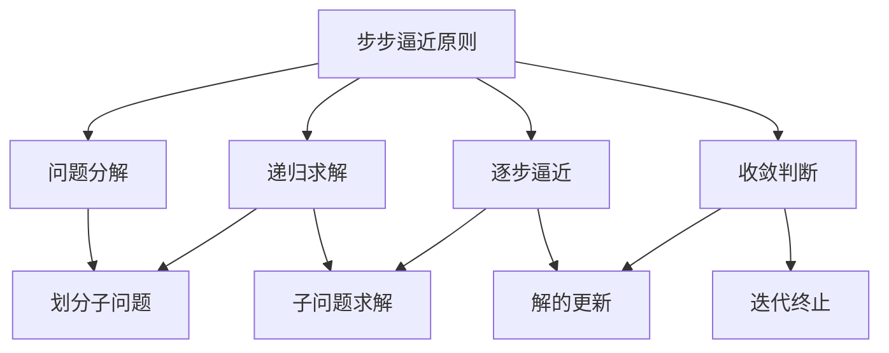

# 像数学家一样思考：步步逼近原则

作者：禅与计算机程序设计艺术 / Zen and the Art of Computer Programming 

关键词：数学思维、步步逼近、算法、建模、程序设计、抽象、递归、归纳

## 1. 背景介绍
### 1.1  问题的由来
在计算机科学和软件工程领域，我们经常需要解决各种复杂的问题。这些问题可能涉及算法设计、系统架构、性能优化等多个方面。面对如此棘手的挑战，我们该如何着手分析和解决问题呢？

数学家在解决问题时，往往会采用一种被称为"步步逼近"（Successive Approximation）的思维方式。这种思维方式强调将复杂问题分解为一系列更小、更容易解决的子问题，然后逐步逼近最终的解决方案。这种基于数学思维的方法论对于计算机科学和软件工程具有重要的启示意义。

### 1.2  研究现状
目前，步步逼近原则在计算机科学和软件工程领域已经得到了广泛的应用。许多经典的算法，如二分搜索、牛顿迭代法等，都蕴含了步步逼近的思想。在人工智能领域，强化学习算法通过不断试错和优化，逐步逼近最优策略。在系统设计中，迭代式开发模式和敏捷开发方法论也体现了这一原则。

尽管步步逼近原则已经在实践中证明了其有效性，但对于如何系统地应用这一原则来指导问题求解，目前还缺乏深入的理论研究和方法论总结。因此，有必要对步步逼近原则在计算机领域的应用进行系统性的梳理和探讨。

### 1.3  研究意义
深入研究步步逼近原则在计算机领域的应用，对于提升我们分析和解决复杂问题的能力具有重要意义：

1. 培养数学思维：步步逼近原则源自数学家的思考方式，学习这一原则有助于我们培养严谨的逻辑思维和数学素养。

2. 简化问题求解：通过将复杂问题分解为一系列简单的子问题，可以降低问题求解的难度，提高解决问题的效率。

3. 启发算法设计：步步逼近原则可以为设计高效的算法提供重要的思路和灵感。

4. 指导系统设计：在软件系统的设计和开发过程中，步步逼近原则可以帮助我们合理地组织和安排开发任务，逐步构建和优化系统。

### 1.4  本文结构
本文将从以下几个方面对步步逼近原则在计算机领域的应用进行探讨：

1. 介绍步步逼近原则的核心概念和思想。
2. 剖析步步逼近原则在经典算法设计中的应用，如二分搜索、牛顿迭代等。
3. 探讨步步逼近原则与数学建模的关系，介绍如何利用数学模型来指导问题求解。
4. 结合具体的代码实例，演示如何应用步步逼近原则来设计和实现算法。
5. 分析步步逼近原则在实际软件工程实践中的应用场景和案例。
6. 总结步步逼近原则对于未来计算机科学和软件工程发展的启示和挑战。

## 2. 核心概念与联系
步步逼近原则的核心思想是将一个复杂问题转化为一系列更加简单、容易求解的子问题，通过逐步求解这些子问题来不断逼近最终的解决方案。这一过程通常具有以下特点：

1. 问题分解：将原问题划分为多个子问题，每个子问题都比原问题更加简单、更容易求解。

2. 递归求解：对每个子问题进行求解，如果子问题仍然较为复杂，则可以继续将其分解为更小的子问题。

3. 逐步逼近：通过逐步求解子问题，不断逼近原问题的最终解。在这个过程中，每一步的解都比上一步更加接近最终解。

4. 收敛判断：在逼近过程中，需要设定一个收敛条件，判断当前的解是否已经足够接近最终解，从而决定是否终止迭代过程。

步步逼近原则与数学中的逼近论、数值分析等领域有着密切的联系。在逼近论中，我们研究如何用一组简单的函数（如多项式函数）来逼近复杂的函数。在数值分析中，许多求解方程、优化问题的算法都采用了逐步逼近的策略，如牛顿迭代法、梯度下降法等。

同时，步步逼近原则也与计算机科学中的许多重要概念紧密相关，如递归、迭代、动态规划、分治等。这些概念都蕴含了将复杂问题分解为简单子问题、逐步求解的思想。

下图展示了步步逼近原则的核心概念以及它们之间的逻辑关系：

## 3. 核心算法原理 & 具体操作步骤
### 3.1  算法原理概述
步步逼近原则可以应用于设计各种高效的算法。以下是一些常见的基于步步逼近思想的算法：

1. 二分搜索（Binary Search）：在有序数组中查找目标元素，每次将搜索范围缩小一半，逐步逼近目标位置。

2. 牛顿迭代法（Newton's Method）：求解非线性方程的数值解，通过不断用切线逼近曲线，逐步逼近方程的根。

3. 梯度下降（Gradient Descent）：求解凸优化问题，通过不断沿着梯度的反方向更新解，逐步逼近最优解。

这些算法的共同特点是，它们都采用了逐步逼近的策略，通过不断迭代，每一步都比上一步更加接近问题的解。

### 3.2  算法步骤详解
以二分搜索算法为例，我们来详细分析其步骤：

1. 确定搜索范围：初始搜索范围是整个有序数组。

2. 计算中点：取搜索范围的中点，将数组划分为两个子区间。

3. 比较中点元素与目标值：
   - 如果中点元素等于目标值，则找到目标，搜索结束。
   - 如果中点元素大于目标值，则目标在左子区间，缩小搜索范围为左子区间。
   - 如果中点元素小于目标值，则目标在右子区间，缩小搜索范围为右子区间。

4. 重复步骤2-3，直到找到目标值或搜索范围为空。

可以看到，二分搜索算法每一次迭代都将搜索范围缩小一半，不断逼近目标位置。这种逐步缩小问题规模的方法，使得算法的时间复杂度降至O(log n)，相比简单的线性搜索，效率有了极大的提升。

### 3.3  算法优缺点
基于步步逼近原则的算法通常具有以下优点：

1. 高效性：通过逐步缩小问题规模，可以快速收敛到问题的解，具有较低的时间复杂度。

2. 简洁性：算法的实现通常比较简洁，易于理解和编码。

3. 通用性：步步逼近的思想可以应用于求解多种类型的问题，具有良好的通用性。

但同时，这类算法也存在一些局限性：

1. 初始条件敏感：有些算法对初始条件或初始值的选择比较敏感，不同的初始值可能导致收敛速度差异较大。

2. 局部最优：对于非凸优化问题，步步逼近的算法可能陷入局部最优解，无法达到全局最优。

3. 收敛速度：虽然总体时间复杂度较低，但在某些情况下，逼近速度可能比较慢，需要较多的迭代次数。

### 3.4  算法应用领域
步步逼近原则在计算机科学和软件工程的众多领域都有广泛的应用，包括：

1. 搜索算法：如二分搜索、插值搜索等。

2. 优化算法：如牛顿法、梯度下降法、坐标下降法等。

3. 数值计算：求解线性方程组、特征值计算、常微分方程数值解等。

4. 机器学习：如逻辑回归、支持向量机等分类算法，以及最小二乘法等回归算法。

5. 图形学：如光线追踪中的加速算法，曲线曲面的逼近算法等。

6. 控制理论：如PID控制算法中的迭代优化过程。

## 4. 数学模型和公式 & 详细讲解 & 举例说明
### 4.1  数学模型构建
为了更好地理解和应用步步逼近原则，我们可以尝试建立相应的数学模型。以优化问题为例，假设我们要求解以下无约束优化问题：

$$
\min_{x \in \mathbb{R}^n} f(x)
$$

其中，$f(x)$ 是一个连续可微的目标函数。

步步逼近原则可以用于设计求解这一优化问题的迭代算法。假设算法的第 $k$ 次迭代的解为 $x^{(k)}$，我们希望构造一个更新规则，使得每次迭代都能够逼近最优解 $x^*$，即：

$$
\lim_{k \to \infty} x^{(k)} = x^*
$$

### 4.2  公式推导过程
以梯度下降法为例，我们来推导其迭代公式。梯度下降法的基本思想是，在每次迭代时，沿着目标函数梯度的反方向移动，以减小函数值。

假设第 $k$ 次迭代的解为 $x^{(k)}$，则梯度下降法的更新规则为：

$$
x^{(k+1)} = x^{(k)} - \alpha \nabla f(x^{(k)})
$$

其中，$\alpha$ 是步长，控制每次移动的距离；$\nabla f(x^{(k)})$ 是函数 $f(x)$ 在 $x^{(k)}$ 处的梯度。

这个更新规则可以通过一阶泰勒展开来进行解释：

$$
f(x) \approx f(x^{(k)}) + \nabla f(x^{(k)})^T (x - x^{(k)})
$$

在 $x^{(k)}$ 处，沿着梯度的反方向移动一小步 $\alpha$，可以近似地减小函数值：

$$
f(x^{(k)} - \alpha \nabla f(x^{(k)})) \approx f(x^{(k)}) - \alpha \|\nabla f(x^{(k)})\|^2
$$

因此，通过不断迭代更新 $x^{(k)}$，每一步都能够减小目标函数值，逐步逼近最优解。

### 4.3  案例分析与讲解
我们以一个简单的二元函数为例，来说明梯度下降法的运行过程。假设目标函数为：

$$
f(x, y) = x^2 + 2y^2
$$

其梯度为：

$$
\nabla f(x, y) = \begin{bmatrix} 2x \\ 4y \end{bmatrix}
$$

假设初始点为 $(1, 1)$，步长 $\alpha=0.1$，我们来模拟梯度下降法的迭代过程。

- 第1次迭代：
  - $\nabla f(1, 1) = \begin{bmatrix} 2 \\ 4 \end{bmatrix}$
  - $x^{(1)} = \begin{bmatrix} 1 \\ 1 \end{bmatrix} - 0.1 \begin{bmatrix} 2 \\ 4 \end{bmatrix} = \begin{bmatrix} 0.8 \\ 0.6 \end{bmatrix}$

- 第2次迭代：
  - $\nabla f(0.8, 0.6) = \begin{bmatrix} 1.6 \\ 2.4 \end{bmatrix}$
  - $x^{(2)} = \begin{bmatrix} 0.8 \\ 0.6 \end{bmatrix}