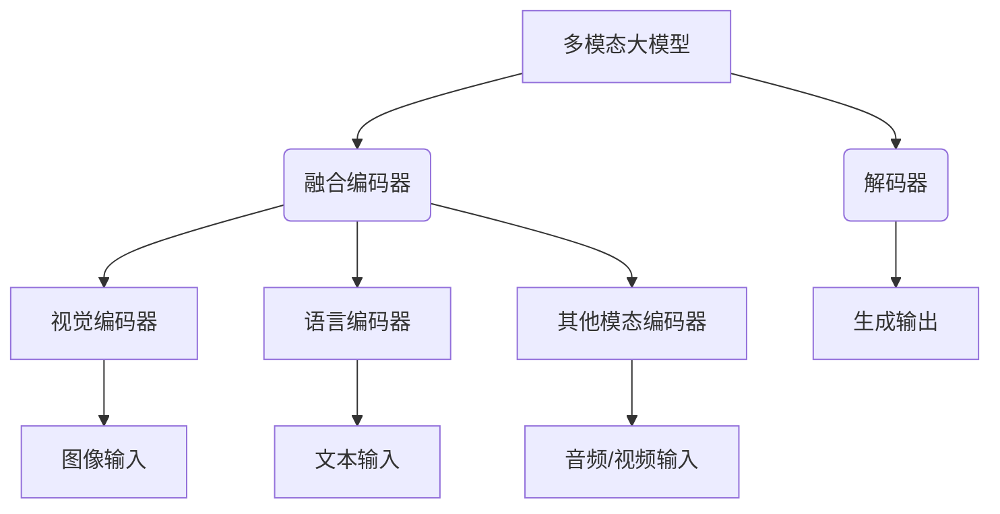

# 多模态大模型：技术原理与实战 中小公司的大模型构建之路

## 1. 背景介绍

### 1.1 问题的由来

在过去的几年里，大型语言模型(LLM)在自然语言处理(NLP)领域取得了令人瞩目的成就。像GPT-3、PaLM和ChatGPT这样的模型展现出了惊人的语言生成能力,能够执行各种复杂的NLP任务,如问答、文本摘要、机器翻译等。然而,这些模型仅限于单一模态(文本),无法处理图像、视频和音频等其他模态数据。

随着人工智能(AI)系统在各个领域的广泛应用,对于能够同时处理多种模态数据的多模态AI模型的需求日益增长。多模态模型可以更好地模拟人类的认知方式,因为人类在日常生活中会同时接收和处理来自不同感官的信息。例如,在进行对话时,我们不仅依赖语音,还会观察对方的面部表情和肢体语言。

### 1.2 研究现状

目前,多模态大模型的研究主要集中在两个方向:

1. **融合现有的单模态模型**:通过将预训练的视觉模型(如CLIP)和语言模型(如GPT)进行融合,构建多模态模型。这种方法的优点是可以利用已有的优秀单模态模型,但缺点是模态之间的交互可能不够紧密,导致性能受限。

2. **从头训练多模态模型**:从大量的多模态数据集(如图像-文本对)开始,训练一个统一的多模态模型。这种方法可以实现更深层次的多模态融合,但需要大量的计算资源和高质量的多模态数据集。

一些知名的多模态大模型包括OpenAI的DALL-E、Google的Parti和Deepmind的Flamingo等。这些模型展现出了强大的多模态理解和生成能力,但由于其庞大的模型规模和训练成本,目前仍然难以为中小型企业所采用。

### 1.3 研究意义

构建多模态大模型对于中小型企业来说具有重大意义:

1. **提升产品和服务质量**:通过融合多种模态数据,企业可以为客户提供更加身临其境和人性化的体验。

2. **开拓新的商业机会**:多模态AI技术可以应用于各种领域,如虚拟现实、智能助手、内容创作等,为企业带来新的收入来源。

3. **提高工作效率**:多模态模型可以自动化一些复杂的任务,如文档理解、会议记录等,从而提高员工的工作效率。

4. **保持技术领先地位**:多模态AI是未来的发展趋势,中小企业通过掌握这一技术,可以在未来的市场竞争中占据优势。

### 1.4 本文结构

本文将全面介绍多模态大模型的技术原理和实战经验,内容安排如下:

- 第2部分阐述多模态大模型的核心概念和模型架构。
- 第3部分详细解释多模态模型训练的核心算法原理和具体操作步骤。
- 第4部分介绍多模态模型中常用的数学模型和公式,并通过案例进行讲解。
- 第5部分提供一个基于Hugging Face的多模态模型项目实践,包括代码实现和运行结果展示。
- 第6部分探讨多模态模型在不同领域的应用场景。
- 第7部分推荐一些多模态模型的学习资源、开发工具和相关论文。
- 第8部分总结多模态模型的研究成果、发展趋势和面临的挑战。
- 第9部分是附录,回答一些常见的问题。

## 2. 核心概念与联系

多模态大模型是一种能够同时处理多种模态输入(如图像、文本、音频等)并生成相应输出的统一模型。其核心思想是将不同模态的数据通过对应的编码器进行编码,然后将编码后的表示融合到一个共享的空间中。解码器接收这个融合后的表示,并生成所需的输出(如文本、图像等)。

### 2.1 融合编码器

融合编码器是多模态模型的关键组件,负责将来自不同模态的编码表示进行融合。常见的融合策略包括:

1. **张量拼接(Tensor Concatenation)**:将不同模态的编码表示沿着特定维度拼接成一个张量。
2. **注意力融合(Attention Fusion)**:使用注意力机制对不同模态的编码表示进行加权求和。
3. **门控融合(Gated Fusion)**:使用门控机制动态调节不同模态编码的贡献度。

### 2.2 解码器

解码器的作用是根据融合后的多模态表示生成所需的输出。常见的解码器架构包括:

1. **Transformer解码器**:广泛应用于生成任务,如机器翻译、文本生成等。
2. **CNN解码器**:常用于生成图像等连续数据。
3. **RNN解码器**:适用于处理序列数据,如语音识别。

### 2.3 模态编码器

不同模态的编码器用于从相应的输入数据中提取特征表示。常见的编码器包括:

1. **视觉编码器**:如VIT、ResNet等用于编码图像数据。
2. **语言编码器**:如BERT、GPT等用于编码文本数据。
3. **音频/视频编码器**:如Conv3D、Transformer等用于编码时序数据。

## 3. 核心算法原理 & 具体操作步骤

### 3.1 算法原理概述

多模态大模型的训练过程可以概括为以下几个关键步骤:

1. **预训练单模态编码器**:在大规模单模态数据集(如ImageNet、Wikipedia等)上预训练各个模态的编码器,获得良好的初始化权重。

2. **构建多模态数据集**:收集包含多种模态数据的数据集,如图像-文本对、视频-字幕对等。

3. **多模态对齐**:通过对比学习等方法,将不同模态的表示对齐到同一个embedding空间中。

4. **多任务联合训练**:在多模态数据集上联合训练融合编码器和解码器,优化多个下游任务的损失函数。

5. **模型微调**:在特定下游任务的数据集上进行模型微调,进一步提升性能。

### 3.2 算法步骤详解

1. **预训练单模态编码器**

对于视觉编码器,通常采用无监督对比学习的方式进行预训练,目标是学习到对图像内容的有效表示。常用的预训练方法包括MoCo、SimCLR等。

对于语言编码器,通常采用掩码语言模型(Masked Language Modeling)和下一句预测(Next Sentence Prediction)等任务进行预训练,目标是捕获文本的语义和上下文信息。常用的预训练模型包括BERT、RoBERTa等。

2. **构建多模态数据集**

多模态数据集的构建是一个巨大的挑战,需要从互联网上爬取和清洗大量的图像-文本对、视频-字幕对等数据。常用的多模态数据集包括:

- **Conceptual Captions**:包含3.3M张图像及其描述文本。
- **LAION**:包含5B张图像及其相关文本。
- **HowTo100M**:包含130M个视频片段及其文本描述。

3. **多模态对齐**

多模态对齐的目标是将不同模态的表示映射到同一个embedding空间中,使得语义相似的不同模态数据点彼此靠近。常用的对齐方法包括:

- **对比学习(Contrastive Learning)**:最大化同一对象不同模态表示之间的相似度,最小化不同对象表示之间的相似度。
- **投射(Projection)**:通过学习一个投射函数,将不同模态的表示映射到一个公共空间。

4. **多任务联合训练**

在多模态数据集上联合训练融合编码器和解码器,优化多个下游任务的损失函数。常见的下游任务包括:

- **图像字幕生成**:根据图像生成对应的文本描述。
- **视觉问答**:根据图像和问题生成答案。
- **图像生成**:根据文本描述生成相应的图像。

通过多任务学习,模型可以捕获不同模态之间的相关性,提升泛化能力。

5. **模型微调**

在特定下游任务的数据集上进行模型微调,可以进一步提升模型在该任务上的性能。微调过程中,通常会冻结大部分预训练参数,只对部分层(如输出层)的参数进行微调。

### 3.3 算法优缺点

**优点**:

- 能够同时处理和融合多种模态数据,模拟人类的认知方式。
- 预训练策略和多任务学习有助于提升模型的泛化能力。
- 在多个下游任务上表现出色,具有广泛的应用前景。

**缺点**:

- 需要大量的计算资源进行训练,对硬件要求较高。
- 高质量的多模态数据集难以获取,数据质量直接影响模型性能。
- 不同模态之间的融合方式仍需进一步探索和优化。

### 3.4 算法应用领域

多模态大模型具有广泛的应用前景,包括但不限于:

- **智能助手**:融合视觉、语音和文本等模态,提供更人性化的交互体验。
- **内容创作**:根据文本描述自动生成图像、视频等多媒体内容。
- **虚拟现实**:为虚拟环境提供逼真的视觉、音频和语言交互。
- **医疗影像**:利用图像和病史数据进行辅助诊断。
- **机器人控制**:融合视觉、语音和传感器数据,实现更智能的机器人控制。

## 4. 数学模型和公式 & 详细讲解 & 举例说明

在多模态大模型中,常用的数学模型和公式主要包括:

### 4.1 数学模型构建

1. **对比学习损失函数**

对比学习是训练多模态编码器的常用方法,其目标是最大化同一对象不同模态表示之间的相似度,最小化不同对象表示之间的相似度。常用的对比学习损失函数是NT-Xent损失:

$$\mathcal{L}_i = -\log\frac{\exp(\text{sim}(z_i, z_i^+)/\tau)}{\sum_{j\neq i}\exp(\text{sim}(z_i, z_j)/\tau)}$$

其中$z_i$和$z_i^+$分别表示同一对象的不同模态表示,称为正对;$z_j$表示其他对象的表示,称为负例;$\text{sim}(\cdot, \cdot)$是相似度函数,通常使用点积相似度;$\tau$是一个温度超参数。

2. **注意力融合**

注意力机制是多模态融合的有效方式之一。给定不同模态的编码表示$\{h_1, h_2, \dots, h_n\}$,注意力融合的公式为:

$$\begin{aligned}
    h_{\text{fused}} &= \sum_{i=1}^n \alpha_i h_i \\
    \alpha_i &= \frac{\exp(e_i)}{\sum_{j=1}^n \exp(e_j)}\\
    e_i &= \text{MLP}(h_i)
\end{aligned}$$

其中$\alpha_i$是注意力权重,通过一个MLP网络计算得到;$h_{\text{fused}}$是融合后的多模态表示。

### 4.2 公式推导过程

1. **注意力机制推导**

注意力机制的核心思想是对输入序列中的每个元素赋予不同的权重,使模型能够专注于更重要的部分。假设输入序列为$\{x_1, x_2, \dots, x_n\}$,我们希望得到一个加权和作为输出表示$y$:

$$y = \sum_{i=1}^n \alpha_i x_i$$

其中$\alpha_i$是第$i$个元