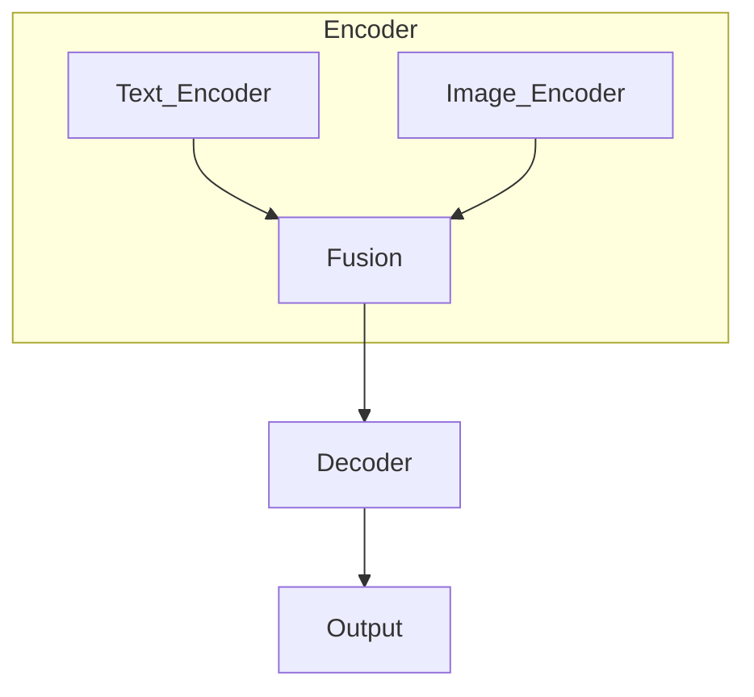

# 多模态大模型：整合视觉与文本信息的前沿科技

## 1. 背景介绍

### 1.1 问题的由来

在当今信息时代,数据呈现多种形式,包括文本、图像、视频等。传统的人工智能模型通常专注于单一模态,如自然语言处理(NLP)任务中的文本数据或计算机视觉(CV)任务中的图像数据。然而,现实世界中的数据通常包含多种模态,需要同时处理和理解不同模态之间的关联。

例如,在图像描述任务中,模型需要同时理解图像内容和相关文本描述之间的关系。再如在视觉问答(Visual Question Answering, VQA)任务中,模型需要基于图像内容和提问语句,给出正确的答案。这种跨模态的需求催生了多模态人工智能模型的发展。

### 1.2 研究现状  

早期的多模态模型通常采用两阶段方法,首先分别对每种模态进行编码,然后将不同模态的表示进行融合。这种方法存在信息丢失和效率低下的问题。近年来,benefiting from 大规模预训练语言模型(如BERT、GPT等)的成功,研究人员开始探索统一的多模态预训练模型,旨在同时学习不同模态之间的相关性。

代表性的多模态预训练模型包括UNITER、ViLBERT、LXMERT等,它们通过预训练的方式,在大规模的文本-图像对数据上学习跨模态的表示。这些模型展现出了在多个下游任务上的出色表现,推动了多模态人工智能的发展。

### 1.3 研究意义

多模态人工智能模型的发展对于构建更加智能、通用和人性化的人工智能系统具有重要意义:

1. **更接近人类认知**:人类认知是多模态的,我们通过视觉、听觉、文本等多种信息渠道来理解周围世界。多模态AI模型有助于模拟这种认知过程,更好地理解复杂的多模态信息。

2. **提高下游任务性能**:许多实际应用场景涉及多模态数据,如视觉问答、图像描述、多媒体检索等。多模态模型能够充分利用不同模态之间的相关性,提高这些任务的性能表现。

3. **推动人工智能发展**:多模态AI是人工智能发展的重要方向之一。研究多模态模型有助于探索更加通用、智能和人性化的人工智能系统,推动整个人工智能领域的进步。

### 1.4 本文结构

本文将全面介绍多模态大模型的相关理论和实践。第2部分将阐述多模态模型的核心概念和基本架构;第3部分将详细解析多模态模型的核心算法原理和具体实现步骤;第4部分将深入探讨多模态模型的数学建模和公式推导过程;第5部分将提供具体的代码实现示例和解释;第6部分将介绍多模态模型在实际应用中的场景;第7部分将推荐相关的学习资源和开发工具;最后第8部分将总结研究成果,展望未来发展趋势和面临的挑战。

## 2. 核心概念与联系

多模态大模型的核心思想是构建一个统一的框架,能够同时处理和融合多种模态(如文本、图像、视频等)的信息。其中涉及以下几个关键概念:

1. **模态(Modality)**:指数据的呈现形式,如文本、图像、视频、音频等。

2. **模态融合(Modal Fusion)**:将来自不同模态的特征或表示进行融合,捕获跨模态的相关性和联系。

3. **跨模态(Cross-Modal)**:描述不同模态之间的交互和关联,如图像-文本、视频-音频等。

4. **多模态表示学习(Multimodal Representation Learning)**:在多模态数据上学习统一的表示空间,使得不同模态的信息能够在该空间中融合和关联。

5. **预训练(Pre-training)**:在大规模多模态数据上进行预训练,获得通用的多模态表示,为下游任务做好初始化。

6. **迁移学习(Transfer Learning)**:将预训练得到的多模态模型迁移到特定的下游任务上,进行微调(fine-tuning)以获得针对性的模型。

这些概念相互关联、环环相扣,共同构建了多模态大模型的理论基础和技术框架。下面将对多模态模型的核心架构进行介绍。

### 2.1 多模态模型架构概览

多模态大模型通常采用编码器-解码器(Encoder-Decoder)架构,用于学习跨模态的表示。如下图所示:

编码器部分包含多个针对不同模态的编码器,如文本编码器(Text Encoder)和图像编码器(Image Encoder)。每个编码器将对应模态的输入(如文本序列或图像)映射到统一的表示空间中。

融合模块(Fusion)将来自不同编码器的模态表示进行融合,捕获跨模态的相关性。常见的融合方法包括简单拼接(Concatenation)、注意力融合(Attention Fusion)、门控融合(Gated Fusion)等。

解码器(Decoder)模块将融合后的多模态表示进行解码,生成所需的输出,如文本生成、分类预测等。解码器的具体形式取决于下游任务的性质。

通过端到端的训练,编码器能够学习到有效的单模态表示,融合模块能够捕获跨模态的关联,解码器能够基于融合表示完成特定的预测任务。

### 2.2 预训练-微调范式

与大规模预训练语言模型(如BERT)的做法类似,多模态大模型也通常采用预训练-微调(Pre-training-Finetuning)范式:

1. **预训练阶段**:在大规模多模态数据(如图像-文本对)上进行预训练,学习通用的多模态表示。常用的预训练目标包括:
   - 遮蔽语言模型(Masked Language Modeling, MLM)
   - 遮蔽视觉模型(Masked Visual Modeling, MVM)
   - 图像-文本对应(Image-Text Matching, ITM)
   - 视觉问答(Visual Question Answering, VQA)

2. **微调阶段**:将预训练得到的多模态模型迁移到特定的下游任务上,通过有监督的微调(如添加任务特定的输出头),使模型适应目标任务。

预训练-微调范式的优势在于:

- 在大规模无标注数据上进行预训练,学习通用的多模态表示,避免从头开始训练。
- 通过微调将预训练模型迁移到下游任务,减少数据需求,提高泛化能力。
- 不同下游任务可共享相同的预训练模型参数,实现有效的知识迁移。

该范式已被广泛应用于自然语言处理和计算机视觉等领域,大幅提高了模型的性能和泛化能力。对于多模态模型而言,它同样扮演着关键角色。

## 3. 核心算法原理 & 具体操作步骤

### 3.1 算法原理概述

多模态大模型的核心算法原理可概括为以下几个关键步骤:

1. **模态编码**:将不同模态的输入(如文本、图像)通过对应的编码器模块(如Transformer编码器)编码为统一的向量表示。

2. **模态融合**:将来自不同模态的向量表示进行融合,获得融合后的多模态表示。融合方式包括拼接(Concatenation)、注意力融合(Attention Fusion)、门控融合(Gated Fusion)等。

3. **交互建模**:在融合表示的基础上,进一步捕获不同模态之间的细粒度交互和关联,通常采用跨模态注意力机制(Cross-Modal Attention)。

4. **预测生成**:将融合后的多模态表示输入到解码器模块(如Transformer解码器),根据具体任务生成所需的预测输出,如文本生成、分类等。

5. **联合训练**:在大规模多模态数据上进行联合训练,使编码器能够学习有效的单模态表示,融合模块能够捕获跨模态关联,解码器能够生成正确的预测输出。

6. **预训练-微调**:先在大规模无标注数据上进行预训练,获得通用的多模态表示;再将预训练模型迁移到特定下游任务,通过有监督微调使模型适应目标任务。

这一系列步骤共同构成了多模态大模型的核心算法框架,实现了不同模态信息的高效融合和建模。下面将对算法的具体实现步骤做进一步阐述。

### 3.2 算法步骤详解

1. **模态编码**

   对于文本模态,通常采用Transformer等编码器对文本序列进行编码,获得文本的向量表示。

   对于图像模态,常用的编码方式包括:
   - CNN编码器:使用诸如ResNet、VGG等CNN模型提取图像的特征向量。
   - ViT编码器:采用Vision Transformer对图像进行编码,将图像分割为多个patch,并对这些patch序列进行Transformer编码。

   编码后的文本向量和图像向量将映射到同一个向量空间中,为后续的融合做好准备。

2. **模态融合**

   融合模块的作用是将来自不同模态的向量表示进行融合,获得统一的多模态表示。常见的融合方法包括:

   - **拼接融合(Concatenation Fusion)**:直接将不同模态的向量拼接在一起,作为融合表示。
     $$h = [h_t; h_v]$$
     其中 $h_t$ 和 $h_v$ 分别表示文本和视觉模态的向量表示。

   - **注意力融合(Attention Fusion)**:通过注意力机制对不同模态的表示进行加权融合。
     $$h = \text{Attention}(Q=h_t, K=h_v, V=h_v)$$
     其中 $Q$、$K$、$V$ 分别表示查询(Query)、键(Key)和值(Value)。

   - **门控融合(Gated Fusion)**:使用门控机制控制不同模态特征的融合程度。
     $$\begin{aligned}
     g &= \sigma(W_g[h_t; h_v] + b_g) \\
     h &= g \odot h_t + (1 - g) \odot h_v
     \end{aligned}$$
     其中 $\sigma$ 为sigmoid激活函数, $\odot$ 为元素乘积, $g$ 为门控向量。

   不同的融合方式各有利弊,可根据具体任务和数据特点选择合适的融合策略。

3. **交互建模**

   融合后的多模态表示 $h$ 捕获了初步的跨模态关联,但还需要进一步建模不同模态之间的细粒度交互。这通常通过跨模态注意力机制实现:

   $$\tilde{h} = \text{CrossModalAttention}(Q=h_t, K=h_v, V=h_v)$$

   其中,文本表示 $h_t$ 作为查询(Query),与视觉表示 $h_v$ 的键(Key)和值(Value)进行注意力交互,得到更新后的多模态表示 $\tilde{h}$,充分融合了不同模态之间的细粒度关联。

   此外,也可采用双向交互的方式,使文本和视觉模态的表示相互影响:

   $$\begin{aligned}
   \tilde{h}_t &= \text{CrossModalAttention}(Q=h_t, K=h_v, V=h_v) \\
   \tilde{h}_v &= \text{CrossModalAttention}(Q=h_v, K=h_t, V=h_t) \\
   \tilde{h} &= [\tilde{h}_t; \tilde{h}_v]
   \end{aligned}$$

   交互建模有助于充分挖掘不同模态之间的相关性,为下游任务奠定基础。

4. **预测生成**

   获得融合后的多模态表示 $\tilde{h}$ 后,将其输入到解码器模块(如Transformer解码器),根据具体任务生成所需的预测输出。

   - 对于文本生成任务(如图像描述、视觉问答),解码器将 $\tilde{h}$ 作为初始状态,自回归地生成目标文本序列。
   - 对于分类任务(如图