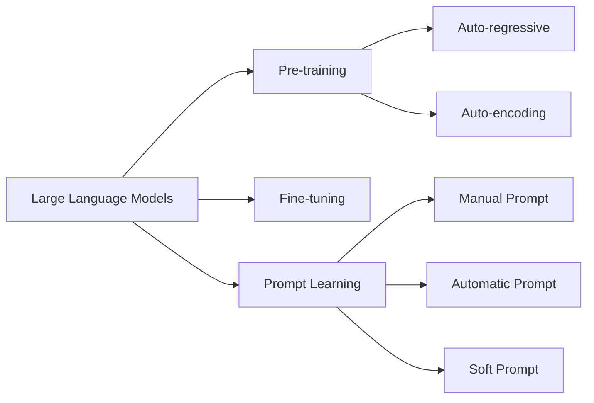

大规模语言模型从理论到实践 提示学习

作者：禅与计算机程序设计艺术 / Zen and the Art of Computer Programming 

关键词：大规模语言模型、提示学习、自然语言处理、深度学习、人工智能

## 1. 背景介绍

### 1.1 问题的由来

自然语言处理(Natural Language Processing, NLP)是人工智能领域的一个重要分支,旨在让计算机能够理解、生成和处理人类语言。近年来,随着深度学习技术的飞速发展,特别是Transformer[1]等注意力机制模型的出现,NLP领域取得了突破性进展。其中,大规模语言模型(Large Language Models, LLMs)更是引领了这一波浪潮。

LLMs通过在海量文本数据上进行预训练,学习到了丰富的语言知识和常识,展现出了惊人的语言理解和生成能力。然而,如何有效地利用LLMs解决下游任务,仍然是一个巨大的挑战。提示学习(Prompt Learning)[2]应运而生,通过设计巧妙的提示(Prompt)引导LLMs执行特定任务,在小样本场景下取得了优异的表现,成为了近期NLP领域的研究热点。

### 1.2 研究现状

目前,业界已经涌现出了一批强大的LLMs,如OpenAI的GPT系列[3]、Google的BERT[4]、Anthropic的Claude等,在多项NLP任务上超越了人类水平。学术界也在LLMs的基础上,提出了一系列的提示学习方法,如PET[5]、PTR[6]等,极大拓展了LLMs的应用范畴。

但LLMs的训练成本高昂,且存在数据偏差、伦理风险等问题。如何设计更高效的训练范式,构建更安全可控的LLMs,同时最大化发挥其潜力,是目前函待解决的关键科学问题。

### 1.3 研究意义

深入研究LLMs和提示学习,对于推动人工智能的发展具有重要意义:

1. 技术层面:有助于突破传统监督学习范式的局限,实现更强大、更通用的NLP系统。 

2. 应用层面:LLMs在智能问答、文本生成、代码开发等领域有广阔应用前景,将极大提升人机交互体验。

3. 理论层面:LLMs为探索机器智能奠定了基础,有望揭示人类语言和认知的奥秘。

4. 产业层面:LLMs代表了人工智能技术的前沿,有望催生新的商业模式和产业变革。

### 1.4 本文结构

本文将系统阐述LLMs和提示学习的理论基础和实践进展,内容安排如下:

- 第2节介绍LLMs的核心概念和发展脉络
- 第3节深入剖析LLMs的底层算法原理和关键技术
- 第4节建立LLMs的数学模型,推导相关公式,并举例说明
- 第5节通过代码实例,演示如何实现一个基于提示学习的NLP项目
- 第6节讨论LLMs在实际场景中的应用现状和未来潜力
- 第7节梳理LLMs相关的学习资源、开发工具和研究文献
- 第8节总结全文,展望LLMs的未来发展趋势和面临的挑战
- 第9节列举LLMs和提示学习的常见问题,并给出解答

## 2. 核心概念与联系

大规模语言模型(LLMs)是以Transformer为基础的深度神经网络模型,通过在大规模无标注文本语料上进行自监督预训练,习得强大的语言理解和生成能力。相比传统的词袋(Bag-of-words)、词嵌入(Word Embedding)等表示方法,LLMs能够捕捉更长距离的语义依赖,建模更复杂的语言现象。

LLMs的训练范式通常分为两个阶段:预训练(Pre-training)和微调(Fine-tuning)。预训练阶段,模型在大规模无标注语料上以自回归(Auto-regressive)或自编码(Auto-encoding)的方式学习通用语言知识。微调阶段,在下游任务的标注数据上对模型进行监督学习,使其适应特定任务。然而,这种范式存在标注数据稀缺、任务适配困难等问题。

提示学习(Prompt Learning)是一种新兴的范式,旨在充分利用LLMs的先验知识,通过设计巧妙的提示模板(Prompt Template),将下游任务转化为与预训练目标相似的形式,从而在小样本、零样本场景下实现强大的任务迁移能力。

形式化地,传统的微调范式可以表示为:

$y^* = \arg\max_y P(y|x;\theta)$

其中$x$为输入,$y$为输出,$\theta$为模型参数。而提示学习范式可以表示为:

$y^* = \arg\max_y P(y|x,t;\theta)$

其中$t$为提示模板。可见,提示学习实质上引入了先验知识$t$来辅助预测。

常见的提示学习方法包括:

- 手工提示(Manual Prompt):由人工设计固定的提示模板
- 自动提示(Automatic Prompt):通过搜索、优化等技术自动生成提示
- 软提示(Soft Prompt):将提示参数化为连续向量,通过梯度下降等方法进行学习

下图展示了LLMs、提示学习及相关概念之间的联系:

## 3. 核心算法原理 & 具体操作步骤

### 3.1 算法原理概述

LLMs的核心算法是基于Transformer的自监督预训练。Transformer采用了自注意力(Self-attention)机制来建模输入序列内部的依赖关系,相比RNN等模型,能够更高效地处理长序列。

形式化地,给定输入序列$X=(x_1,\ldots,x_n)$,Transformer的自注意力计算过程如下:

1. 将输入embedding化为$Q,K,V$三个矩阵:

$Q = XW^Q, K = XW^K, V = XW^V$

2. 计算自注意力权重:

$A = \text{softmax}(\frac{QK^T}{\sqrt{d}})$

其中$d$为embedding维度。

3. 计算自注意力输出:

$\text{Attention}(Q,K,V) = AV$

多头自注意力(Multi-head Self-attention)进一步增强了模型的表达能力:

$\text{MultiHead}(Q,K,V) = \text{Concat}(\text{head}_1,\ldots,\text{head}_h)W^O$

其中$\text{head}_i=\text{Attention}(QW_i^Q,KW_i^K,VW_i^V)$

Transformer堆叠了多层自注意力和前馈网络,形成了强大的语言建模能力。预训练阶段,模型通过自回归或自编码的方式最大化似然概率:

$L(\theta) = -\sum_{i=1}^n \log P(x_i|x_{<i};\theta)$ (自回归) 

或

$L(\theta) = -\sum_{i=1}^n \log P(x_i|x_{\backslash i};\theta)$ (自编码)

其中$x_{<i}$表示$x_i$之前的所有token,$x_{\backslash i}$表示去掉$x_i$的输入序列。

### 3.2 算法步骤详解

基于Transformer的LLMs预训练可分为以下步骤:

1. 语料准备:收集大规模无标注文本语料,进行清洗、分词等预处理。

2. 词表构建:统计语料中的词频,选取频率Top K的词构建词表。

3. 文本编码:将文本转化为词表中的id序列,并添加特殊token如[CLS],[SEP]等。

4. 数据加载:将编码后的文本序列组织成batch,送入模型进行训练。

5. 模型构建:搭建Transformer模型,设置层数、头数、隐藏层维度等超参数。

6. 损失函数:根据自回归或自编码的目标,设计对应的似然概率损失函数。

7. 优化算法:选择合适的优化器如Adam,设置学习率、权重衰减等。

8. 训练迭代:在训练集上进行多轮迭代,每轮按batch梯度下降,更新模型参数。

9. 评估验证:在验证集上评估模型性能,如perplexity等指标,进行早停、超参调优等。

10. 模型存储:训练完成后,将模型参数保存为checkpoint,供后续使用。

提示学习在预训练好的LLMs基础上,设计提示并进行推理或训练,主要步骤如下:

1. 任务分析:分析下游任务的输入输出格式,确定提示形式。

2. 提示设计:根据任务特点,人工设计或自动搜索最优的提示模板。

3. 推理/训练:将提示插入到输入文本中,利用LLMs进行zero-shot或few-shot学习。

4. 结果解析:对LLMs生成的结果进行解析,提取结构化信息。

5. 评估优化:在验证集上评估提示的有效性,并不断迭代优化。

### 3.3 算法优缺点

LLMs的优点在于:

1. 强大的语言理解和生成能力,在多项NLP任务上达到甚至超越人类水平。

2. 可扩展性强,模型规模和数据规模越大,性能越好。 

3. 通用性强,可以适配各种下游任务,实现少样本、零样本学习。

但同时也存在一些局限:

1. 训练成本极高,需要大量计算资源和数据,对中小企业和学术界门槛较高。

2. 偏差和有害性风险,模型可能学习到数据中的偏见和错误知识。

3. 可解释性差,模型判断的内在逻辑不透明,存在安全隐患。

4. 常识推理能力有限,对于一些需要外部知识和逻辑推理的任务表现不佳。

提示学习在一定程度上缓解了LLMs的局限,但提示设计是一个需要不断探索的挑战。

### 3.4 算法应用领域

LLMs结合提示学习,在NLP的各个领域取得了瞩目成绩,主要应用包括:

1. 问答系统:通过提示引导LLMs进行问题理解和知识检索,生成准确流畅的回答。

2. 机器翻译:将其他语言的句子作为提示,生成目标语言的翻译结果。

3. 文本摘要:提示LLMs总结文章的核心内容,自动生成摘要。

4. 对话系统:通过多轮交互提示,实现上下文相关、个性化的对话。

5. 文本分类:将分类标签作为提示,实现情感分析、主题分类等任务。

6. 知识图谱:将实体、关系作为提示,从文本中抽取结构化知识。

7. 代码生成:将自然语言描述作为提示,自动生成对应的程序代码。

除了NLP,LLMs在语音识别、图像描述、视频理解等多模态领域也有广泛应用。未来LLMs有望进一步发展为通用人工智能的基础设施。

## 4. 数学模型和公式 & 详细讲解 & 举例说明

### 4.1 数学模型构建

LLMs的核心是基于Transformer的语言模型,其数学形式可以表示为:

给定语料库$\mathcal{D}=\{x^{(1)},\ldots,x^{(n)}\}$,每个样本$x^{(i)}$是一个token序列$(x_1^{(i)},\ldots,x_{l_i}^{(i)})$。语言模型的目标是最大化似然概率:

$$\theta^* = \arg\max_\theta \prod_{i=1}^n P(x^{(i)};\theta) = \arg\max_\theta \prod_{i=1}^n \prod_{j=1}^{l_i} P(x_j^{(i)}|x_{<j}^{(i)};\theta)$$

其中$\theta$为模型参数,$x_{<j}^{(i)}$表示$x_j^{(i)}$之前的token序列。

Transformer是一种基于自注意力的语言模型,其数学结构可以表示为:

$$\begin{aligned}
\text{Attention}(Q,K,V) &= \text{