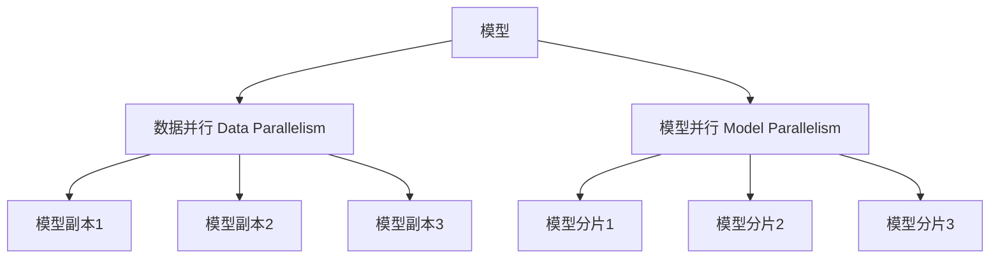

# 大语言模型原理与工程实践：模型并行

关键词：大语言模型、模型并行、Transformer、深度学习、分布式训练、高性能计算

## 1. 背景介绍
### 1.1 问题的由来
随着人工智能技术的飞速发展,自然语言处理(NLP)领域取得了令人瞩目的成就。其中,大语言模型(Large Language Model, LLM)以其强大的语言理解和生成能力,成为了NLP研究的热点和前沿。然而,随着模型规模的不断增大,训练这些大型语言模型所需的计算资源和时间成本也随之飙升。为了应对这一挑战,模型并行(Model Parallelism)技术应运而生。

### 1.2 研究现状 
目前,业界主流的大语言模型如GPT-3、PaLM、Megatron-Turing NLG等,其参数量动辄上百亿甚至上千亿。训练这些超大规模的语言模型,单个GPU或TPU已难以承载。因此,学术界和工业界都在积极探索模型并行技术,旨在通过将模型切分到多个设备上并行训练,来突破硬件瓶颈,提升训练效率。微软、英伟达、DeepMind等科技巨头纷纷推出了自己的模型并行框架和实践。

### 1.3 研究意义
模型并行技术的研究具有重要意义:

1. 突破计算瓶颈,支持更大规模语言模型的训练;
2. 提升训练效率,大幅缩短训练时间,加速模型迭代;
3. 降低训练成本,更高效地利用异构计算资源;
4. 推动人工智能技术在更多领域的应用落地。

### 1.4 本文结构
本文将围绕大语言模型中的模型并行技术展开深入探讨。内容安排如下:

- 第2节介绍模型并行的核心概念及其与数据并行的联系区别。
- 第3节重点阐述模型并行的核心算法原理和具体操作步骤。
- 第4节从理论层面对模型并行涉及的数学模型和公式进行推导与案例分析。 
- 第5节给出模型并行的代码实例,并详细解读其实现原理。
- 第6节讨论模型并行技术在实际应用场景中的价值和未来展望。
- 第7节推荐模型并行相关的学习资源、开发工具和前沿文献。
- 第8节总结全文,并对模型并行技术的未来发展趋势和挑战进行展望。

## 2. 核心概念与联系
模型并行(Model Parallelism)是一种分布式训练范式,其核心思想是将深度学习模型的不同部分(如层、Attention头、嵌入等)划分到不同的硬件设备上,实现并行计算,从而突破单个设备的内存和算力限制。与之相对的是数据并行(Data Parallelism),即在多个设备上复制完整的模型,并分割数据进行并行训练。二者的区别如下图所示:



可以看到,数据并行采用完全相同的模型副本,而模型并行则将模型切分成不同的分片。在实践中,二者往往结合使用,以达到最佳的并行训练效果。例如NVIDIA的Megatron-LM[1]同时采用了张量切片(Tensor Slicing)和流水线并行(Pipeline Parallelism)两种模型并行策略。

模型并行的优势在于:
1. 支持更大规模的模型训练,突破单卡内存限制;
2. 提升训练效率,缩短训练时间;
3. 更灵活地利用异构硬件资源。

但同时它也面临一些挑战:
1. 并行策略设计复杂,需要考虑负载均衡、通信开销等因素;
2. 对框架和硬件的适配改动较大,工程实现难度高;
3. 调优难度大,需要权衡模型性能和训练效率。

## 3. 核心算法原理 & 具体操作步骤
### 3.1 算法原理概述
模型并行的核心是将模型切分到多个设备,并协调它们高效完成前向和反向传播。以最常见的Transformer[2]模型为例,可以采取以下几种并行策略:

1. 层间切分(Layer-wise Splitting):将不同的Transformer层放置在不同设备上。
2. 张量切分(Tensor Slicing):将层内的张量(如自注意力矩阵)切分到不同设备。
3. 流水线并行(Pipeline Parallelism):将前向传播划分为多个阶段,在不同设备间流水执行。

不同的切分策略适用于不同的场景,需要根据模型特点和硬件条件进行权衡取舍。

### 3.2 算法步骤详解
以张量切分为例,对于Transformer的自注意力计算,可以将其切分到多个设备:

1. 将输入序列 $X$ 均匀切分为 $S$ 个子序列 $[X_1, X_2, ..., X_S]$
2. 在每个设备 $i$ 上,并行计算 Query、Key、Value 矩阵:
$$ Q_i = X_i W^Q, K_i = X_i W^K, V_i = X_i W^V $$
3. 全局通信,将 $K_i,V_i$ 聚合:
$$ K = Concat(K_1, K_2, ..., K_S) $$
$$ V = Concat(V_1, V_2, ..., V_S) $$
4. 在每个设备并行计算注意力得分,进行Softmax归一化:
$$ A_i = Softmax(Q_i K^T / \sqrt{d}) V $$
5. 全局通信,聚合注意力输出: 
$$ A = Concat(A_1, A_2, ..., A_S) $$

其中,$W^Q, W^K, W^V$为注意力矩阵的参数,$d$为特征维度。可以看到,张量切分将注意力计算并行化,但需要进行通信同步,因此需要权衡计算和通信开销。

### 3.3 算法优缺点
张量切分的优点是:
- 并行粒度细,设备利用率高
- 适用于模型的各个部分,包括Embedding、Attention、MLP等
- 与数据并行兼容,可以同时使用

缺点包括:
- 需要频繁的设备间通信,带来额外开销
- 切分策略和超参数调优复杂,对性能影响大
- 适配现有框架的改动较大

### 3.4 算法应用领域
模型并行广泛应用于各种大规模的深度学习任务,尤其是自然语言处理领域:

- 语言模型预训练,如GPT-3[3]、Megatron-Turing NLG[4] 
- 机器翻译,如GPT-3、Switch Transformer[5]
- 对话生成,如DialoGPT[6]、Blender[7]
- 文本摘要,如PEGASUS[8]、BART[9]

此外,模型并行在语音识别、图像生成、推荐系统等领域也有广泛应用。随着模型规模的持续增长,模型并行将成为大模型训练的关键技术。

## 4. 数学模型和公式 & 详细讲解 & 举例说明
### 4.1 数学模型构建
对于一个$L$层的Transformer模型,其前向传播可以表示为:

$$
\begin{aligned}
H_0 &= Embedding(X) \\
H_l &= TransformerLayer_l(H_{l-1}), l=1,2,...,L \\
O &= LayerNorm(H_L)
\end{aligned}
$$

其中$X$为输入序列,$Embedding$为词嵌入层,$TransformerLayer_l$为第$l$层的Transformer层(包括自注意力和前馈网络),$LayerNorm$为层归一化。

考虑将模型切分到$N$个设备上,每个设备负责$L/N$层的计算。记设备$i$上的层为$[L_i, R_i]$,则有:

$$
\begin{aligned}
L_i &= (i-1) \times \lfloor L/N \rfloor + 1 \\  
R_i &= \min(i \times \lfloor L/N \rfloor, L)
\end{aligned}
$$

前向传播过程变为:

$$
\begin{aligned}
H_0 &= Embedding(X) \\
H_{L_i} &= AllToAll(H_{R_{i-1}}), i=1,2,...,N \\
H_l &= TransformerLayer_l(H_{l-1}), l=L_i,L_i+1,...,R_i \\  
O &= AllToAll(H_{R_N})
\end{aligned}
$$

其中$AllToAll$表示设备间的全互联通信,用于在设备间传递数据。反向传播过程与之类似,略去不表。

### 4.2 公式推导过程
对于张量切分,以自注意力计算为例。设输入$X$的形状为$(B, S, D)$,其中$B$为批大小,$S$为序列长度,$D$为特征维度。将$X$切分为$N$份,每份形状为$(B, S/N, D)$。则设备$i$上的注意力计算为:

$$
\begin{aligned}
Q_i &= X_i W^Q \\
K_i &= X_i W^K \\ 
V_i &= X_i W^V \\
K &= Concat(K_1, K_2, ..., K_N) \\
V &= Concat(V_1, V_2, ..., V_N) \\ 
A_i &= Softmax(Q_i K^T / \sqrt{D}) V \\
A &= Concat(A_1, A_2, ..., A_N)
\end{aligned}
$$

其中$W^Q, W^K, W^V$为注意力矩阵的参数。可以看到,张量切分将注意力矩阵的计算和存储分布到多个设备,通过All-Gather通信完成中间结果的聚合,最终得到完整的注意力输出$A$。

### 4.3 案例分析与讲解
以GPT-3模型为例,其有175B参数,难以在单个设备上训练。DeepMind采用了多种模型并行策略[3]:

- 层间切分:将96层的Transformer均匀划分到12个设备。
- 张量切分:将词嵌入、注意力和MLP的权重矩阵切分到4个设备。
- 数据并行:在1024个设备上复制模型,并行处理不同的数据切片。

通过这些并行策略,DeepMind在2048个TPU核心上训练了GPT-3,耗时约5天,相比单卡训练加速了数百倍。这充分展示了模型并行技术在大语言模型训练中的威力。

### 4.4 常见问题解答
Q: 模型并行和数据并行可以同时使用吗?
A: 可以。实际上,大部分超大规模的语言模型都同时采用了模型并行和数据并行,以达到最佳的加速效果。二者在不同的维度上将模型和数据划分到多个设备,可以相互兼容。

Q: 模型并行对硬件和网络有什么要求?  
A: 模型并行对设备间互联提出了更高要求,需要高带宽、低延迟的网络(如NVLink、InfiniBand)来支持频繁的梯度同步。此外,并行策略的设计需要考虑设备的异构性(如CPU、GPU、TPU),以实现负载均衡。

Q: 模型并行的切分策略如何选择?
A: 切分策略的选择需要考虑多个因素:模型的架构特点、设备数量和连接拓扑、通信带宽和延迟等。一般需要通过理论分析和实验对比来确定最优的切分策略。此外,不同的切分策略可以组合使用,以适应不同的场景需求。

## 5. 项目实践：代码实例和详细解释说明
### 5.1 开发环境搭建
以PyTorch + Megatron-LM为例,介绍模型并行的开发环境搭建。

首先安装PyTorch和Megatron-LM:

```bash
pip install torch
git clone https://github.com/NVIDIA/Megatron-LM
cd Megatron-LM
pip install -r requirements.txt
```

Megatron-LM是NVIDIA开源的Transformer语言模型并行库,支持张量切分、流水线并行等多种策略。

### 5.2 源代码详细实现
以下