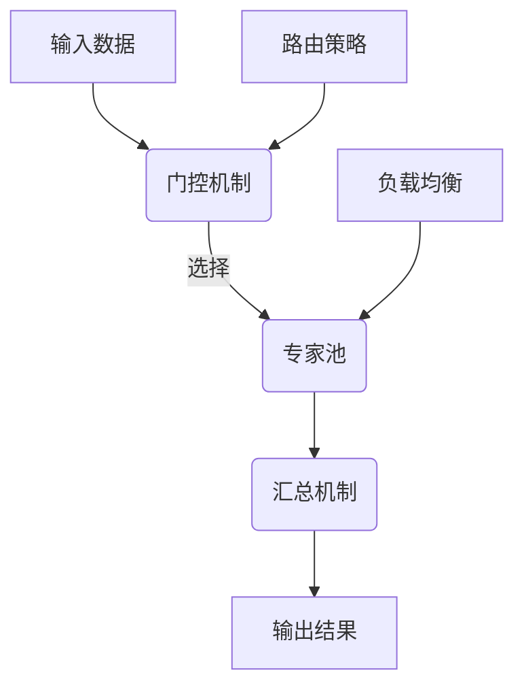

# 大语言模型原理基础与前沿 MoE与集成

## 1. 背景介绍

### 1.1 问题的由来

随着深度学习的快速发展,大型神经网络模型在自然语言处理(NLP)、计算机视觉(CV)等领域展现出了卓越的性能。然而,训练这些大型模型需要消耗大量的计算资源,而且推理过程也存在延迟和内存占用过高的问题。因此,如何在保持模型性能的同时,降低计算资源需求和推理延迟,成为了亟待解决的挑战。

### 1.2 研究现状

为了应对上述挑战,研究人员提出了多种模型压缩和加速方法,例如模型剪枝、知识蒸馏、量化等。然而,这些方法通常需要对原始模型进行微调和重新训练,从而增加了额外的计算开销。另一种解决方案是利用专门加速硬件(如GPU、TPU等),但这需要昂贵的硬件投资。

最近,一种被称为"混合专家"(Mixture of Experts,MoE)的新型架构引起了广泛关注。MoE通过将大型模型分解为多个专家子模型,并根据输入动态选择相关专家进行计算,从而显著降低了计算量和内存占用。MoE不仅可以应用于预训练语言模型,还可以扩展到计算机视觉、强化学习等多个领域。

### 1.3 研究意义

研究MoE架构及其与其他模型集成的方法,对于构建更高效、更强大的人工智能系统具有重要意义。MoE可以极大地降低训练和推理的计算成本,使大型模型在资源受限的环境(如移动设备、边缘计算等)中得以部署。此外,MoE架构的可解释性和模块化特性,有助于我们更好地理解深度神经网络的内在工作机制。

### 1.4 本文结构

本文将全面介绍MoE的基础原理、核心算法、数学模型,并详细阐述其在自然语言处理、计算机视觉等领域的应用实践。此外,还将探讨MoE与其他模型(如Transformer、CNN等)集成的方法,以及MoE在未来的发展趋势和面临的挑战。

## 2. 核心概念与联系

MoE架构的核心思想是将大型神经网络模型分解为多个专家子模型,每个专家子模型负责处理特定的输入模式或子任务。在推理过程中,根据输入数据动态选择相关的专家子模型进行计算,从而避免了对所有参数进行计算,大大降低了计算量和内存占用。

MoE架构中的关键组件包括:

1. **门控(Gating)机制**: 根据输入数据选择相关的专家子模型。常用的门控机制包括基于软权重的加性注意力机制、硬门控(选择Top-K专家)等。

2. **专家(Expert)池**: 包含多个专家子模型,每个专家子模型都是一个独立的神经网络,专门处理特定的输入模式或子任务。

3. **汇总(Pooling)机制**: 将选择的专家子模型的输出进行加权汇总,得到最终的输出结果。

4. **路由(Routing)策略**: 确定将输入数据分配给哪些专家子模型进行处理。常见的路由策略包括基于输入的硬分区、基于任务的分区等。

5. **负载均衡(Load Balancing)**: 在推理过程中,动态调整专家子模型的分配,以实现计算资源的均衡利用。

6. **专家容量(Expert Capacity)**: 指专家子模型的规模和数量,需要根据任务复杂度和可用资源进行权衡。

MoE架构与其他深度学习模型(如Transformer、CNN等)存在明显的区别,但也有一些相似之处。例如,Transformer的多头注意力机制可视为一种简单的MoE形式;而CNN中的卷积核可视为处理不同输入模式的专家。通过将MoE与这些模型相结合,可以进一步提高模型的性能和效率。

## 3. 核心算法原理 & 具体操作步骤

### 3.1 算法原理概述

MoE的核心算法原理可以概括为以下几个步骤:

1. **门控(Gating)**: 根据输入数据计算门控向量,用于选择相关的专家子模型。

2. **专家选择(Expert Selection)**: 根据门控向量,从专家池中选择出Top-K个专家子模型。

3. **专家计算(Expert Computation)**: 将输入数据分别传递给选择的专家子模型进行计算,得到各个专家的输出。

4. **输出汇总(Output Pooling)**: 将选择的专家子模型的输出进行加权汇总,得到最终的输出结果。

5. **反向传播(Backpropagation)**: 在训练过程中,根据损失函数计算梯度,并对门控机制、专家子模型的参数进行更新。

### 3.2 算法步骤详解

1. **门控机制**

门控机制的作用是根据输入数据选择出相关的专家子模型。常见的门控机制包括:

- **加性注意力机制**:计算输入与每个专家的相关性得分,并通过Softmax函数得到概率分布作为门控向量。

$$
\begin{aligned}
e_i &= v_i^\top \tanh(W_ih + b_i) \\
p_i &= \frac{\exp(e_i)}{\sum_j \exp(e_j)}
\end{aligned}
$$

其中$h$为输入,$(v_i, W_i, b_i)$为第$i$个专家的门控参数,$p_i$为第$i$个专家被选中的概率。

- **硬门控**:直接选择概率最大的Top-K个专家,其他专家的概率置为0。

$$
\begin{aligned}
\text{TopK}(p, K) &\rightarrow \hat{p} \\
\hat{p}_i &= \begin{cases}
p_i, &\text{if }i\in\text{topK}(p) \\
0, &\text{otherwise}
\end{cases}
\end{aligned}
$$

2. **专家选择**

根据门控向量$\hat{p}$,从专家池中选择出Top-K个专家子模型进行计算。对于剩余的$N-K$个专家,可以选择不进行计算(节省计算资源),或者将它们的输出设置为0(保证形状一致)。

3. **专家计算**

将输入$h$分别传递给选择的$K$个专家子模型,得到各个专家的输出$\{f_i(h)\}_{i=1}^K$。每个专家子模型$f_i$都是一个独立的神经网络,可以是Transformer、CNN或其他任何架构。

4. **输出汇总**

将选择的专家子模型的输出进行加权汇总,得到最终的输出结果$y$:

$$
y = \sum_{i=1}^K \hat{p}_i f_i(h)
$$

5. **反向传播**

在训练过程中,根据损失函数$\mathcal{L}(y, y_\text{true})$计算梯度,并对门控机制的参数$(v_i, W_i, b_i)$和专家子模型$f_i$的参数进行更新。

### 3.3 算法优缺点

**优点**:

- **计算效率高**:只需计算少数相关专家的输出,避免了对所有参数进行计算,从而大大降低了计算量和内存占用。
- **模型容量大**:通过增加专家的数量,可以构建极大规模的模型,而不受单个设备内存的限制。
- **可解释性强**:每个专家子模型负责处理特定的输入模式或子任务,有助于理解模型的内部工作机制。
- **可扩展性好**:专家子模型可以独立训练和更新,便于在新数据或任务上进行迁移学习和知识增量。

**缺点**:

- **门控机制复杂**:准确选择相关专家是关键,但门控机制的设计和训练往往很困难。
- **专家不平衡**:不同专家可能会被选中的频率不同,导致参数更新不均衡。
- **路由开销大**:在推理过程中,需要根据输入动态选择专家,存在一定的路由开销。
- **并行化困难**:由于专家选择的动态性,在现有的并行计算架构(如GPU)上实现高效的并行化是一个挑战。

### 3.4 算法应用领域

MoE架构最初被提出用于自然语言处理任务,如机器翻译、语言模型等。随后,该架构也被成功应用到了计算机视觉、强化学习、多模态等多个领域。

- **自然语言处理**:Google的Switch Transformer、GShard等大型语言模型都采用了MoE架构。
- **计算机视觉**:将MoE应用于图像分类、目标检测、图像分割等任务,可以显著提高模型的性能和效率。
- **强化学习**:在强化学习中,可以将MoE用于构建大规模的策略网络和价值网络,提高样本效率和泛化能力。
- **多模态学习**:MoE可以用于融合不同模态(如文本、图像、视频等)的信息,实现高效的多模态表示学习。

## 4. 数学模型和公式 & 详细讲解 & 举例说明

### 4.1 数学模型构建

我们将MoE架构建模为一个条件计算模型,其中门控机制根据输入$h$选择相关的专家子模型,每个专家子模型$f_i$对应一个条件概率分布$P(y|h, z=i)$,最终的输出$y$是所有选择专家的输出的加权和。

更formally,给定输入$h$,MoE模型的条件概率分布为:

$$
P(y|h) = \sum_{i=1}^N P(z=i|h)P(y|h,z=i)
$$

其中$z$是门控机制的输出,表示选择的专家索引;$N$是专家的总数量。

对于每个专家$i$,其条件概率分布由专家子模型$f_i$参数化:

$$
P(y|h,z=i) = f_i(h;\theta_i)
$$

其中$\theta_i$是第$i$个专家子模型的参数。

门控机制的输出$P(z=i|h)$由门控参数$\phi$参数化,例如对于加性注意力门控:

$$
P(z=i|h) = \frac{\exp(e_i(h;\phi))}{\sum_j \exp(e_j(h;\phi))}
$$

那么,MoE模型的条件概率分布可以表示为:

$$
P(y|h) = \sum_{i=1}^N \frac{\exp(e_i(h;\phi))}{\sum_j \exp(e_j(h;\phi))} f_i(h;\theta_i)
$$

在训练过程中,我们最小化负对数似然损失函数:

$$
\mathcal{L}(\phi,\{\theta_i\}) = -\mathbb{E}_{h,y}\left[\log P(y|h)\right]
$$

通过对门控参数$\phi$和专家参数$\{\theta_i\}$进行梯度下降优化,可以得到最优的MoE模型。

### 4.2 公式推导过程

我们将推导MoE模型的前向计算和反向传播公式,以加深对算法原理的理解。

**前向计算**

1. 门控机制输出(以加性注意力门控为例):

$$
\begin{aligned}
e_i &= v_i^\top \tanh(W_ih + b_i) \\
p_i &= \frac{\exp(e_i)}{\sum_j \exp(e_j)}
\end{aligned}
$$

2. 专家选择(硬门控):

$$
\begin{aligned}
\text{TopK}(p, K) &\rightarrow \hat{p} \\
\hat{p}_i &= \begin{cases}
p_i, &\text{if }i\in\text{topK}(p) \\
0, &\text{otherwise}
\end{cases}
\end{aligned}
$$

3. 专家计算:

$$
y_i = f_i(h;\theta_i)
$$

4. 输出汇总:

$$
y = \sum_{i=1}^N \hat{p}_i y_i
$$

**反向传播**

对于门控参数$\phi$的梯度:

$$
\frac{\partial\mathcal{L}}{\partial\phi}