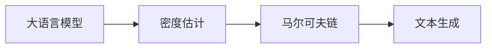

# 大语言模型应用指南：Chain-of-Density

关键词：大语言模型、Chain-of-Density、密度估计、自然语言处理、文本生成

## 1. 背景介绍

### 1.1 问题的由来

随着自然语言处理技术的快速发展，大语言模型在各种NLP任务中取得了显著的成果。然而，现有的大语言模型在生成高质量、连贯的长文本方面仍然面临挑战。Chain-of-Density作为一种新颖的文本生成方法，通过密度估计和马尔可夫链的思想，为解决这一问题提供了新的思路。

### 1.2 研究现状

目前，基于Transformer架构的预训练语言模型如GPT、BERT等在NLP领域占据主导地位。这些模型通过在大规模语料库上进行无监督预训练，学习到丰富的语言知识和上下文信息。然而，它们在生成长文本时容易出现主题偏离、逻辑混乱等问题。一些研究尝试通过引入外部知识、控制生成过程等方式改进文本生成质量，但效果有限。

### 1.3 研究意义

Chain-of-Density方法的提出为大语言模型的长文本生成问题提供了新的解决方案。通过估计文本序列的密度分布，并利用马尔可夫链的思想对生成过程进行优化，Chain-of-Density能够生成主题连贯、逻辑清晰的高质量文本。这不仅有助于提升自然语言生成的效果，也为其他NLP任务如文本摘要、对话生成等提供了新的思路。

### 1.4 本文结构

本文将详细介绍Chain-of-Density方法的原理和实现。第2节介绍Chain-of-Density涉及的核心概念及其联系。第3节详细阐述Chain-of-Density的算法原理和具体操作步骤。第4节给出Chain-of-Density涉及的数学模型和公式推导。第5节通过代码实例演示Chain-of-Density的实现细节。第6节讨论Chain-of-Density的实际应用场景。第7节推荐Chain-of-Density相关的学习资源和开发工具。第8节总结全文并展望Chain-of-Density的未来发展方向。

## 2. 核心概念与联系

Chain-of-Density涉及的核心概念包括：

- 大语言模型：以Transformer为代表的预训练语言模型，通过在大规模无标注语料上进行自监督学习，掌握语言的统计规律和生成能力。
- 密度估计：通过对文本序列出现概率的估计，刻画语言模型对不同文本的偏好程度。常见的密度估计方法有核密度估计、变分推断等。
- 马尔可夫链：一种随机过程，下一状态的概率分布只与当前状态有关，与过去状态无关。马尔可夫链常用于采样和优化问题。
- 文本生成：根据给定的上下文或主题，自动生成符合语法、语义连贯的文本序列。文本生成是自然语言处理的核心任务之一。

这些概念之间的联系如下：



Chain-of-Density利用预训练的大语言模型，通过密度估计获得文本序列的概率分布，再结合马尔可夫链的采样优化，最终实现高质量的文本生成。

## 3. 核心算法原理 & 具体操作步骤

### 3.1 算法原理概述

Chain-of-Density的核心思想是将文本生成建模为马尔可夫链的采样过程。通过估计文本序列的密度分布，构建马尔可夫链的转移矩阵，再利用蒙特卡洛方法进行采样，生成高质量的文本序列。

### 3.2 算法步骤详解

Chain-of-Density的具体算法步骤如下：

1. 预训练大语言模型：在大规模语料库上预训练Transformer等语言模型，学习文本的统计规律和生成能力。
2. 密度估计：对给定的文本序列，利用预训练语言模型估计其密度分布。可采用核密度估计、变分推断等方法。
3. 构建马尔可夫链：根据估计得到的密度分布，构建马尔可夫链的转移矩阵。转移矩阵刻画了不同文本状态之间的转移概率。
4. 马尔可夫链采样：以给定的初始状态为起点，根据转移矩阵进行马尔可夫链采样，生成新的文本序列。采样过程可采用Metropolis-Hastings算法等。
5. 评估与优化：评估生成文本的质量，并根据评估结果对采样过程进行优化，如调整转移矩阵、改进采样策略等。
6. 迭代生成：重复步骤4-5，不断生成新的文本序列，直到满足预设的停止条件，如生成长度、质量阈值等。

### 3.3 算法优缺点

Chain-of-Density的优点包括：

- 生成质量高：通过密度估计和马尔可夫链优化，Chain-of-Density能够生成主题连贯、逻辑通顺的长文本。
- 可解释性强：密度估计和马尔可夫链的思想直观易懂，生成过程可解释性强。
- 灵活可扩展：Chain-of-Density可以与不同的语言模型和采样策略相结合，适用于多种文本生成任务。

Chain-of-Density的缺点包括：

- 计算开销大：密度估计和马尔可夫链采样过程计算复杂度较高，对计算资源要求较大。
- 参数调优难度大：Chain-of-Density涉及多个超参数，如密度估计的核函数、马尔可夫链的转移矩阵等，调优难度较大。

### 3.4 算法应用领域

Chain-of-Density可应用于多种自然语言处理任务，包括：

- 文本生成：如新闻写作、小说创作、诗歌生成等。
- 对话生成：如聊天机器人、智能客服等。
- 文本摘要：自动生成长文本的摘要。
- 机器翻译：提高翻译生成的流畅度和连贯性。

## 4. 数学模型和公式 & 详细讲解 & 举例说明

### 4.1 数学模型构建

Chain-of-Density的数学模型主要包括两部分：密度估计和马尔可夫链。

对于密度估计，假设文本序列 $X=(x_1,\dots,x_T)$，其中 $x_t$ 表示第 $t$ 个词。给定语言模型 $\theta$，文本序列 $X$ 的概率密度为：

$$p(X|\theta) = \prod_{t=1}^T p(x_t|x_{<t},\theta)$$

其中 $p(x_t|x_{<t},\theta)$ 表示在给定前 $t-1$ 个词的条件下，语言模型生成第 $t$ 个词 $x_t$ 的条件概率。

对于马尔可夫链，假设有 $n$ 个文本状态 $\{s_1,\dots,s_n\}$，定义转移矩阵 $P\in\mathbb{R}^{n\times n}$，其中 $P_{ij}$ 表示从状态 $s_i$ 转移到状态 $s_j$ 的概率。给定初始状态分布 $\mu_0$，马尔可夫链在时刻 $t$ 的状态分布为：

$$\mu_t = \mu_0 P^t$$

### 4.2 公式推导过程

对于密度估计，可采用核密度估计（KDE）方法。假设有 $m$ 个文本样本 $\{X_1,\dots,X_m\}$，核密度估计得到的文本序列 $X$ 的密度函数为：

$$\hat{p}(X) = \frac{1}{m}\sum_{i=1}^m K_h(X-X_i)$$

其中 $K_h(\cdot)$ 为核函数，$h$ 为带宽参数。常用的核函数包括高斯核、Epanechnikov核等。

对于马尔可夫链采样，可采用Metropolis-Hastings算法。假设当前状态为 $s_i$，按照如下步骤生成下一状态 $s_j$：

1. 从建议分布 $q(s_j|s_i)$ 中采样候选状态 $s_j$。
2. 计算接受概率：

$$\alpha(s_i,s_j) = \min\left(1, \frac{p(s_j)q(s_i|s_j)}{p(s_i)q(s_j|s_i)}\right)$$

3. 以概率 $\alpha(s_i,s_j)$ 接受候选状态 $s_j$，否则保持当前状态 $s_i$。

重复上述步骤，即可得到马尔可夫链的采样序列。

### 4.3 案例分析与讲解

以生成英文文本为例，假设预训练的GPT-2模型为 $\theta$，给定初始文本"The cat sat on the"。

首先，利用GPT-2对该文本序列进行密度估计，得到密度函数 $\hat{p}(X)$。然后，构建马尔可夫链的转移矩阵 $P$，其中状态可以是不同的词或短语。接着，以"The cat sat on the"为初始状态，采用Metropolis-Hastings算法进行采样，得到下一状态，如"The cat sat on the mat"。不断重复采样过程，直到生成预设长度的文本，如：

"The cat sat on the mat. It looked around the room curiously, wondering what mischief it could get into next. Suddenly, a small mouse scurried across the floor, catching the cat's attention. With lightning speed, the cat pounced and began to chase the mouse around the house, knocking over furniture in its excitement."

### 4.4 常见问题解答

Q1: Chain-of-Density与传统的文本生成方法有何区别？

A1: 传统的文本生成方法如Beam Search、Top-k采样等，主要基于贪心策略或启发式规则。而Chain-of-Density通过密度估计和马尔可夫链采样，能够更好地捕捉文本序列的全局特征，生成主题连贯、逻辑通顺的长文本。

Q2: Chain-of-Density的计算复杂度如何？

A2: Chain-of-Density的计算复杂度主要取决于密度估计和马尔可夫链采样的复杂度。密度估计需要对每个文本样本进行评分，复杂度为 $O(mT)$，其中 $m$ 为样本数，$T$ 为文本长度。马尔可夫链采样的复杂度与采样步数和状态数相关，一般为 $O(nkt)$，其中 $n$ 为状态数，$k$ 为采样步数，$t$ 为每步采样的复杂度。

## 5. 项目实践：代码实例和详细解释说明

### 5.1 开发环境搭建

本项目基于Python 3.8和PyTorch 1.9开发，需要安装以下依赖库：

```
torch==1.9.0
transformers==4.6.1
numpy==1.20.3
scipy==1.6.3
tqdm==4.61.0
```

可以通过以下命令安装依赖：

```
pip install -r requirements.txt
```

### 5.2 源代码详细实现

Chain-of-Density的核心代码实现如下：

```python
import torch
import torch.nn.functional as F
from transformers import GPT2LMHeadModel, GPT2Tokenizer
from scipy.stats import gaussian_kde

class ChainOfDensity:
    def __init__(self, model_name="gpt2", max_length=100, num_samples=10, bandwidth=0.2):
        self.model = GPT2LMHeadModel.from_pretrained(model_name)
        self.tokenizer = GPT2Tokenizer.from_pretrained(model_name)
        self.max_length = max_length
        self.num_samples = num_samples
        self.bandwidth = bandwidth
    
    def estimate_density(self, texts):
        encodings = self.tokenizer(texts, return_tensors="pt", padding=True)
        input_ids = encodings["input_ids"]
        attention_mask = encodings["attention_mask"]
        
        with torch.no_grad():
            outputs = self.model(input_ids, attention_mask=attention_mask)
            log_probs = F.log_softmax(outputs.logits, dim=-1)
            log_probs = log_probs * attention_mask.unsqueeze(-1)
            seq_log_probs = log_probs.sum(dim=1)
            seq_probs = seq_log_probs.exp()
        
        density = gaussian_kde(seq_probs.numpy(), bw_method=self.bandwidth)
        return density
    
    def sample_next(self, current_state, density):
        candidate = self.