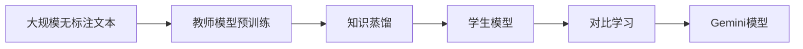

# 大语言模型应用指南：Gemini简介

作者：禅与计算机程序设计艺术 / Zen and the Art of Computer Programming 

关键词：大语言模型、Gemini、预训练模型、自然语言处理、人工智能

## 1. 背景介绍
### 1.1 问题的由来
随着人工智能技术的飞速发展，自然语言处理(NLP)领域取得了突破性进展。大语言模型的出现，为NLP任务带来了革命性的变革。传统的NLP方法主要依赖于人工构建的特征和规则，难以应对语言的复杂性和多样性。而大语言模型通过在海量文本数据上进行预训练，能够自动学习语言的内在规律和表示，大大提升了NLP任务的性能。

### 1.2 研究现状
目前，业界已经涌现出一系列优秀的大语言模型，如GPT系列、BERT、XLNet等。这些模型在多个NLP任务上取得了state-of-the-art的结果，展现出强大的语言理解和生成能力。然而，现有的大语言模型仍然存在一些局限性，如参数量巨大、训练成本高昂、推理速度较慢等问题。因此，如何设计更加高效、轻量级的大语言模型，成为当前研究的热点方向之一。

### 1.3 研究意义
大语言模型的研究对于推动人工智能的发展具有重要意义。一方面，大语言模型为NLP任务提供了更加强大的基础模型，有助于提升自然语言理解、对话系统、机器翻译等应用的性能。另一方面，大语言模型蕴含着丰富的语言知识和常识，可以作为知识库为其他AI系统提供支持。此外，探索更加高效、轻量级的大语言模型，有利于降低计算资源消耗，促进模型的实际应用和普及。

### 1.4 本文结构
本文将围绕Gemini这一新型大语言模型展开介绍和分析。首先，我们将阐述大语言模型的核心概念和Gemini的特点。然后，详细讲解Gemini的核心算法原理和具体操作步骤。接着，通过数学模型和公式推导，深入剖析Gemini的内在机制。此外，我们还将提供Gemini的代码实例和详细解释，展示其在实际项目中的应用。最后，总结Gemini的研究成果，展望大语言模型的未来发展趋势和面临的挑战。

## 2. 核心概念与联系

大语言模型是指在大规模文本数据上预训练得到的语言模型。与传统的语言模型不同，大语言模型通常采用深度神经网络结构，包含数亿甚至上千亿的参数。通过在海量无标注文本上进行自监督学习，大语言模型能够捕捉到语言的内在规律和语义表示，具备强大的语言理解和生成能力。

Gemini是一种新型的大语言模型，其核心思想是将知识蒸馏和对比学习相结合，实现高效、轻量级的预训练。具体而言，Gemini采用教师-学生框架，先使用一个大型的教师模型在大规模文本上进行预训练，然后通过知识蒸馏将教师模型的知识转移到一个小型的学生模型中。同时，Gemini引入对比学习机制，通过最大化正样本对之间的相似度，最小化负样本对之间的相似度，增强模型学习语义表示的能力。

下图展示了Gemini的整体框架：

可以看出，Gemini通过知识蒸馏和对比学习的结合，既继承了教师模型的知识，又通过对比学习增强了语义表示能力，最终得到一个高效、轻量级的大语言模型。

## 3. 核心算法原理 & 具体操作步骤
### 3.1 算法原理概述
Gemini的核心算法包括两个部分：知识蒸馏和对比学习。

知识蒸馏是指将一个大型复杂模型(教师模型)的知识转移到一个小型简单模型(学生模型)的过程。具体而言，教师模型在大规模文本上进行预训练，学习到丰富的语言知识。然后，学生模型通过模仿教师模型的行为(如预测概率分布)来学习教师模型的知识。知识蒸馏可以显著减小模型的参数量和计算开销，同时保持较高的性能。

对比学习是一种自监督学习方法，旨在学习数据的语义表示。其核心思想是通过最大化正样本对之间的相似度，最小化负样本对之间的相似度，从而使模型能够区分不同语义的样本。在Gemini中，对比学习用于增强学生模型学习语义表示的能力。通过引入对比学习，学生模型不仅要模仿教师模型的行为，还要最大化与正样本的相似度，最小化与负样本的相似度，从而更好地捕捉语言的语义信息。

### 3.2 算法步骤详解
Gemini的训练过程可以分为以下几个步骤：

1. 教师模型预训练：在大规模无标注文本上预训练一个大型的教师模型(如BERT、RoBERTa等)，使其学习到丰富的语言知识。

2. 构建学生模型：设计一个小型的学生模型，通常采用与教师模型相同的架构，但层数和隐藏单元数减少。

3. 知识蒸馏：
   - 使用教师模型对文本进行推理，得到软标签(soft labels)，即教师模型的预测概率分布。
   - 学生模型通过最小化与软标签的交叉熵损失，来模仿教师模型的行为。
   
4. 对比学习：
   - 对于每个文本样本，构建正样本对和负样本对。正样本对可以是同一个文本的不同部分，负样本对可以是不同文本的片段。
   - 学生模型通过最大化正样本对的相似度，最小化负样本对的相似度，来学习语义表示。
   
5. 联合训练：将知识蒸馏损失和对比学习损失相加，作为学生模型的总损失函数，进行端到端的训练。

6. 模型评估：在下游任务上评估学生模型的性能，如文本分类、命名实体识别、问答等。

通过以上步骤，Gemini可以在继承教师模型知识的同时，通过对比学习增强语义表示能力，最终得到一个高效、轻量级的大语言模型。

### 3.3 算法优缺点
Gemini算法的优点包括：

1. 高效轻量：通过知识蒸馏，Gemini可以将大型教师模型的知识压缩到小型学生模型中，显著减小模型的参数量和计算开销，提高推理速度。

2. 语义表示增强：引入对比学习机制，使学生模型能够更好地捕捉语言的语义信息，提升下游任务的性能。

3. 通用性强：Gemini可以应用于各种类型的大语言模型，如BERT、GPT等，具有良好的通用性和扩展性。

然而，Gemini算法也存在一些局限性：

1. 教师模型依赖：Gemini的性能在很大程度上取决于教师模型的质量。如果教师模型性能不佳，学生模型的性能也会受到影响。

2. 负样本选择：对比学习中负样本的选择对算法性能有较大影响。如何选择合适的负样本是一个需要仔细考虑的问题。

3. 训练成本：尽管学生模型的参数量和计算开销减小了，但Gemini仍然需要在大规模文本上进行预训练，训练成本仍然较高。

### 3.4 算法应用领域
Gemini作为一种通用的大语言模型，可以应用于各种自然语言处理任务，如：

1. 文本分类：将文本划分到预定义的类别中，如情感分析、新闻分类等。

2. 命名实体识别：识别文本中的实体(如人名、地名、组织机构名等)并进行分类。

3. 问答系统：根据给定的问题，从大规模文本中找到相关的答案。

4. 机器翻译：将一种语言的文本翻译成另一种语言，如中英文翻译。

5. 文本摘要：自动生成文本的摘要，提取关键信息。

6. 对话系统：构建智能对话系统，实现人机交互。

此外，Gemini还可以作为预训练模型，为其他自然语言处理任务提供良好的初始化参数，提升任务性能。

## 4. 数学模型和公式 & 详细讲解 & 举例说明
### 4.1 数学模型构建
Gemini的数学模型主要包括两部分：知识蒸馏和对比学习。

对于知识蒸馏，我们定义教师模型为 $T$，学生模型为 $S$。给定一个文本序列 $x=(x_1,x_2,...,x_n)$，教师模型的输出为软标签 $y^T=(y^T_1,y^T_2,...,y^T_n)$，其中 $y^T_i$ 表示第 $i$ 个位置的预测概率分布。学生模型的输出为 $y^S=(y^S_1,y^S_2,...,y^S_n)$。知识蒸馏的目标是最小化学生模型输出与软标签之间的交叉熵损失：

$$\mathcal{L}_{KD}=-\sum_{i=1}^n\sum_{j=1}^Vy^T_{ij}\log y^S_{ij}$$

其中，$V$ 表示词表大小，$y^T_{ij}$ 和 $y^S_{ij}$ 分别表示教师模型和学生模型在第 $i$ 个位置第 $j$ 个词上的预测概率。

对于对比学习，我们使用InfoNCE损失函数。给定一个正样本对 $(x,x^+)$ 和 $K$ 个负样本 $\{x^-_1,x^-_2,...,x^-_K\}$，学生模型将它们编码为向量表示 $(\mathbf{z},\mathbf{z}^+,\mathbf{z}^-_1,\mathbf{z}^-_2,...,\mathbf{z}^-_K)$。对比学习的目标是最大化正样本对的相似度，最小化负样本对的相似度：

$$\mathcal{L}_{CL}=-\log\frac{\exp(\text{sim}(\mathbf{z},\mathbf{z}^+)/\tau)}{\exp(\text{sim}(\mathbf{z},\mathbf{z}^+)/\tau)+\sum_{i=1}^K\exp(\text{sim}(\mathbf{z},\mathbf{z}^-_i)/\tau)}$$

其中，$\text{sim}(\cdot,\cdot)$ 表示余弦相似度，$\tau$ 是温度超参数。

最终，Gemini的总损失函数为知识蒸馏损失和对比学习损失的加权和：

$$\mathcal{L}=\lambda\mathcal{L}_{KD}+(1-\lambda)\mathcal{L}_{CL}$$

其中，$\lambda\in[0,1]$ 是平衡两个损失的权重系数。

### 4.2 公式推导过程
知识蒸馏损失的推导过程如下：

1. 定义教师模型的软标签：
$$y^T_i=\text{softmax}(\mathbf{z}^T_i/\tau)$$
其中，$\mathbf{z}^T_i$ 是教师模型在第 $i$ 个位置的输出向量，$\tau$ 是温度超参数。

2. 定义学生模型的输出：
$$y^S_i=\text{softmax}(\mathbf{z}^S_i)$$
其中，$\mathbf{z}^S_i$ 是学生模型在第 $i$ 个位置的输出向量。

3. 计算交叉熵损失：
$$\mathcal{L}_{KD}=-\sum_{i=1}^n\sum_{j=1}^Vy^T_{ij}\log y^S_{ij}$$

对比学习损失的推导过程如下：

1. 定义正样本对和负样本对的相似度：
$$\text{sim}(\mathbf{z},\mathbf{z}^+)=\frac{\mathbf{z}^\top\mathbf{z}^+}{\|\math