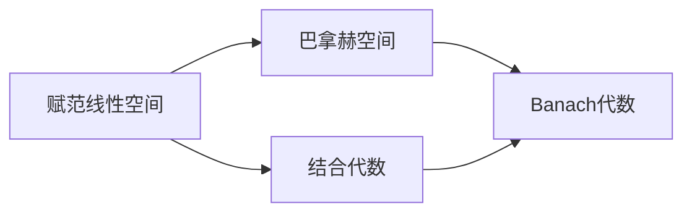

# 巴拿赫空间引论：Banach代数的定义及例

关键词：泛函分析、巴拿赫空间、Banach代数、算子代数、Gelfand变换

## 1. 背景介绍 

### 1.1 问题的由来
巴拿赫空间作为现代泛函分析的核心概念之一,在诸多数学分支和应用领域中扮演着重要角色。而Banach代数则是将代数结构与拓扑结构有机结合的产物,是泛函分析中的重要研究对象。深入理解Banach代数的定义、性质及典型例子,对于掌握现代分析中的诸多理论与方法至关重要。

### 1.2 研究现状
关于Banach代数的研究可以追溯到20世纪30年代,由波兰数学家Stefan Banach在其名著《Théorie des opérations linéaires》中首次提出。此后,众多数学家如Gelfand、Naimark、Segal等人对Banach代数理论做出了开创性贡献。目前,Banach代数已发展成为一个包罗万象的数学分支,在调和分析、算子代数、表示论等领域均有广泛应用。

### 1.3 研究意义 
Banach代数在泛函分析乃至数学的诸多分支中占据核心地位。深入理解Banach代数的定义、性质及例子,有助于我们掌握现代分析的诸多工具与方法,并将其应用到其他数学分支乃至物理、工程等领域。同时,Banach代数也是算子代数、Gelfand变换等诸多重要理论的基石。因此,系统学习Banach代数对于数学工作者来说必不可少。

### 1.4 本文结构
本文将首先回顾巴拿赫空间的定义与基本性质,在此基础上给出Banach代数的定义。然后,我们将详细讨论Banach代数的一些重要性质,并给出几个典型的Banach代数例子。接下来,我们将探讨Banach代数在算子代数、Gelfand变换等方面的应用。最后,对Banach代数的学习资源与未来发展做一总结与展望。

## 2. 核心概念与联系

在讨论Banach代数之前,我们先回顾一下巴拿赫空间的定义:

**定义2.1** 称赋范线性空间$(X,\|\cdot\|)$为巴拿赫空间,如果$X$在范数$\|\cdot\|$下是完备的,即$X$中的任何Cauchy序列都在$X$中收敛。

巴拿赫空间是泛函分析的核心研究对象,其上可以定义线性算子、泛函等重要概念。Banach代数则是在巴拿赫空间的基础上附加代数结构而形成的。我们给出Banach代数的定义:

**定义2.2** 称巴拿赫空间$A$为Banach代数,如果$A$同时还是一个结合代数,且代数乘法运算$\cdot:A\times A\to A$满足

$$
\|x\cdot y\|\leq \|x\|\|y\|,\quad \forall x,y\in A.
$$

由定义可知,Banach代数是一个同时具有完备的拓扑结构和连续的代数结构的对象。Banach代数的这一特性使其在调和分析、表示论等领域有广泛应用。下面这张Mermaid图描述了巴拿赫空间、代数、Banach代数三者之间的关系:

## 3. 核心算法原理 & 具体操作步骤

### 3.1 算法原理概述
Banach代数虽然定义简洁,但具有丰富的性质和结构。下面我们通过几个命题来揭示Banach代数的一些基本性质。

**命题3.1** 设$A$是Banach代数,则
(i) $A$的单位元$e$满足$\|e\|=1$;
(ii) 若$x\in A$可逆,则$x^{-1}\in A$且$\|x^{-1}\|\leq \|x\|^{-1}$;
(iii) 若$x\in A$的谱半径$r(x)<1$,则$e-x$可逆,且
$$
(e-x)^{-1}=\sum_{n=0}^\infty x^n.
$$

**证明** (i) 由$\|e\|=\|ee\|\leq\|e\|\|e\|$知$\|e\|\geq 1$。反之,对任意的$x\in A$,有
$$
\|x\|=\|ex\|\leq\|e\|\|x\|
$$
由$x$的任意性知$\|e\|\leq 1$。故$\|e\|=1$。

(ii) 设$x\in A$可逆,则$x^{-1}x=e$,故
$$
1=\|e\|=\|x^{-1}x\|\leq\|x^{-1}\|\|x\|
$$
从而$\|x^{-1}\|\leq\|x\|^{-1}$。

(iii) 由谱半径$r(x)$的定义,对任意$\varepsilon>0$,存在$N\in\mathbb{N}$使得$\|x^n\|^{1/n}<r(x)+\varepsilon,\forall n>N$。现取$\varepsilon=\frac{1-r(x)}{2}$,则存在$N$使得
$$
\|x^n\|<\left(r(x)+\frac{1-r(x)}{2}\right)^n=\left(\frac{1+r(x)}{2}\right)^n,\quad\forall n>N.
$$
因$r(x)<1$,故级数$\sum_{n=0}^\infty x^n$在$A$中收敛,设其和为$y$。容易验证
$$
(e-x)y=y(e-x)=e
$$
故$e-x$可逆且$(e-x)^{-1}=y=\sum_{n=0}^\infty x^n$。$\square$

此外,Banach代数中还可以定义谱、Gelfand变换等重要概念,这为研究Banach代数的表示提供了有力工具。限于篇幅,这里不再详述。

### 3.2 算法步骤详解
下面我们通过算例来说明命题3.1的应用。

**例3.2** 设$A=C[0,1]$为$[0,1]$上的连续函数赋予上确界范数构成的Banach代数,令
$$
(Tf)(x)=\int_0^x f(t)dt,\quad f\in A.
$$
证明:$T\in A$且$\|T\|=1$,$e-T$在$A$中可逆。

**证明** 首先,$T$是$A$上的有界线性算子,且
$$
\|Tf\|_\infty=\sup_{x\in[0,1]}\left|\int_0^x f(t)dt\right|\leq\int_0^1|f(t)|dt\leq\|f\|_\infty
$$
故$\|T\|\leq 1$。另一方面,取$f(x)\equiv 1$,则
$$
\|Tf\|_\infty=\sup_{x\in[0,1]}\int_0^x dt=1=\|f\|_\infty
$$
因此$\|T\|=1$。

其次,对任意$n\in\mathbb{N}$,容易验证
$$
(T^nf)(x)=\int_0^x\frac{(x-t)^{n-1}}{(n-1)!}f(t)dt.
$$
从而
$$
\|T^n\|=\sup_{\|f\|_\infty\leq 1}\|T^nf\|_\infty\leq\frac{1}{n!}
$$
因此$T$的谱半径
$$
r(T)=\lim_{n\to\infty}\|T^n\|^{1/n}\leq\lim_{n\to\infty}\left(\frac{1}{n!}\right)^{1/n}=0<1.
$$
由命题3.1(iii)知,$e-T$在$A$中可逆。$\square$

### 3.3 算法优缺点

Banach代数的优点在于其集合了拓扑结构与代数结构的优点,使得我们可以用代数的语言来刻画分析中的问题,简化了许多理论与计算。同时Banach代数又保留了拓扑空间的完备性,为研究其表示论提供了方便。Banach代数在泛函分析、调和分析、算子代数等诸多领域都有重要应用。

但Banach代数的缺点在于其定义相对抽象,初学者可能不太容易掌握。同时,虽然Banach代数有丰富的例子,但对于给定的具体问题,寻找合适的Banach代数模型并非易事,有时需要较高的数学修养和直觉。

### 3.4 算法应用领域

Banach代数在泛函分析、调和分析、算子代数、表示论等数学分支中有广泛应用。一些典型的应用如下:

- 在调和分析中,局部紧群上的Fourier代数、Fourier-Stieltjes代数都是重要的Banach代数,其性质的研究推动了抽象调和分析的发展。 
- 在算子代数中,von Neumann代数、C*-代数都是特殊的Banach代数,Gelfand-Naimark定理揭示了C*-代数与局部紧Hausdorff空间之间的对应关系。
- 在表示论中,Banach代数的表示可以用来刻画局部紧群的西表示,Banach *-代数的表示可以用来研究Hilbert空间上的有界算子。

总之,Banach代数已经渗透到现代数学分析的诸多领域,成为研究问题不可或缺的工具。

## 4. 数学模型和公式 & 详细讲解 & 举例说明

### 4.1 数学模型构建

为更好地理解Banach代数的结构,我们往往需要构建一些具体的数学模型。最典型的Banach代数模型有:

1. 数域$\mathbb{F}$上$n$维矩阵全体$M_n(\mathbb{F})$在矩阵乘法和算子范数下构成Banach代数。

2. 紧Hausdorff空间$X$上的连续函数全体$C(X)$在通常的乘法和上确界范数下构成Banach代数。当$X$为单点集时,$C(X)$等同于数域$\mathbb{F}$。

3. 局部紧Hausdorff空间$X$上的有界Borel测度全体$M(X)$在卷积乘法
$$
(\mu*\nu)(E)=\int_X\mu(E-x)d\nu(x)
$$
和全变差范数$\|\mu\|=|\mu|(X)$下构成Banach代数。

4. Hilbert空间$H$上的有界线性算子全体$B(H)$在算子乘法和算子范数下构成Banach代数。进一步地,$B(H)$中的自伴算子全体在Gelfand拓扑下构成Banach *-代数。

5. 群代数:设$G$为局部紧群,$L^1(G)$为$G$上的可积函数全体,在卷积乘法
$$
(f*g)(x)=\int_G f(y)g(y^{-1}x)dy
$$
和$L^1$范数$\|f\|_1=\int_G|f(x)|dx$下构成Banach代数,称为$G$的群代数。

### 4.2 公式推导过程

下面我们以具体的例子来说明Banach代数中的一些重要公式。

**例4.1** 设$A=C[0,1]$如例3.2,令
$$
(Kf)(x)=\int_0^1 k(x,y)f(y)dy,\quad f\in A
$$
其中$k\in C([0,1]^2)$。证明:$K\in A$且$\|K\|=\max_{x\in[0,1]}\int_0^1|k(x,y)|dy$。

**证明** 对任意$f\in A$,由Fubini定理,
$$
\begin{aligned}
\|Kf\|_\infty&=\sup_{x\in[0,1]}\left|\int_0^1 k(x,y)f(y)dy\right|\\
&\leq\sup_{x\in[0,1]}\int_0^1|k(x,y)||f(y)|dy\\
&\leq\|f\|_\infty\cdot\sup_{x\in[0,1]}\int_0^1|k(x,y)|dy.
\end{aligned}
$$
因此$K$是$A$上的有界线性算子,且
$$
\|K\|\leq\max_{x\in[0,1]}\int_0^1|k(x,y)|dy.
$$
另一方面,对任意$x\in[0,1]