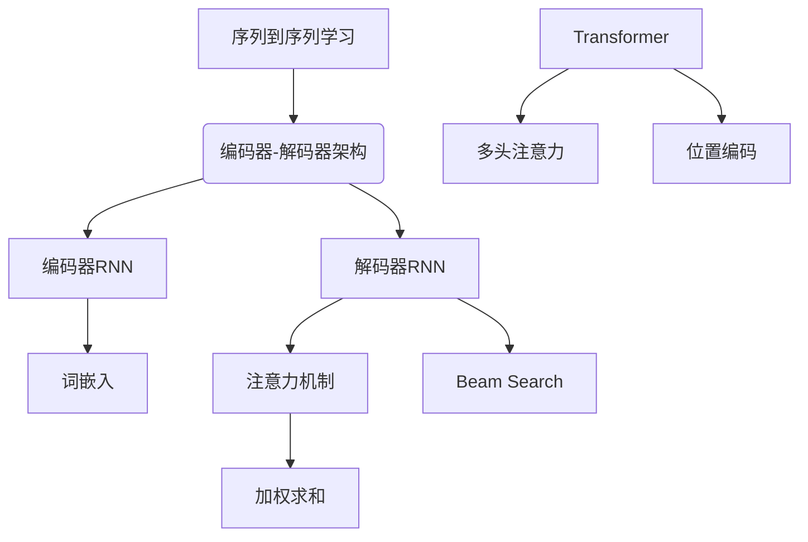

# 序列到序列学习 原理与代码实例讲解

## 1. 背景介绍

### 1.1 问题的由来

在自然语言处理、机器翻译、语音识别等领域中,我们常常需要将一个序列映射为另一个序列。例如,在机器翻译任务中,我们需要将一种语言的句子映射为另一种语言的句子;在语音识别任务中,我们需要将语音信号序列映射为文本序列。这类问题被统称为"序列到序列(Sequence-to-Sequence)"问题。

传统的机器学习模型,如隐马尔可夫模型(HMM)和条件随机场(CRF),在处理这类问题时存在一些局限性。它们需要人工设计特征,并且在处理长序列时效果较差。近年来,benefiting from 大数据和强大的计算能力,基于深度学习的序列到序列模型展现出了优异的性能,成为解决此类问题的主流方法。

### 1.2 研究现状

2014年,Google的Cho等人提出了Encoder-Decoder框架,将序列到序列问题建模为两个递归神经网络(RNN)的组合,分别负责编码输入序列和解码生成输出序列。该工作开启了基于深度学习的序列到序列模型的研究热潮。

随后,研究人员提出了多种改进模型,如注意力机制(Attention)、门控循环单元(GRU)、双向RNN等,显著提高了模型的性能。2017年,Transformer模型的提出进一步推动了该领域的发展,其完全基于注意力机制,避免了RNN的一些缺陷,在多个任务上取得了新的state-of-the-art表现。

如今,序列到序列模型已广泛应用于机器翻译、文本摘要、对话系统、图像字幕生成等多个领域,并不断在理论和应用层面获得创新。

### 1.3 研究意义

序列到序列学习是自然语言处理、语音识别等领域的核心问题,具有重要的理论意义和应用价值:

- 理论意义:序列到序列模型将输入序列映射为输出序列,涉及序列建模、表示学习、注意力机制等多个前沿领域,是探索深度学习在处理结构化数据方面的能力和局限性的重要研究方向。

- 应用价值:序列到序列模型在机器翻译、语音识别、文本摘要等领域展现出优异的性能,是实现人机智能交互的关键技术,在信息化社会中具有广阔的应用前景。

因此,深入研究序列到序列学习的原理和实践,对于推动人工智能理论发展和技术创新具有重要意义。

### 1.4 本文结构

本文将全面介绍序列到序列学习的理论原理、主流模型、训练技巧以及实践应用。内容安排如下:

- 第2部分介绍序列到序列学习的核心概念和模型框架。
- 第3部分详细阐述编码器-解码器模型、注意力机制等核心算法原理。
- 第4部分构建数学模型,推导公式,并结合案例进行讲解。
- 第5部分提供完整的代码实例,并对关键模块进行解读。
- 第6部分介绍序列到序列模型在实际应用中的场景。
- 第7部分推荐相关学习资源、开发工具和论文。
- 第8部分总结研究成果,展望未来发展趋势和面临的挑战。
- 第9部分列举常见问题并给出解答。

## 2. 核心概念与联系

序列到序列学习(Sequence-to-Sequence Learning)旨在建立一种将输入序列映射为输出序列的模型,常用于机器翻译、文本摘要、对话系统等任务。其核心思想是使用编码器-解码器(Encoder-Decoder)架构:

- 编码器(Encoder)是一个递归神经网络(RNN),读取输入序列,获取其语义表示。
- 解码器(Decoder)是另一个RNN,根据编码器的输出和上一步生成的单词,预测当前单词,逐个生成输出序列。

在这一过程中,涉及以下几个关键概念:

- 词嵌入(Word Embedding):将词映射为实值向量,作为RNN的输入。
- 注意力机制(Attention Mechanism):计算编码器输出在解码器的每一步的加权和,作为解码器的辅助输入,提高长期依赖捕获能力。
- Beam Search:在解码时,保留若干候选序列并并行生成,提高输出质量。

2017年,Transformer模型进一步推动了该领域的发展,其完全基于注意力机制,避免了RNN的一些缺陷:

- 多头注意力(Multi-Head Attention):将注意力分为多个子空间,提高关注焦点的多样性。
- 位置编码(Positional Encoding):将位置信息编码到序列的表示中,因为Transformer没有递归结构。

这些核心概念和模块相互关联、环环相扣,共同构建了序列到序列学习的理论框架和实现基础。

## 3. 核心算法原理 & 具体操作步骤

### 3.1 算法原理概述

序列到序列学习的核心算法是编码器-解码器(Encoder-Decoder)框架,包括以下两个主要组件:

1. **编码器(Encoder)**
   
   编码器是一个RNN,读取源序列 $X=(x_1,x_2,...,x_n)$,计算每个时间步的隐藏状态 $\overrightarrow{h_t}=f(\overrightarrow{h_{t-1}},x_t)$。最终隐藏状态 $\overrightarrow{h_n}$ 被视为源序列的语义表示,也称为上下文向量(Context Vector)。

2. **解码器(Decoder)**

   解码器也是一个RNN,基于上下文向量和前一步生成的单词,预测当前时间步的输出单词概率分布:

   $$P(y_t|y_1,...,y_{t-1},X)=g(\overrightarrow{h_n},y_1,...,y_{t-1})$$

   其中,函数 $g$ 由解码器RNN及其输出层组成。在测试时,通过贪心搜索或Beam Search等方法,从概率分布中选取最优单词序列作为输出。

编码器将可变长度的输入序列编码为固定长度的语义向量,解码器则将该向量解码为目标序列,实现了序列到序列的映射过程。

### 3.2 算法步骤详解

1. **数据预处理**

   - 文本数据:执行分词、词性标注、命名实体识别等预处理
   - 非文本数据:进行归一化、降噪等处理

2. **构建词汇表**

   统计语料库中的词频,选取高频词构建源语言和目标语言的词汇表。

3. **生成词嵌入**

   使用Word2Vec、GloVe等工具,将词汇表中的词映射为实值向量,作为RNN的输入。

4. **训练编码器**

   - 编码器是一个RNN,可使用LSTM或GRU等变体
   - 按时间步迭代输入源序列的词嵌入向量
   - 记录最终时间步的隐藏状态作为上下文向量

5. **训练解码器**

   - 解码器也是一个RNN,可与编码器共享权重
   - 在每一步,解码器读取上一步预测的单词和编码器的上下文向量
   - 通过Softmax输出层计算预测单词的概率分布
   - 使用交叉熵损失函数、教师强制等策略进行训练

6. **注意力机制(Optional)**

   - 计算编码器隐藏状态与解码器当前状态的注意力权重
   - 将编码器隐藏状态的加权和作为解码器的辅助输入
   - 注意力机制赋予模型对输入序列的选择性关注能力

7. **Beam Search解码**

   - 在测试时,通过贪心搜索或Beam Search等策略生成输出序列
   - Beam Search是一种启发式图搜索算法,保留若干候选序列并并行生成,提高输出质量

8. **模型评估**

   - 使用BLEU、METEOR、TER等指标评估模型在测试集上的性能
   - 根据评估结果,调整超参数,重新训练模型

通过上述步骤,模型可以学习将源语言序列映射为目标语言序列的能力,实现序列到序列的转换。算法的关键在于编码器-解码器架构、注意力机制和高效的训练策略。

### 3.3 算法优缺点

**优点:**

1. **端到端建模**:无需人工设计特征,直接从数据中学习映射规律。
2. **可变长度输入输出**:能够处理长度不等的序列,适用范围广泛。
3. **注意力机制**:赋予模型选择性关注输入的能力,提高长期依赖捕获能力。
4. **高效可并行**:无递归结构,具有高效的并行计算能力。

**缺点:**

1. **训练数据量要求大**:需要大量的并行语料库作为训练数据。
2. **暴露偏置问题**:模型可能会学习并放大训练数据中存在的偏见。
3. **解释性差**:深度神经网络模型的内部运作机制通常难以解释。
4. **输出冗余**:生成的序列可能存在冗余、重复的现象。

总的来说,序列到序列模型在处理可变长度序列映射任务时表现出色,但也存在一些需要进一步改进的不足。

### 3.4 算法应用领域

序列到序列学习算法在以下领域都有广泛的应用:

1. **机器翻译**
   
   将一种自然语言的句子翻译为另一种语言,是序列到序列学习的典型应用场景。

2. **文本摘要**

   将文章或长文本自动压缩为简明扼要的摘要文本,属于序列到序列的文本生成任务。

3. **对话系统**

   根据对话历史上下文,预测下一个合理的回复语句,实现人机对话交互。

4. **语音识别**

   将语音信号序列转录为文本序列,是语音与文本之间的序列转换任务。

5. **图像字幕生成**

   根据图像内容自动生成对应的文本描述,是从图像像素序列到文本序列的映射。

6. **化学反应预测**

   预测给定反应物的产物序列,是将分子结构序列映射为产物序列的任务。

7. **蛋白质二级结构预测**

   根据蛋白质氨基酸序列,预测其二级结构序列,广泛应用于生物信息学领域。

可见,序列到序列学习算法具有极为广泛的应用前景,是自然语言处理、计算机视觉、生物信息学等多个领域的核心技术。

## 4. 数学模型和公式 & 详细讲解 & 举例说明

### 4.1 数学模型构建

我们将序列到序列学习问题建模为,给定源序列 $X=(x_1,x_2,...,x_n)$,预测目标序列 $Y=(y_1,y_2,...,y_m)$ 的条件概率分布:

$$P(Y|X;\theta)=\prod_{t=1}^m P(y_t|y_1,...,y_{t-1},X;\theta)$$

其中, $\theta$ 为模型参数。

根据Chain Rule,该联合概率可以分解为一个序列条件概率的乘积。我们的目标是最大化训练数据的对数似然:

$$\max_\theta \sum_{(X,Y)\in D}\log P(Y|X;\theta)$$

这里 $D$ 为训练数据集。

为了建模上述条件概率分布,我们使用编码器-解码器框架:

1. **编码器(Encoder)**

   编码器是一个RNN,读取源序列 $X$,计算每个时间步的隐藏状态:
   
   $$\overrightarrow{h_t}=f(\overrightarrow{h_{t-1}},x_t)$$
   
   最终隐藏状态 $\overrightarrow{h_n