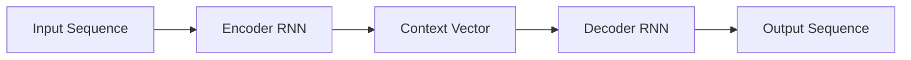
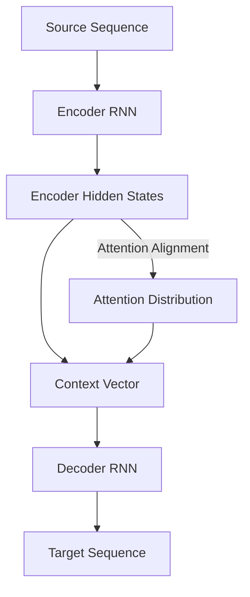

# 序列到序列模型 (Seq2Seq) 原理与代码实例讲解

作者：禅与计算机程序设计艺术 / Zen and the Art of Computer Programming

关键词：序列到序列模型, Seq2Seq, Encoder-Decoder, 注意力机制, 神经机器翻译, 聊天机器人, 文本摘要

## 1. 背景介绍

### 1.1 问题的由来

随着人工智能技术的飞速发展,自然语言处理(NLP)领域也取得了巨大的进步。在NLP的诸多任务中,如何让机器像人一样进行"序列到序列"的学习与转换,是一个极具挑战性但又意义重大的课题。所谓"序列到序列"(Sequence-to-Sequence,简称Seq2Seq),是指将一个序列转换为另一个序列的过程,比如机器翻译、对话系统、文本摘要等。然而,传统的NLP方法很难有效地解决Seq2Seq问题。

### 1.2 研究现状

2014年,Google的Sutskever等人在其开创性的论文[1]中首次提出了Seq2Seq模型,并将其成功应用于神经机器翻译(Neural Machine Translation, NMT)任务。此后,Seq2Seq模型迅速成为NLP领域的研究热点,并在机器翻译[2]、对话系统[3]、文本摘要[4]、语音识别[5]、图像字幕[6]等诸多任务上取得了突破性进展。尤其是随着注意力机制(Attention Mechanism)[7]、Transformer[8]等技术的出现,Seq2Seq模型的性能得到了进一步提升。

### 1.3 研究意义 

Seq2Seq模型作为一种端到端(End-to-End)的深度学习范式,具有建模灵活、学习能力强、应用范围广等优点,代表了未来NLP技术发展的重要方向。深入研究Seq2Seq模型的原理和实现,对于推动人工智能在认知智能、人机交互等领域的进步具有重要意义。同时,Seq2Seq思想也为其他序列学习问题(如时间序列预测)提供了新的思路。因此,全面掌握Seq2Seq模型具有重要的理论价值和实践意义。

### 1.4 本文结构

本文将全面系统地介绍Seq2Seq模型的原理、架构与应用。第2部分介绍Seq2Seq的核心概念;第3部分阐述Seq2Seq的算法原理与步骤;第4部分给出Seq2Seq的数学模型与公式推导;第5部分通过代码实例讲解Seq2Seq的实现细节;第6部分展望Seq2Seq的应用场景;第7部分推荐Seq2Seq的学习资源;第8部分总结全文并展望未来;第9部分为常见问题解答。

## 2. 核心概念与联系

Seq2Seq模型的核心是Encoder-Decoder(编码器-解码器)架构[1]。如图1所示,Encoder将输入序列压缩为一个上下文向量(Context Vector),Decoder再根据该向量生成输出序列。Encoder和Decoder通常都是RNN(Recurrent Neural Network,循环神经网络)[9]。

图1 Seq2Seq模型的Encoder-Decoder架构

Seq2Seq模型还引入了Attention机制[7]来提升性能,如图2所示。Attention让Decoder在生成每个输出时,都能重点关注输入序列中与之最相关的部分,而不是只依赖单一的Context Vector。Decoder通过Attention对齐(Alignment)计算出一个Attention Distribution,作为各Encoder隐藏态(Hidden State)的加权求和,得到Attention Vector供解码使用。

图2 Seq2Seq模型的Attention机制

另一个重要概念是Teacher Forcing[10],即在训练时将上一步的真实标签(而非模型预测)作为Decoder的输入,以加快收敛和提高性能。但在推理时,Decoder输入只能来自上一步的预测输出。

总之,Encoder-Decoder、Attention、Teacher Forcing等技术共同构成了Seq2Seq模型的核心,使其能够灵活高效地建模各类序列转换问题。

## 3. 核心算法原理 & 具体操作步骤

### 3.1 算法原理概述

Seq2Seq模型的本质是,学习从输入序列到输出序列的条件概率分布 $P(y|x)$,其中 $x=(x_1,\ldots,x_m)$ 为输入序列,$y=(y_1,\ldots,y_n)$ 为输出序列。根据条件概率公式,有:

$$P(y|x)=\prod_{i=1}^n P(y_i|y_1,\ldots,y_{i-1},x)$$

Seq2Seq模型通过Encoder-Decoder架构来建模 $P(y|x)$:

- **Encoder** 是一个RNN,将输入序列 $x$ 编码为一个固定长度的实值向量(记为 $c$),即Context Vector:

$$c=q(h_1,\ldots,h_m)$$

其中 $h_i$ 是Encoder RNN在第 $i$ 步的隐藏态, $q$ 是一个非线性函数(通常取最后一个隐藏态,或做求和/均值)。

- **Decoder** 也是一个RNN,在给定Context Vector $c$ 和之前生成的字符 $y_1,\ldots,y_{i-1}$ 的条件下,预测下一个字符 $y_i$ 的概率分布:

$$P(y_i|y_1,\ldots,y_{i-1},x)=g(y_{i-1},s_i,c)$$

其中 $s_i$ 是Decoder RNN在第 $i$ 步的隐藏态, $g$ 是一个非线性函数(通常是Softmax)。

Decoder在每一步将上一步的输出 $y_{i-1}$ 和当前隐藏态 $s_i$ 作为输入,连同Context Vector $c$ 一起,预测下一个字符的概率分布,直到生成结束符<EOS>。

### 3.2 算法步骤详解

Seq2Seq模型的训练和推理(预测)过程如下:

**训练阶段:**
1. 将输入序列 $x=(x_1,\ldots,x_m)$ 送入Encoder,计算各时间步隐藏态 $h_1,\ldots,h_m$。
2. 将 $h_1,\ldots,h_m$ 通过函数 $q$ 转换为Context Vector $c$。
3. 将 $c$ 作为Decoder的初始隐藏态 $s_0$。
4. for i=1,2,...,n:
   - 将上一步的真实输出 $y_{i-1}$ 和当前隐藏态 $s_{i-1}$ 作为Decoder输入,连同 $c$ 一起计算当前隐藏态 $s_i$。
   - 将 $s_i$ 通过函数 $g$ 转换为当前字符 $y_i$ 的概率分布 $P(y_i|y_1,\ldots,y_{i-1},x)$。
   - 计算真实标签 $y_i^*$ 的交叉熵损失 $-\log P(y_i^*|y_1,\ldots,y_{i-1},x)$。
5. 将各步损失相加并优化模型参数。

**推理阶段:**
1. 将输入序列 $x=(x_1,\ldots,x_m)$ 送入Encoder,计算Context Vector $c$。
2. 将 $c$ 作为Decoder的初始隐藏态 $s_0$,同时令 $y_0$ 为起始符<BOS>。 
3. for i=1,2,...,until <EOS>:
   - 将上一步的预测输出 $y_{i-1}$ 和当前隐藏态 $s_{i-1}$ 作为Decoder输入,连同 $c$ 一起计算当前隐藏态 $s_i$。
   - 将 $s_i$ 通过函数 $g$ 转换为当前字符 $y_i$ 的概率分布,并选择概率最大的字符作为 $y_i$。
   - 若 $y_i$ 为<EOS>则停止解码,否则继续。

以上是Seq2Seq模型的基本算法流程。在实践中,我们还可以采用一些改进技术,如Attention机制、Beam Search、双向/多层RNN、正则化等,以进一步提升模型性能。

### 3.3 算法优缺点

Seq2Seq模型的优点主要有:
- 端到端学习,无需人工特征工程,建模灵活。
- 能够处理不定长的输入输出序列。
- 通过Encoder将输入序列压缩为语义向量,具有信息提炼能力。
- 通过Attention机制缓解长程依赖问题,提高对齐和泛化能力。
- 适用范围广,可用于机器翻译、对话、摘要等多种任务。

但Seq2Seq模型也存在一些局限性:
- 由于RNN的递归结构,训练和推理的计算开销较大。
- 容易出现消失梯度问题,难以捕捉长距离依赖。
- 推理误差容易累积,导致生成质量下降。
- 对低频词和未登录词建模能力有限。
- 语言模型能力不足,生成的句子可能不够流畅自然。

尽管如此,这些问题大都可以通过一些技术改进来缓解,如Attention、Beam Search、Pointer Network[11]、Copy Mechanism[12]、Scheduled Sampling[13]等。

### 3.4 算法应用领域

Seq2Seq模型在NLP领域得到了广泛应用,主要场景包括:

- **机器翻译**: 将源语言句子转换为目标语言,如Google NMT[2]。
- **对话系统**: 根据上下文生成恰当的对话回复,如小冰聊天机器人[3]。  
- **文本摘要**: 将长文本浓缩为简短摘要,提取关键信息,如Pointer-Generator[14]。
- **语音识别**: 将语音信号转录为文本,如Listen,Attend and Spell[5]。
- **图像字幕**: 根据图像内容生成自然语言描述,如Show,Attend and Tell[6]。
- **问答系统**: 根据问题生成自然语言答案,如Transformer-XL[15]。

除了NLP,Seq2Seq思想还可用于其他序列学习任务,如时间序列预测、DNA序列分析、视频字幕等。可以说,Seq2Seq模型为各类复杂序列问题的求解提供了一种通用范式。

## 4. 数学模型和公式 & 详细讲解 & 举例说明

### 4.1 数学模型构建

设输入序列为 $x=(x_1,\ldots,x_m)$,输出序列为 $y=(y_1,\ldots,y_n)$,Seq2Seq模型的数学形式可表示为:

$$P(y|x)=\prod_{i=1}^n P(y_i|y_1,\ldots,y_{i-1},x)$$

其中, $P(y_i|y_1,\ldots,y_{i-1},x)$ 是在给定前 $i-1$ 个输出和整个输入序列的条件下,生成第 $i$ 个输出的概率。

具体来说,Encoder将输入序列 $x$ 通过RNN编码为一系列隐藏态 $h_1,\ldots,h_m$:

$$h_i=f_{\theta}(x_i,h_{i-1})$$

其中 $f_{\theta}$ 是一个非线性变换(通常是LSTM[16]或GRU[17]),$\theta$ 为参数。

接着,Encoder通过函数 $q$ 将 $h_1,\ldots,h_m$ 汇总为一个固定长度的Context Vector $c$:

$$c=q(h_1,\ldots,h_m)$$

其中 $q$ 可以是简单的取最后一个隐藏态,也可以是做求和或均值操作。

Decoder根据Context Vector $c$ 和之前的输出,通过另一个RNN生成当前输出的概率分布:

$$s_i=f_{\phi}(y_{i-1},s_{i-1},c)$$
$$P(y_i|y_1,\ldots,y_{i-1},x)=g(y_{i-1},s_i,c)$$

其中 $s_i$ 是Decoder RNN的隐藏态,$f_{\phi}$ 和 $g$ 都是非线性变换(通常 $g$ 是Softmax函数