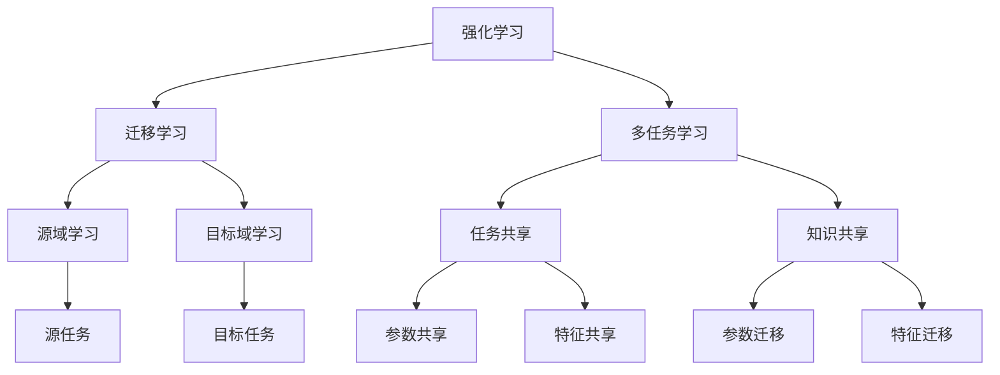

# 强化学习Reinforcement Learning中的迁移学习与多任务学习

## 1. 背景介绍

### 1.1 问题的由来

在人工智能领域中,强化学习(Reinforcement Learning, RL)是一种基于环境交互的学习范式,其目标是训练智能体(Agent)通过试错学习,采取一系列行动以最大化长期累积奖励。传统的强化学习算法往往需要针对每个任务从头开始训练,这种方式效率低下且资源消耗大。

随着人工智能技术的快速发展,越来越多的应用场景需要智能体具备快速学习新任务的能力。然而,在复杂环境中从头学习新任务存在诸多挑战,例如需要大量的试错次数、收敛缓慢等。因此,如何利用已学习的知识来加速新任务的学习过程成为了一个迫切需要解决的问题。

### 1.2 研究现状

为解决上述问题,研究人员提出了迁移学习(Transfer Learning)和多任务学习(Multi-Task Learning)等方法。迁移学习旨在利用在源域(Source Domain)上学习到的知识来加速在目标域(Target Domain)上的学习过程。多任务学习则是同时学习多个相关任务,利用不同任务之间的相关性来提高整体学习效率。

近年来,这两种方法在强化学习领域得到了广泛关注和研究。研究人员提出了多种迁移学习和多任务学习算法,并将其应用于机器人控制、游戏AI、自然语言处理等多个领域,取得了令人鼓舞的进展。

### 1.3 研究意义 

迁移学习和多任务学习在强化学习中的应用具有重要意义:

1. **加速学习效率**: 利用已学习的知识可以显著减少智能体在新环境中的探索时间,从而加快学习速度。
2. **提高样本利用率**: 通过共享不同任务之间的相关知识,可以更有效地利用有限的样本数据。
3. **提升泛化能力**: 在多个相关任务上进行联合训练,有助于智能体提高对新环境的适应能力。
4. **节省计算资源**: 避免了针对每个新任务从头训练的资源浪费。

### 1.4 本文结构

本文将全面介绍强化学习中的迁移学习和多任务学习方法。首先阐述核心概念及其相互关系,然后深入探讨核心算法原理和数学模型,并通过实例代码和应用场景说明其具体实现和应用。最后,我们将总结该领域的发展趋势和面临的挑战,并推荐相关工具和资源以供进一步学习。

## 2. 核心概念与联系

强化学习(Reinforcement Learning)是一种基于环境交互的学习范式,智能体通过采取行动并获得奖励反馈来学习最优策略。

迁移学习(Transfer Learning)旨在利用在源域(Source Domain)学习到的知识,加速在目标域(Target Domain)上的学习过程。它包括源任务(Source Task)和目标任务(Target Task)两个部分。

多任务学习(Multi-Task Learning)则是同时学习多个相关任务,通过任务共享(Task Sharing)和知识共享(Knowledge Sharing)来提高整体学习效率。任务共享包括参数共享(Parameter Sharing)和特征共享(Feature Sharing),知识共享包括参数迁移(Parameter Transfer)和特征迁移(Feature Transfer)。

迁移学习和多任务学习在强化学习中的应用,可以加速学习新任务、提高样本利用率、提升泛化能力并节省计算资源。

## 3. 核心算法原理 & 具体操作步骤

### 3.1 算法原理概述

在传统的强化学习中,智能体需要针对每个新任务从头开始学习,这种方式效率低下且资源消耗大。迁移学习和多任务学习的核心思想是利用已学习的知识来加速新任务的学习过程。

迁移学习算法通常包括以下三个主要步骤:

1. **源域学习**: 在源域(Source Domain)上训练智能体,获得源任务(Source Task)的策略或者知识。
2. **知识迁移**: 将源域学习到的知识(如策略、参数、特征等)迁移到目标域(Target Domain)。
3. **目标域学习**: 在目标域上基于迁移的知识继续训练,加速目标任务(Target Task)的学习过程。

多任务学习算法则通过以下步骤实现多个任务之间的知识共享:

1. **任务共享**: 不同任务共享部分或全部参数、特征等,实现知识的相互借鉴。
2. **联合训练**: 同时在多个任务上进行训练,使智能体能够学习到多个任务之间的共同知识。
3. **知识迁移**: 将联合训练获得的知识迁移到新的任务上,加速新任务的学习过程。

### 3.2 算法步骤详解

#### 3.2.1 迁移学习算法步骤

1. **源域学习**
   - 选择合适的强化学习算法(如DQN、A3C等)
   - 在源域环境中训练智能体,获得源任务的策略或知识

2. **知识迁移**
   - 确定需要迁移的知识类型(如策略、参数、特征等)
   - 设计合适的迁移方法(如参数共享、特征映射等)
   - 将源域知识迁移到目标域

3. **目标域学习**
   - 基于迁移的知识,在目标域环境中继续训练智能体
   - 根据需要对迁移知识进行微调(Fine-tuning)
   - 评估智能体在目标任务上的性能

#### 3.2.2 多任务学习算法步骤

1. **任务共享**
   - 确定需要共享的知识类型(如参数、特征等)
   - 设计共享知识的网络结构(如硬参数共享、软参数共享等)
   - 构建能够同时处理多个任务的智能体模型

2. **联合训练**
   - 选择合适的强化学习算法(如A3C、PPO等)
   - 同时在多个任务上训练智能体模型
   - 根据需要设计任务权重或其他策略来平衡不同任务的训练

3. **知识迁移**
   - 将联合训练获得的知识(如参数、特征等)迁移到新任务上
   - 基于迁移知识在新任务上继续训练,加速学习过程
   - 评估智能体在新任务上的性能

### 3.3 算法优缺点

#### 3.3.1 迁移学习算法

**优点**:

- 能够有效利用已学习的知识,加速新任务的学习过程
- 减少了探索时间和样本需求,提高了学习效率
- 可以在源域和目标域存在差异的情况下实现知识迁移

**缺点**:

- 源域和目标域之间的差异过大可能导致负迁移(Negative Transfer)
- 需要合理选择迁移方法和迁移知识类型,否则可能无法获得性能提升
- 存在一定的额外计算开销,如知识迁移、微调等步骤

#### 3.3.2 多任务学习算法

**优点**:

- 能够利用不同任务之间的相关性,提高整体学习效率
- 通过联合训练,智能体可以学习到更加通用的知识表示
- 有助于提升智能体在新环境中的泛化能力

**缺点**:

- 不同任务之间的相关性过低可能导致性能下降
- 需要合理设计任务权重等策略来平衡不同任务的训练
- 联合训练过程中,不同任务之间可能存在干扰和竞争

### 3.4 算法应用领域

迁移学习和多任务学习在强化学习领域有广泛的应用前景:

- **机器人控制**: 通过迁移学习和多任务学习,机器人可以快速适应新环境并学习新的控制策略。
- **游戏AI**: 在不同游戏之间共享知识,可以加速AI代理在新游戏中的学习过程。
- **自然语言处理**: 利用多任务学习,可以训练出能够处理多种NLP任务的通用语言模型。
- **计算机视觉**: 在不同视觉任务之间进行迁移学习和多任务学习,可以提高模型的泛化能力。
- **推荐系统**: 通过多任务学习,可以同时优化多个推荐指标,提高推荐系统的整体性能。

## 4. 数学模型和公式 & 详细讲解 & 举例说明

### 4.1 数学模型构建

在强化学习中,我们通常将环境建模为马尔可夫决策过程(Markov Decision Process, MDP),用一个五元组 $\langle \mathcal{S}, \mathcal{A}, \mathcal{P}, \mathcal{R}, \gamma \rangle$ 来表示:

- $\mathcal{S}$ 是状态空间(State Space)的集合
- $\mathcal{A}$ 是动作空间(Action Space)的集合
- $\mathcal{P}$ 是状态转移概率(State Transition Probability)
- $\mathcal{R}$ 是奖励函数(Reward Function)
- $\gamma \in [0, 1)$ 是折现因子(Discount Factor)

在每个时间步 $t$,智能体根据当前状态 $s_t \in \mathcal{S}$ 选择一个动作 $a_t \in \mathcal{A}$,然后环境根据状态转移概率 $\mathcal{P}(s_{t+1}|s_t, a_t)$ 转移到下一个状态 $s_{t+1}$,并给出相应的奖励 $r_t = \mathcal{R}(s_t, a_t, s_{t+1})$。

智能体的目标是学习一个策略 $\pi: \mathcal{S} \rightarrow \mathcal{A}$,使得在该策略下的长期累积折现奖励最大:

$$
J(\pi) = \mathbb{E}_{\pi} \left[ \sum_{t=0}^{\infty} \gamma^t r_t \right]
$$

其中 $\mathbb{E}_{\pi}$ 表示在策略 $\pi$ 下的期望。

在迁移学习和多任务学习中,我们需要考虑多个相关但不同的MDP,分别表示为 $M_i = \langle \mathcal{S}_i, \mathcal{A}_i, \mathcal{P}_i, \mathcal{R}_i, \gamma_i \rangle$,其中 $i$ 表示第 $i$ 个任务或域。我们的目标是利用这些不同MDP之间的相关性,加速学习过程并提高整体性能。

### 4.2 公式推导过程

在迁移学习中,我们通常采用以下方法来实现知识迁移:

1. **策略迁移**

假设在源域 $M_s$ 上已经学习到了一个优秀的策略 $\pi_s$,我们希望将其迁移到目标域 $M_t$ 上。一种简单的方法是直接将 $\pi_s$ 作为目标域的初始策略,然后在目标域上继续训练:

$$
\pi_t^{(0)} = \pi_s
$$

2. **参数迁移**

如果源域和目标域的状态空间和动作空间相似,我们可以将源域学习到的参数作为目标域的初始参数,然后在目标域上进行微调。假设智能体使用参数 $\theta$ 来表示策略,我们有:

$$
\theta_t^{(0)} = \theta_s
$$

3. **特征迁移**

在一些情况下,源域和目标域的状态空间或动作空间可能存在差异。这时我们可以通过特征映射函数 $\phi$ 将源域的特征映射到目标域,从而实现特征迁移:

$$
\phi_t(s_t, a_t) = g(\phi_s(s_s, a_s))
$$

其中 $g$ 是一个映射函数,用于将源域特征映射到目标域特征空间。

在多任务学习中,我们通常采用硬参数共享或软参数共享的方式来实现不同任务之