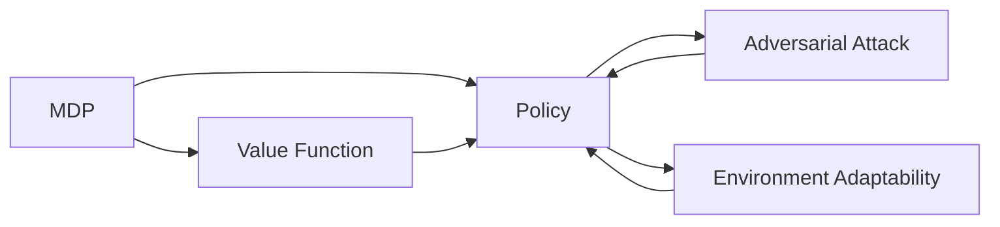

关键词：强化学习、对抗性训练、环境适应性、深度学习、智能体、奖励函数、状态空间、动作空间、策略梯度、模仿学习、元学习、迁移学习

# 强化学习Reinforcement Learning对抗性训练与环境适应性

## 1. 背景介绍

### 1.1 问题的由来

强化学习(Reinforcement Learning, RL)作为一种重要的机器学习范式,其目标是让智能体(Agent)通过与环境的交互学习到最优策略,以获得最大的累积奖励。然而,现实世界中的环境往往是复杂多变的,传统的强化学习算法很难适应环境的变化,导致性能下降。此外,当面对对抗性环境时,比如在自动驾驶、网络安全等领域,智能体需要具备一定的鲁棒性和适应性。因此,如何提高强化学习算法的对抗性和环境适应性,成为了一个亟待解决的问题。

### 1.2 研究现状

近年来,学术界针对强化学习的对抗性和适应性问题开展了大量研究。一方面,研究者们提出了多种对抗性训练方法,如对抗性策略优化[1]、对抗性样本训练[2]等,通过引入对抗性扰动提高模型的鲁棒性。另一方面,也有学者探索利用迁移学习[3]、元学习[4]等技术,让训练好的智能体能够快速适应新环境。此外,多智能体强化学习[5]通过引入多个智能体的互动与博弈,让智能体学习应对环境中的不确定性因素。尽管取得了一定进展,但现有方法在应对复杂真实场景时仍然面临诸多挑战。

### 1.3 研究意义

强化学习的对抗性和适应性问题具有重要的理论意义和实际价值:

1. 推动强化学习理论的发展。对抗性和适应性是智能体和环境博弈过程的重要特征,深入研究有助于揭示强化学习机制的本质规律。

2. 拓展强化学习的应用领域。提高算法的对抗性和适应性,将大大拓宽强化学习在自动驾驶、机器人、网络安全、金融等领域的应用前景。

3. 促进通用人工智能的发展。具备强鲁棒性和快速学习能力是通用AI系统的重要特征,相关研究为实现通用AI奠定基础。

### 1.4 本文结构

本文将围绕强化学习的对抗性训练与环境适应性展开探讨。第2部分介绍相关的核心概念;第3部分重点阐述几种主要的对抗性训练算法原理;第4部分建立算法的数学模型并给出公式推导;第5部分通过项目实践演示算法的代码实现;第6部分分析算法在实际场景中的应用;第7部分推荐相关的学习资源;第8部分总结全文并展望未来研究方向;第9部分列举常见问题解答。

## 2. 核心概念与联系

在探讨强化学习的对抗性和适应性之前,有必要先明确几个核心概念:

- 马尔可夫决策过程(Markov Decision Process, MDP):描述智能体与环境交互的数学框架,包含状态空间、动作空间、转移概率、奖励函数等要素。

- 策略(Policy):智能体根据当前状态选择动作的映射函数,用 $\pi$ 表示。最优策略 $\pi^*$ 能够获得最大期望累积奖励。

- 价值函数(Value Function):评估状态或者状态-动作对的长期累积奖励,分为状态价值函数 $V^\pi(s)$ 和动作价值函数 $Q^\pi(s,a)$。

- 对抗性攻击(Adversarial Attack):在智能体策略学习过程中,通过恶意构造的状态扰动或奖励扰动,使得智能体行为偏离最优策略。

- 环境适应性(Environment Adaptability):智能体在面对新环境时,能够快速学习和调整策略以保持良好性能的能力。

这些概念之间存在紧密联系。MDP定义了强化学习问题,智能体通过学习最优策略来最大化累积奖励。价值函数为策略评估提供了重要依据。对抗性攻击会影响环境动力学,导致智能体难以学到鲁棒的策略。而环境适应性让智能体能够应对环境变化,提高在真实复杂场景中的决策能力。下图展示了这些概念间的逻辑关系:

## 3. 核心算法原理 & 具体操作步骤

### 3.1 算法原理概述

对抗性训练和环境适应性的强化学习算法主要包括以下几类:

1. 对抗性策略优化(Adversarial Policy Optimization):通过引入对抗性智能体与原智能体博弈,增强策略的鲁棒性,代表算法有RARL[1]等。

2. 对抗性样本训练(Adversarial Sample Training):在状态空间中加入对抗性扰动,使得智能体能够应对恶意构造的状态,代表算法有SA-DDPG[2]等。

3. 元强化学习(Meta Reinforcement Learning):通过元学习让智能体学会快速适应新环境,代表算法有MAML[4]等。 

4. 迁移强化学习(Transfer Reinforcement Learning):利用已有知识加速在新环境中的策略学习,代表算法有PRL[3]等。

这些算法从不同角度增强了强化学习的对抗性和适应性,具体选择需要结合实际问题的特点。

### 3.2 算法步骤详解

以对抗性策略优化中的RARL算法为例,其主要步骤如下:

1. 初始化原智能体(protagonist)和对抗智能体(adversary)的策略网络 $\pi_p$ 和 $\pi_a$,以及价值网络 $V_p$ 和 $V_a$。

2. 重复以下步骤,直到满足终止条件:

   a. 原智能体与对抗智能体在环境中交互,收集轨迹数据 $\tau_p$ 和 $\tau_a$。

   b. 利用采集的数据,计算原智能体的策略梯度:

   $$\nabla_{\theta_p} J(\pi_p) = \mathbb{E}_{s,a\sim\tau_p} [\nabla_{\theta_p} \log \pi_p(a|s) A^{\pi_p}(s,a)]$$

   其中 $A^{\pi_p}(s,a)$ 为优势函数。
   
   c. 计算对抗智能体的策略梯度:
   
   $$\nabla_{\theta_a} J(\pi_a) = \mathbb{E}_{s,a\sim\tau_a} [\nabla_{\theta_a} \log \pi_a(a|s) (-A^{\pi_p}(s,a))]$$
   
   d. 利用策略梯度更新两个智能体的策略网络参数 $\theta_p$ 和 $\theta_a$。
   
   e. 利用时序差分算法更新两个智能体的价值网络。

3. 输出训练好的原智能体策略 $\pi_p$。

通过引入对抗智能体,RARL算法让原智能体在训练过程中学习应对敌手的对抗策略,从而得到更加鲁棒的策略。

### 3.3 算法优缺点

RARL等对抗性策略优化算法的优点包括:

- 通过显式建模对抗过程,直接优化智能体的鲁棒性。
- 博弈框架易于扩展,可以引入多个对抗智能体。
- 实现难度相对较低,基于传统强化学习算法改进。

但它们也存在一些局限:

- 需要精心设计对抗智能体的奖励函数,难以平衡双方的进化速度。
- 训练不稳定,原智能体和对抗智能体的策略可能难以收敛。
- 计算开销大,需要训练多个智能体,采样效率较低。

针对这些问题,一些工作尝试引入集中训练、策略正则化等机制,取得了一定改善。未来仍需要在算法的稳定性和样本效率等方面进一步探索。

### 3.4 算法应用领域

对抗性训练和环境适应性的强化学习算法在以下领域具有广泛应用前景:

- 自动驾驶:训练鲁棒的驾驶策略,应对恶劣天气、故障等突发情况。
- 网络安全:学习对抗网络攻击的检测和防御策略。
- 金融交易:训练适应市场变化的量化交易算法。
- 机器人控制:提高机器人在非结构化环境下的适应能力和抗干扰能力。
- 游戏AI:训练能够对抗人类玩家的游戏智能体。

随着算法的不断发展和完善,有望在更多实际场景中得到应用,为构建安全可靠的智能系统提供重要支撑。

## 4. 数学模型和公式 & 详细讲解 & 举例说明

### 4.1 数学模型构建

对抗性强化学习可以用随机博弈的数学模型来刻画。考虑一个两人零和马尔可夫博弈 $\mathcal{G}=\langle\mathcal{S},\mathcal{A}_1,\mathcal{A}_2,\mathcal{P},\mathcal{R}_1,\mathcal{R}_2,\gamma\rangle$,其中:

- $\mathcal{S}$ 为状态空间。
- $\mathcal{A}_1$ 和 $\mathcal{A}_2$ 分别为两个玩家的动作空间。 
- $\mathcal{P}:\mathcal{S}\times\mathcal{A}_1\times\mathcal{A}_2\rightarrow\mathcal{S}$ 为转移概率函数。
- $\mathcal{R}_1:\mathcal{S}\times\mathcal{A}_1\times\mathcal{A}_2\rightarrow\mathbb{R}$ 和 $\mathcal{R}_2:\mathcal{S}\times\mathcal{A}_1\times\mathcal{A}_2\rightarrow\mathbb{R}$ 为两个玩家的奖励函数,且满足零和条件 $\mathcal{R}_1+\mathcal{R}_2=0$。
- $\gamma\in[0,1]$ 为折扣因子。

两个玩家分别为原智能体和对抗智能体,其策略为 $\pi_1:\mathcal{S}\rightarrow\mathcal{A}_1$ 和 $\pi_2:\mathcal{S}\rightarrow\mathcal{A}_2$。博弈的目标是找到纳什均衡(Nash Equilibrium),即一组最优策略 $\pi_1^*$ 和 $\pi_2^*$ 满足:

$$V_1^{\pi_1^*,\pi_2^*}(s) \geq V_1^{\pi_1,\pi_2^*}(s), \forall \pi_1,s$$

$$V_2^{\pi_1^*,\pi_2^*}(s) \geq V_2^{\pi_1^*,\pi_2}(s), \forall \pi_2,s$$

其中 $V_1^{\pi_1,\pi_2}(s)$ 和 $V_2^{\pi_1,\pi_2}(s)$ 分别为在状态 $s$ 下,双方采取联合策略 $(\pi_1,\pi_2)$ 时获得的期望累积奖励:

$$V_1^{\pi_1,\pi_2}(s) = \mathbb{E}_{\pi_1,\pi_2}[\sum_{t=0}^\infty \gamma^t \mathcal{R}_1(s_t,a_t^1,a_t^2) | s_0=s]$$

$$V_2^{\pi_1,\pi_2}(s) = \mathbb{E}_{\pi_1,\pi_2}[\sum_{t=0}^\infty \gamma^t \mathcal{R}_2(s_t,a_t^1,a_t^2) | s_0=s]$$

### 4.2 公式推导过程

为了求解纳什均衡,可以利用策略梯度定理分别优化两个智能体的策略。对于原智能体,其目标是最大化期望累积奖励:

$$J(\pi_1) = \mathbb{E}_{s\sim d^{\pi_1,\pi_2},a\sim\pi_1}[\mathcal{R}_1(s,a)]$$

根据策略梯度定理,其梯度为:

$$\nabla_{\theta_1} J