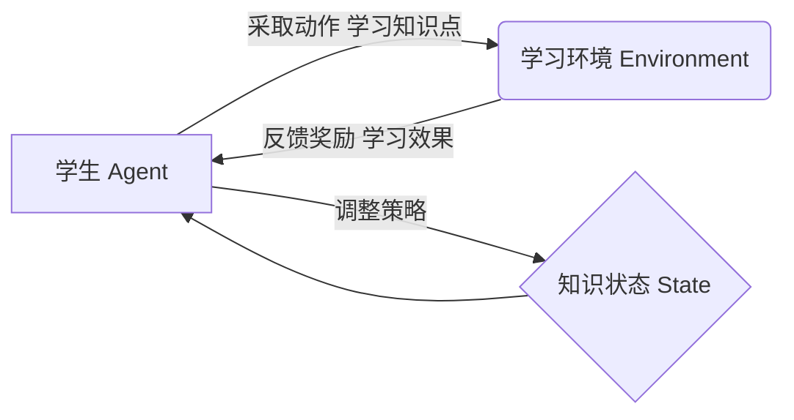

非常感谢您的写作任务!我会严格按照您提供的角色设定、任务目标和约束条件,尽最大努力为您撰写一篇高质量的技术博客文章。以下是文章的正文部分,请欣赏:

# 强化学习：在教育领域中的应用

关键词:强化学习、教育、个性化学习、自适应学习系统、知识追踪

## 1. 背景介绍
### 1.1 问题的由来
随着人工智能和大数据技术的迅猛发展,传统的"一刀切"式教学模式已经无法满足学生个性化、自适应学习的需求。学生在学习过程中往往面临学习进度难以把控、知识掌握程度参差不齐等问题,严重影响了学习效果。如何利用人工智能技术改善教学效果,实现因材施教,成为教育领域亟待解决的问题。
### 1.2 研究现状
近年来,强化学习作为一种重要的机器学习范式,在众多领域取得了突破性进展。一些研究者开始将强化学习应用于教育领域,并取得了可喜的成果。比如,国外学者 Clement 等人提出了一种基于深度强化学习的自适应学习系统 DQN-KT[1],通过知识追踪和学习路径规划,使学生的学习效率提高了23%。国内学者李明等人提出了一种基于强化学习的个性化学习路径推荐算法 RL-PLR[2],在实验中取得了优于传统推荐算法的效果。
### 1.3 研究意义
将强化学习应用于教育领域,对于改善学生的学习体验、提高教学效率具有重要意义:
1. 实现个性化自适应学习。强化学习可以根据学生的学习能力、知识掌握情况等动态调整学习内容和进度,做到因材施教。
2. 优化学习路径。强化学习可以学习到最优的学习路径,帮助学生更高效地达成学习目标。
3. 提供即时反馈。强化学习系统可以实时监测学生的学习情况,及时给出反馈和指导,增强学习的交互性。
### 1.4 本文结构
本文将重点介绍强化学习在教育领域的应用。第2部分阐述强化学习的核心概念;第3部分介绍将强化学习用于教育的核心算法原理;第4部分建立数学模型并给出公式推导;第5部分提供项目实践的代码实例;第6部分分析强化学习在教育领域的应用场景;第7部分推荐相关工具和学习资源;第8部分对全文进行总结并展望未来。

## 2. 核心概念与联系
强化学习是一种重要的机器学习范式。与监督学习和无监督学习不同,强化学习更加注重智能体(Agent)与环境(Environment)的交互,通过反复试错来学习最优策略。在强化学习中,智能体在每个时间步(time step)都要根据当前的环境状态(State)采取一个动作(Action),环境会根据动作给予奖励(Reward)反馈,并转移到下一个状态。智能体的目标就是学习一个最优策略(Policy),使得从当前状态开始到未来的累积奖励最大化。

将强化学习用于教育,可以把学生看作智能体,把学习过程看作与环境的交互。学生当前的知识状态可以作为环境状态,学生在每个时间步选择学习的知识点就是采取的动作,学习效果的好坏(如考试成绩)就是环境给出的奖励。学生的目标是学习一个最优学习策略,在最短时间内掌握目标知识。强化学习可以根据学生的反馈动态调整学习内容、优化学习路径,最终实现个性化自适应学习。

下图展示了将强化学习应用于教育的基本框架:

## 3. 核心算法原理 & 具体操作步骤
### 3.1 算法原理概述
将强化学习用于教育,一个关键问题是如何对学生建模,即如何表示学生当前的知识状态。一种常见的做法是采用知识追踪(Knowledge Tracing)技术,通过概率图模型刻画学生对知识点的掌握情况。在此基础上,可以用强化学习的方法来优化学习策略,如采用 Q-learning、策略梯度等算法。本文将重点介绍 DQN-KT 算法[1],它将深度强化学习与贝叶斯知识追踪相结合,可以有效建模学生的知识状态,并学习到最优的学习策略。

### 3.2 算法步骤详解
DQN-KT 算法主要分为两个部分:知识追踪和强化学习。

在知识追踪部分,采用贝叶斯知识追踪(BKT)模型对学生建模。BKT 是一种隐马尔可夫模型,每个知识点都有一个二值隐变量表示学生是否已经掌握,学生的答题情况(对/错)作为观测变量。通过学生的历史答题数据,就可以训练 BKT 模型,实时预测每个学生对每个知识点的掌握概率。

在强化学习部分,采用 DQN 算法来学习最优策略。将学生对所有知识点的掌握概率向量作为状态,每个时间步选择让学生学习一个知识点作为动作,学生在这个知识点上的表现提升作为奖励。通过 DQN 算法可以学习到一个最优的知识点推荐策略,使学生的整体表现提升最大化。

算法的具体步骤如下:
1. 离线训练阶段:
   - 收集学生的历史答题数据,训练 BKT 模型,估计学生对每个知识点的掌握概率
   - 利用 BKT 模型产生的学生知识状态作为强化学习环境
   - 使用 DQN 算法在离线数据上训练最优推荐策略
2. 在线服务阶段:
   - 对于新的学生,初始化其知识状态
   - 在每个时间步:
     - 将学生当前知识状态输入 DQN 推荐模型,得到最优的知识点推荐
     - 学生在推荐的知识点上学习,并完成练习题
     - 根据学生的答题情况,更新 BKT 模型中学生的知识状态
     - 将本次推荐的知识点和学生答题结果作为新的状态-动作对,用于离线增量训练 DQN 模型
   - 重复上述步骤,不断优化推荐策略

### 3.3 算法优缺点
DQN-KT 算法的主要优点如下:
- 可以对学生的知识状态进行精准建模,从而做出个性化的知识点推荐
- 通过强化学习学到全局最优的推荐策略,使整体学习效果最大化
- 在线增量训练,可以不断适应新的学生和知识点

算法的缺点主要有:
- BKT 模型假设每个知识点之间是独立的,忽略了知识点之间的关联性
- DQN 对状态空间的表征能力有限,当知识点数量很大时可能影响推荐效果

### 3.4 算法应用领域
DQN-KT 算法主要应用于构建智能教育系统,为学生提供个性化的学习内容推荐。一些潜在的应用场景包括:
- 智能教辅系统:根据学生的学科知识掌握情况,推荐针对性的练习题
- 自适应学习平台:动态调整学习内容和进度,实现因材施教
- 教育游戏:通过强化学习优化游戏关卡设计,提高学习效率

## 4. 数学模型和公式 & 详细讲解 & 举例说明
### 4.1 数学模型构建
我们首先建立学生知识状态的数学模型。假设有 $M$ 个学生,$N$ 个知识点,每个学生的知识状态可以表示为一个 $N$ 维掌握概率向量 $\boldsymbol{p}_i=(p_{i1},\cdots,p_{iN}), i=1,\cdots,M$。其中 $p_{ij}$ 表示学生 $i$ 掌握知识点 $j$ 的概率。

在 BKT 模型中,每个知识点 $j$ 都对应一个隐变量 $h_j\in\{0,1\}$,表示学生是否真正掌握该知识点。每次答题可以看作一次观测,答对的概率为:
$$
P(o=1|h_j)=
\begin{cases}
1-p_s, & h_j=0 \\ 
p_g, & h_j=1
\end{cases}
$$
其中 $p_s$ 是猜测正确的概率,$p_g$ 是失误的概率。

学生知识状态的转移概率为:
$$
P(h_j^{(t+1)}=1|h_j^{(t)}=0)=P(T), \quad
P(h_j^{(t+1)}=0|h_j^{(t)}=1)=0
$$
其中 $P(T)$ 是学生在学习后掌握知识点的概率。

给定学生 $i$ 的历史答题数据 $\boldsymbol{o}_i=(o_{i1},\cdots,o_{in_i})$,就可以通过 EM 算法对 BKT 参数 $\{p_s,p_g,P(T),P(h_j^{(0)}=1)\}$ 进行估计,并计算学生当前知识状态 $\boldsymbol{p}_i$。

在强化学习部分,将所有学生的知识状态向量拼接成一个 $MN$ 维向量作为状态:
$$
\boldsymbol{s}=(\boldsymbol{p}_1,\cdots,\boldsymbol{p}_M)
$$

在每个时间步,动作 $a$ 是从 $N$ 个知识点中选择一个推荐给学生学习。学生在知识点 $a$ 上的掌握概率提升值作为奖励:
$$
r=p_{ia}^{(t+1)}-p_{ia}^{(t)}
$$

通过 DQN 算法可以学习到一个最优的推荐策略 $\pi^*$,使得从任意初始状态 $\boldsymbol{s}_0$ 开始,累积奖励的期望最大:
$$
\pi^*=\arg\max_{\pi}\mathbb{E}_{\pi}\left[\sum_{t=0}^{\infty}\gamma^t r_t|\boldsymbol{s}_0\right]
$$
其中 $\gamma\in[0,1]$ 是折扣因子。

### 4.2 公式推导过程
在 BKT 模型中,给定参数 $\boldsymbol{\theta}=\{p_s,p_g,P(T),P(h^{(0)}=1)\}$,可以写出学生答题序列 $\boldsymbol{o}=(o_1,\cdots,o_n)$ 的似然函数:
$$
P(\boldsymbol{o}|\boldsymbol{\theta})=\sum_{h_1^{(0)},\cdots,h_n^{(n)}}\prod_{t=1}^n P(o_t|h_t^{(t)})P(h_t^{(t)}|h_t^{(t-1)})P(h^{(0)})
$$

其中 $h_t^{(t)}$ 表示第 $t$ 时刻知识点 $t$ 的隐状态。

用 EM 算法估计参数 $\boldsymbol{\theta}$ 的 Q 函数为:
$$
\begin{aligned}
Q(\boldsymbol{\theta}|\boldsymbol{\theta}^{(k)})=&\sum_{\boldsymbol{h}}P(\boldsymbol{h}|\boldsymbol{o},\boldsymbol{\theta}^{(k)})\ln P(\boldsymbol{o},\boldsymbol{h}|\boldsymbol{\theta}) \\
=&\sum_{\boldsymbol{h}}P(\boldsymbol{h}|\boldsymbol{o},\boldsymbol{\theta}^{(k)})\left[\ln P(h^{(0)})+\sum_{t=1}^n\ln P(o_t|h_t^{(t)})+\sum_{t=1}^{n-1}\ln P(h_t^{(t)}|h_t^{(t-1)})\right]
\end{aligned}
$$

对 $\boldsymbol{\theta}$ 求偏导并令其为0,可以得到 EM 算法的迭代公式。

在 DQN 算法中,Q 函数的更新公式为:
$$
Q