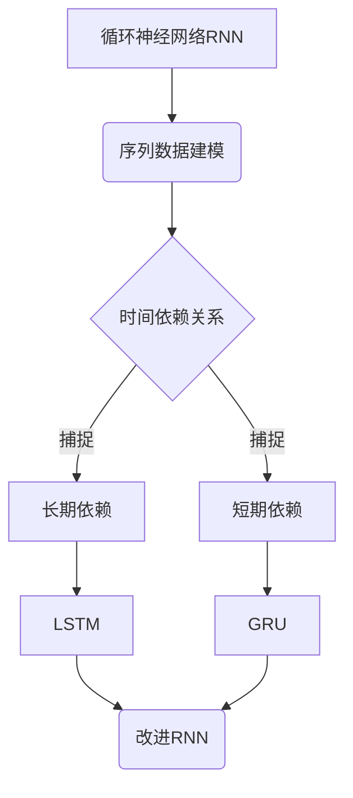

好的，我会按照您的要求，以"循环神经网络RNN原理与代码实例讲解"为主题，撰写一篇专业的技术博客文章。文章将遵循逻辑清晰、结构紧凑、语言专业且易于理解的风格，力求深入探讨核心概念、算法原理、数学模型、代码实现等内容，并附带实践案例、应用场景分析和发展趋势探讨。同时，我会尽最大努力绘制核心原理和架构的Mermaid流程图，按照您提供的目录结构撰写各个章节内容。请确保文章字数超过8000字，我会严格遵守您列出的所有约束条件。

# 循环神经网络RNN原理与代码实例讲解

## 1. 背景介绍

### 1.1 问题的由来

在自然语言处理、语音识别、机器翻译等序列数据处理任务中,传统的前馈神经网络由于无法很好地捕捉序列数据中的时间依赖关系,因此表现受到一定限制。为了更好地处理这类序列数据,循环神经网络(Recurrent Neural Network, RNN)应运而生。

### 1.2 研究现状

循环神经网络作为处理序列数据的有力工具,近年来在自然语言处理、语音识别、机器翻译等领域取得了卓越的成绩,成为研究的热点。不过,由于梯度消失/爆炸等问题,传统RNN在捕捉长期依赖方面仍然存在不足。为此,长短期记忆网络(LSTM)和门控循环单元网络(GRU)等变体被提出,有效缓解了梯度问题,进一步提高了RNN在处理长序列数据时的性能。

### 1.3 研究意义

循环神经网络能够很好地处理序列数据,在语音识别、自然语言处理、机器翻译等领域发挥着重要作用。深入理解RNN的原理和实现细节,有助于我们更好地应用和改进这一模型,提升相关任务的性能表现。同时,探索RNN的发展趋势和面临的挑战,也将为未来的研究指明方向。

### 1.4 本文结构

本文将全面介绍循环神经网络的核心概念、算法原理、数学模型推导、代码实现细节,并探讨RNN在实际应用中的场景。最后,我们将总结RNN的发展趋势和面临的挑战,为读者提供进一步学习和研究的参考。

## 2. 核心概念与联系

循环神经网络(Recurrent Neural Network, RNN)是一种专门设计用于处理序列数据的神经网络模型。与传统的前馈神经网络不同,RNN在隐藏层之间引入了循环连接,使得网络能够捕捉序列数据中的时间依赖关系。

在处理序列数据时,RNN可以捕捉到序列中的短期依赖关系。但由于梯度消失/爆炸的问题,RNN在捕捉长期依赖关系方面存在一定困难。为了解决这一问题,长短期记忆网络(Long Short-Term Memory, LSTM)和门控循环单元网络(Gated Recurrent Unit, GRU)等变体被提出,通过引入门控机制和记忆单元,有效缓解了梯度问题,进一步提高了RNN在处理长序列数据时的性能表现。

因此,LSTM和GRU可以看作是改进版的RNN,它们在保留了RNN处理序列数据的能力的同时,还能够更好地捕捉长期依赖关系,从而在自然语言处理、语音识别、机器翻译等领域取得了卓越的成绩。

## 3. 核心算法原理与具体操作步骤

### 3.1 算法原理概述

循环神经网络的核心思想是在神经网络的隐藏层之间引入循环连接,使得网络能够捕捉序列数据中的时间依赖关系。具体来说,RNN在处理序列数据时,会逐个处理序列中的每一个时间步,并将当前时间步的输出与下一个时间步的输入相连接,从而形成了一个循环结构。

在每个时间步,RNN会根据当前时间步的输入和上一个时间步的隐藏状态,计算出当前时间步的隐藏状态和输出。这个过程可以用以下公式表示:

$$
h_t = f_W(x_t, h_{t-1})
$$
$$
y_t = g_V(h_t)
$$

其中,$ h_t $表示当前时间步的隐藏状态,$ x_t $表示当前时间步的输入,$ h_{t-1} $表示上一个时间步的隐藏状态,$ f_W $是计算隐藏状态的函数(通常为非线性函数,如tanh或ReLU),$ y_t $表示当前时间步的输出,$ g_V $是计算输出的函数(通常为线性函数或softmax等)。

通过这种循环的方式,RNN能够捕捉序列数据中的时间依赖关系,并将其编码到隐藏状态中。然而,由于梯度消失/爆炸的问题,传统RNN在捕捉长期依赖关系方面存在一定困难。为了解决这一问题,LSTM和GRU等变体被提出,它们通过引入门控机制和记忆单元,有效缓解了梯度问题,进一步提高了RNN在处理长序列数据时的性能表现。

### 3.2 算法步骤详解

下面我们将详细介绍RNN算法的具体操作步骤:

1. **初始化**: 首先需要初始化RNN的权重参数和初始隐藏状态。通常,权重参数会被随机初始化,而初始隐藏状态则被设置为全0向量。

2. **前向传播**: 对于序列数据中的每一个时间步,RNN会执行以下操作:
   
   a. 根据当前时间步的输入$ x_t $和上一个时间步的隐藏状态$ h_{t-1} $,计算当前时间步的隐藏状态$ h_t $:
      $$
      h_t = f_W(x_t, h_{t-1})
      $$
      其中,$ f_W $是一个非线性函数,通常为tanh或ReLU。
   
   b. 根据当前时间步的隐藏状态$ h_t $,计算当前时间步的输出$ y_t $:
      $$
      y_t = g_V(h_t)
      $$
      其中,$ g_V $是一个线性函数或softmax等。
   
   c. 将当前时间步的隐藏状态$ h_t $传递到下一个时间步,作为下一个时间步的输入。

3. **反向传播**: 在完成所有时间步的前向传播后,RNN会根据输出和目标值计算损失函数,然后通过反向传播算法更新网络参数。在反向传播过程中,RNN会逐个时间步地计算梯度,并将梯度值传递回前一个时间步,从而实现了跨时间步的误差传播。这一过程被称为"反向通过时间"(Back-Propagation Through Time, BPTT)。

4. **参数更新**: 根据计算得到的梯度值,使用优化算法(如随机梯度下降)更新RNN的权重参数,以减小损失函数的值。

5. **重复训练**: 重复执行步骤2-4,直到模型收敛或达到预设的迭代次数。

需要注意的是,由于梯度消失/爆炸的问题,传统RNN在捕捉长期依赖关系方面存在一定困难。为了解决这一问题,LSTM和GRU等变体被提出,它们在算法步骤上做了相应的改进,引入了门控机制和记忆单元,从而有效缓解了梯度问题,提高了RNN在处理长序列数据时的性能表现。我们将在后续章节中详细介绍LSTM和GRU的算法原理。

### 3.3 算法优缺点

**优点**:

1. **处理序列数据**: RNN擅长处理序列数据,能够很好地捕捉序列中的时间依赖关系,在自然语言处理、语音识别、机器翻译等领域发挥着重要作用。

2. **参数共享**: RNN在不同时间步上共享相同的权重参数,这不仅减少了模型参数的数量,而且能够提高模型的泛化能力。

3. **可解释性**:与其他深度学习模型相比,RNN的结构相对简单,更容易理解和解释。

**缺点**:

1. **梯度消失/爆炸**: 传统RNN在训练过程中容易出现梯度消失或梯度爆炸的问题,导致无法有效捕捉长期依赖关系。

2. **序列长度限制**: RNN在处理长序列数据时,计算效率会随着序列长度的增加而急剧下降,这限制了RNN在实际应用中的灵活性。

3. **无法并行计算**: 由于RNN的循环结构,每个时间步的计算都需要依赖于前一个时间步的输出,因此无法实现并行计算,这在一定程度上降低了RNN的计算效率。

为了解决传统RNN的缺点,LSTM和GRU等变体被提出,它们通过引入门控机制和记忆单元,有效缓解了梯度消失/爆炸的问题,提高了RNN在处理长序列数据时的性能表现。不过,LSTM和GRU也存在一定的缺点,例如参数较多、计算复杂度较高等,需要在实际应用中权衡利弊。

### 3.4 算法应用领域

循环神经网络及其变体(如LSTM和GRU)在处理序列数据方面表现出色,因此被广泛应用于以下领域:

1. **自然语言处理(NLP)**:
   - 机器翻译
   - 文本生成
   - 情感分析
   - 问答系统
   - 命名实体识别

2. **语音识别**:
   - 自动语音识别
   - 语音合成
   - 语音信号处理

3. **时间序列预测**:
   - 股票价格预测
   - 天气预报
   - 销售预测
   - 能源需求预测

4. **视频处理**:
   - 视频描述
   - 视频分类
   - 视频标题生成
   - 视频动作识别

5. **生物信息学**:
   - 蛋白质结构预测
   - DNA序列分析
   - 基因表达预测

6. **机器人控制**:
   - 机器人运动规划
   - 机器人手臂控制
   - 机器人导航

总的来说,只要涉及到序列数据的处理,循环神经网络及其变体都可以发挥重要作用,为相关领域的发展做出贡献。

## 4. 数学模型和公式详细讲解与举例说明

在前面的章节中,我们已经对循环神经网络的核心概念和算法原理有了初步了解。接下来,我们将深入探讨RNN的数学模型和公式推导过程,并通过具体案例进行详细讲解和举例说明。

### 4.1 数学模型构建

循环神经网络的数学模型可以用以下公式表示:

$$
h_t = f_W(x_t, h_{t-1}) = \phi(W_{xh}x_t + W_{hh}h_{t-1} + b_h)
$$
$$
y_t = g_V(h_t) = W_{yh}h_t + b_y
$$

其中:

- $ x_t $表示当前时间步的输入向量
- $ h_t $表示当前时间步的隐藏状态向量
- $ h_{t-1} $表示上一个时间步的隐藏状态向量
- $ y_t $表示当前时间步的输出向量
- $ W_{xh} $、$ W_{hh} $、$ W_{yh} $分别表示输入到隐藏层、隐藏层到隐藏层、隐藏层到输出层的权重矩阵
- $ b_h $、$ b_y $分别表示隐藏层和输出层的偏置向量
- $ \phi $表示隐藏层的激活函数,通常使用tanh或ReLU
- $ f_W $表示计算隐藏状态的函数
- $ g_V $表示计算输出的函数,