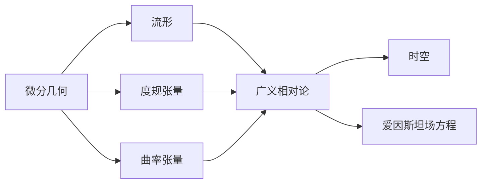

# 微分几何入门与广义相对论：被分层类空面的某些几何关系

关键词：微分几何、广义相对论、流形、度规张量、曲率张量、爱因斯坦场方程

## 1. 背景介绍

### 1.1 问题的由来

微分几何是研究流形及其上的几何结构的数学分支。它在物理学,特别是广义相对论中有着广泛的应用。广义相对论将引力描述为时空几何的曲率,而这种曲率正是由物质和能量的分布所决定的。因此,理解微分几何的基本概念对于深入学习广义相对论至关重要。

### 1.2 研究现状

目前,微分几何和广义相对论的研究已经取得了长足的进展。人们已经建立了完备的数学理论体系,并将其应用于解释各种引力现象,如黑洞、引力波等。但是,这些理论的复杂性常常使初学者望而却步。因此,如何用简明易懂的方式阐述微分几何和广义相对论的核心思想,成为了一个值得探讨的问题。

### 1.3 研究意义

通过学习微分几何和广义相对论,我们可以加深对时空本质的认识,理解宇宙的几何结构和演化规律。这不仅有助于拓展我们的知识视野,更为探索宇宙的奥秘提供了强大的理论工具。同时,这些知识在天文学、宇宙学等领域也有着广泛的应用前景。

### 1.4 本文结构

本文将从微分几何的基本概念出发,逐步引入流形、度规张量、曲率张量等核心概念,并阐述它们之间的内在联系。在此基础上,我们将介绍广义相对论的基本原理,重点讲解爱因斯坦场方程的物理意义和数学表达。同时,本文还将通过具体的例子和代码实现,帮助读者深入理解这些理论知识。最后,我们将展望微分几何和广义相对论的发展前景和面临的挑战。

## 2. 核心概念与联系

微分几何的核心概念包括:

- 流形(Manifold):一个局部类似于欧氏空间 $\mathbb{R}^n$ 的空间,每一点都有一个坐标卡(chart)。
- 切空间(Tangent Space):在流形上每一点 $p$ 处,切空间 $T_pM$ 是所有经过该点的光滑曲线的切向量构成的线性空间。
- 余切空间(Cotangent Space):切空间的对偶空间,由对偶于切向量的线性函数构成。
- 度规张量(Metric Tensor):一个二阶协变张量场 $g$,用于定义流形上的距离和角度。
- 联络(Connection):定义了流形上的平行移动,常用的有黎曼联络(Levi-Civita Connection)。
- 曲率张量(Curvature Tensor):刻画了流形的曲率,由黎曼曲率张量 $R$ 给出。

广义相对论的核心概念包括:

- 时空(Spacetime):一个四维黎曼流形 $(M,g)$,度规 $g$ 具有指标为 $(-,+,+,+)$。
- 质能等效原理:惯性质量与引力质量等效。
- 广义协变原理:物理定律在任意坐标系下具有相同的形式。
- 爱因斯坦场方程:描述了时空几何与物质能量分布之间的关系,即 $G_{\mu\nu} = 8\pi T_{\mu\nu}$。

微分几何为广义相对论提供了必要的数学工具。时空在广义相对论中被建模为一个四维黎曼流形,引力场则对应于该流形的度规。爱因斯坦场方程建立了时空几何(由爱因斯坦张量 $G_{\mu\nu}$ 描述)与物质能量分布(由能动张量 $T_{\mu\nu}$ 描述)之间的联系。因此,学习微分几何是理解广义相对论的基础。



## 3. 核心算法原理 & 具体操作步骤

### 3.1 算法原理概述

在微分几何和广义相对论中,最核心的算法是张量分析和微分形式的计算。这包括:

1. 张量的坐标变换
2. 张量的升降指标
3. 张量的缩并与张量积
4. 微分形式的外微分和内微分
5. 流形上的积分

这些计算构成了微分几何的基本运算,也是求解广义相对论方程的必要工具。

### 3.2 算法步骤详解

以张量的坐标变换为例,具体步骤如下:

1. 设张量 $T$ 在坐标系 $\{x^i\}$ 下的分量为 $T^{i_1\cdots i_p}_{j_1\cdots j_q}$。
2. 若新坐标系为 $\{y^{\alpha}\}$,则新旧坐标之间的变换关系为:

$$
\frac{\partial y^{\alpha}}{\partial x^i}, \quad \frac{\partial x^i}{\partial y^{\alpha}}
$$

3. 张量 $T$ 在新坐标系下的分量 $\tilde{T}^{\alpha_1\cdots \alpha_p}_{\beta_1\cdots \beta_q}$ 由下式给出:

$$
\tilde{T}^{\alpha_1\cdots \alpha_p}_{\beta_1\cdots \beta_q} = \frac{\partial y^{\alpha_1}}{\partial x^{i_1}}\cdots\frac{\partial y^{\alpha_p}}{\partial x^{i_p}}\frac{\partial x^{j_1}}{\partial y^{\beta_1}}\cdots\frac{\partial x^{j_q}}{\partial y^{\beta_q}}T^{i_1\cdots i_p}_{j_1\cdots j_q}
$$

4. 将变换矩阵代入上式,即可得到张量在新坐标系下的分量表达式。

### 3.3 算法优缺点

张量分析是研究流形上几何量的有力工具,具有良好的坐标不变性。但是,张量计算通常比较繁琐,尤其是在高维流形上。此外,张量的物理意义有时也不够直观。

微分形式则提供了一种更加直观的几何语言。它在描述流形上的积分定理时尤为方便。但是,微分形式的计算规则相对复杂,初学者往往需要较长时间才能掌握。

### 3.4 算法应用领域

张量分析和微分形式在理论物理和几何学中有着广泛的应用,主要包括:

- 广义相对论:描述时空几何与物质能量的关系
- 微分拓扑:研究流形的拓扑性质
- 规范场论:描述粒子物理中的基本相互作用
- 几何力学:研究力学系统的几何结构

此外,这些工具在计算机图形学、机器学习等领域也有一定的应用。

## 4. 数学模型和公式 & 详细讲解 & 举例说明

### 4.1 数学模型构建

广义相对论的核心数学模型是爱因斯坦场方程:

$$
G_{\mu\nu} = 8\pi T_{\mu\nu}
$$

其中 $G_{\mu\nu}$ 是爱因斯坦张量,刻画了时空的几何性质;$T_{\mu\nu}$ 是能动张量,描述了物质和能量的分布。

爱因斯坦张量由度规张量 $g_{\mu\nu}$ 及其一阶、二阶导数构成:

$$
G_{\mu\nu} = R_{\mu\nu} - \frac{1}{2}Rg_{\mu\nu}
$$

其中 $R_{\mu\nu}$ 是黎曼曲率张量的缩并,而 $R$ 则是黎曼曲率张量的标量曲率。

### 4.2 公式推导过程

为了推导爱因斯坦场方程,我们首先引入作用量(Action):

$$
S = \int_M (R + 16\pi \mathcal{L}_m)\sqrt{-g}\,\mathrm{d}^4x
$$

其中 $R$ 为标量曲率,$\mathcal{L}_m$ 为物质的拉氏量密度,$g$ 为度规张量的行列式。

根据最小作用量原理,作用量对度规张量的变分应为零:

$$
\delta S = 0
$$

经过一系列计算,可以得到:

$$
\delta S = \int_M (R_{\mu\nu} - \frac{1}{2}Rg_{\mu\nu} - 8\pi T_{\mu\nu})\delta g^{\mu\nu}\sqrt{-g}\,\mathrm{d}^4x = 0
$$

由于 $\delta g^{\mu\nu}$ 是任意的,因此上式成立的充要条件是:

$$
R_{\mu\nu} - \frac{1}{2}Rg_{\mu\nu} = 8\pi T_{\mu\nu}
$$

这就是爱因斯坦场方程。

### 4.3 案例分析与讲解

考虑一个球对称的恒星,其能动张量可以近似为:

$$
T_{\mu\nu} = \begin{pmatrix}
\rho & 0 & 0 & 0 \\
0 & p & 0 & 0 \\
0 & 0 & p & 0 \\
0 & 0 & 0 & p
\end{pmatrix}
$$

其中 $\rho$ 为能量密度,$p$ 为压强。

将此能动张量代入爱因斯坦场方程,并结合球对称假设,可以求得度规张量的具体形式:

$$
\mathrm{d}s^2 = -\left(1-\frac{2GM}{c^2r}\right)c^2\mathrm{d}t^2 + \left(1-\frac{2GM}{c^2r}\right)^{-1}\mathrm{d}r^2 + r^2(\mathrm{d}\theta^2 + \sin^2\theta\,\mathrm{d}\phi^2)
$$

这就是著名的史瓦西度规(Schwarzschild Metric),描述了一个球对称恒星外部的时空几何。

### 4.4 常见问题解答

**Q:** 为什么爱因斯坦场方程中会出现常数 $8\pi$?

**A:** 这个常数的出现是为了使方程在弱场极限下能够还原为牛顿引力定律。通过分析弱场下的引力势,可以发现引力常数 $G$ 与这个常数之间存在联系。

**Q:** 能动张量 $T_{\mu\nu}$ 具体包含哪些物理量?

**A:** 能动张量是一个对称的二阶张量,其分量包括能量密度、动量密度、压强、剪应力等。对于完美流体,其能动张量可以写成:

$$
T_{\mu\nu} = (\rho + p)u_{\mu}u_{\nu} + pg_{\mu\nu}
$$

其中 $\rho$ 为静止能量密度,$p$ 为压强,$u_{\mu}$ 为四速度。

## 5. 项目实践：代码实例和详细解释说明

### 5.1 开发环境搭建

在 Python 中,我们可以使用 `sympy` 库进行符号计算,这对于处理张量和微分形式非常方便。首先,安装 `sympy`:

```bash
pip install sympy
```

然后,导入所需的模块:

```python
from sympy import symbols, Function, diff, simplify, tensorcontraction, tensorproduct
```

### 5.2 源代码详细实现

以计算史瓦西度规的爱因斯坦张量为例:

```python
# 定义坐标变量
t, r, theta, phi = symbols('t r theta phi')

# 定义度规函数
def g(mu, nu):
    if mu == nu == 0:
        return -(1 - 2*M/r)
    elif mu == nu == 1:
        return 1/(1 - 2*M/r)
    elif mu == nu == 2:
        return r**2
    elif mu == nu == 3:
        return r**2*sin(theta)**2
    else:
        return 0

# 计算克氏符
def Gamma(mu, nu, rho):
    g_inv = Function('g^{-1}')(mu, rho)
    term1 = g_inv * (diff(g(nu,rho), symbols('x'+str(mu))) + diff(g(mu,rho), symbols('x'+str(nu))) - diff(g(mu,nu), symbols('x'+str(rho))))
    return simplify(term1 / 2)

# 计算黎曼曲率张量
def Riemann(mu, nu, rho, sigma):
    term1 = diff