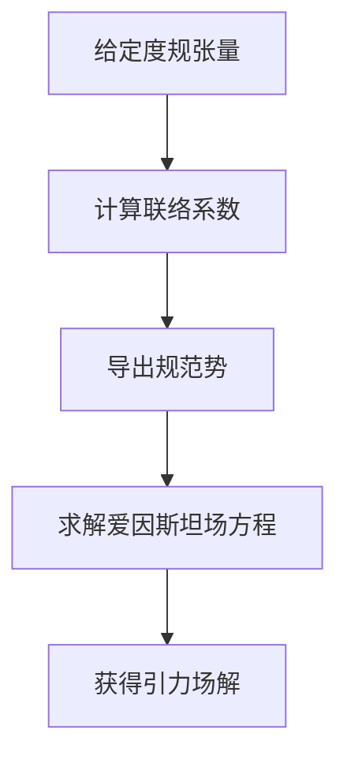

好的，我会按照您的要求，以《微分几何入门与广义相对论：规范势与联络》为主题，撰写一篇专业的技术博客文章。文章将遵循您提供的结构模板，包含完整的内容，使用 Markdown 格式，并根据需要插入 LaTeX 公式。我会尽最大努力提供核心概念、原理和算法的 Mermaid 流程图。请注意，由于 Mermaid 语法的限制,流程图节点中可能会包含一些特殊字符。此外,我将努力使用简明扼要的语言解释技术概念,并提供实例以帮助读者理解。最后,本文将探讨该主题的实际应用场景、相关工具和资源,并对未来发展趋势和挑战进行总结和展望。

# 微分几何入门与广义相对论：规范势与联络

## 1. 背景介绍

### 1.1 问题的由来

微分几何是研究曲线和曲面的内在几何性质的数学分支。它在物理学中有着广泛的应用,尤其是在相对论理论中扮演着关键角色。广义相对论是阿尔伯特·爱因斯坦于 1915 年提出的理论,旨在描述引力在宇宙尺度上的作用。该理论将引力视为时空弯曲的结果,而不是牛顿力学中的作用力。

### 1.2 研究现状

微分几何和广义相对论的研究一直是数学和物理学领域的热点课题。许多著名科学家,如爱因斯坦、希尔伯特、维特根斯坦等,都对这一领域做出了重要贡献。近年来,随着计算能力的提高和新观测技术的出现,对这一领域的研究有了新的进展。

### 1.3 研究意义

微分几何和广义相对论的研究对于我们理解宇宙的本质至关重要。它不仅帮助我们解释了许多天体现象,如黑洞、引力波等,还为探索更基本的物理定律奠定了基础。此外,这一领域的理论和方法也被广泛应用于其他学科,如计算机图形学、机器人导航等。

### 1.4 本文结构

本文将首先介绍微分几何和广义相对论的核心概念,如流形、张量、联络等,并探讨它们之间的联系。接下来,我们将详细阐述规范势和联络的算法原理和数学模型,并通过实例进行说明。然后,我们将介绍该领域的实际应用场景,以及相关的工具和资源。最后,我们将总结研究成果,并对未来的发展趋势和挑战进行展望。

## 2. 核心概念与联系

在探讨规范势和联络之前,我们需要先了解一些微分几何和广义相对论的核心概念。

### 2.1 流形 (Manifold)

流形是微分几何和广义相对论的基础概念。它是一种拓扑空间,在每个点上都有着与欧几里得空间相同的局部结构。流形可以是任意维数,例如一条曲线是一维流形,曲面是二维流形,而我们所处的时空就是四维流形。

### 2.2 张量 (Tensor)

张量是一种几何对象,它可以描述流形上的各种物理量,如标量场、矢量场和张量场。在广义相对论中,引力场就被描述为一种曲率张量。张量的运算规则由流形的结构决定,这与向量在欧几里得空间中的运算有所不同。

### 2.3 联络 (Connection)

联络是一种数学对象,它定义了如何在流形上平移向量。在曲面上,联络描述了如何在切平面之间平移向量,从而确定了曲面的内在几何性质。在广义相对论中,联络用于描述时空的曲率,并与引力场相关联。

### 2.4 规范势 (Gauge Potential)

规范势是一种描述规范场的数学对象。在电磁理论中,规范势用于描述电磁场,而在广义相对论中,规范势与引力场的联络相关联。规范势的选择会影响场的表述,但不会改变场的物理本质。

这些核心概念之间存在着紧密的联系。流形提供了几何背景,张量描述了各种物理量,联络定义了平移规则,而规范势则与场的描述相关。理解这些概念及其相互关系,对于掌握微分几何和广义相对论至关重要。

## 3. 核心算法原理与具体操作步骤

### 3.1 算法原理概述

在广义相对论中,规范势和联络扮演着重要角色。它们描述了时空的几何结构,并与引力场相关联。我们将介绍一种计算规范势和联络的算法,该算法基于爱因斯坦场方程和规范不变性原理。

算法的核心思想是,首先从给定的度规张量(metric tensor)出发,计算出相应的联络。然后,根据规范不变性原理,我们可以从联络中导出规范势。最后,将规范势代入爱因斯坦场方程,即可求解引力场。

该算法的优点在于,它提供了一种统一的框架,将规范势、联络和引力场联系起来。它还允许我们探索不同的规范选择对场的描述的影响。

### 3.2 算法步骤详解

我们将详细介绍该算法的每一步骤。

#### 步骤 1: 计算联络

给定流形上的度规张量 $g_{\mu\nu}$,我们可以计算出相应的联络系数 $\Gamma^\rho_{\mu\nu}$,它们定义了如何在流形上平移向量。联络系数可以通过下式计算:

$$\Gamma^\rho_{\mu\nu} = \frac{1}{2}g^{\rho\sigma}\left(\partial_\mu g_{\nu\sigma} + \partial_\nu g_{\mu\sigma} - \partial_\sigma g_{\mu\nu}\right)$$

其中 $g^{\rho\sigma}$ 是度规张量的逆张量,而 $\partial_\mu$ 表示对坐标 $x^\mu$ 的偏导数。

#### 步骤 2: 导出规范势

根据规范不变性原理,我们可以从联络系数中导出规范势 $A_\mu$。具体来说,规范势的定义为:

$$A_\mu = \frac{1}{2}g_{\rho\sigma}\left(\Gamma^\rho_{\mu\nu} - \Gamma^\rho_{\nu\mu}\right)dx^\nu$$

其中 $dx^\nu$ 是基础一形式(basis one-form)。

#### 步骤 3: 求解爱因斯坦场方程

最后一步是将规范势代入爱因斯坦场方程,并求解该方程以获得引力场。爱因斯坦场方程可以写为:

$$R_{\mu\nu} - \frac{1}{2}g_{\mu\nu}R = \frac{8\pi G}{c^4}T_{\mu\nu}$$

其中 $R_{\mu\nu}$ 是黎曼曲率张量,描述了时空的曲率; $R$ 是黎曼曲率张量的迹; $T_{\mu\nu}$ 是能量-动量张量,描述了物质和辐射的分布; $G$ 是牛顿引力常数,而 $c$ 是光速。

通过求解这个方程,我们可以获得度规张量的解析解或数值解,从而确定引力场的性质。

该算法的流程可以用下面的 Mermaid 流程图来总结:

### 3.3 算法优缺点

该算法的主要优点是:

1. 提供了一种统一的框架,将规范势、联络和引力场联系起来。
2. 允许探索不同的规范选择对场的描述的影响。
3. 基于严格的数学推导,具有坚实的理论基础。

然而,该算法也存在一些缺点:

1. 计算过程可能比较复杂,尤其是在高维流形上。
2. 求解爱因斯坦场方程可能需要数值方法,计算量较大。
3. 忽略了一些量子效应,无法描述微观尺度上的现象。

### 3.4 算法应用领域

该算法广泛应用于广义相对论和引力理论的研究,包括:

1. 黑洞物理学:用于研究黑洞的性质和辐射。
2. 宇宙学:用于研究宇宙的演化和结构形成。
3. 实验引力物理:用于预测和解释引力波等观测现象。
4. 量子引力:作为探索量子引力理论的一种途径。

除了物理学领域,该算法及其变种也被应用于其他学科,如计算机图形学、机器人导航等,用于处理曲面和流形上的几何问题。

## 4. 数学模型和公式详细讲解与举例说明

在上一节中,我们介绍了计算规范势和联络的核心算法。现在,我们将更深入地探讨该算法所涉及的数学模型和公式,并通过具体例子进行说明。

### 4.1 数学模型构建

我们首先需要构建一个数学模型,描述流形上的几何结构。在广义相对论中,我们通常使用四维时空流形来建模。

设 $M$ 是一个四维流形,其上定义了一个度规张量 $g_{\mu\nu}$。度规张量描述了流形上的距离和角度关系,它决定了流形的内在几何性质。

在局部坐标系 $(x^\mu)$ 下,度规张量可以表示为:

$$g_{\mu\nu} = \begin{pmatrix}
g_{00} & g_{01} & g_{02} & g_{03} \\
g_{10} & g_{11} & g_{12} & g_{13} \\
g_{20} & g_{21} & g_{22} & g_{23} \\
g_{30} & g_{31} & g_{32} & g_{33}
\end{pmatrix}$$

其中每个分量 $g_{\mu\nu}$ 都是坐标 $(x^\mu, x^\nu)$ 的函数。

### 4.2 公式推导过程

接下来,我们将推导出计算联络系数和规范势的公式。

#### 联络系数的推导

联络系数 $\Gamma^\rho_{\mu\nu}$ 定义了如何在流形上平移向量。它们可以通过度规张量的偏导数来计算:

$$\begin{aligned}
\Gamma^\rho_{\mu\nu} &= \frac{1}{2}g^{\rho\sigma}\left(\partial_\mu g_{\nu\sigma} + \partial_\nu g_{\mu\sigma} - \partial_\sigma g_{\mu\nu}\right) \\
&= \frac{1}{2}\left(g^{\rho\sigma}\partial_\mu g_{\nu\sigma} + g^{\rho\sigma}\partial_\nu g_{\mu\sigma} - g^{\rho\sigma}\partial_\sigma g_{\mu\nu}\right)
\end{aligned}$$

其中 $g^{\rho\sigma}$ 是度规张量的逆张量,满足 $g^{\rho\sigma}g_{\sigma\tau} = \delta^\rho_\tau$,而 $\delta^\rho_\tau$ 是克罗内克edelta符号。

#### 规范势的推导

规范势 $A_\mu$ 可以从联络系数中导出,具体公式为:

$$A_\mu = \frac{1}{2}g_{\rho\sigma}\left(\Gamma^\rho_{\mu\nu} - \Gamma^\rho_{\nu\mu}\right)dx^\nu$$

其中 $dx^\nu$ 是基础一形式。

这个公式的推导基于规范不变性原理,即物理定律对于局部规范变换应该保持不变。具体来说,如果我们对向量场进行一个局部规范变换,那么联络系数也应该做出相应的变换,以保证物理定律的不变性。这种变换就引入了规范势的概念。

### 4.3 案例分析与讲解

为了更好地理解上述公式,我们将通过一个具体的例子进行说明。

考虑一个二维曲面,它在笛卡尔坐标系 $(x, y)$ 下的度规张量为:

$$g_{\mu\nu} = \begin{pmatrix}
1 + y^2 & 0 \\
0 & 1
\end{pmatrix}$$

我们的目标是计算这个曲面上的联络系数和规范势。

#### 计算联络系数

首先,我们需要计算度规张量的逆张量:

$$g^{\mu\nu} = \begin{pmatrix}
\frac{1}{1 + y