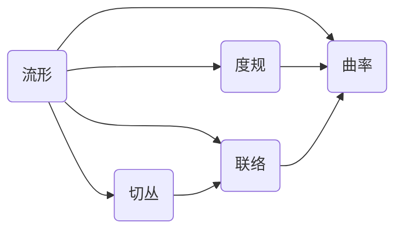

# 微分几何入门与广义相对论：转盘系的空间几何

关键词：微分几何、广义相对论、转盘系、曲率、度规张量、测地线、爱因斯坦场方程

## 1. 背景介绍
### 1.1  问题的由来
微分几何是研究曲线、曲面等几何对象在局部的性质的数学分支。它与广义相对论有着密切的联系，因为广义相对论使用微分几何来描述时空的几何性质。转盘系是研究广义相对论的一个重要模型，它展示了旋转参考系中的时空几何与惯性参考系有着本质的不同。理解转盘系的空间几何，有助于我们深入理解广义相对论的基本概念和数学工具。

### 1.2  研究现状
目前，微分几何在广义相对论中的应用已经得到了广泛的研究。从爱因斯坦最初提出广义相对论时就使用了黎曼几何，到后来人们使用微分几何来研究黑洞、宇宙学等问题，微分几何一直是广义相对论的重要数学工具。转盘系作为一个简单而又有启发性的模型，在相对论教学和研究中有着重要的地位。

### 1.3  研究意义
深入理解转盘系的空间几何，对于学习和研究广义相对论有着重要的意义。它能够帮助我们建立广义相对论的物理直觉，理解曲率、测地线等基本概念。同时，转盘系也展示了广义相对论时空几何的一些重要性质，如局域不变性、等效原理等。因此，系统地学习转盘系的微分几何，对于深入理解广义相对论的数学结构和物理内涵都是非常有益的。

### 1.4  本文结构
本文将从微分几何的基本概念出发，系统地介绍转盘系的空间几何。第二节将回顾微分几何的一些核心概念，如流形、切丛、联络等。第三节介绍转盘系的度规和曲率计算。第四节讨论转盘系中的测地线方程和测地偏离。第五节给出转盘系中的模拟引力场和轨道方程的计算实例。第六节讨论转盘系的一些推广和应用。第七节介绍学习转盘系微分几何的工具和资源。第八节总结全文并讨论微分几何在广义相对论中的发展趋势和挑战。

## 2. 核心概念与联系
微分几何的核心概念包括流形、切丛、度规、联络、曲率等。一个n维流形是一个局部类似于n维欧氏空间的空间。流形上每一点都有一个切空间，切空间是该点所有切向量的集合。切丛是所有切空间的并集。度规给出了流形上的一种度量结构，联络给出了切向量平行传播的规则。曲率是描述流形局部弯曲程度的量。

广义相对论将时空描述为一个四维的伪黎曼流形。爱因斯坦场方程描述了时空流形的度规与物质能量分布之间的关系。转盘系是一个三维流形，它的度规、曲率等性质都可以用微分几何的方法来分析。



## 3. 核心算法原理 & 具体操作步骤 
### 3.1  算法原理概述
计算转盘系的空间几何性质，主要涉及以下几个步骤：
1. 给出转盘系的度规张量，用来描述转盘系的几何结构。
2. 计算转盘系的联络系数，刻画切向量的平行传播。
3. 计算转盘系的曲率张量，表征转盘系空间的曲率。
4. 求解测地线方程，得到转盘系中的测地线。
5. 分析测地偏离，研究临近测地线间的偏离行为。

### 3.2  算法步骤详解
1. 转盘系的度规张量可以写为：

$$
g=
\begin{pmatrix}
-c^2+\omega^2 r^2 & 0 & 0\\
0 & 1 & 0\\
0 & 0 & r^2
\end{pmatrix}
$$

其中$\omega$是转盘的角速度，$r$是到转轴的距离，$c$是光速。

2. 计算克氏符$\Gamma^i_{jk}$，可以使用度规张量的表达式：

$$
\Gamma^i_{jk}=\frac{1}{2}g^{im}(\partial_j g_{mk}+\partial_k g_{mj}-\partial_m g_{jk})
$$

3. 计算黎曼曲率张量$R^i_{jkl}$，使用克氏符的表达式：

$$
R^i_{jkl}=\partial_k\Gamma^i_{jl}-\partial_l\Gamma^i_{jk}+\Gamma^i_{mk}\Gamma^m_{jl}-\Gamma^i_{ml}\Gamma^m_{jk}
$$

4. 测地线方程可以写为：

$$
\frac{d^2x^i}{d\tau^2}+\Gamma^i_{jk}\frac{dx^j}{d\tau}\frac{dx^k}{d\tau}=0
$$

其中$\tau$是固有时。求解该方程可以得到转盘系中的测地线。

5. 测地偏离方程为：

$$
\frac{D^2\xi^i}{D\tau^2}=R^i_{jkl}\frac{dx^j}{d\tau}\xi^k\frac{dx^l}{d\tau}
$$

其中$\xi^i$是测地偏离矢量，表征了临近测地线间的相对位移。

### 3.3  算法优缺点
优点：
- 使用微分几何的方法分析转盘系，数学上严谨、系统。
- 能够定量描述转盘系的几何性质，如度规、曲率等。
- 为研究广义相对论提供了很好的数学模型和工具。

缺点：
- 计算比较复杂，需要掌握丰富的微分几何知识。
- 物理图像不够直观，需要一定的数学抽象能力。

### 3.4  算法应用领域
- 广义相对论的教学和科普
- 广义相对论引力理论的研究
- 黑洞、宇宙学等领域的理论模型构建

## 4. 数学模型和公式 & 详细讲解 & 举例说明
### 4.1  数学模型构建
转盘系的数学模型可以构建如下：
1. 转盘系是一个三维流形$M$，局部坐标系为$(t,r,\phi)$。
2. 流形上的度规张量为：

$$
g=
\begin{pmatrix}
-c^2+\omega^2 r^2 & 0 & 0\\
0 & 1 & 0\\
0 & 0 & r^2
\end{pmatrix}
$$

3. 联络、曲率等几何量可以通过度规张量计算得到。
4. 物体的运动满足测地线方程：

$$
\frac{d^2x^i}{d\tau^2}+\Gamma^i_{jk}\frac{dx^j}{d\tau}\frac{dx^k}{d\tau}=0
$$

### 4.2  公式推导过程
1. 度规张量的推导：
   考虑转盘系的局部坐标系$(t,r,\phi)$，其中$t$是时间坐标，$r$是到转轴的距离，$\phi$是方位角。假设转盘的角速度为$\omega$，则转盘上的线元可以写为：

   $$
   ds^2=-c^2dt^2+dr^2+r^2(d\phi-\omega dt)^2
   $$

   展开上式，可以得到度规张量的表达式：

   $$
   g=
   \begin{pmatrix}
   -c^2+\omega^2 r^2 & 0 & 0\\
   0 & 1 & 0\\
   0 & 0 & r^2
   \end{pmatrix}
   $$

2. 克氏符的推导：
   克氏符的定义为：

   $$
   \Gamma^i_{jk}=\frac{1}{2}g^{im}(\partial_j g_{mk}+\partial_k g_{mj}-\partial_m g_{jk})
   $$

   将度规张量的表达式代入上式，经过简单计算可以得到转盘系的克氏符分量。

3. 黎曼曲率张量的推导：
   黎曼曲率张量的定义为：

   $$
   R^i_{jkl}=\partial_k\Gamma^i_{jl}-\partial_l\Gamma^i_{jk}+\Gamma^i_{mk}\Gamma^m_{jl}-\Gamma^i_{ml}\Gamma^m_{jk}
   $$

   将克氏符的表达式代入上式，可以得到转盘系的黎曼曲率张量分量。

4. 测地线方程的推导：
   测地线是使得两点之间线积分取极值的曲线，其方程可以由变分法得到：

   $$
   \frac{d^2x^i}{d\tau^2}+\Gamma^i_{jk}\frac{dx^j}{d\tau}\frac{dx^k}{d\tau}=0
   $$

   其中$\tau$是固有时。将转盘系的克氏符表达式代入上式，可以得到具体的测地线方程。

### 4.3  案例分析与讲解
下面我们来分析一个具体的例子：转盘系中的圆周运动。

设一个质点在转盘上做半径为$r_0$的圆周运动，其速度为$v$。我们可以选取转盘系的局部坐标系$(t,r,\phi)$，使得质点的坐标为$(t,r_0,\phi(t))$。

代入度规张量的表达式，可以得到质点的运动方程：

$$
\begin{cases}
\ddot{t}+\frac{2\omega r_0^2}{c^2-\omega^2r_0^2}\dot{\phi}=0\\
\ddot{r}=r_0\dot{\phi}^2\\
\ddot{\phi}+\frac{2\omega}{c^2-\omega^2r_0^2}\dot{t}\dot{\phi}=0
\end{cases}
$$

其中点表示对固有时$\tau$的导数。

求解上述方程组，可以得到质点的运动轨迹为：

$$
\begin{cases}
t=\gamma\tau\\
r=r_0\\
\phi=\phi_0+\omega\gamma\tau
\end{cases}
$$

其中$\gamma=1/\sqrt{1-\omega^2r_0^2/c^2}$是劳伦兹因子，$\phi_0$是初始位置。

可以看到，相对于转盘系，质点做匀速圆周运动。但是由于转盘系是非惯性系，质点的运动轨迹并不是测地线。惯性力的作用使得质点相对于转盘系有向心加速度。

### 4.4  常见问题解答
Q：转盘系的度规为什么有交叉项？
A：这是由于转盘系是一个非惯性参考系。在转动的参考系中，时间和空间是耦合的，度规必然存在交叉项。这反映了转盘系时空的非欧几里得性质。

Q：转盘系的曲率有什么物理意义？
A：转盘系的曲率反映了该系统的非惯性效应。转盘系的曲率越大，惯性力的作用就越明显。在广义相对论中，引力场也可以用时空曲率来刻画。转盘系的曲率类似于引力场，因此常被用来类比和研究引力效应。

Q：测地线有什么物理意义？
A：测地线是时空中的"直线"，表示自由粒子的运动轨迹。在广义相对论中，引力使得时空弯曲，自由粒子沿着测地线运动。研究测地线有助于理解时空曲率和引力的本质。

## 5. 项目实践：代码实例和详细解释说明
### 5.1  开发环境搭建
本项目使用Python语言，需要安装以下库：
- NumPy：用于数值计算。
- SymPy：用于符号计算。
- Matplotlib：用于绘图。

可以使用pip安装这些库：

```bash
pip install numpy sympy matplotlib
```

### 5.2  源代码详细实现
下面是计算转盘系中测地线的Python代码实现：

```python
import numpy as np
import sympy as sp
import matplotlib.pyplot as plt

# 定义符号变量
t, r, phi = sp.symbols('t r phi')
omega = sp.Symbol('omega')
c = sp.Symbol('c')

# 定义度规张量
g = sp.Matrix([
    [-c**2 + omega**2*r**2