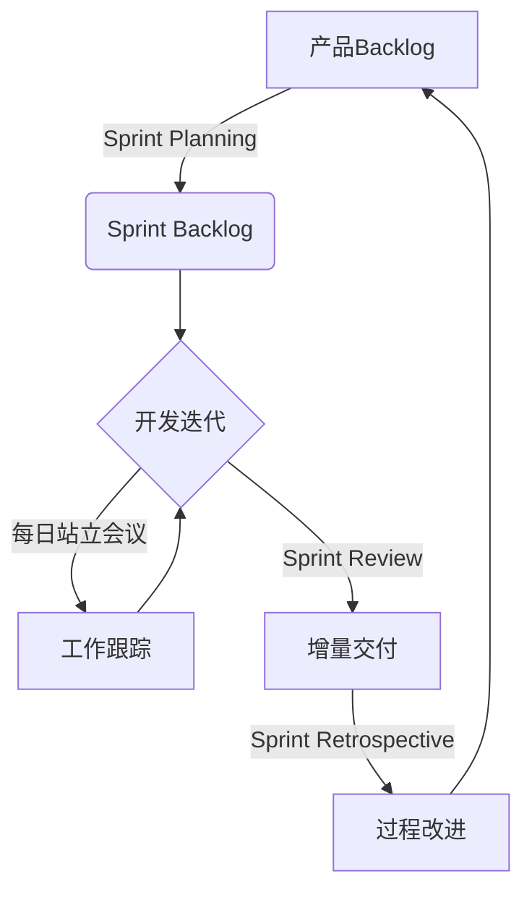
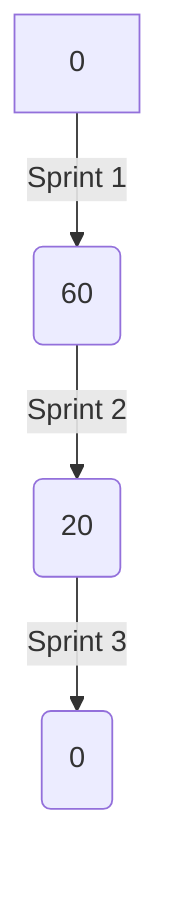

# 敏捷开发与快速迭代原理与代码实战案例讲解

## 1. 背景介绍

### 1.1 问题的由来

在当今瞬息万变的商业环境中，软件开发团队面临着巨大的压力,需要快速响应市场需求,提高软件交付效率。传统的瀑布式开发模式由于其严格的线性过程和缺乏灵活性,已经无法满足当前动态变化的业务需求。因此,敏捷开发方法应运而生,旨在通过迭代式、增量式的开发过程,提高软件交付的速度和质量。

### 1.2 研究现状

敏捷开发方法已经成为软件行业的主流实践,广泛应用于各种规模的项目中。Scrum、Kanban、XP(Extreme Programming)等敏捷框架和实践方法被广泛采纳,帮助团队提高协作效率,加快交付周期。然而,敏捷开发也面临着一些挑战,如如何有效管理变更需求、如何实现可持续发展等,这些问题仍在持续探索和改进中。

### 1.3 研究意义

掌握敏捷开发与快速迭代的原理和实践技巧,对于提高软件开发效率、响应市场变化、提升产品质量至关重要。通过深入理解敏捷开发的核心理念和实践方法,开发团队可以更好地适应不断变化的需求,缩短上市时间,提高客户满意度。此外,快速迭代也有助于持续集成和持续交付,实现软件开发的自动化和DevOps实践。

### 1.4 本文结构

本文将全面介绍敏捷开发与快速迭代的原理和实践技巧。首先,阐述敏捷开发的核心概念和原则;其次,详细讲解敏捷开发的核心算法和实施步骤;然后,探讨相关的数学模型和公式;接着,提供代码实例和实战案例分析;最后,总结未来发展趋势和挑战,并给出工具和资源推荐。

## 2. 核心概念与联系

敏捷开发(Agile Development)是一种迭代式、增量式的软件开发方法,强调团队协作、客户参与和快速响应变化。它的核心理念包括:

1. **迭代式开发**:将整个开发过程分为多个迭代周期,每个迭代都交付一部分可工作的软件增量。
2. **需求变更**:欣然接受需求变更,即使在开发后期也可以灵活调整。
3. **客户协作**:密切与客户合作,确保开发出符合客户期望的软件。
4. **团队沟通**:促进团队内部的面对面交流,提高协作效率。
5. **可持续发展**:保持一个可持续的开发节奏,避免过度加班。

敏捷开发方法强调"人"的重要性,注重个体和互动,而非过程和工具。它通过快速迭代和持续交付,帮助团队快速响应变化,提高软件质量和客户满意度。

快速迭代(Rapid Iteration)是敏捷开发的核心实践之一,指在短周期内(通常为1-4周)重复进行需求分析、设计、编码、测试和交付的过程。每个迭代都交付一部分可工作的软件增量,并根据反馈进行调整。快速迭代有助于:

1. **风险控制**:通过频繁交付和反馈,降低项目风险。
2. **需求验证**:及时验证需求,确保开发正确的软件。
3. **持续改进**:基于每次迭代的反馈,不断优化和改进软件。
4. **可见进度**:每个迭代都有可见的交付成果,增加项目透明度。

敏捷开发和快速迭代紧密相连,相辅相成。敏捷开发提供了理念和原则的指导,而快速迭代则是实现这些理念的关键实践方式。通过快速迭代,团队可以更好地贯彻敏捷开发的核心价值观,提高软件交付效率和质量。

## 3. 核心算法原理与具体操作步骤

### 3.1 算法原理概述

敏捷开发采用了一种称为"Scrum"的核心算法,用于指导迭代式开发过程。Scrum算法由以下三个核心概念组成:

1. **产品BackLog**:一个prioritized的需求列表,由产品负责人(Product Owner)维护和优先排序。
2. **Sprint**:一个固定时间周期(通常为1-4周),用于完成部分产品Backlog中的需求。
3. **每日站立会议**:开发团队每天进行15分钟的会议,讨论工作进展和障碍。

Scrum算法的工作流程如下所示:

### 3.2 算法步骤详解

1. **Sprint Planning**:在每个Sprint开始时,Scrum团队(包括开发人员、测试人员和产品负责人)会召开一次Sprint计划会议。在这个会议上,团队会从产品Backlog中选择一部分需求,并制定出本次Sprint的目标和交付承诺。选择的需求将形成本次Sprint的Sprint Backlog。

2. **开发迭代**:在Sprint期间,开发团队按照Sprint Backlog中的需求进行开发和测试工作。每天都会召开一次15分钟的站立会议,讨论工作进展、障碍和计划。

3. **每日站立会议**:每个开发人员在站立会议上回答三个问题:1)从上次会议到现在,你做了什么?2)接下来你计划做什么?3)你遇到了什么障碍?Scrum Master负责协调并解决障碍。

4. **Sprint Review**:在Sprint结束时,团队会召开一次Sprint评审会议,向利益相关方展示本次Sprint的成果,并收集反馈。

5. **Sprint Retrospective**:紧接着,团队会召开一次回顾会议,讨论本次Sprint的过程,总结经验教训,并制定下一次Sprint的改进措施。

6. **回到第1步**:根据Sprint评审和回顾的结果,产品负责人可能会更新产品Backlog,然后开始新一轮的Sprint计划会议,重复上述过程。

### 3.3 算法优缺点

**优点**:

- 提高交付速度,缩短上市时间
- 更好地控制项目风险和变更
- 增强团队协作和自我管理能力
- 提高软件质量和客户满意度
- 可见的进度,增加项目透明度

**缺点**:

- 需要客户的高度参与和承诺
- 对团队的自我管理能力要求较高
- 初期可能存在一些浪费和低效率
- 需要频繁的会议和沟通协作
- 对大型复杂项目的可扩展性存在挑战

### 3.4 算法应用领域

Scrum算法最初是为了管理软件开发项目而设计的,但是由于其灵活性和适应性,现在已经广泛应用于各种领域,包括:

- 软件开发
- 产品设计和开发
- 运营和IT服务管理
- 营销和广告活动
- 研究和学术项目
- 硬件开发
- 组织变革和流程改进

任何需要快速响应变化、提高效率和质量的复杂项目,都可以考虑采用Scrum算法和敏捷开发方法。

## 4. 数学模型和公式详细讲解举例说明

在敏捷开发中,有一些常用的数学模型和公式,可以帮助我们更好地规划和管理迭代过程。

### 4.1 数学模型构建

#### 4.1.1 经验燃尽图模型

经验燃尽图(Burn-down Chart)是敏捷开发中一种常用的可视化工具,用于跟踪每个Sprint的工作进度。它将Sprint Backlog中的剩余工作量与时间进行对比,形成一条燃尽线。

经验燃尽图的数学模型可以表示为:

$$
R(t) = W_0 - \frac{W_0}{T} \times t
$$

其中:
- $R(t)$表示在时间$t$时剩余的工作量
- $W_0$表示Sprint开始时的总工作量
- $T$表示Sprint的总时间

理想情况下,燃尽线应该是一条直线,表示工作按计划稳步完成。但在实际情况中,燃尽线可能会出现波动,这反映了工作进度的变化。

#### 4.1.2 团队速率模型

团队速率(Team Velocity)是指团队在一个Sprint中可以完成的工作量。它是基于过去几个Sprint的实际完成量计算得出的,用于估计未来Sprint的工作量。

团队速率的数学模型可以表示为:

$$
V_n = \frac{1}{N} \sum_{i=1}^{N} W_i
$$

其中:
- $V_n$表示第n个Sprint的团队速率
- $N$表示用于计算的Sprint数量
- $W_i$表示第i个Sprint的实际完成工作量

通过持续跟踪和计算团队速率,Scrum团队可以更准确地估计未来Sprint的工作量,并根据实际情况进行调整。

### 4.2 公式推导过程

#### 4.2.1 经验燃尽图公式推导

假设Sprint开始时的总工作量为$W_0$,Sprint的总时间为$T$,并且工作按照固定速率线性完成。那么在时间$t$时,剩余的工作量$R(t)$可以表示为:

$$
\begin{aligned}
R(t) &= W_0 - \text{已完成工作量} \\
     &= W_0 - \frac{W_0}{T} \times t
\end{aligned}
$$

其中,$\frac{W_0}{T}$表示每单位时间完成的工作量。

#### 4.2.2 团队速率公式推导

假设我们有$N$个Sprint的实际完成工作量数据$W_1, W_2, \ldots, W_N$,我们希望计算出团队的平均速率$V_n$。

根据算术平均值的定义,我们有:

$$
V_n = \frac{1}{N} \sum_{i=1}^{N} W_i
$$

这个公式表示,团队速率等于过去$N$个Sprint的实际完成工作量的算术平均值。

### 4.3 案例分析与讲解

假设一个Scrum团队正在进行一个新项目的开发,Sprint时间为2周。根据过去几个Sprint的数据,团队的平均速率为40故事点(Story Point)。现在,产品Backlog中有100个故事点的需求待完成。

#### 4.3.1 使用经验燃尽图规划Sprint

我们可以使用经验燃尽图来规划这个项目需要多少个Sprint才能完成。

假设每个Sprint的工作量都等于团队速率40故事点,那么理想的燃尽线应该是:

$$
R(t) = 100 - \frac{100}{14} \times t
$$

其中,$t$表示Sprint天数(2周=14天)。

根据这条燃尽线,我们可以绘制出理想的经验燃尽图,如下所示:

从图中可以看出,理想情况下,这个项目需要3个Sprint才能完成。

#### 4.3.2 使用团队速率估计Sprint数量

另一种方法是直接使用团队速率来估计需要多少个Sprint。

由于团队速率为40故事点/Sprint,总工作量为100故事点,那么理论上需要:

$$
\text{Sprint数量} = \frac{100}{40} = 2.5 \approx 3
$$

这个结果与使用经验燃尽图的方法一致,都是需要3个Sprint才能完成这个项目。

#### 4.3.3 实际情况下的调整

在实际情况下,由于各种不确定因素的影响,实际的工作进度可能会与理想情况有所偏差。例如,某些故事点可能被低估了,或者出现了一些意外的阻碍。因此,Scrum团队需要根据每个Sprint的实际完成情况,动态调整后续Sprint的工作量和计划。

经验燃尽图和团队速率这两个模型可以为团队提供参考和指导,但最终还是需