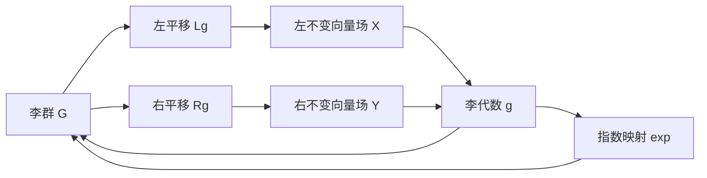

# 李群与李代数基础：第2节 李群的一些基本性质

关键词：李群、李代数、流形、左平移、右平移、左不变向量场、右不变向量场、Lie括号、指数映射

## 1. 背景介绍
### 1.1 问题的由来
李群作为一种重要的数学结构,在现代数学、物理学和工程技术中有着广泛的应用。它不仅是微分几何、拓扑学等数学分支的重要研究对象,也是量子力学、粒子物理、控制论等领域不可或缺的工具。深入理解李群的基本性质,对于我们运用李群理论解决实际问题具有重要意义。

### 1.2 研究现状
目前,关于李群的基本性质已有较为系统和完备的理论结果。从20世纪中叶开始,以Hermann Weyl、Claude Chevalley等数学家为代表,经过几代数学工作者的不懈努力,李群理论已发展成为一个庞大而完善的数学分支。国内外许多专著和教材对李群的基本性质进行了详尽的论述,为我们学习和研究李群提供了很好的参考。

### 1.3 研究意义
李群不仅是一个深刻而优美的数学理论,更是解决实际问题的有力工具。许多物理、化学、生物等领域的问题,都可以用李群的语言来描述和解决。深入理解李群的基本性质,掌握李群的基本概念和运算规律,对于我们学习和应用李群理论具有重要意义。本文将系统地介绍李群的一些基本性质,力求概念清晰、逻辑严谨,便于读者学习和掌握。

### 1.4 本文结构
本文主要内容分为以下几个部分：
- 第一部分介绍李群的基本定义和例子,帮助读者建立李群的直观概念；
- 第二部分讨论李群上的平移变换及其性质,引出左不变和右不变向量场的概念；
- 第三部分介绍李代数的定义,说明李代数与李群的关系,给出李代数上的一些重要运算；
- 第四部分讨论指数映射,说明它是李代数到李群的映射,并具有很好的性质；
- 第五部分通过具体的代码实例,演示如何用计算机程序实现李群和李代数的基本运算；
- 第六部分列举李群理论的一些经典应用,展示李群在实际问题中的作用；
- 第七部分介绍学习李群理论的工具书和资源,方便读者进一步学习和研究。

## 2. 核心概念与联系
在开始介绍李群的基本性质之前,我们先回顾一下李群的定义。李群是一类特殊的群,它除了满足群的公理外,还要求群元素集合是一个光滑流形,并且群的乘法和求逆运算是光滑映射。

具体地,一个集合 $G$ 称为李群,如果它满足以下条件：
1. $G$ 是一个群,即 $G$ 上定义了一个二元运算(记为 $\cdot$),满足结合律,存在单位元 $e$,每个元素都有逆元；
2. $G$ 是一个光滑流形；
3. 映射 $G \times G \to G, (x,y) \mapsto xy$ 和 $G \to G, x \mapsto x^{-1}$ 是光滑的。

李群中的每一个元素都对应一个从李群到自身的变换,称为平移变换。平移变换分为左平移和右平移两种。对于李群 $G$ 中的元素 $g$,左平移 $L_g$ 和右平移 $R_g$ 分别定义为：

$$
L_g: G \to G, \quad L_g(x) = gx, \quad \forall x \in G
$$

$$
R_g: G \to G, \quad R_g(x) = xg, \quad \forall x \in G
$$

平移变换满足以下性质：
1. $L_g$ 和 $R_g$ 都是 $G$ 上的微分同胚；
2. $L_{gh} = L_g \circ L_h, \quad R_{gh} = R_h \circ R_g$；
3. $L_g \circ R_h = R_h \circ L_g$。

这些性质反映了平移变换与群乘法之间的关系,在李群的理论和应用中起着重要作用。

与平移变换密切相关的概念是左不变向量场和右不变向量场。设 $G$ 是一个李群,$X$ 是 $G$ 上的向量场,如果对任意 $g \in G$,都有

$$
(L_g)_* X = X
$$

其中 $(L_g)_*$ 表示 $L_g$ 的推前,则称 $X$ 为左不变向量场。类似地,如果对任意 $g \in G$,都有

$$
(R_g)_* X = X
$$

则称 $X$ 为右不变向量场。左不变和右不变向量场在李群的研究中有着重要地位,它们与李群的李代数有着密切联系。

李群的另一个重要概念是李代数,它反映了李群的局部性质。一个李群的李代数定义为单位元处的左不变向量场全体,记为 $\mathfrak{g}$。李代数 $\mathfrak{g}$ 不仅是一个向量空间,还定义了一个二元运算,称为李括号(Lie bracket),它将 $\mathfrak{g}$ 中的两个元素 $X,Y$ 映射到另一个元素 $[X,Y] \in \mathfrak{g}$。李括号满足以下性质：
1. 双线性性：$[aX+bY,Z] = a[X,Z]+b[Y,Z], \quad [X,aY+bZ] = a[X,Y]+b[X,Z]$；
2. 反对称性：$[X,Y] = -[Y,X]$；
3. 雅可比等价：$[X,[Y,Z]] + [Y,[Z,X]] + [Z,[X,Y]] = 0$。

有了李括号,我们就得到了一个李代数 $(\mathfrak{g},[\cdot,\cdot])$。李代数与李群之间有着密切关系,李群的很多性质都可以用李代数的语言来刻画。

连接李代数与李群的一个重要工具是指数映射(exponential map)。对于李代数 $\mathfrak{g}$ 中的元素 $X$,它在李群 $G$ 中生成一条 $1$ 参数子群 $\{\exp(tX) | t \in \mathbb{R}\}$,称 $\exp(X)$ 为 $X$ 的指数。指数映射 $\exp: \mathfrak{g} \to G$ 满足以下性质：
1. $\exp(0) = e$；
2. $\exp(t_1 + t_2)X = \exp(t_1 X) \exp(t_2 X)$；
3. $\exp(tX)$ 是 $t$ 的光滑函数；
4. $\exp$ 将 $\mathfrak{g}$ 中的一个邻域微分同胚到 $G$ 中 $e$ 的一个邻域。

指数映射在李群和李代数的理论与应用中起着重要的桥梁作用。

下面这张图清晰地展示了李群、李代数、左(右)平移、左(右)不变向量场、指数映射等概念之间的逻辑关系：

## 3. 核心算法原理 & 具体操作步骤
### 3.1 算法原理概述
在李群和李代数的理论研究和实际应用中,需要进行一些基本运算,例如李群乘法、李代数上的李括号运算、指数映射等。这些运算可以通过具体的算法来实现。下面我们以最基本的矩阵李群 $GL(n,\mathbb{R})$ 为例,介绍相关算法的基本原理。

### 3.2 算法步骤详解
1. 李群乘法：对于矩阵李群 $GL(n,\mathbb{R})$ 中的两个元素 $A,B$,它们的乘积 $AB$ 就是矩阵乘法,即
$$(AB)_{ij} = \sum_{k=1}^n A_{ik}B_{kj}$$

2. 李代数上的李括号运算：$\mathfrak{gl}(n,\mathbb{R})$ 由全体 $n$ 阶实矩阵构成,其上的李括号运算定义为
$$[X,Y] = XY - YX$$
其中 $X,Y$ 是两个 $n$ 阶实矩阵。

3. 指数映射：对于 $\mathfrak{gl}(n,\mathbb{R})$ 中的元素 $X$,它的指数 $\exp(X)$ 定义为矩阵指数级数
$$\exp(X) = I + X + \frac{1}{2!}X^2 + \frac{1}{3!}X^3 + \cdots$$
其中 $I$ 是 $n$ 阶单位矩阵。这个无穷级数对任意矩阵 $X$ 都收敛,其和为一个可逆矩阵,因此 $\exp(X) \in GL(n,\mathbb{R})$。

### 3.3 算法优缺点
上述算法的优点是概念清晰、计算直观,容易实现。但是对于一般的李群和李代数,直接计算可能会比较困难,需要根据具体情况设计高效的算法。

### 3.4 算法应用领域
这些基本算法是研究和应用李群理论的重要工具,在数学、物理、工程等领域都有广泛应用。例如在计算机视觉中,三维旋转矩阵构成一个特殊正交群 $SO(3)$,图像变换可以用 $SO(3)$ 中的矩阵来描述。再如在控制论中,刚体运动可以用欧式群 $SE(3)$ 中的变换来刻画。掌握这些基本算法,对于理解和应用李群理论至关重要。

## 4. 数学模型和公式 & 详细讲解 & 举例说明
### 4.1 数学模型构建
我们以三维旋转群 $SO(3)$ 为例,来说明如何构建李群的数学模型。$SO(3)$ 由全体三阶实正交矩阵构成,它是一个三维流形,也是一个李群。我们可以用欧拉角 $(\alpha, \beta, \gamma)$ 来参数化 $SO(3)$ 中的矩阵：

$$
R(\alpha, \beta, \gamma) = 
\begin{pmatrix}
\cos\alpha \cos\beta \cos\gamma - \sin\alpha \sin\gamma & -\cos\alpha \cos\beta \sin\gamma - \sin\alpha \cos\gamma & \cos\alpha \sin\beta \\
\sin\alpha \cos\beta \cos\gamma + \cos\alpha \sin\gamma & -\sin\alpha \cos\beta \sin\gamma + \cos\alpha \cos\gamma & \sin\alpha \sin\beta \\
-\sin\beta \cos\gamma & \sin\beta \sin\gamma & \cos\beta
\end{pmatrix}
$$

其中 $\alpha, \gamma \in [0, 2\pi), \beta \in [0, \pi]$。容易验证,对任意 $\alpha, \beta, \gamma$,矩阵 $R(\alpha, \beta, \gamma)$ 都是正交的,而且行列式为 $1$。反之,对任意 $R \in SO(3)$,总存在唯一的 $(\alpha, \beta, \gamma)$ 使得 $R = R(\alpha, \beta, \gamma)$。这说明 $(\alpha, \beta, \gamma)$ 给出了 $SO(3)$ 的一个局部坐标系。

### 4.2 公式推导过程
利用上面的参数化,我们可以得到 $SO(3)$ 的李代数 $\mathfrak{so}(3)$ 的一组基。事实上,取

$$
X_1 = \left.\frac{\partial R}{\partial \alpha}\right|_{(0,0,0)} = 
\begin{pmatrix}
0 & 0 & 0 \\
0 & 0 & -1 \\
0 & 1 & 0
\end{pmatrix},
\quad
X_2 = \left.\frac{\partial R}{\partial \beta}\right|_{(0,0,0)} =
\begin{pmatrix} 
0 & 0 & 1 \\
0 & 0 & 0 \\
-1 & 0 & 0
\end{pmatrix},
\quad
X_3 = \left.\frac{\partial R}{\partial \gamma}\right|_{(0,0,0)} =
\begin{pmatrix}
0 & -1 & 0 \\