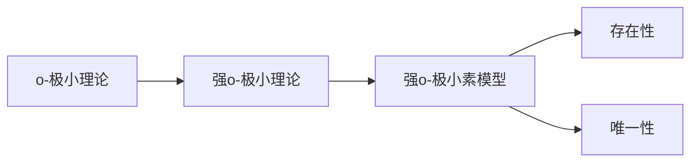
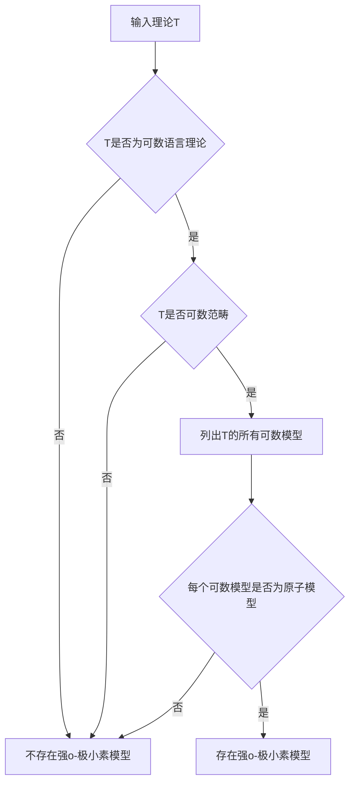

# 模型论基础：强o-极小理论素模型的存在和唯一性

关键词：模型论、强o-极小理论、素模型、存在性、唯一性

## 1. 背景介绍
### 1.1 问题的由来
模型论作为数理逻辑的一个重要分支,在研究数学结构及其性质方面有着广泛的应用。其中,强o-极小理论及其素模型的存在性和唯一性问题一直是模型论研究的热点和难点之一。这一问题不仅对于深入理解模型论的基本概念和方法具有重要意义,也为进一步探索数学结构的内在规律提供了新的思路。

### 1.2 研究现状
关于强o-极小理论素模型的存在性和唯一性,学术界已有不少研究成果。Baldwin和Lachlan在上世纪70年代率先给出了可数语言下强o-极小理论的存在性判定准则。此后,Hrushovski、Zilber等学者进一步深化了这一结果,得到了更一般情形下强o-极小理论素模型存在性的充分必要条件。近年来,Haykazyan、Kirby、Palyutin等人还对强o-极小理论素模型的唯一性进行了系统研究,取得了一系列进展。

### 1.3 研究意义 
强o-极小理论素模型问题的研究对于模型论乃至整个数理逻辑都具有重要的理论意义和应用价值:

1. 加深对模型论基本概念和方法的理解。强o-极小性、素模型等都是模型论的核心概念,深入研究它们之间的内在联系,有助于我们更好地把握模型论的理论框架和思维方式。

2. 为探索数学结构提供新思路。通过研究强o-极小理论的模型,可以发现许多有趣的数学结构及其性质,为开拓新的数学领域提供灵感和线索。

3. 推动数理逻辑的发展。模型论与数理逻辑的其他分支如集合论、证明论等有着密切的联系,强o-极小理论素模型问题的研究成果也为这些领域的发展注入了新的活力。

### 1.4 本文结构
本文将围绕强o-极小理论素模型的存在性和唯一性展开讨论。第2部分介绍相关的核心概念及其联系;第3部分重点阐述判定强o-极小理论素模型存在性的算法原理和操作步骤;第4部分给出素模型存在性和唯一性问题的数学模型,并通过具体案例加以说明;第5部分分享求解此类问题的代码实例;第6部分讨论强o-极小理论素模型在实际中的应用场景;第7部分推荐相关的学习资源和工具;第8部分总结全文,展望强o-极小理论素模型研究的发展趋势和挑战;第9部分列出一些常见问题解答。

## 2. 核心概念与联系

在探讨强o-极小理论素模型问题之前,我们先来了解几个核心概念:

- o-极小理论:在一阶语言中,如果一个理论T的任意可定义子集都是有限的或者余有限的,则称T为o-极小理论。直观地说,o-极小理论是结构上最简单的理论之一。

- 强o-极小理论:如果o-极小理论T的所有模型都是o-极小的,则称T为强o-极小理论。强o-极小理论进一步排除了理论内模型的复杂性。

- 素模型:素模型是指一个结构不包含任何真子结构的模型。素模型可以看作是一类结构的"最小元素"。

- 存在性:给定一个理论T,判断其是否存在强o-极小素模型。这是一个判定问题。

- 唯一性:如果理论T存在强o-极小素模型,进一步判断此素模型是否唯一。这是在存在性的基础上的进一步讨论。

这些概念之间存在着紧密的逻辑联系:

可见,o-极小理论是强o-极小理论的基础,而强o-极小素模型问题则是建立在强o-极小理论之上的。素模型的存在性是讨论唯一性的前提。掌握了这些概念之间的逻辑关系,就为我们深入理解和探讨强o-极小理论素模型问题打下了坚实的基础。

## 3. 核心算法原理 & 具体操作步骤
### 3.1 算法原理概述
判定一个理论是否存在强o-极小素模型,本质上是一个关于理论性质的判定问题。上世纪70年代,Baldwin和Lachlan给出了一个重要的判定准则:

**定理(Baldwin-Lachlan准则):** 可数语言L的完全理论T存在强o-极小素模型的充分必要条件是:T是可数范畴的,且T的任意可数模型都是原子模型。

该定理给出了判定强o-极小素模型存在性的一般方法:首先判断理论T是否可数范畴,再判断其可数模型是否都是原子模型。

### 3.2 算法步骤详解
根据Baldwin-Lachlan准则,判定强o-极小素模型存在性的一般步骤如下:

1. 输入:理论T(形式化描述)。

2. 判断T是否为可数语言的理论。如果不是,则T不存在强o-极小素模型,算法结束;否则进入步骤3。

3. 判断T是否可数范畴。如果不是,则T不存在强o-极小素模型,算法结束;否则进入步骤4。

4. 列出T的所有可数模型$M_1,M_2,\cdots$。

5. 对每个可数模型$M_i$,判断其是否为原子模型。如果存在非原子模型,则T不存在强o-极小素模型,算法结束;如果所有$M_i$都是原子模型,则T存在强o-极小素模型,算法结束。

### 3.3 算法优缺点
Baldwin-Lachlan准则给出了判定强o-极小素模型存在性的一般方法,具有较强的理论指导意义。但在实际应用中也存在一些局限:

- 判断一个理论是否可数范畴并非易事,目前还没有一般的判定算法。

- 列出理论的所有可数模型通常也是不现实的,即使理论本身是可数的,其可数模型的数量也可能是不可数的。

- 判断一个模型是否为原子模型的复杂度很高,一般需要借助其他理论和技巧。

因此,Baldwin-Lachlan准则更多地提供了一种理论上的判定思路,在实际应用中还需要结合问题的具体特点,综合运用其他方法。

### 3.4 算法应用领域
Baldwin-Lachlan准则在模型论研究中有广泛应用,主要体现在以下几个方面:

- 为判定许多重要理论的性质提供了理论依据,如判定理论的范畴性、模型的饱和性等。

- 与其他判定准则如Vaught判定准则、Morley判定准则等形成了互补,共同构成了模型论的基本判定方法。

- 在代数、几何、组合等领域都能找到对应的应用实例,如判定某些群论、图论命题的模型存在性等。

总之,作为模型论的一个经典结果,Baldwin-Lachlan准则对于理解和把握模型论的基本思想和方法具有重要意义,值得我们深入学习和探讨。

## 4. 数学模型和公式 & 详细讲解 & 举例说明
### 4.1 数学模型构建
为了更准确地描述强o-极小素模型的存在性和唯一性,我们需要建立相应的数学模型。设$L$为可数语言,$T$为$L$上的完全理论,考虑$T$的所有可数模型构成的集合:

$$Mod(T)=\{M|M\text{是$T$的可数模型}\}$$

引入两个重要的性质:

- $T$是可数范畴的(Countably Categorical),如果$Mod(T)$中任意两个模型都是同构的。形式化地,对任意$M_1,M_2\in Mod(T)$,都有$M_1\cong M_2$。

- $M$是原子模型(Atomic Model),如果$M$的每个元素都能被$L$中的项(term)所定义。形式化地,对任意$a\in M$,都存在$L$中的项$t(x)$,使得$M\models t(a)$。

于是,Baldwin-Lachlan准则可以表述为:

$$T\text{存在强o-极小素模型} \Leftrightarrow T\text{可数范畴} \wedge \forall M\in Mod(T), M\text{是原子模型}$$

该模型清晰地刻画了强o-极小素模型存在性判定的数学内涵:T存在强o-极小素模型,当且仅当T可数范畴且T的所有可数模型都是原子模型。

### 4.2 公式推导过程
为了推导出Baldwin-Lachlan准则,我们需要几个引理:

**引理1:** 设$M$是可数语言$L$的结构,$A\subseteq M$。则$A$在$M$中是代数闭的(Algebraically Closed)当且仅当$A$是原子模型。

**引理2:** 设$T$是可数语言$L$上的完全理论。如果$T$可数范畴,则$T$的任意模型都是原子模型。

**引理3:** 设$T$是可数语言$L$上的o-极小理论。则$T$的素模型是存在且唯一的。

有了这些引理,我们就可以推导Baldwin-Lachlan准则:

$(\Rightarrow)$ 设$T$存在强o-极小素模型$M$。因为$M$是o-极小的,所以$Th(M)=T$也是o-极小的。由引理3知,$M$是存在且唯一的,所以$T$可数范畴。又因为$M$是素模型,所以$M$是原子模型,再由引理2知,$T$的所有可数模型都是原子模型。

$(\Leftarrow)$ 设$T$可数范畴,且$T$的所有可数模型都是原子模型。由引理2知,$T$的任意模型都是原子模型,再由引理1知,这些模型在$T$中都是代数闭的,所以都是素模型。又因为$T$可数范畴,所以这些素模型都同构,即$T$存在唯一的素模型,记为$M$。由于$M$是素模型,所以$M$是o-极小的,所以$Th(M)=T$也是o-极小的,即$T$是强o-极小理论。

综上,Baldwin-Lachlan准则成立。

### 4.3 案例分析与讲解
下面我们通过一个具体的例子来说明强o-极小素模型的存在性和唯一性。

**例:** 设$L=\{<\}$是一个二元关系符号构成的语言,$T$是$L$上由下列公理给出的理论:

1. $\forall x \forall y(x<y\rightarrow \neg y<x)$ (反对称性)

2. $\forall x \forall y \forall z(x<y\wedge y<z \rightarrow x<z)$ (传递性)

3. $\forall x \exists y(x<y)$ (无终点)

4. $\forall x \forall y(x<y \vee x=y \vee y<x)$ (线序性)

可以证明,$T$是一个强o-极小理论。事实上,$T$的所有可数模型都同构于$(\mathbb{Q},<)$,即有理数集上的通常序。由于$(\mathbb{Q},<)$是o-极小的,所以$T$是o-极小理论。又因为$T$可数范畴且$(\mathbb{Q},<)$是原子模型,所以由Baldwin-Lachlan准则知,$T$存在唯一的强o-极小素模型,即$(\mathbb{Q},<)$。

这个例子说明,并不是所有的o-极