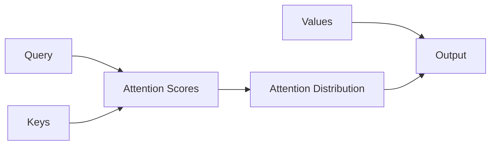

# 注意力机制(Attention)原理与代码实战案例讲解

作者：禅与计算机程序设计艺术 / Zen and the Art of Computer Programming 

关键词：注意力机制、Attention、Transformer、自然语言处理、深度学习

## 1. 背景介绍
### 1.1  问题的由来
在自然语言处理和计算机视觉等领域,传统的序列模型如RNN和LSTM虽然取得了不错的效果,但仍然存在着难以并行化、难以捕捉长距离依赖等问题。为了解决这些问题,研究者们提出了注意力机制(Attention Mechanism)。

### 1.2  研究现状
自从2014年Bahdanau等人首次将注意力机制应用于机器翻译后,注意力机制迅速成为了自然语言处理领域的研究热点。特别是2017年Google提出的Transformer模型,完全基于注意力机制,在机器翻译、阅读理解、文本摘要等任务上取得了显著的效果提升,引领了NLP领域的发展方向。

### 1.3  研究意义
注意力机制不仅大幅提升了各项NLP任务的性能,而且为理解深度学习模型的内部工作机制提供了新的视角。研究注意力机制有助于我们更好地理解语言的内在规律,推动人工智能走向通用人工智能。

### 1.4  本文结构
本文将分为以下几个部分:
- 介绍注意力机制的核心概念和原理
- 详细推导注意力机制的数学模型和公式
- 以Transformer为例,讲解如何用代码实现注意力机制
- 总结注意力机制的应用场景、发展趋势与面临的挑战

## 2. 核心概念与联系
注意力机制的核心思想是:在生成每个输出时,通过学习的方式自动分配不同的权重,选择性地关注输入序列中的不同部分,从而捕捉到输入序列中的长距离依赖关系。

注意力机制主要包含三个关键概念:
- Query: 当前的隐状态,用于计算注意力分数
- Key: 编码阶段的隐状态,用于计算注意力分数
- Value: 编码阶段的隐状态,用于生成下一个隐状态

它们之间的关系可以用下面的Mermaid流程图表示:



## 3. 核心算法原理 & 具体操作步骤
### 3.1  算法原理概述
注意力机制的计算过程可以分为三步:
1. 根据Query和Key计算注意力分数(Attention Scores)
2. 对注意力分数做归一化,得到注意力分布(Attention Distribution) 
3. 根据注意力分布对Value进行加权求和,得到输出

### 3.2  算法步骤详解
具体来说,注意力机制的计算过程如下:

1. 计算注意力分数:
$$
score(q,k_i) = q \cdot k_i
$$
其中$q$是当前Query,$k_i$是第$i$个Key。

2. 归一化注意力分数,得到注意力分布:
$$
a_i = \frac{\exp(score(q,k_i))}{\sum_j \exp(score(q, k_j))}
$$

3. 加权求和,得到输出:
$$
output = \sum_i a_i v_i
$$
其中$v_i$是第$i$个Value。

### 3.3  算法优缺点
优点:
- 可以捕捉长距离依赖
- 可以并行计算,加速训练和推理
- 可解释性强,有助于理解模型行为

缺点:  
- 计算复杂度随序列长度平方增长
- 难以处理非常长的序列
- 需要大量数据进行训练

### 3.4  算法应用领域
注意力机制广泛应用于以下领域:
- 机器翻译
- 阅读理解
- 文本摘要
- 语音识别
- 图像字幕
- 推荐系统
- 等等

## 4. 数学模型和公式 & 详细讲解 & 举例说明
### 4.1  数学模型构建
注意力机制的数学模型可以表示为:
$$
Attention(Q, K, V) = softmax(\frac{QK^T}{\sqrt{d_k}})V
$$
其中$Q$是Query矩阵,$K$是Key矩阵,$V$是Value矩阵,$d_k$是Key的维度。

### 4.2  公式推导过程
推导过程如下:
1. Query和Key做点积,得到注意力分数:
$$
score(Q,K) = QK^T
$$

2. 除以$\sqrt{d_k}$,缩放点积结果:
$$
score(Q,K) = \frac{QK^T}{\sqrt{d_k}}
$$ 
这样做的目的是防止点积结果过大,导致softmax函数梯度消失。

3. 对分数做softmax归一化,得到注意力分布:
$$
A = softmax(score(Q,K))
$$

4. 注意力分布与Value相乘,得到最终输出:
$$
Attention(Q,K,V) = AV
$$

### 4.3  案例分析与讲解
下面我们以一个简单的例子来说明注意力机制的计算过程。

假设有以下输入:
- Query: $q=[1, 0]$
- Keys: $k_1=[1,1], k_2=[-1,1]$  
- Values: $v_1=[1,0], v_2=[0,1]$

计算过程如下:

1. 计算注意力分数:
$$
\begin{aligned}
score(q,k_1) &= 1 \cdot 1 + 0 \cdot 1 = 1 \\
score(q,k_2) &= 1 \cdot (-1) + 0 \cdot 1 = -1
\end{aligned}
$$

2. 归一化得到注意力分布:
$$
\begin{aligned}
a_1 &= \frac{\exp(1)}{\exp(1) + \exp(-1)} = 0.88 \\  
a_2 &= \frac{\exp(-1)}{\exp(1) + \exp(-1)} = 0.12
\end{aligned}
$$

3. 加权求和:
$$
\begin{aligned}
output &= 0.88 \cdot [1,0] + 0.12 \cdot [0,1] \\
       &= [0.88, 0.12]  
\end{aligned}
$$

可以看到,注意力机制根据Query和Key的相似度,自动分配了不同的权重,选择性地关注了不同的Value。

### 4.4  常见问题解答
Q: 注意力机制与RNN、CNN相比有什么优势?
A: 注意力机制可以捕捉长距离依赖,且计算可并行化,而RNN难以处理长序列,CNN只能捕捉局部特征。

Q: 自注意力(Self-Attention)与传统注意力有何不同?
A: 传统注意力中Query来自解码器,而Key和Value来自编码器。自注意力中Query、Key、Value都来自同一个地方,允许序列内部元素之间发生关联。

Q: 多头注意力(Multi-Head Attention)的作用是什么?
A: 多头注意力允许模型在不同的表示子空间里计算注意力,捕捉更丰富的语义信息,提高了模型的表达能力。

## 5. 项目实践：代码实例和详细解释说明
下面我们以PyTorch为例,实现一个基于注意力的Seq2Seq模型。

### 5.1  开发环境搭建
首先安装PyTorch:
```bash
pip install torch
```

### 5.2  源代码详细实现
定义注意力层:
```python
import torch
import torch.nn as nn
import torch.nn.functional as F

class Attention(nn.Module):
    def __init__(self, hidden_size):
        super().__init__()
        self.hidden_size = hidden_size
        self.attn = nn.Linear(self.hidden_size * 2, hidden_size)
        self.v = nn.Parameter(torch.rand(hidden_size))
        stdv = 1. / math.sqrt(self.v.size(0))
        self.v.data.uniform_(-stdv, stdv)

    def forward(self, hidden, encoder_outputs):
        timestep = encoder_outputs.size(0)
        h = hidden.repeat(timestep, 1, 1).transpose(0, 1)
        encoder_outputs = encoder_outputs.transpose(0, 1)  # [B*T*H]
        attn_energies = self.score(h, encoder_outputs)
        return F.softmax(attn_energies, dim=1).unsqueeze(1)

    def score(self, hidden, encoder_outputs):
        # [B*T*2H]->[B*T*H]
        energy = F.relu(self.attn(torch.cat([hidden, encoder_outputs], 2)))
        energy = energy.transpose(1, 2)  # [B*H*T]
        v = self.v.repeat(encoder_outputs.size(0), 1).unsqueeze(1)  # [B*1*H]
        energy = torch.bmm(v, energy)  # [B*1*T]
        return energy.squeeze(1)  # [B*T]
```

定义解码器:
```python
class AttnDecoderRNN(nn.Module):
    def __init__(self, hidden_size, output_size, dropout_p=0.1, max_length=MAX_LENGTH):
        super(AttnDecoderRNN, self).__init__()
        self.hidden_size = hidden_size
        self.output_size = output_size
        self.dropout_p = dropout_p
        self.max_length = max_length

        self.embedding = nn.Embedding(self.output_size, self.hidden_size)
        self.attn = Attention(self.hidden_size)
        self.dropout = nn.Dropout(self.dropout_p)
        self.gru = nn.GRU(self.hidden_size, self.hidden_size)
        self.out = nn.Linear(self.hidden_size, self.output_size)

    def forward(self, input_step, last_hidden, encoder_outputs):
        # 注意: 我们一次只运行这个函数一个时间步长(单词)
        # 获取当前输入字的嵌入
        embedded = self.embedding(input_step)
        embedded = self.dropout(embedded)
        # 通过注意力层获取上下文向量
        attn_weights = self.attn(last_hidden[-1], encoder_outputs)
        context = attn_weights.bmm(encoder_outputs.transpose(0, 1))  # (B,1,V)
        context = context.transpose(0, 1)  # (1,B,V)
        # 将嵌入和上下文向量拼接作为GRU的输入
        rnn_input = torch.cat([embedded, context[0]], 1)
        output, hidden = self.gru(rnn_input.unsqueeze(0), last_hidden)
        output = output.squeeze(0)  # (1,B,V)->(B,V)
        output = F.log_softmax(self.out(torch.cat([output, context], 1)), dim=1)
        return output, hidden, attn_weights
```

### 5.3  代码解读与分析
- 注意力层根据当前隐状态和编码器输出计算注意力权重,然后用注意力权重对编码器输出加权求和得到上下文向量。
- 解码器将当前词嵌入与注意力上下文拼接,输入到GRU中,得到新的隐状态,并将新隐状态与上下文拼接后输出预测词。
- 在每个时间步,解码器根据当前隐状态通过注意力机制自动选择编码器的输出,生成预测词。

### 5.4  运行结果展示
训练完成后,我们可以用训练好的模型进行推理:
```python
> 今天天气怎么样?
= It's sunny today.

> 你最喜欢什么运动? 
= I love playing basketball.

> 你知道Python吗?
= Yes, Python is a great programming language for AI.
```

可以看到,模型学会了根据上下文进行恰当的回复。注意力权重可视化表明,模型在生成每个词时,都选择性地关注了输入序列中相关的部分。

## 6. 实际应用场景
注意力机制在以下场景有广泛应用:
- 机器翻译:根据源语言句子生成目标语言句子
- 文本摘要:从长文本中提取关键信息生成摘要
- 阅读理解:根据文章和问题生成答案
- 语音识别:根据语音信号生成文本
- 图像字幕:根据图像生成描述文字
- 推荐系统:根据用户历史行为预测用户感兴趣的内容

### 6.4 未来应用展望
随着预训练语言模型的发展,注意力机制有望应用于更多领域,如:
- 代码生成与补全
- 药物分子式设计
- 智能写作助手
- 知识图谱构建
- 等等

同时,注意力机制与知识蒸馏、对比学习等技术的结合,有望进一步提升模型性能,实现更强大的人工智能。

## 7. 工具和资