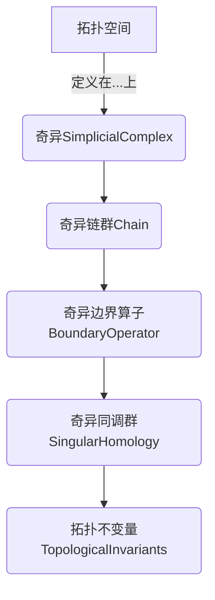

# 流形拓扑学：奇异同调群

## 1. 背景介绍

### 1.1 问题的由来

在数学和物理学领域,对于复杂系统的研究一直是一个重要且具有挑战性的课题。传统的研究方法通常会遇到一些困难,例如复杂系统的非线性行为、高维度和大规模等。为了更好地理解和描述这些复杂系统,需要引入新的数学工具和理论。流形拓扑学(Manifold Topology)作为一种新兴的研究方法,为解决这些挑战提供了新的思路和视角。

### 1.2 研究现状  

流形拓扑学是拓扑学和几何学的交叉领域,主要研究流形(Manifold)的拓扑性质。流形是一种在局部看起来像欧几里得空间的空间,但在全局上可能具有更复杂的结构。流形拓扑学的研究对象包括流形的同伦类、同调群、奇异同调群等,这些概念为研究复杂系统的拓扑结构提供了强大的工具。

近年来,流形拓扑学在数据分析、机器学习、计算机视觉、材料科学等领域得到了广泛的应用。例如,在数据分析中,可以将高维数据集视为一个流形,利用流形拓扑学的理论和方法进行降维、簇分析等操作。在材料科学中,可以研究晶体结构的拓扑性质,探索新型材料的设计和合成。

### 1.3 研究意义

奇异同调群(Singular Homology)是流形拓扑学中一个重要的概念,它提供了一种描述和研究流形拓扑性质的有效方法。奇异同调群不仅可以应用于流形,还可以推广到更广泛的拓扑空间,因此具有更强的通用性和适用性。

研究奇异同调群对于深入理解复杂系统的拓扑结构具有重要意义。通过计算和分析奇异同调群,我们可以获得系统的一些基本拓扑不变量,如贝特数(Betti Number)、欧拉特征数(Euler Characteristic)等,这些不变量可以反映系统的连通性、环面数等重要拓扑性质。同时,奇异同调群还可以用于分类和识别不同的拓扑空间,为复杂系统的分析和建模提供了有力的理论支持。

### 1.4 本文结构

本文将全面介绍流形拓扑学中奇异同调群的理论基础、计算方法和应用。文章结构如下:

1. 背景介绍
2. 核心概念与联系
3. 核心算法原理与具体操作步骤
4. 数学模型和公式详细讲解与举例说明
5. 项目实践:代码实例和详细解释说明
6. 实际应用场景
7. 工具和资源推荐
8. 总结:未来发展趋势与挑战
9. 附录:常见问题与解答

## 2. 核心概念与联系

奇异同调群理论建立在一些基础概念之上,这些概念相互关联,共同构成了完整的理论体系。本节将介绍奇异同调群的核心概念,并阐明它们之间的联系。

1. **拓扑空间(Topological Space)**: 奇异同调群理论的研究对象是一般的拓扑空间,而不仅限于流形。拓扑空间是一个抽象的集合,具有某些开集的结构,用于研究点集之间的邻近关系。

2. **奇异简单复形(Singular Simplicial Complex)**: 为了研究拓扑空间的同伦性质,我们需要构造一个代数对象来近似描述该空间。奇异简单复形就是这样一种代数对象,它由一系列的奇异单形(Singular Simplex)组成,可以近似地嵌入到给定的拓扑空间中。

3. **奇异链群(Singular Chain Group)**: 奇异链群是由奇异单形通过形式和构成的一个Abel群。它为研究拓扑空间的同伦性质提供了代数结构。

4. **奇异边界算子(Singular Boundary Operator)**: 奇异边界算子是定义在奇异链群上的一个同态映射,它将高维的奇异单形映射到它们的边界,即由低维奇异单形构成的形式和。边界算子满足"边界的边界为零"的性质,这是构造奇异同调群的关键。

5. **奇异同调群(Singular Homology Group)**: 奇异同调群是由奇异链群和奇异边界算子导出的一个同伦不变量。它描述了拓扑空间中的环面和空穴的代数结构,是研究拓扑空间同伦类型的重要工具。

6. **拓扑不变量(Topological Invariants)**: 奇异同调群及其相关的同伦不变量,如贝特数、欧拉特征数等,是描述拓扑空间基本性质的重要量,对于分类、识别和研究拓扑空间具有重要意义。

上述概念相互关联,共同构成了奇异同调群理论的理论框架。通过计算和分析奇异同调群,我们可以深入理解拓扑空间的同伦结构,为复杂系统的建模和分析提供有力的数学支持。

## 3. 核心算法原理与具体操作步骤

### 3.1 算法原理概述

计算奇异同调群的核心算法是基于奇异链复形和奇异边界同态的构造。算法的主要思路如下:

1. 构造奇异单形: 对于给定的拓扑空间X,我们首先需要构造一个代数对象——奇异单形集合,来近似描述X的拓扑结构。

2. 生成奇异链群: 将奇异单形通过形式和的方式组合成更高维的奇异链,从而生成奇异链群C_n(X)。

3. 定义奇异边界算子: 在每个维度n上,定义一个奇异边界同态∂_n:C_n(X)→C_n-1(X),将n维奇异链映射到它们的(n-1)维边界。

4. 计算同调群: 利用奇异边界算子的性质"边界的边界为零",我们可以构造出同调群H_n(X)=Ker(∂_n)/Im(∂_n+1),其中Ker(∂_n)表示n维边界为零的链,Im(∂_n+1)表示(n+1)维链的边界。

5. 计算同伦不变量: 从同调群H_n(X)中,我们可以计算出拓扑空间X的一些重要同伦不变量,如贝特数、欧拉特征数等。

该算法的关键在于正确构造奇异链复形和奇异边界算子,并利用它们之间的代数关系计算出同调群。下面将详细介绍算法的具体步骤。

### 3.2 算法步骤详解

计算奇异同调群的算法步骤如下:

1. **构造奇异单形**

   对于给定的拓扑空间X,我们首先需要构造一个代数对象——奇异单形集合Δ_n(X),来近似描述X的拓扑结构。

   奇异n单形是一个连续映射σ:Δ^n→X,其中Δ^n表示n维单位简单复形。直观上,奇异0单形对应X中的点,奇异1单形对应X中的曲线段,奇异2单形对应X中的曲面三角形,依此类推。

   通过枚举所有可能的连续映射σ,我们可以获得X的全部奇异单形集合Δ_n(X)。

2. **生成奇异链群**

   在获得奇异单形集合Δ_n(X)后,我们可以通过形式和的方式将它们组合成更高维的奇异链。

   对于每个维度n,我们定义一个Abel群C_n(X),它的元素是所有n维奇异链的形式和,即:

   C_n(X) = {∑_i n_iσ_i | n_i∈Z, σ_i∈Δ_n(X)}

   其中,n_i是整数系数,σ_i是n维奇异单形。这个Abel群C_n(X)被称为X的n维奇异链群。

3. **定义奇异边界算子**

   在每个维度n上,我们定义一个奇异边界同态∂_n:C_n(X)→C_n-1(X),将n维奇异链映射到它们的(n-1)维边界。

   对于任意n维奇异单形σ:Δ^n→X,它的边界∂_nσ定义为:

   ∂_nσ = ∑_i (-1)^i σ|_{Δ^n_i}

   其中,Δ^n_i表示Δ^n的第i个(n-1)维面,σ|_{Δ^n_i}是σ在Δ^n_i上的限制。

   通过线性扩展,我们可以将边界算子∂_n推广到整个n维奇异链群C_n(X)上。

4. **计算同调群**

   利用奇异边界算子∂_n的性质"边界的边界为零",即∂_n∂_n+1=0,我们可以构造出n维同调群:

   H_n(X) = Ker(∂_n) / Im(∂_n+1)

   其中,Ker(∂_n)表示n维边界为零的链,Im(∂_n+1)表示(n+1)维链的边界。

   直观上,同调群H_n(X)描述了X中n维"空穴"或"环面"的代数结构。它是一个Abel群,其中的元素对应X中不同的n维同伦类。

5. **计算同伦不变量**

   从同调群H_n(X)中,我们可以计算出拓扑空间X的一些重要同伦不变量,如:

   - **贝特数(Betti Number)**: 定义为β_n(X) = rank(H_n(X)),表示X中n维"空穴"或"环面"的个数。
   - **欧拉特征数(Euler Characteristic)**: 定义为χ(X) = ∑_n (-1)^n β_n(X),是一个重要的拓扑不变量,描述了X的整体拓扑结构。

   这些同伦不变量对于分类、识别和研究拓扑空间具有重要意义。

通过上述步骤,我们可以计算出给定拓扑空间X的奇异同调群及其相关的同伦不变量,从而深入理解X的拓扑结构。

### 3.3 算法优缺点

奇异同调群算法具有以下优点:

1. **通用性强**: 奇异同调群理论适用于任意拓扑空间,不仅限于流形,因此具有很强的通用性。

2. **计算方便**: 通过构造奇异链复形和边界算子,我们可以较为方便地计算出同调群和相关的同伦不变量。

3. **描述能力强**: 同调群能够很好地描述拓扑空间中的"空穴"和"环面"结构,为深入理解拓扑空间的同伦性质提供了有力工具。

4. **与其他数学领域联系紧密**: 奇异同调群理论与代数拓扑学、代数几何等数学领域有着密切联系,为跨学科研究提供了桥梁。

然而,奇异同调群算法也存在一些缺点和局限性:

1. **计算复杂度高**: 对于高维或复杂的拓扑空间,计算奇异同调群的复杂度会急剧增加,需要更高效的算法和更强大的计算能力。

2. **理论抽象性强**: 奇异同调群理论涉及大量抽象代数和拓扑概念,对初学者来说理解起来可能有一定困难。

3. **离散近似问题**: 在实际应用中,我们通常只能获得拓扑空间的离散采样数据,如何从离散数据准确计算出同调群仍然是一个挑战。

4. **噪声和缺失数据的影响**: 实际数据中存在噪声和缺失数据的情况,这可能会影响同调群计算的准确性和稳定性。

总的来说,奇异同调群算法是一种强大的工具,但在实际应用中也需要结合具