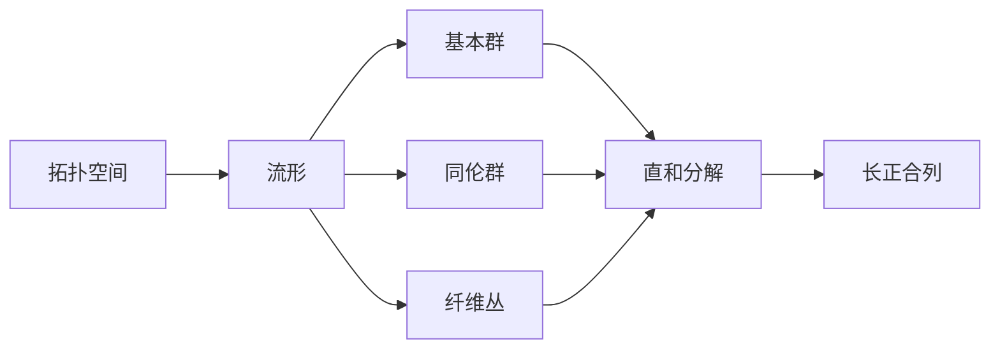

# 流形拓扑学：直和分解公式

作者：禅与计算机程序设计艺术 / Zen and the Art of Computer Programming 

关键词：流形拓扑学，直和分解，同伦群，基本群，纤维丛，Mayer-Vietoris序列

## 1. 背景介绍
### 1.1  问题的由来
流形拓扑学是数学中一个重要的分支,它研究具有局部欧氏空间性质的拓扑空间。流形在数学和物理中有广泛的应用,如广义相对论、量子场论、弦理论等。在流形拓扑学中,一个核心问题是如何计算和描述流形的拓扑不变量,如基本群、同伦群等。直和分解公式是解决这一问题的重要工具之一。

### 1.2  研究现状
直和分解公式最早由数学家 Mayer 和 Vietoris 在20世纪30年代提出,后来被广泛应用于流形拓扑学的研究中。近年来,随着计算机科学和人工智能的发展,直和分解公式在计算拓扑学中也得到了广泛应用。许多学者利用该公式,结合计算机算法,开发了高效的拓扑数据分析工具。

### 1.3  研究意义 
深入理解和掌握直和分解公式,对于研究流形拓扑学和开发拓扑数据分析算法具有重要意义。通过该公式,我们可以将复杂流形分解为简单的子流形,从而简化计算和分析。同时,直和分解与其他代数拓扑工具如纤维丛、谱序列等密切相关,对这些概念的理解也大有裨益。

### 1.4  本文结构
本文将首先介绍流形拓扑学的一些核心概念,如流形、同伦群、基本群等。然后重点讲解直和分解公式的数学原理和推导过程。接着,我们将通过一些具体的算例来说明该公式的应用。最后,探讨直和分解在拓扑数据分析等领域的应用前景,并对未来的研究方向做一展望。

## 2. 核心概念与联系
在讨论直和分解公式之前,我们先回顾一下流形拓扑学的一些核心概念：

- 拓扑空间：满足一定公理的点集,是研究拓扑学的基本对象。
- 流形：局部同胚于欧氏空间的拓扑空间,可分为光滑流形和拓扑流形。
- 基本群：刻画流形上闭合曲线的一个代数结构,反映流形的连通性。
- 同伦群：描述流形上连续映射的一个代数结构,是更高维的基本群。
- 纤维丛：由底空间、纤维空间和投影映射组成的拓扑结构,流形可视为纤维丛。
- 长正合列：由映射连接的一系列群,满足一定的正合性质。

下图展示了这些概念之间的联系：

可以看到,直和分解公式与流形、基本群、同伦群、纤维丛等概念都有密切联系,在代数拓扑的理论体系中占据重要地位。

## 3. 核心算法原理 & 具体操作步骤
### 3.1  算法原理概述
直和分解公式的核心思想是,将流形分解为两个子流形的并,然后利用子流形的拓扑信息来计算原流形的拓扑不变量。设 $M$ 是一个流形,$U,V$ 是 $M$ 的两个开子集,且满足 $M=U\cup V$。记 $A=U\cap V$,则直和分解公式描述了 $M$ 的同调群 $H_*(M)$ 与 $H_*(U),H_*(V),H_*(A)$ 之间的关系：

$$
\begin{align}
\cdots \stackrel{\partial}{\longrightarrow} H_n(A) 
\stackrel{\varphi}{\longrightarrow} H_n(U) \oplus H_n(V)
\stackrel{\psi}{\longrightarrow} H_n(M)
\stackrel{\partial}{\longrightarrow} H_{n-1}(A) \stackrel{\varphi}{\longrightarrow} \cdots
\end{align}
$$

其中 $\partial$ 是边缘算子,$\varphi$ 由包含映射诱导,$\psi$ 由限制映射诱导。该序列是正合的,即任意相邻三项的复合映射为零。利用正合列的性质,我们可以递归地计算出 $M$ 的同调群。

### 3.2  算法步骤详解
利用直和分解公式计算流形同调群的一般步骤如下：

1. 将流形 $M$ 分解为两个开子集 $U,V$ 的并,使得 $M=U\cup V$。
2. 计算子流形 $U,V$ 以及交集 $A=U\cap V$ 的同调群 $H_*(U),H_*(V),H_*(A)$。
3. 分析包含映射 $A\to U,A\to V$ 和限制映射 $U\to M,V\to M$ 在同调群层面的诱导映射 $\varphi,\psi$。
4. 写出直和分解正合列,并根据相邻三项复合为零的性质,列出各个群之间的关系式。
5. 利用关系式和已知信息,递归计算未知的同调群,填写完整正合列。
6. 得到流形 $M$ 的全部同调群 $H_n(M)$。

### 3.3  算法优缺点
直和分解公式的优点在于,它将复杂流形的计算问题转化为若干子流形的计算,降低了计算难度。同时,该公式揭示了流形的拓扑不变量与其覆盖子流形之间的代数关系,具有明确的几何直观和代数结构。

但是,直和分解公式也存在一些局限性。首先,并非所有流形都能方便地分解为两个子流形的并。其次,正合列的计算有时会比较复杂,特别是涉及到非平凡的映射时。再者,该公式只能计算同调群,对于其他拓扑不变量如基本群,还需要其他工具。

### 3.4  算法应用领域
直和分解公式在流形拓扑学中有广泛应用,主要用于计算流形的同调群、示性类等代数拓扑不变量。结合其他代数工具如Eilenberg-Steenrod公理、Mayer-Vietoris序列,它在同调论中占据核心地位。

近年来,随着拓扑数据分析的兴起,直和分解公式也在计算拓扑学中得到应用。通过将数据集视为某个流形的采样点,利用直和分解计算数据集的拓扑特征,可以进行数据降维、特征提取等操作。一些流行的拓扑数据分析算法,如持续同调、Mapper算法等,都用到了直和分解的思想。

## 4. 数学模型和公式 & 详细讲解 & 举例说明
### 4.1  数学模型构建
为了推导直和分解公式,我们先构建数学模型。设 $M$ 是一个紧致流形,$U,V$ 是 $M$ 的两个开子集,满足 $M=U\cup V$。记 $A=U\cap V$,考虑链复形 $S_*(U),S_*(V),S_*(A)$ 以及它们的直和 $S_*(U)\oplus S_*(V)$。包含映射 $i:A\to U,j:A\to V$ 诱导了链映射 $i_*:S_*(A)\to S_*(U),j_*:S_*(A)\to S_*(V)$。从而可以定义链映射：

$$
\begin{align}
\varphi_*: S_*(A) &\to S_*(U)\oplus S_*(V) \\
\sigma &\mapsto (i_*(\sigma),-j_*(\sigma))
\end{align}
$$

类似地,限制映射 $k:U\to M,l:V\to M$ 诱导了链映射 $k_*:S_*(U)\to S_*(M),l_*:S_*(V)\to S_*(M)$。可以定义链映射：

$$
\begin{align}
\psi_*: S_*(U)\oplus S_*(V) &\to S_*(M) \\
(\sigma,\tau) &\mapsto k_*(\sigma)+l_*(\tau)
\end{align}
$$

进一步,边缘算子 $\partial$ 诱导了链复形之间的映射。这样,我们得到了如下的链复形序列：

$$
\begin{align}
\cdots \stackrel{\partial}{\longrightarrow} S_n(A) 
\stackrel{\varphi_n}{\longrightarrow} S_n(U) \oplus S_n(V)
\stackrel{\psi_n}{\longrightarrow} S_n(M)
\stackrel{\partial}{\longrightarrow} S_{n-1}(A) \stackrel{\varphi_{n-1}}{\longrightarrow} \cdots
\end{align}
$$

可以验证,该序列是正合的,即 $\mathrm{im}\,\varphi_n=\ker\psi_n,\mathrm{im}\,\psi_n=\ker\partial,\mathrm{im}\,\partial=\ker\varphi_{n-1}$。

### 4.2  公式推导过程
由上述链复形序列,取同调,可得到直和分解公式：

$$
\begin{align}
\cdots \stackrel{\partial_*}{\longrightarrow} H_n(A) 
\stackrel{\varphi_*}{\longrightarrow} H_n(U) \oplus H_n(V)
\stackrel{\psi_*}{\longrightarrow} H_n(M)
\stackrel{\partial_*}{\longrightarrow} H_{n-1}(A) \stackrel{\varphi_*}{\longrightarrow} \cdots
\end{align}
$$

其中 $\partial_*,\varphi_*,\psi_*$ 是边缘算子、包含映射、限制映射在同调群层面的诱导映射。由正合列的性质,有如下关系：

1. $\mathrm{im}\,\varphi_*\cong\ker\psi_*$
2. $\mathrm{im}\,\psi_*\cong\ker\partial_*$
3. $\mathrm{im}\,\partial_*\cong\ker\varphi_*$
4. $H_n(M)\cong(\ker\psi_*)/(\mathrm{im}\,\varphi_*)$

利用这些关系,我们可以通过已知的 $H_*(U),H_*(V),H_*(A)$ 计算未知的 $H_*(M)$。

### 4.3  案例分析与讲解
下面我们通过一个具体的例子来说明直和分解公式的应用。设 $M$ 是二维球面 $S^2$,取 $U,V$ 分别为 $S^2$ 的北半球和南半球,则 $A$ 是赤道。已知 $H_*(U),H_*(V),H_*(A)$ 的计算结果为：

- $H_0(U)=H_0(V)=\mathbb{Z},H_1(U)=H_1(V)=0,H_2(U)=H_2(V)=0$
- $H_0(A)=\mathbb{Z},H_1(A)=\mathbb{Z}$

我们来计算 $H_*(S^2)$。首先写出直和分解正合列：

$$
\begin{align}
0 \to H_2(A) \stackrel{\varphi_*}{\to} H_2(U)\oplus H_2(V) \stackrel{\psi_*}{\to} H_2(S^2) \stackrel{\partial_*}{\to} \\
H_1(A) \stackrel{\varphi_*}{\to} H_1(U)\oplus H_1(V) \stackrel{\psi_*}{\to} H_1(S^2) \stackrel{\partial_*}{\to} \\  
H_0(A) \stackrel{\varphi_*}{\to} H_0(U)\oplus H_0(V) \stackrel{\psi_*}{\to} H_0(S^2) \to 0
\end{align}
$$

根据 $U,V,A$ 的已知同调群,以及正合列的性质,逐步填写未知项：

$$
\begin{align}
0 \to 0 \stackrel{}{\to} 0 \stackrel{}{\to} H_2(S^2) \stackrel{}{\to} \\
\mathbb{Z} \stackrel{}{\to} 0 \stackrel{}{\to} H_1(S^2) \stackrel{}{\to} \\
\mathbb{Z} \stackrel{\varphi_*}{\to} \mathbb{Z}\oplus\mathbb{Z} \stackrel{\psi_*}{\to} H_